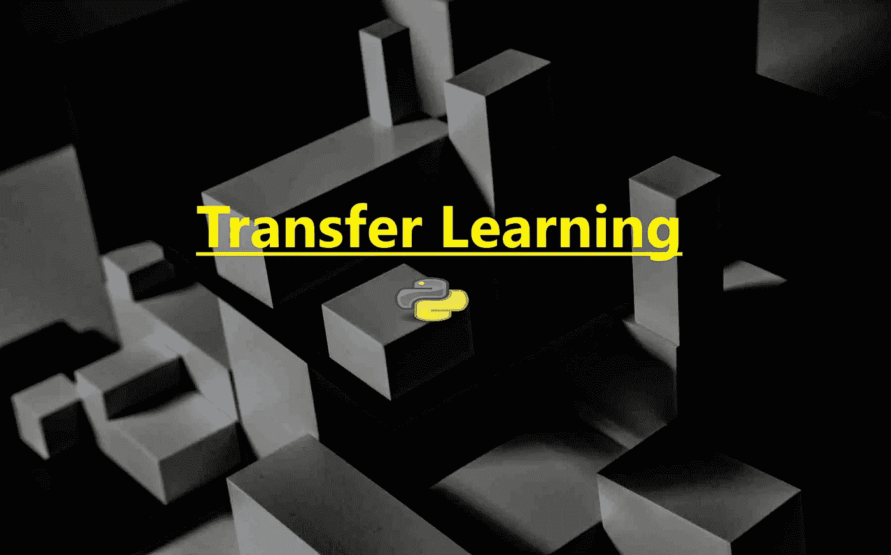
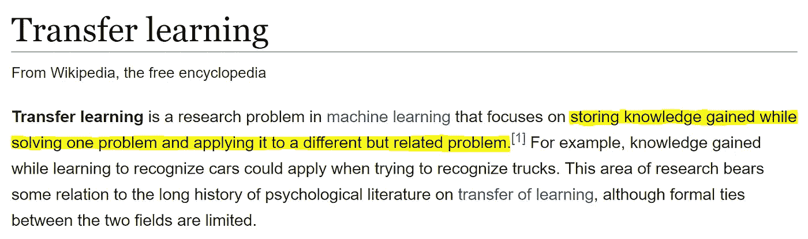
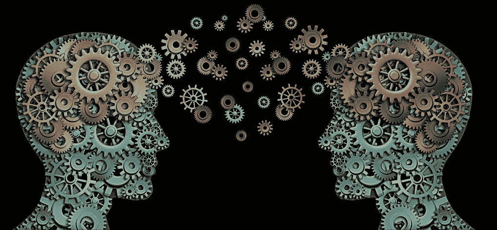
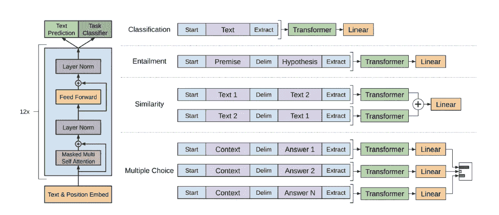
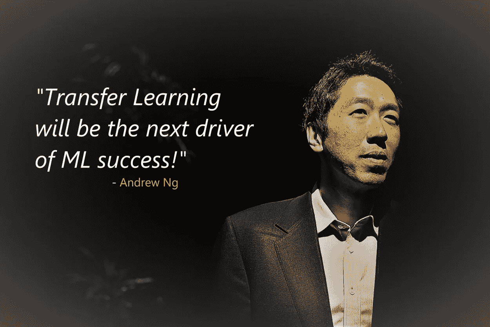

# 迁移学习——在新任务中重复使用预先训练的深度学习模型

> 原文：<https://medium.com/analytics-vidhya/reusing-a-pre-trained-deep-learning-model-on-a-new-task-transfer-learning-1c0a25a92dfb?source=collection_archive---------0----------------------->

在向有志之士教授*数据科学*一年多之后，我想我可以肯定地说**迁移学习**是一个困扰很多学生的概念。对于他们中的大多数人来说，这更像是“*不是机器学习，而且随着深度学习越来越深入，那现在我还需要了解一些迁移学习吗？*”。但在大多数情况下，有志者甚至不会意识到这个术语(*迁移学习*)，因为 MOOCs 并不真正使用这个术语([除了吴恩达](https://www.youtube.com/watch?v=yofjFQddwHE))。然而，在线教育门户网站上的专家讲师甚至不会跳过这个话题，只是他们没有明确使用这个术语，导致大量好奇的学习者经常提出类似于“*我知道如何训练一个模型，并且已经这样做了，但现在如何将这个预先训练好的模型用于新的任务？*“因此，让我们试着用简单的术语从概念上分解这个主题，以填补空白。

在整篇文章中，我不会重复发明轮子，也不会叙述别人根本没有解释过的事情。所以当你觉得“ ***我本可以自己完成这件事的时候&不需要他来告诉我！*** ”，我的回答是“*请这么做，因为在这个数字时代我们已经有足够的免费资源了&没有比自己研究更好的方法了*”。但是对于那些努力寻找相关信息的学习者来说，我们将依次采取步骤来理解&引导我们自己找到可以帮助我们理解这个重要概念的资源。

每当我们发现自己迷失的时候，我们的第一反应就是搜索 ***谷歌*** ，对吗？而且往往**维基**搜索结果高居搜索引擎结果榜首，那么让我们先从什么[***维基***](https://en.wikipedia.org/wiki/Transfer_learning) 说:

“ ***储存在解决一个问题时获得的知识，并将其应用于另一个不同但相关的问题*** ”之所以被强调，是因为这是我们一开始就需要向我们的灰色细胞提供的所有信息。尝试用一个更简单的例子在你的脑海中重现它，比如:作为一个酷的新时代游戏千禧一代，如果你知道如何使用[游戏手柄](https://www.techopedia.com/definition/7363/gamepad)(手持控制器或游戏手柄)，你就很有可能开始玩视频游戏，无论是在 [*Xbox*](https://en.wikipedia.org/wiki/Xbox) 上还是在 [*PlayStation*](https://en.wikipedia.org/wiki/PlayStation) 上。

假设，你的大脑最初接受了使用*游戏手柄*的训练，同时在 *PlayStation* 上玩游戏，后来当你也购买了 *Xbox* 时，你的大脑自动转移了那个*游戏手柄*控制/使用模型，并将其调整到你的大脑已经开始为 Xbox 上的游戏创建的知识管道。这使得你的大脑在学习 *Xbox* 时非常容易工作，因为它部分使用了预先训练的(*游戏手柄*)模型，并根据 Xbox 游戏体验的要求快速定制它。

现在我们有了一点概念上的理解，让我们想想为什么深度学习模型是固有的。那么深度学习模型有效的特殊要求是什么？ **>** **深度学习模型很像我们的女朋友**，**无论我们为她们做(喂)多少(数据量)，她们都不会满意，所以我们得到的回报只是成本(指成本/损失误差)**。但是如果我们运气好的话，我们可能只是找到了适合自己的女孩(深度学习模型)，而当这种罕见的事情发生时，我们就是放不下她(预训练模型)，对吗？

同样，一个优秀的预训练模型可以成为我们的多用途工具，因为它可以帮助完成许多其他事情，因此迁移学习是高级预测神经网络算法的一个重要概念。 **>** 另一个重要的方面是，在现实世界中，**为每项任务装配一个巨大的标签化数据集就像陪我们的女朋友去购物一样困难**。但是如果我们知道女朋友的 BFF(预训模特)也在镇上呢？当我们享受利物浦带着啤酒和披萨与切尔西比赛的时候，难道我们不应该更喜欢让他们两个都去疯狂购物(为其他任务训练新模型)吗？

因为这个假设的女朋友已经帮助我们理解了迁移学习的必要性，所以让我们继续来弄清楚在实施这个概念的过程中统计上发生了什么。例如，在计算机视觉场景中，深度学习算法通常试图辨别初始层中的边缘、中间层中的形状以及最终层中的一些必要的议程特定特征。**通过迁移学习，我们重用预训练模型的初始层和中间层，只为新任务**重新训练最终层。当我们没有足够的标记数据来完成我们的新任务时，这非常方便，也因为像神经网络、[贝叶斯网络](https://en.wikipedia.org/wiki/Bayesian_network)或[马尔可夫逻辑网络](https://en.wikipedia.org/wiki/Markov_logic_network)这样的训练算法是非常计算详尽的。注意，这个过程也有局限性，我们将在本文的后面讨论。

为了进一步扩展我们关于刚才提到的图像识别示例的迁移学习的知识，让我们快速浏览一下[吴恩达](https://www.linkedin.com/in/andrewyng/)的这个富有洞察力的会议，他演示了(参考作为新任务*的*放射学诊断*)*新模型(使用放射学图像数据集)中最终层的新权重集的初始化，同时保持我们预训练模型的初始&中间层完好无损。随着进一步的替代改进，我们的源(预训练)模型的所有权重得到修改，而不是简单地重新初始化和学习目标(新)模型中最终分类层的权重。随着培训数据可用性的增加，这种额外的模型灵活性开始产生效益。现在让我们来听听这个活生生的传说:

信息量很大，对吧？但在某个地方，它可能会戳中你的头脑，为什么所有地方的转移学习的参考大多是计算机视觉(特别是图像)相关的。所以**让我们换个话题，现在来看看*自然语言处理* (NLP)** 。多年来，NLP 领域缺乏一个已建立的参考数据集和源任务来学习可概括的基础模型，因此'*微调预训练的*'模型的社区不是那么大。

然而，最近的论文，如 Howard 和 Ruder 的[“用于文本分类的通用语言模型微调”](https://arxiv.org/pdf/1801.06146.pdf) &拉德福德的论文[“通过生成性预训练提高语言理解”](https://s3-us-west-2.amazonaws.com/openai-assets/research-covers/language-unsupervised/language_understanding_paper.pdf)展示了在自然语言领域有前途的模型微调能力。尽管这些论文中的源数据集各不相同，但社区似乎正在标准化一个“*语言建模*”目标，作为训练可转移基础模型的途径。显而易见的好处来自于这样一个事实:原始文本对于每一个可以想到的领域都是大量可用的，并且*语言建模*具有不需要带标签的训练数据的理想属性。

【必读】一篇关于 KDNuggets 的非常全面的[文章，关于“**NLP**的有效迁移学习”](https://www.kdnuggets.com/2018/10/more-effective-transfer-learning-nlp.html)

我可以给你一些高端的例子，在这些例子中，迁移学习已经被应用于深度学习，并被观众广泛接受，但如果你处于初始学习阶段，架构可能会很快变得复杂，因此我不会这样做。仍然只是列举几个供你参考(如果你希望更多地了解它，或者可能只是出于采访的目的):**>Google 的 Inception 模型**[在 Google AI 博客上使用 TensorFlow 实现简单的图像分类](https://ai.googleblog.com/2016/03/train-your-own-image-classifier-with.html)**>微软的 ResNet 模型**[原文](https://arxiv.org/abs/1512.03385) *但是*从这个[开始易于理解](/@14prakash/understanding-and-implementing-architectures-of-resnet-and-resnext-for-state-of-the-art-image-cf51669e1624)使用 PyTorch 首先实现 **>**

有了我在整篇文章中附上的所有超链接，你就可以使用 TensorFlow、PyTorch 等工具在特定场景中实现迁移学习了。主要在计算机视觉和自然语言处理领域有深度学习模型。在实现之前，我们需要理解[我们的源模型的特性有多大的可移植性](https://arxiv.org/abs/1411.1792)，以及我们是否做了足够的工作来避免常见的缺点。**我们还需要注意一些缺点，比如:>** 我们可能会在新数据集的架构灵活性方面受到*的限制。> *对于目标任务，学习率通常保持很低*，因为我们相信我们的源模型的权重，并且不急于以任何方式太快地扭曲它们。*

总的来说，到目前为止，我们观察到了对方法论的概念性理解、数学倾向、流行的实现领域、很少的实际例子，以及迁移学习的常见缺陷。继续，问题是**迁移学习本身是否在每个方面都是如此有效的解决方案，以至于它可以成为任何深度学习问题的明确解决方案**？不幸的是，答案是**不**，因为“*在统计学习中没有免费的午餐”*。

这就是将其他微调概念集成到执行管道中的地方。这里有一个由 Sebastian Ruder 撰写的[机器学习博客，详细介绍了这些概念，以及更多类似于](http://ruder.io/transfer-learning/)[半监督学习](https://en.wikipedia.org/wiki/Semi-supervised_learning)、[多任务学习](https://www.youtube.com/watch?v=UdXfsAr4Gjw)、[零起点学习](https://arxiv.org/pdf/1707.00600.pdf)等等，所以我强烈推荐看看这个博客。杰森·布朗利的另一个博客[值得关注。如果您希望我涵盖其中的任何概念，请在*评论*部分告诉我。感谢您的时间，并享受机器学习！](https://machinelearningmastery.com/transfer-learning-for-deep-learning/)

页（page 的缩写）s:本文中提到的任何性别/关系仅仅是为了增加一点幽默&绝对没有冒犯任何人的意思。:)