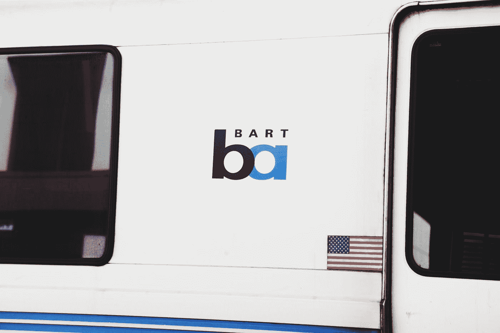
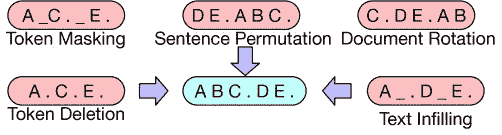

# 揭示 BART:预处理的去噪目标

> 原文：<https://medium.com/analytics-vidhya/revealing-bart-a-denoising-objective-for-pretraining-c6e8f8009564?source=collection_archive---------7----------------------->

乔治·特罗瓦托在 [Unsplash](https://unsplash.com?utm_source=medium&utm_medium=referral) 上的照片

> **论文真实作者:、、刘、纳曼·戈亚尔、马尔扬·加兹维尼贾德、阿卜杜勒拉赫曼·穆罕默德、奥迈尔·利维、维斯·斯托扬诺夫、卢克·泽特勒莫耶**

****简介:****

**本文讨论了自然语言生成中序列对序列模型的预处理去噪方法。我试图以一种清晰的方式解释我的研究中的一切，希望每个读者都能理解这篇文章，并从中受益。巴特(虽然听起来像你已经知道的伯特，但不要在这里停下来，因为这是写下这篇文章的动机，因为它将帮助你理解巴特的确切文献)。**

**目前，用于预训练的自监督学习已经在各种下游自然语言处理任务中取得了巨大的成功，例如，Word2Vec、ELMO、BERT、spanBert、XLNet 等。都是基于自我监督的学习。但在所有这些中，自我监督的掩蔽语言模型以其卓有成效的 SOTA 性能真正撼动了 NLP 的领域。同样，巴特是另一个成功。**

**问题来了“巴特是什么？”它是一种自监督自动编码器，首先使用添加了噪声的源文本(通过破坏源文本中的一些标记或使用本文稍后讨论的任何合适的噪声方案)作为输入，然后使用 LM(语言模型)通过预测被破坏标记的真实替换来重建原始文本。当用于自然语言生成(NLG)任务时，该模型在性能方面是最好的，但对于理解任务也是值得称赞的。**

****架构:****

****

**本文作者创建的图像**

**正如作者在论文中所建议的，这是一种基于转换器的 Seq2Seq 模型，它使用损坏的源文本，然后通过从解码器重新生成原始文本来尝试对源文本进行去噪，并且解码器的每一层都关注编码器的最终隐藏层。它可以被看作是一个 Seq2Seq 模型，修改后作为一个自动编码器。该架构的一个显著特点是使用 GELU 代替 RELU 激活层。与 BERT 相比，它不像 BERT 那样在顶部使用前馈网络进行单词预测。此外，与同等的基于 BERT 的架构相比，BART 仅多使用 10%的参数，并在语言生成任务方面实现了更好的性能。架构中涉及的参数初始化为正态分布~ N(0.00，0.02)。作者谈到了根据用户要求提供两种不同的预训练模型:**

1.  **基础案例模型(6 层架构)**
2.  **大型模型(12 层架构)**

**为了准备用于预训练的模型，首先，来自输入/源文本的一些标记被随机破坏(添加噪声方案),并且在训练时，使用输出和解码器输出之间的交叉熵损失来优化再生损失。与现有的去噪自动编码器不同，BART 允许我们应用任何类型的文档损坏。在极端情况下，关于源的所有信息都丢失了，BART 相当于一个语言模型。让我们也来看看可以在源文本上的 BART 中使用的噪声方案/变换:**

****

**BART paper([https://arxiv.org/pdf/1910.13461.pdf](https://arxiv.org/pdf/1910.13461.pdf))的真实作者(开头提到过)的图片**

**1.令牌屏蔽:随机令牌被采样并用[MASK]令牌屏蔽。**

**2.令牌删除:随机令牌被采样和删除(类似于屏蔽)，模型在它们的位置添加新的令牌。**

**3.标记填充:从泊松分布中抽取多个文本区间(一组连续的标记)，并且每个区间由屏蔽的标记[MASK]代替。**

**4.句子排列:文档句子的随机排列。**

**5.文档旋转:随机统一选择一个标记，文档围绕该标记旋转，以便文档从该标记开始。**

****为什么巴特如此富于表现力而又高高在上？****

**让我们通过假设一种情况来理解这一点，在这种情况下，我们只有 BERT 作为我们感兴趣用于 NLG 任务的语言模型。你能看出任何限制吗？好吧，让我给你一个提示:“BERT 使用源文本，其中一些标记被*屏蔽*，它试图预测实际上可以替换那些*屏蔽*标记的单词。”如果我的暗示听起来对你没有帮助，这并不意味着你不擅长做事情，因为我的暗示可能很糟糕😔。**

**好吧，让我解释一下，如果你已经知道屏蔽令牌是由 BERT 独立预测的，并且声称对于基于 NLG 的任务来说是一个“不太好”的体系结构，尽管 BERT 本质上是双向的，那么我在上面的提示的最后两行中给单词“屏蔽”加下划线的原因就很容易理解了。但是像 GPT 这样的架构(读取从左到右的上下文)由于其自回归性质而在 NLG 任务中是健壮的，然而，它仅包括从左到右的上下文读取，并且不是深度双向的。**

**因此，为了实现这种任务的良好性能，建议通过结合用于编码被破坏的源文本的 BERT 和用于通过预测被屏蔽的标记来生成原始文本的 GPT 来获得两个世界的最佳效果。这激发了对基于编码器-解码器(seq2seq)的架构 BART 的需求，以提高下游 NLG 和理解任务的性能。**

****应用:****

**BART 可以进行微调，以便在各种下游任务中表现出色:**

1.  **序列分类:使用预训练的 BART，并且解码器输出的最终表示(解码器的顶部隐藏状态)被用作序列的有意义的输入表示，并且被用于新的多类分类器中。**
2.  **令牌分类:使用预训练的 BART，解码器输出的最终表示(解码器的顶部隐藏状态)提供每个单词的有意义的表示，并用于令牌的分类。**
3.  **序列生成:它类似于去噪预训练目标，因为解码器输出具有从原始输入序列复制的信息的序列。它可以用于摘要和问答任务中的序列生成。**
4.  **机器翻译:整个预训练的编码器-解码器被假定为将生成目标序列的解码器，并且引入一个新的编码器，该编码器将源序列作为输入。在训练时，预训练结构的参数被冻结，在编码器试图学习源和目标序列之间的比对的第一步中，仅学习新编码器的参数。第二步，通过较少的迭代学习整个架构。**

**我希望我的文章对所有的读者都是有用的、有成效的和有益的。我还要感谢所有好奇的读者，他们花时间阅读了我的第一篇文章。我也对那些认为事情可以用更清晰的方式解释的人感到抱歉，并要求他们一定要给予必要的反馈，我下次一定会考虑你的建议。此外，我完全接受和回答您的问题，疑虑和与本文相关的反馈。结束，保持健康，保持动力！**