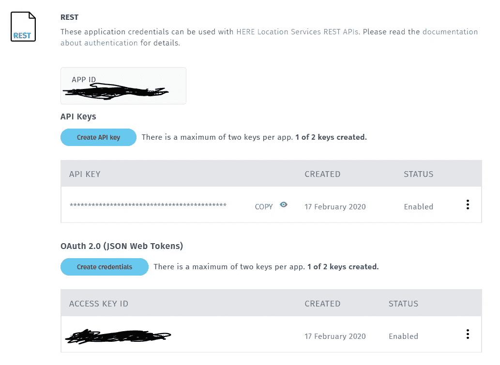
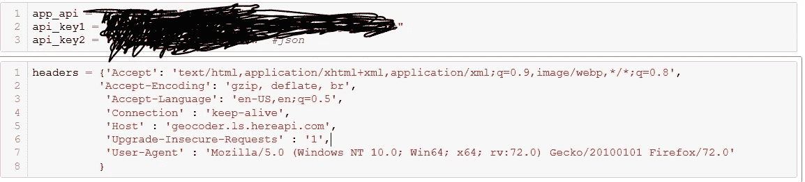
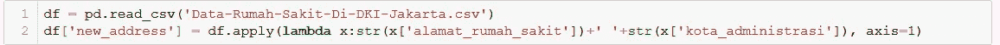
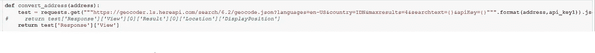
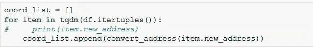
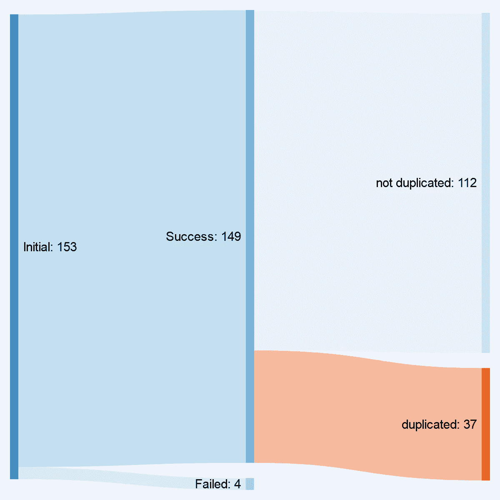
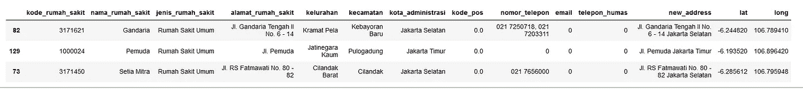
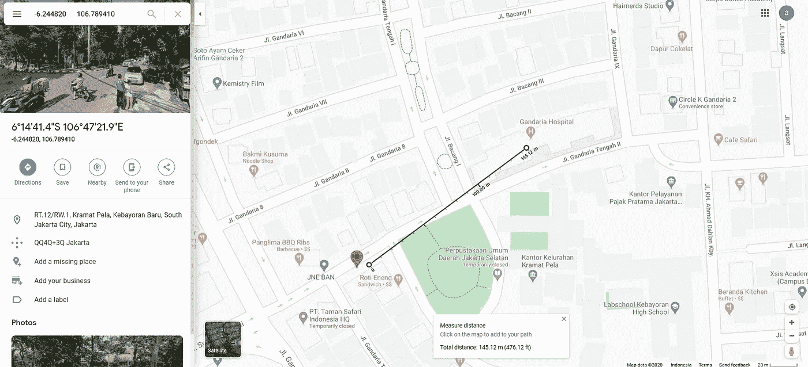

# 使用 here API 将地址转换为纬度和经度

> 原文：<https://medium.com/analytics-vidhya/reverse-address-to-latitude-and-longitude-using-here-api-73458b4df996?source=collection_archive---------21----------------------->

在我们开始之前，请在这里的[上创建账户。
然后创建一个项目。](https://developer.here.com/login)

*我使用 here 服务的主要原因是它是免费的(每月 25 万次请求)，如果我使用谷歌服务，它需要信用卡*。

在我们跳到 API 之前，有几个步骤来创建认证[密钥](https://developer.here.com/documentation/authentication/dev_guide/index.html)。

如果授权密钥注册成功，它将看起来像这样。

认证密钥

# 数据

对于数据，我使用雅加达的医院数据。它有地址，城市，但没有经度和纬度。这里可以找到[。](https://data.jakarta.go.id/dataset/6925d6e6-d9a7-4159-906b-96468f870d93/resource/5d550b55-52c0-4d71-aa12-c4d319a593e8/download/Data-Rumah-Sakit-Di-DKI-Jakarta.csv)

# 密码

这段代码有 4 个主要部分。

1.  设置 API 密钥
2.  加载数据和清理
3.  将地址反转为经度和纬度
4.  确认

1.  设置 API 密钥

设置 API 密钥

2.加载数据和清理

成功加载数据后，创建一列用于连接医院地址和城市。这将使 API 易于识别。

3.将地址反转为经度和纬度并清除

通过创建下面的函数，它接收输入地址，输出是 lat 和 long。但是，一个地址中可能存在多个 lat 和 long。

转换地址的函数

使用循环将函数运行到数据帧

因为清除过程仅检索纬度和经度信息，因为除了纬度和经度之外还有其他信息。

清理过程

4.确认

下图解释了在给定输入医院数据的情况下 here maps api 的性能。

使用[和](http://sankeymatic.com/build/)创建的桑基图如下。

摘要

最终结果样本

使用谷歌地图进行验证

5.结论

使用这里映射反向地址地址到 lat long API 产生相当准确的结果。此外，它是免费的* 250k，并具有丰富的功能比扭转 lat long 其他。