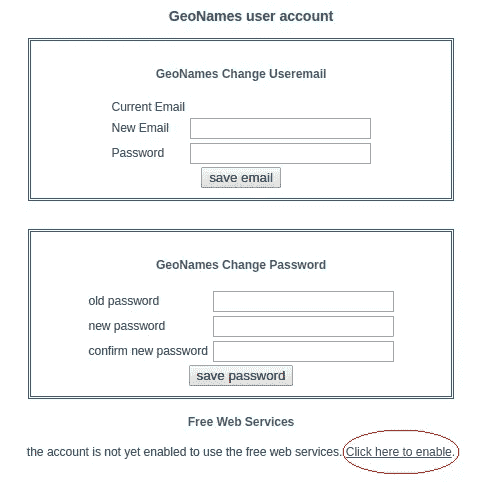

# 使用 Python 中的地理名称进行反向地理编码

> 原文：<https://medium.com/analytics-vidhya/reverse-geocoding-with-geonames-in-python-3b5bb176a26c?source=collection_archive---------6----------------------->

## 如何从原始纬度/经度值获取位置名称


## 什么是反向地理编码？

查找给定纬度/经度对的地址或位置名称的过程。在许多与位置相关的数据科学应用中，它是一个重要的模块。

我试图找到一种方法来获得一组纬度/经度对的英文位置名称。我发现一些博客使用 [**命名**](https://nominatim.org/release-docs/develop/api/Overview/) ，这也被 [OpenStreetMap](https://www.openstreetmap.org/) (OSM)用于地理编码和反向地理编码目的。但是，Nominatim 返回本地语言的位置名称(例如，中国用中文，孟加拉国用孟加拉语等)。当然，你可以很容易地用 python 把它们翻译成英语，但是还有另外一种方法，使用[**GeoNames**](https://geopy.readthedocs.io/en/stable/#geonames)**它是免费使用的，并且返回英语的位置名称。**

**在本教程中，我们将使用 geopy 库中的 GeoNames 类来执行反向地理编码。**

## **安装库**

**首先，我们需要用下面的命令从终端安装 [**geopy**](https://geopy.readthedocs.io/en/stable/) 库。**

```
pip install geopy
```

**现在，我们的编码部分开始。**

## ****导入类****

**对于本教程，我们只需要导入一个类。**

```
from geopy.geocoders import GeoNames
```

## ****初始化****

**为了初始化 GeoNames，我们必须执行以下操作:
1 .在这里创建一个新的用户账户。
2。在登录状态下，进入此[链接](https://www.geonames.org/manageaccount)激活免费网络服务。
3。点击页面下方的“点击此处启用”链接**

****

**因此，我们的帐户已经获得了 GeoNames 的免费网络服务。**

**现在，我们通过提供我们的 GeoNames 帐户用户名代替“您的用户名”进行初始化，如下所示:**

```
geo = GeoNames(username=’your_username')
```

## **查找位置名称**

**接下来，我们输入纬度、经度值来获取所需的位置信息。**

```
latitude, longitude = 23.765328, 90.358641 #enter any value here
location = geo.reverse(query=(latitude, longitude), exactly_one=False, timeout=5) 
# timeout: Time, in seconds, to wait for the geocoding service to    # respond. In case of timeout error, increase it's value.
```

**上面的代码将返回一个列表类型的对象。我们可以执行以下操作来获取位置的名称:**

```
location_name = location[0]
```

**因此，只需几行代码，我们就可以获得特定地址的位置名称。**

## ****免费数据来源****

**GeoNames 还开放了几个国家的[数据源](https://www.geonames.org/datasources/)。人们可以根据自己的需要轻松下载这些内容。**

## ****限制****

**尽管 GeoNames 对于一般用途是免费的，但它确实有一些限制。每个应用程序都有每小时和每天的限制(由用户名标识)。因此，使用一个用户名，我们可以执行一定数量的请求(函数调用)。对于[反向地理编码](http://www.geonames.org/export/credits.html)，我们可以在一小时内执行大约 333 个请求。如果你想用于[商业](http://www.geonames.org/commercial-webservices.html)目的，你也可以购买积分。但是对于小规模的项目，免费版本已经足够好了。**

## ****结论****

**我们现在可以很容易地从给定的纬度/经度对中找到我们想要的位置名称。为了便于使用，下面是最终代码。**

```
# import class
from geopy.geocoders import GeoNames# initialize with your username
geo = GeoNames(username=’your_username’)# get location information
latitude, longitude = 23.765328, 90.358641 #enter your desired value
location = geo.reverse(query=(latitude, longitude), exactly_one=False, timeout=5)# get location name
location_name = location[0]# print location name
print(location_name)
```

**希望这篇文章对你有帮助:)。**

**万事如意！**