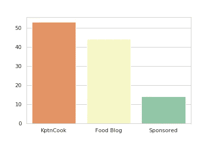
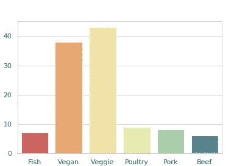
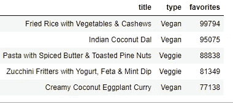
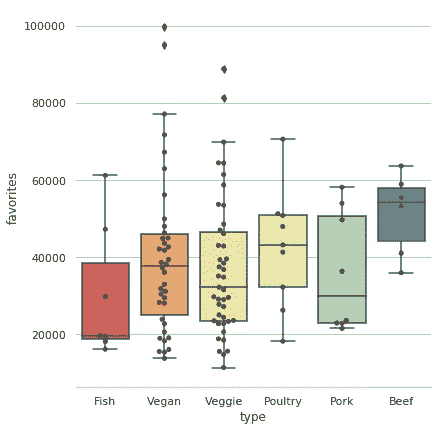
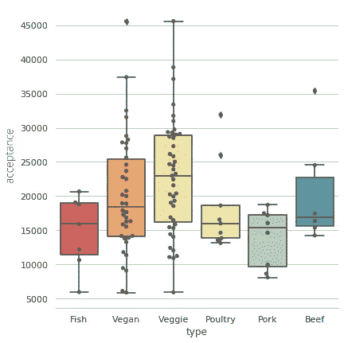
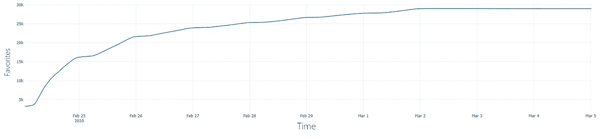
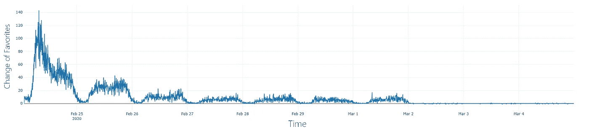
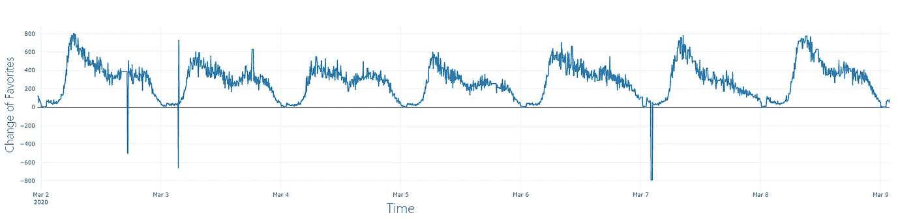
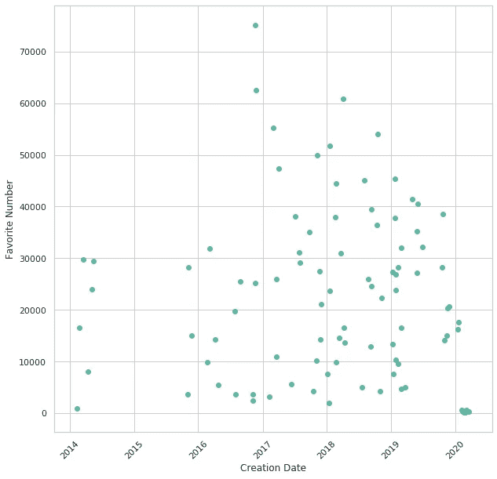

# 反转和分析烹饪应用 KptnCook——我的食谱收藏

> 原文：<https://medium.com/analytics-vidhya/reversing-and-analyzing-the-cooking-app-kptncook-my-recipe-collection-5b5b04e5a085?source=collection_archive---------6----------------------->

由 [Breakslow](https://unsplash.com/@breakslow?utm_source=medium&utm_medium=referral) 在 [Unsplash](https://unsplash.com?utm_source=medium&utm_medium=referral) 上拍摄

我喜欢烹饪，花些时间做一顿美味的饭菜是一种放松。因此，一个朋友向我推荐了一个名为 KptnCook 的应用程序，我非常喜欢它。KptnCook 每天只提供三种食谱。食谱只有一天的有效期，然后就消失了。为了保存好的食谱，我可以把它保存在我的收藏夹里。因此，你不会被其他应用程序中的大量食谱淹没。

然而，我是一个好奇的人，在使用这个应用程序几周后，我想了一些方法来欺骗系统，以获得他们所有的食谱。此外，受伟大的大卫·克里塞尔的启发，我想到了我可以收集的数据并做一些小的分析，就像大卫对[在线新闻杂志《明镜在线》](https://www.youtube.com/watch?v=bYviBstTUwo)和[德国铁路](https://www.youtube.com/watch?v=AGCmPLWZKd8)所做的那样。因此，我开始反转应用程序，以便更深入地了解它，并收集一个月的数据。本文分为两部分，首先描述我的倒车过程，然后分析我收集的数据。

# 回动的

我分析应用程序的方式总是由两部分组成，这两部分相辅相成。首先，我在我的测试手机上下载应用程序的 APK，那只是我的旧三星 Galaxy S4，并设置程序 Burpsuite 来分析网络流量。这叫做动态分析。要考虑的重要一点是要使用的手机。自从 Android Nougat 以来， [Google 改变了他们信任认证机构的方式](https://android-developers.googleblog.com/2016/07/changes-to-trusted-certificate.html)，因此拦截安全流量不再像以前那么容易。然而，似乎有一种方法可以绕过它，然而在我的 S4 上，它仍然以简单的方式工作。除了动态分析，我在我的电脑上反编译相同的 APK，并开始静态分析。这意味着，我浏览程序代码，试图理解应用程序是如何工作的。在第一个视图之后，我开始用动态分析来验证我在代码中的发现，反之亦然，也获得了在静态分析中寻找什么的新想法。

在 KptnCook 的代码中，有一个类立刻引起了我的注意，因为它的名字是 *ApiCreds* 。这个类包括一个 API 域和一个 API 键，不幸的是，从来没有使用过。很快，通过跟踪 API 域函数，我发现了五个更有前途的类:这五个类的共同点是它们都以名称 *Webservice* 开始，它们几乎都使用 API 域，并且它们都使用一个所谓的 *kptnkey* 作为请求头或请求参数。

首先，我简单地看了一下类 *WebserviceAccount* ，觉得它看起来不错。我无意超越任何账户，所以没有深究。此外，使用该应用程序不需要帐户，只需要扩展功能。

接下来，我快速浏览了类 *WebserviceCampaigns* ，该类用于获取菜谱列表之间的促销活动信息。对此不感兴趣，我继续学习类 *WebserviceStores* ，这是一个使用另一个 API 域的类——[*stores.kptncook.com*。](https://stores.kptncook.com.)用于列出合作商店，如 Kaufland 或 Rewe，以便在购物清单中的地图上显示它们。购物清单在类 *WebserviceShoppinglist* 中处理，并通过唯一的清单 ID 和用户 ID 从 API 请求。我必须承认，我没有深入研究这些类，因为活动和商店超出了我的范围。正如我所说的，我的兴趣是得到食谱——我开始饿了。

最后一个 webservice 类 *WebserviceRecipes* 揭示了对它们的 API 调用。每个配方都有自己的配方 ID，用于向服务器请求配方。通过请求*mobile.kptncook.com/recipes/de/<时间>在 JSON 中提供 id，其中时间代表 UNIX 时间。然而，在我的测试中，我只能列出当天的食谱，不管我输入的是什么时间。所以我继续进行另一个有趣的 API 调用，它给出了当前在他们的收藏夹列表中拥有该食谱的人数—*mobile.kptncook.com/recipe/<id>/收藏夹/计数*。此外，可以从计数中增加或减少一个，就像我在应用程序的收藏夹列表中添加或删除食谱一样，但没有任何认证。因此，我可以随心所欲地操纵这个数字，我们将在数据分析中对此进行更深入的研究。简而言之，我能够在不使用应用程序的情况下请求当前最喜欢的食谱，因为我的目标是这项工作。尽管如此，我受限于每天收集的食谱 id，无法获得数据库中的所有食谱。*

考虑到这一点，让我们开始烹饪并查看来自我最喜欢的一餐的食谱 JSON。JSON 很长，所以我建议在第二个选项卡中打开它。

描述一个配方的 JSON

首先，我们有食谱的 ID，接下来是关于食谱的信息，然后是作者——照片和社交媒体的链接。有些食谱是由品牌赞助的，比如 Followfood，它也被列为作者。之后是配料表。它的每个元素都包含不同品牌的一系列产品。产品在应用程序中得到推荐，并在用户为食谱创建购物清单时使用。最后，我们可以看到描述如何做饭的步骤。每一步都由图像、标题和该步骤中使用的成分组成。

反转之后，我很快编写了一个工具，从 API 请求数据，并自动收集它们用于我的数据分析。每晚欧洲中部时间 01:00，当新的食谱发布时，我请求它们并将 JSON 存储在数据库中。我每五分钟检查一次收藏夹数。为了不引起任何日志的注意，我使用了 Tor 代理 docker，它为我的每个请求提供了一个新的 IP 地址。这对于少量的数据很有用，但是对于大量的请求来说，这是不可伸缩的，因为由于路由的原因，它非常慢。一切就绪后，我收集了一个月的数据，并在事后进行了分析。

# 数据分析

从分析开始，让我们大致了解一下我们的数据集。数据跨度从 2020 年 2 月 21 日到 2003 年 2 月 21 日，共四周。它包括 111 个食谱，我们有 630137 个不同的最喜欢的数字。细心的读者会注意到，28 天乘以 3 个食谱并不是 111，在这之前我还隐瞒了一件事。除了标准食谱之外，还有一些推广食谱会出现几天，它们会被添加到我的数据中。接下来，我会先问一个问题，然后尝试用我掌握的数据来回答这个问题。

作者是谁？

有了数据集，对作者进行列表和分组变得非常容易。我把他们分为三类:在 KptnCook 工作的人；拥有美食博客和的人；公司赞助的食谱。在下面的图中，我们可以看到大多数食谱(53)是由 KptnCook 作者自己创造的，只有少数是赞助的(14)。美食博客提供了几乎一半的菜谱(44 种)，并且与他们网站上的[列表非常匹配。在我的数据集中，5 个作者属于 KptnCook，36 个是博客作者，6 个是公司。我们可以看到，所有外部作者只带来了一些食谱，大部分工作是由 KptnCook 背后的人完成的。](https://www.kptncook.com/de/foodblogs)

按类别分组的食谱数量

接下来，我把食谱分成食物种类和成分，这样我就可以看到作者喜欢的饮食。下面，可以清楚的看到，大部分食谱都是素食或者纯素的。不幸的是，这些成分没有什么意义，因为它们是英语和德语的，无法归类。

按类型分组的配方数量

所以，回答问题，作者是美食博主和各种公司。尽管如此，大多数食谱都是内部制作的。似乎作者大多是素食主义者，或者他们期望大多数用户是素食主义者。另一种解释可能是，无肉菜肴可以变得更加多样。然而，素食是时尚的，所以接下来的问题是，这是真的吗？用户对素食更感兴趣吗？

**谁是用户？**

了解用户的关键是他们可以选择喜爱的食物。如前所述，我每五分钟收集一次每个食谱的喜爱数字(favs)。查看数据时，我意识到有时计数在一个 tick 中跳跃了 1000 个单位，但在下一个 tick 中又恢复正常。因此，我认为问题出在服务器端，尽管如此，我还是在分析数据之前清理了它们。这个搞清楚之后，我们就可以回过头来看数据了。我把食物按 favs 分类，看到前五名食谱都是素食或纯素食。通过这种方式，作者走上了正确的道路。

最受欢迎的食谱按其喜爱的数量排序

然而，正如我们之前看到的，大多数食谱都是素食主义者或纯素食主义者的，因此可以预期会看到它们出现在最上面。因此，让我们更清楚地查看所有的食谱，看看人们对这些类别的平均喜欢程度。在此之前，我意识到大多数食谱并不像人们预期的那样以零 favs 开始，而是以不同的数字开始。这很可能是由于我将在后面解释的食谱的重用。现在，我决定引入一个新的类别，我称之为用户的*接受度*。接受是早晨和晚上最喜欢的区别。因此，它描述了一天有多少人点击了应用程序中的收藏夹按钮，比收藏夹更具描述性。在下图中，我在左边画了平均收藏，在右边画了平均接受度。

配方按其类型分组，并绘制成箱线图。左图显示了每个配方的收藏夹总数，左图显示了该配方出现在数据集中的第一天收藏夹的变化。

我们可以看到，左边最受欢迎的食谱是无肉类，然而，平均来说，它们比家禽或猪肉要少。另一方面，我们看到，根据接受度绘制的图，更相关的是，素食和纯素食是突出的。由于作者创造了更多新的素食和纯素食食谱，我认为他们更经常地在其他类别中重复使用食谱。因此，无肉食谱收集了更多的 favs(总数)，但没有接受度(每天)。事实上，在我看来，用户最喜欢健康和素食，有时仍然可以享受一顿好的牛肉餐，因为他们可能会把它当作一顿特殊的餐。但那只是假设。

继续分析，让我们看看 favs 随时间的变化和用户的例行程序。为此，我绘制了总收藏夹数和收藏夹数随时间的变化。通过收藏夹的变化，我们可以看到用户什么时候活跃。

一个 7 天食谱在 10 天内最受欢迎的次数

一个 7 天食谱在 10 天的过程中 favs 的变化

一周内所有收藏夹的变化

在前两个图中，我们可以看到两个图表，显示了 7 天食谱的 favs 变化。7 天食谱是一个星期后才消失的特价菜。最后一张图显示了我在一周内收集的所有食谱的变化。在这两个图中，我们可以很容易地看到，大多数用户在早上 8:00 左右使用该应用程序，可能是在他们起床的时候。晚上晚些时候是另一个高峰，在午夜，使用量下降到几乎为零。在欧洲中部时间 01:00，图表显示了一个跳跃，这是因为大多数食谱开始时没有 favs 后来更多。有趣的是，除了周末，我们总是能在午夜——德国时间——看到这一幕。这是德国大多数人睡觉的时间，而这款应用也是为美国市场设计的。回到用户是谁以及作者创建的食谱类型是否正确的问题:似乎大多数用户都是德国人，有着典型的工作和睡眠时间表。据 favs 所知，大多数食物都是素食或纯素的，这一事实受到了用户的欢迎。

但是如果我们不能相信最喜欢的数字呢？他们可靠吗？这是我想回答的下一个也是最后一个问题。

我们能相信 favs 吗？

前面我提到过，favs 通常是从几千或者更多开始的。此外，我之前提到我找到了一种方法来修改我喜欢的 favs。所以，首先想到的肯定是这些数字是假的。然而，我认为它们是有效的，我将解释为什么。虽然操纵是可能的，但是 favs 随时间的变化图没有显示异常，除了开始时的 favs。所有的食谱都有一个创建日期，对于许多食谱来说，这个日期已经有 20 年了.在下图中，我们可以看到创建日期与 favs 的数量相关，我解释了他们重复使用旧配方而不是伪造数字的方式。重复使用的配方收集了每个外观的 favs，显然比新配方有更多的 favs。我们之前已经看到，一般来说，无肉食谱有更多的受欢迎程度，但接受程度却更低，可能是因为重复使用。然而，据我所知，这些数字不是从零开始，而是在 200 左右。我猜，这是为了让数字从一开始就在应用程序中看起来更好。当然，有人可能会说 200 个额外的收藏是假的，但对我来说这也没什么。

按创建日期和喜爱的数字分类的食谱

然而，我在图表中发现了一个奇怪的现象，我仍然无法解释。在上面的图中，显示了基于 favs 变化的一种配方的活性，在 7 天后仍然可以看到活性。这是有道理的，人们从他们的最爱中删除食谱，数量下降，然而，有时数量上升一个或两个。这可能是 API 的测试或其他人逆转了应用程序，我不知道。毕竟，我认为这些数字总体上是准确的，我们可以信任它们。

总之，我们发现 KptnCook 团队自己创造了大部分食谱，并且主要关注素食。这很好地被用户所接受，他们可能是德国人或欧洲人。最后，我们检查了数据的完整性，每个人都应该这样做，并认为它们是准确的。

# 结论

总结这篇文章，让我鼓励你开始你自己的小逆转或数据分析项目。现在也许是最佳时机，因为大多数人都必须呆在家里。逆向应用和分析数据不仅有趣，而且有助于理解数据。我试图唤起人们的好奇心，因为我认为在这个世界上，你只需在手机上点击几下就可以轻松找到每个问题的答案，这很重要，你也知道如何用数据来验证问题。并且，如果你现在饿了，为了食物或者数据分析，随时找我要食谱或者小技巧。我对我现在拥有的大量食谱感到不知所措…