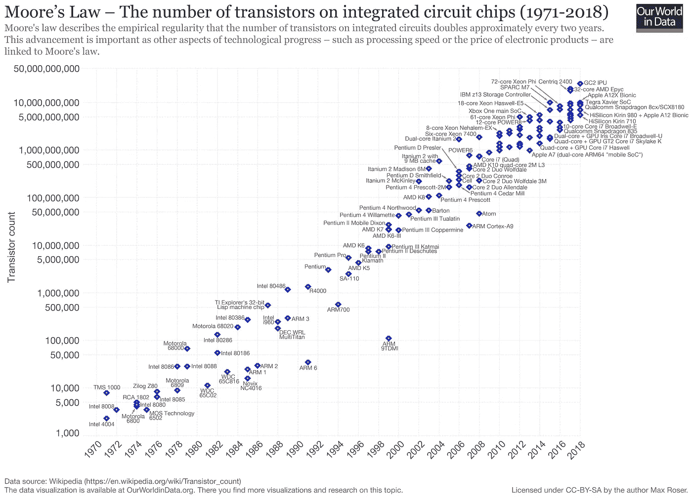

# 逆转生物化学中的埃罗姆定律

> 原文：<https://medium.com/analytics-vidhya/reversing-erooms-law-in-biochemistry-d237f76b1bb0?source=collection_archive---------14----------------------->

约翰·莫塞斯·鲍恩在 [Unsplash](https://unsplash.com/s/photos/physics?utm_source=unsplash&utm_medium=referral&utm_content=creditCopyText) 上拍摄的照片

一个人必须住在喜马拉雅山的高处，才能错过近几十年的重大科学发展。在我们这一代人的一生中，我们已经见证了计算机技术渗透到我们日常生活的每一个方面，经常带来仅仅在 20 年前还被认为是科幻小说的解决方案。

医学和药理学是这些技术突破的最大受益者之一，正如我们所看到的，新一代药物进入市场，如单克隆抗体、新一代艾滋病毒药物、抗偏头痛药物等。由于技术进步，很难过高估计最近的成就，它们似乎继续以指数速度发生。由于计算机科学的进步，这种增长已经被期待了很久，甚至被仔细地解释过。事实上，摩尔定律预测最大晶体管密度每两年翻一番，直接导致计算成本在同一时期也下降两倍。当然，我们可以自由预测未来几年的稳定增长乘数，我们的未来似乎越来越光明。

由 Max Roser—[https://ourworldindata . org/uploads/2019/05/Transistor-Count-over-time-to-2018 . png、](https://ourworldindata.org/uploads/2019/05/Transistor-Count-over-time-to-2018.png,) CC BY-SA 4.0、[https://commons.wikimedia.org/w/index.php?curid=79751151](https://commons.wikimedia.org/w/index.php?curid=79751151)

然而，在药理学领域，他们早在 20 世纪 80 年代就开始注意到一种相反的趋势。Richard Friesner 博士(博士和领先的制药研究公司之一 schrdinger LLC 的联合创始人)在他的文章[“逆转 Eroom 定律:计算机能极大地影响药物发现的生产力吗？”](https://www.schrodinger.com/blog/reversing-erooms-law-can-computers-dramatically-impact-productivity-drug-discovery)。对于那些可能没有听说过 Eroom 定律的人来说，这是摩尔定律的意思和拼写都颠倒了。Eroom 定律根据经验表明，药物研发的成本大约每 9 年翻一番，这应该关系到几乎所有人，因为随着年龄的增长，我们最终都会服用维持药物，如果我们还没有服用的话。这些开发成本的增加减缓了研究，并可能被认为是计算生物化学通往“数十亿美元分子”的道路上的一个严重障碍——这是一种我们非常需要的超高效靶向药丸。

尽管如此，弗里斯纳博士仍然非常乐观，这令人难以置信地欣慰。他在文章中指出，当前的生物化学实践尚未充分利用大数据处理的快速增长的计算潜力，尽管该行业已经开始受益于计算机建模成本的降低。根据他的说法，“挑战在于使用计算机和精确的科学算法来预测候选药物必须具备的关键特性”。尽管在过去的 30 年里，人们一直在尝试使用计算机模拟物理和化学化合物的性质，但直到现在，他们的结果才开始显示出一些成果，而且潜力是无限的！

此外，如今每个媒体都在无休止地谈论靶向治疗，其形式是将药物的活性分子成分塑造成个人的基因图谱，也称为个性化医疗。这是我们必须再次考虑 Eroom 法则的地方，因为内置的个人调整成本会高得难以想象！人们必须问这样一个问题，如果科学家们清楚地知道只有少数人能够负担得起这种类型的治疗，他们为什么还要追求这个呢？

根据 Friesner 博士的说法，答案再次回到了计算机模拟模型的发展。他预测纳米技术将会爆发式增长，这将会颠覆 Eroom 定律。在特异性和效力方面，我们可能服用的每一种靶向药丸背后的生物学和化学将比现有水平高出几光年，并且——希望成本大大降低。他以对永恒的质量-价格权衡的乐观预测结束了他的精彩文章:“极具挑战性的生物学和新药更高的安全性/有效性的平衡将仍然存在；但使用精确、强大的纳米尺度模拟来逆转 Eroom 定律似乎是可能的。”

这确实给人类在未来战胜疾病带来了更大的希望！