# 综述:AdaConv —通过自适应卷积实现视频帧插值(视频帧插值)

> 原文：<https://medium.com/analytics-vidhya/review-adaconv-video-frame-interpolation-via-adaptive-convolution-video-frame-interpolation-fbce6acaa2a5?source=collection_archive---------19----------------------->

## 使用 CNN 来内插帧，而不是使用光流+像素合成

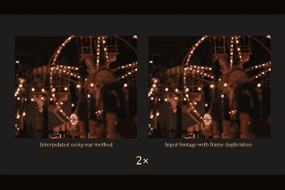

**视频帧插值作者(来自他们的** [**网站**](http://web.cecs.pdx.edu/~fliu/project/adaconv/) **)**

在这篇报道中，我们回顾了波特兰州立大学的**视频帧自适应卷积插值(AdaConv)** 。(它被称为 AdaConv，因为它是在他们的网站上而不是在报纸上命名的。在他们后来的论文中，也引用了 AdaConv 的名字。)

通常使用两阶段方法。首先，使用光流来估计运动。然后，基于估计的运动合成像素。本文采用一步法，即卷积神经网络(CNN)。这是一篇发表在 **2017 CVPR** 的论文，引用超过 **130 次**。( [Sik-Ho Tsang](https://medium.com/u/aff72a0c1243?source=post_page-----fbce6acaa2a5--------------------------------) @中)

# 概述

1.  **视频帧插值**
2.  **卷积像素插值**
3.  **网络架构&损失函数**
4.  **移位和针脚实现**
5.  **训练&超参数选择**
6.  **实验结果**

# 1.视频帧插值

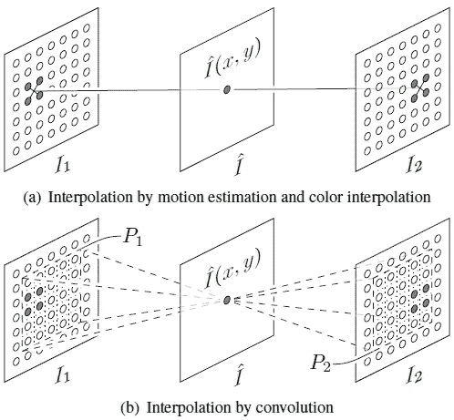

**(a)传统方法，(b) CNN 方法**

*   给定两个视频帧 *I* 1 和 *I* 2，插值方法旨在在两个输入帧的中间临时插值一个帧ˇ*I*。
*   (a)传统上，如图的上部所示，在估计中间帧中每个像素的运动之后，运动指向的输入帧处的像素被用于内插中间帧处的像素ˇ*I*(*x*， *y* ) 。
*   (b)本文采用 CNN，在提供感受野的情况下，采用数据驱动的方法，通过训练好的 CNN 得到像素ˇ*I*(*x*， *y* )。

# 2.**通过卷积进行像素插值**

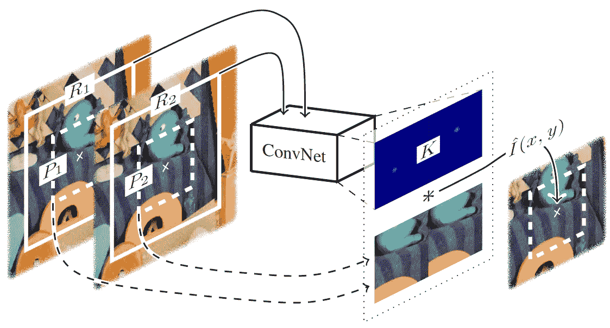

**通过卷积进行像素插值**

*   具体来说，为了估计输出像素( *x* ， *y* )的卷积核 *K* ，CNN 将感受野面片 *R* 1( *x* ， *y* )和 *R* 2( *x* ， *y* )作为输入，其中 *R* 1( *x* ，)
*   输出内核为了产生输出像素的颜色而将卷积的面片 *P* 1 和*P*2(*x*， *y* )与这些感受野位于同一中心位置，但尺寸较小，如上图所示。
*   比小块大的大感受野用于更好地处理运动估计中的孔径问题。
*   默认的感受野大小为 79×79 像素。卷积面片大小为 41×41，核大小为 41 × 82，因为它用于与两个面片进行卷积。

# 3.**网络架构&损失函数**

## 3.1.网络体系结构

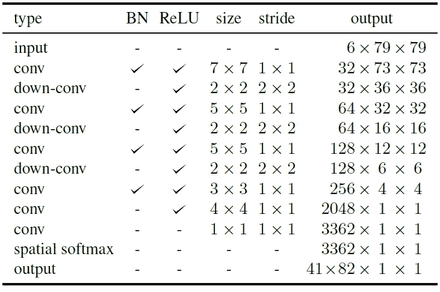

**网络架构**

*   CNN 由几个卷积层和下卷积层组成，作为最大池层的替代。使用 ReLU 和以及批处理规范化(BN)。
*   该网络是完全卷积的。因此，它不限于固定大小的输入。
*   **一个关键约束是输出卷积核的系数应该是非负的，并且总和为 1。因此，最终的卷积层连接到一个空间 softmax 层来输出卷积核**，它隐式地满足了这个重要的约束。

## 3.2.损失函数

*   一个可能的损失函数可以是插值像素颜色和地面真实颜色之间的差异，如下所示:

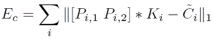

*   其中, *Ci* 为插值帧中(*， *yi* )处的底色。*
*   *然而，这个**颜色损失**单独会导致模糊的结果。*
*   *为了解决这个问题，考虑**梯度损失**:*

*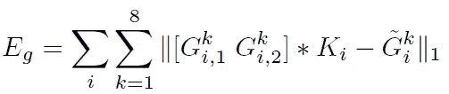*

*   *其中 k 表示我们计算梯度的八种方法之一。*
*   **Gki* ，1 和 *Gki* ，2 是输入面片 *Pi* ，1 和 *Pi* ，2 的梯度。*
*   *和\\*Gki*是插值帧中(*、*、*易*)处的地面实况梯度。*
*   *计算输入面片的梯度，然后执行与估计的核的卷积，这将导致感兴趣像素处的插值图像的梯度。*
*   *因此，最终的损失是颜色损失和梯度损失加在一起。*

# *4.移位和缝合实现*

*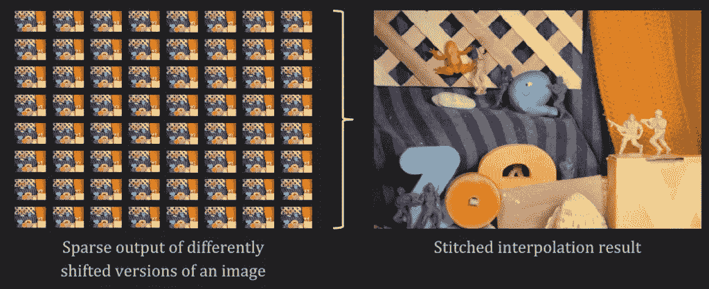*

***移位并缝合***

*   *移位和拼接[17，32，39]方法，其中使用相同输入的稍微移位的版本。这种方法返回稀疏的结果，这些结果可以组合起来形成插值帧的密集表示，如上所示。*
*   *考虑尺寸为 1280×720 的帧，**神经网络的像素方式实现**将需要 **921，600 次通过神经网络的前向传递**。*
*   *对于输入的 64 种不同的移位版本，**移位和缝合实现** **只需要 64 次向前传递**。*
*   *与 Nvidia Titan X 上每帧花费 104 秒的**像素方式实现相比，**移位缝合实现只需要 9 秒。*****
*   *为了处理边界问题，只需简单地使用零填充。*

# *5.训练和超参数选择*

## *5.1.训练数据集*

*   *使用来自 Flickr 的带有知识共享许可的公开可用视频。使用关键词下载的 3，000 个视频，如“驾驶”、“跳舞”、“冲浪”、“骑行”和“滑雪”，产生了多样化的选择。下载的视频被缩放到 1280×720 像素的固定大小。*

## *5.2.超参数选择*

*   *理论上，卷积核必须大于两帧之间的**像素运动**，以便捕捉运动(隐含地)来产生良好的插值结果。*
*   ***应选择大仁。**另一方面，大核涉及大量待估计值，增加了网络的复杂度。*
*   *选择一个足够大的卷积核来捕获训练数据集中的最大运动，即 38 个像素。*
*   *因此，我们系统中的**卷积核**大小为 **41×82** ，其将被应用于两个 41×41 的面片。*
*   *这个内核有**几个比 38 像素**大的像素，为重采样提供像素支持**。***
*   *并且使用验证数据集发现较大的**感受野**为 **79×79** ，在其中实现了良好的平衡。*

# *6.实验结果*

## *6.1.SOTA 比较*

*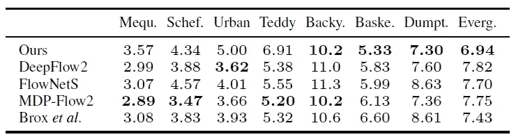*

***平均插补误差***

*   *米德尔伯里光流基准用于评估。*
*   *在 Middlebury 基准测试中报告的 100 多种方法中，所提出的方法在 Evergreen 和 Basketball 上取得了最好的结果，在 Dumptruck 上取得了第二好的结果，在后院(当时)上取得了第三好的结果。*

## *6.2.定性评价*

*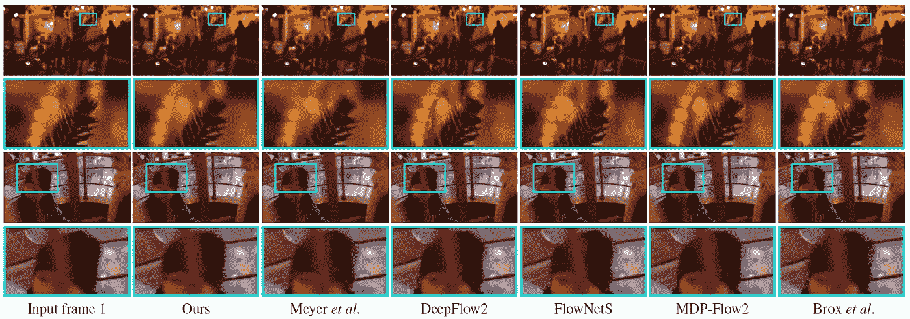*

***模糊***

*   ***模糊**:所提出的方法产生更清晰的图像，尤其是在运动较大的区域。*

*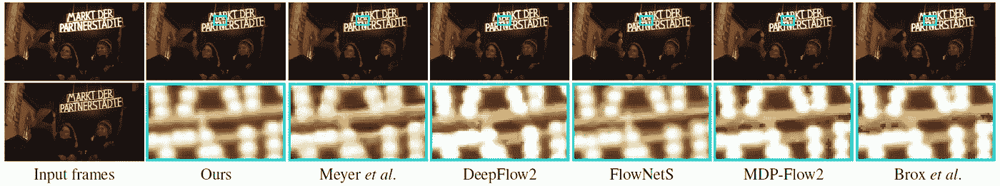*

***亮度突变***

*   ***亮度突变**:所提出的方法比基于流动的方法产生更具视觉吸引力的插值结果。*

**

***咬合***

*   ***遮挡**:所提出的方法采用了一种学习方法来获得适当的卷积核，从而为遮挡区域带来视觉上吸引人的像素合成结果，而通常光流在遮挡区域是不可靠或不可用的。*

## *6.3.遮挡处理*

*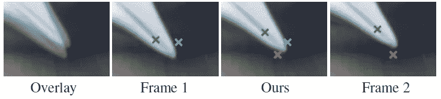*

***遮挡处理***

*   ***绿色 x** 在两个帧中都可见，内核显示该像素的颜色是从两个帧内插的。*
*   *相比之下，由**红色 x** 指示的像素仅在第 2 帧中可见。我们发现**帧 1 的子核中所有系数的总和几乎为零，这表明帧 1 对该像素**没有贡献。*
*   *类似地，由青色 x 指示的像素仅在帧 1 中可见。*

## *6.4.边缘感知像素插值*

*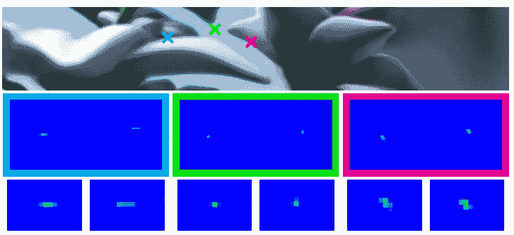*

***卷积核***

*   *上图显示了内核如何适应图像特征。*
*   *首先，对于所有这些内核，只有极少数内核元素具有非零值。此外，所有这些非零元素在空间上分组在一起。这非常符合典型的基于流量的插值方法。*
*   *第二，对于**平坦区域**中的像素，例如由**绿色 x** 指示的像素，其内核**仅具有两个具有有效值**的元素。这也与基于流量的插值方法一致。*
*   *第三，更有趣的是，**对于沿着图像边缘**的像素，例如由**红色和青色 x** 、**指示的像素，内核是各向异性的，并且它们的方向与边缘方向**很好地对齐。*

## *6.5.运行时间和内存*

*   *在单个 Nvidia Titan X 上，对于 640×480 的图像，这种实现需要大约 2.8 秒，内存为 3.5，*
*   *9.1 秒，4.7 千兆字节，1280×720，以及*
*   *1920×1080 的 21.6 秒。*

## *6.6.内核大小*

*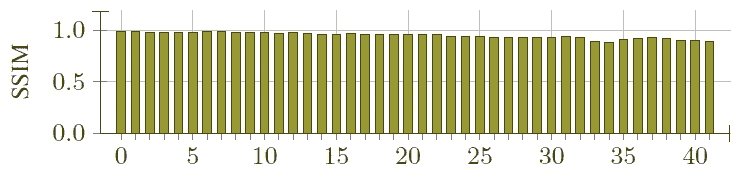*

*   *该方法所能处理的必然受到卷积核大小的限制。系统目前无法处理任何超过 41 像素的大运动。*

*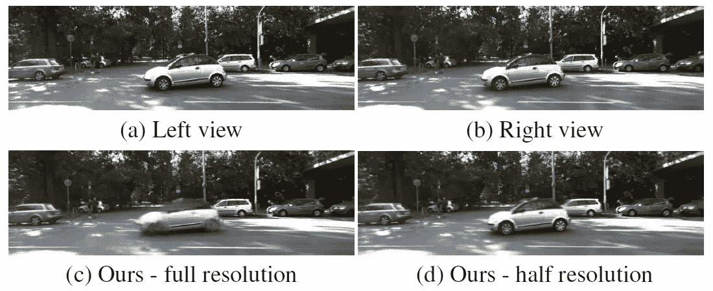*

***立体图像的插值***

*   *上图显示了来自 KITTI 基准的一对立体图像。*
*   *当使用所提出的方法在左视图和右视图之间内插中间帧时，由于大的视差(超过 41 个像素)，汽车是模糊的，如(c)所示。*
*   *在将输入图像缩小到其原始尺寸的一半之后，所提出的方法插值得很好，如(d)所示。*

## *6.7.其他人*

*   *所提出的方法不能在任意时间内插一帧。现在只能运行在 *t* =0.5。*

> *在冠状病毒肆虐的日子里，给我一个挑战，这个月再写 30 个故事..？好吃吗？这是这个月的第五个故事了。感谢访问我的故事..*

## *参考*

*【2017 CVPR】【阿达康】
[通过自适应卷积的视频帧内插](https://arxiv.org/abs/1703.07514)*

## *视频帧插值*

*[ [AdaConv](/analytics-vidhya/review-adaconv-video-frame-interpolation-via-adaptive-convolution-video-frame-interpolation-fbce6acaa2a5) ]*

## *[我之前的其他评论](/@sh.tsang/overview-my-reviewed-paper-lists-tutorials-946ce59fbf9e)*