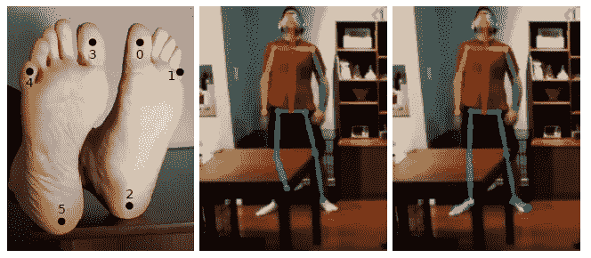
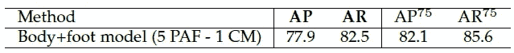
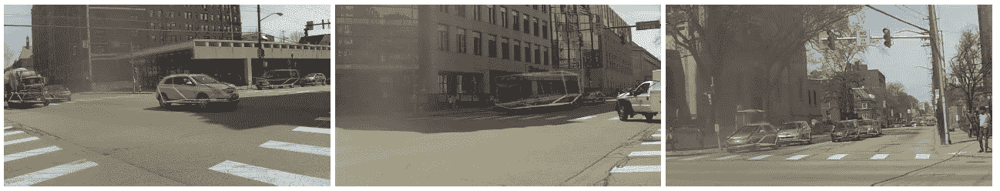
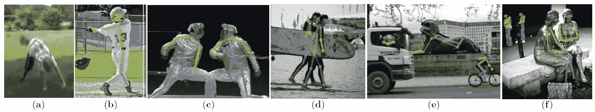

# 回顾 CMU Pose & open Pose—2016 年 COCO 关键点检测挑战赛(人体姿势估计)的获胜者

> 原文：<https://medium.com/analytics-vidhya/review-cmupose-openpose-winner-in-coco-keypoint-detection-challenge-2016-human-pose-ccbdbc72b7dd?source=collection_archive---------7----------------------->

## 第一个用于多人 2D 姿势检测的开源实时系统

在这个故事中，CMUPose & OpenPose，进行了回顾。 **CMUPose** 是卡耐基梅隆大学参加并**赢得 2016 年可可关键点检测挑战赛**的团队名称。该方法作为 **2017 CVPR** 出版，引用 **2000 余篇**。

**CMU pose:2016 可可关键点检测挑战赛冠军(**[**)http://cocodataset.org/#keypoints-leaderboard**](http://cocodataset.org/#keypoints-leaderboard)**)**

后来，加州大学、卡耐基梅隆大学和脸书现实实验室提出了更加增强的 **OpenPose** ，其中**第一次组合了身体和脚部关键点数据集和检测器**。它也是第一个用于多人 2D 姿势检测的开源实时系统。最终发布为 **2019 TPAMI** ，引用 **300 余次**。( [Sik-Ho Tsang](https://medium.com/u/aff72a0c1243?source=post_page-----ccbdbc72b7dd--------------------------------) @中)

由于 OpenPose 是 CMUPose 的加强版，所以在这个故事中主要提到 OpenPose。

# 概述

1.  **整体管线**
2.  **CMUPose 网络架构**
3.  **OpenPose 网络架构**
4.  **OpenPose 损失函数和其他细节**
5.  **OpenPose 伸展脚检测**
6.  **结果(在 OpenPose 论文中)**

# **1。整体管道**

**整体管道**

*   **(a)** : **尺寸为 w×h 的彩色图像**作为输入图像。
*   **(b)** :前馈网络同时**预测一组身体部位位置**的 2D 置信图(CM)*，以及*
*   ***(c)** : **零件亲缘关系的一组 2D 矢量场*L***，或**零件亲缘关系场(PAF)** ，其编码零件之间的关联程度*
*   *集合 *S* = ( *S* 1、 *S* 2、…、 *SJ* )具有 *J* 置信图，每个零件一个。*
*   *集合 *L* = ( *L* 1、 *L* 2、…、 *LC* )有 *C* 个向量场，每个肢体一个。 *LC* 中的每个图像位置编码一个 2D 矢量。*
*   ***(d)** :然后，通过贪婪推理来解析置信图和亲和域，并且*
*   ***(e)** :输出图像中所有人的 2D 关键点。*

# *2. **CMUPose 网络架构***

**

***CMUPose 网络架构***

*   *图像首先由 [VGG-19](/coinmonks/paper-review-of-vggnet-1st-runner-up-of-ilsvlc-2014-image-classification-d02355543a11) 的前 10 层进行分析，生成一组特征图 *F* 输入到每个分支的第一级。*
*   *第一阶段，网络产生一组 CMs，*S*1 =*ρ*1(*F*)，一组 PAF，*L*1 =*φ*1(*F*)。*
*   **S* 和 *L* 可以迭代细化以改善检测结果。*
*   *在阶段 t，它变成:*

**

*   *基于 S 和 L，可以检测人体姿态。*

# *3.开放式网络体系结构*

**

***OpenPose 网络架构***

*   *OpenPose 的架构与 CMUPose 不同。*
*   *该网络首先制作一套 PAFS， *Lt.**

**

*   *然后制作一套 CMs， *St* 。*

**

*   *发现**提炼 PAFs 比提炼 CMs** 更重要。因此，PAF 细化对于高精度来说更关键且足够，在增加网络深度的同时移除身体部位置信图细化。*

**

***PAF 跨阶段细化***

*   *在 CMUPose 中，网络架构包括几个 7x7 卷积层。**在 OpenPose 中，每个 7×7 卷积核被 3 个连续的 3×3 核代替。**保留感受野并减少操作次数。前者的手术次数是 97 次，而后者只有 51 次。*
*   *此外，**3 个卷积核中的每一个的输出被连接**，遵循类似于 [DenseNet](https://towardsdatascience.com/review-densenet-image-classification-b6631a8ef803?source=post_page---------------------------) 的方法。非线性层的数量增加了三倍，并且网络可以保持较低级和较高级的特征。*

# ***4。损失函数和其他细节***

## *4.1.损失函数*

**

*   *在估计的预测和地面实况图和场之间使用 L2 损失。*
*   **Lc* *是地面真相 PAF，S *j* *是地面真相部分置信图， *W* 是像素 *p* 处注释缺失时 *W* ( *p* ) = 0 的二进制掩码。*
*   *每个阶段的中间监督通过周期性地补充梯度来解决消失梯度问题。*

**

## *4.2.置信图*

*   *每个人 *k* 和每个身体部位 *j* 的置信图 *S* *为:*

**

*   *如上式所示，它是一个逐渐变化的高斯点，峰值位于点的中心，σ控制峰值的扩散。*
*   *这些 CMs 实际上类似于[Tompson NIPS’14](https://towardsdatascience.com/review-tompson-nips14-joint-training-of-cnn-and-graphical-model-human-pose-estimation-95016bc510c)中使用的热图。*

## *4.3.**部分亲和领域(** PAF)*

*   *对于多人关键点检测，我们需要知道哪个身体部位链接到哪个身体部位。*
*   *因为举例来说，如果有多人，则有多个头部和肩部。特别是，它们紧密地组合在一起，很难区分哪个头部和肩部属于同一个人。*
*   *因此，需要一个链接来指定属于同一个人的特定头部和肩部之间的联系。*
*   ***这种联系是以 PAF 为代表的。两个身体部分之间的 PAF 越强，这两个部分联系在一起并且属于同一个人的信心就越高。***
*   *如果 p 位于肢上，则 PAF *L* *为单位矢量，否则为 0:*

**

*   *沿着线段的预测零件亲和场 *Lc* 用于测量两个候选零件位置 dj1 和 dj2 的置信度:*

**

*   *对于多人，总的 *E* 需要最大化:*

**

*   *连接身体部位有多种方法:*

**

*   ***(a)** :双人身体部位。*
*   ***(b)** :考虑所有边缘进行匹配。*
*   ***(c)** :最小树边匹配。*
*   ***(d)**:open pose 使用的贪婪算法，只学习最小的边。*
*   *事实上，有很多关于 CMs 和 PAFS 的细节，请阅读文件了解更多细节。*

# *5. **OpenPose 伸展脚检测***

**

*   *OpenPose 已经提出了****第一个组合的身体和脚部关键点数据集和检测器**如上图所示。***
*   ***通过包含脚部关键点，它能够正确地检测脚踝，如上图右侧所示。***

# ***6.结果**(在 OpenPose 纸中)*****

## ***6.1.MPII 多人***

******

*****MPII 数据集*****

*   ***对于 288 个图像子集以及完整的测试集，OpenPose 也获得了高 mAP，优于或相当于 [DeepCut](/@sh.tsang/review-deepcut-deepercut-multi-person-pose-estimation-human-pose-estimation-da5b469cbbc3) 、 [DeeperCut](/@sh.tsang/review-deepcut-deepercut-multi-person-pose-estimation-human-pose-estimation-da5b469cbbc3) 和[纽维尔 ECCV 16](https://towardsdatascience.com/review-newell-eccv16-and-newell-pocv-16-stacked-hourglass-networks-human-pose-estimation-a9eeb76d40a5)。***

******

*   *****左**:如果地面实况关键点位置与所提出的解析算法一起使用:88.3% mAP。***
*   ***使用 GT 连接与建议的关键点检测 81.6%地图。***
*   *****右**:更多阶段，更高地图。***

## ***6.2.可可要点挑战***

******

*****测试开发排行榜*****

*   ***存在首先检测人然后检测关键点的自顶向下的方法，而自底向上的方法是首先检测关键点以形成人的骨架。***
*   ***上表中，OpenPose 表现不太好。这主要是因为当只考虑高等级的人时，准确性下降得更快(AP^L).***

******

*****验证设置*****

*   *****5PAF — 1CM** : 5 级 PAF，1 级 CM 最高地图 65.3。***
*   *****3CM-3PAF** :仅 61.0%地图。当使用 PAF 作为先验时，零件置信度图的精确度大大增加。***

## ***6.3.推理时间***

******

*   ***OpenPose 几乎保持相同的运行时间，不管每张图片有多少人。***
*   ***虽然自上而下的方法如 Alpha-Pose 和 Mark R-CNN，但运行时间与每张图像的人数成正比。***

## ***6.4.足部关键点数据集***

******

*****脚部验证设置*****

*   ***通过 OpenPose 获得高 AP 和 AR。***

## ***6.5.车辆姿态估计***

************

*   ***车辆关键点也可以用高 AP 和 AR 来检测。***

## ***6.6.定性结果***

******

## ***6.7.失败案例***

******

*****常见故障案例(a)** 罕见姿势或外观、 **(b)** 缺失或错误零件检测、 **(c)** 重叠零件，即两个人共享零件检测、 **(d)** 错误连接关联两个人的零件、 **(e-f)** 雕像或动物的假阳性。***

******

*****脚失灵案例*****

***事实上，在 OpenPose 论文中还有许多我在这里没有提到的结果。请随意阅读他们的论文。:)***

## ***参考***

***【2017 CVPR】【CMU Pose】
[利用部位亲和场的实时多人 2D 姿态估计](https://arxiv.org/abs/1611.08050)***

***【2019 TPAMI】【open Pose】
[open Pose:利用部位亲和场的实时多人 2D 姿态估计](https://arxiv.org/abs/1812.08008)***

***【GitHub】[https://github.com/CMU-Perceptual-Computing-Lab/openpose](https://github.com/CMU-Perceptual-Computing-Lab/openpose)***

# ***我以前对人体姿态估计的评论***

*****人体姿态估计**[deep Pose](https://towardsdatascience.com/review-deeppose-cascade-of-cnn-human-pose-estimation-cf3170103e36?source=post_page---------------------------)】[汤普森 NIPS ' 14](https://towardsdatascience.com/review-tompson-nips14-joint-training-of-cnn-and-graphical-model-human-pose-estimation-95016bc510c?source=post_page---------------------------)】[汤普森 CVPR ' 15](https://towardsdatascience.com/review-tompson-cvpr15-spatial-dropout-human-pose-estimation-c7d6a5cecd8c?source=post_page---------------------------)][CPM](/@sh.tsang/review-cpm-convolutional-pose-machines-human-pose-estimation-224cfeb70aac?source=post_page---------------------------)][FCGN](/@sh.tsang/review-fcgn-fully-convolutional-google-net-human-pose-estimation-52022a359cb3)][IEF](/towards-artificial-intelligence/review-ief-iterative-error-feedback-human-pose-estimation-a56add160fa5)][deep cut&DeeperCut](/@sh.tsang/review-deepcut-deepercut-multi-person-pose-estimation-human-pose-estimation-da5b469cbbc3)[纽维尔 ECCV'16 &纽维尔 POCV '](https://towardsdatascience.com/review-newell-eccv16-and-newell-pocv-16-stacked-hourglass-networks-human-pose-estimation-a9eeb76d40a5)***

## ***[我之前的其他评论](/@sh.tsang/overview-my-reviewed-paper-lists-tutorials-946ce59fbf9e)***