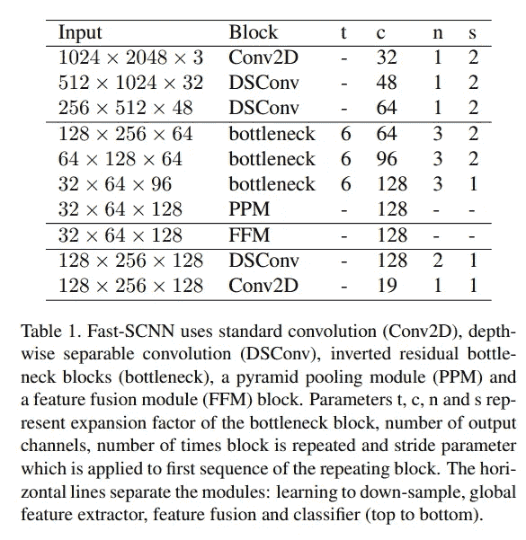

# 回顾:快速-SCNN

> 原文：<https://medium.com/analytics-vidhya/review-fast-scnn-848f2382677a?source=collection_archive---------11----------------------->

## 一种超实时语义分割模型

在这篇文章中，快速 SCNN(快速分割卷积神经网络)[1]是一个简单的回顾。该架构以实时语义分割任务为目标，在输入图像分辨率较高(1024 x 2048 px)的 Cityscapes 数据集上可以达到每秒 123.5 帧，而网络容量较小。

# 概述

*   快速 SCNN 建筑
*   学习下采样
*   实验结果
*   消融研究

# 1.快速 SCNN 建筑

快速 SCNN 建筑

*   如上所示，快速 SCNN 由四个模块组成:学习下采样、全局特征提取器、特征融合和分类器。
*   所有模块都是使用深度方向可分离卷积构建的。

Fast-SCNN 的布局

*   布局如上所示，水平线分隔了模块

# 2.学习下采样

*   当前最先进的实时语义分割方法是由网络构建的，该网络具有在每一侧以不同分辨率操作的两个分支。
*   众所周知，DCNNs 提取前几层的角和边等低级特征，作者认为在浅网络块中的低级和高级分支之间共享特征计算将提高性能。
*   作者在 Cityscapes 数据集上对 Fast-SCNN 进行了评估。
*   他们用三组数据来报告结果:两者，仅好的，和有粗糙标签数据的好的。
*   他们只用*19 类*进行评估。
*   作为比较，选择了 ContextNet、BiSeNet、GUN、eNet 和 ICNet，因为它们是 SOTA 实时语义分割方法。
*   在运行时间比较方面，提出的快速 SCNN 分为两种类型:快速 SCNN cls 和快速 SCNN prob。
*   这样做的原因是 softmax 运算在推理上开销很大；因此，当网络处于推理模式时，它们将 softmax 替换为 argmax。
*   *快速 SCNN cls* 表示 softmax 更改为 argmax。
*   *Fast-SCNN 探测器*表示标准版本。

Fast-SCNN 的定性结果

等级和类别 mIoU 比较

运行时(fps)比较

# 4.消融研究

## 预训练和弱标记数据

*   诸如 R-CNN 和 PSPNet 之类的高容量 dcnn 已经表明，通过对比辅助任务的预训练可以提高性能。
*   由于作者指定快速 SCNN 具有低容量，因此他们希望在有和没有预训练的情况下，以及在有和没有附加弱标记数据的情况下测试性能。

## 零输出跳跃连接

*   作者做了这个测试来确认跳过连接是否有利于快速 SCNN。
*   通过置零跳过连接，验证数据集上的 mIoU 从 69.22%下降到 64.30%，图 3 显示了无置零跳过连接和有置零跳过连接之间的结果。

## 较低输入解决方案

*   由于作者对那些没有全分辨率输入或强大计算能力的嵌入式设备感兴趣，他们用一半和四分之一输入分辨率对此进行了研究。
*   如表 7 所示，作者认为快速 SCNN 无需修改即可直接应用于较低的输入分辨率。

不同输入分辨率下快速 SCNN 的运行时间和精度

# 参考

[1][https://arxiv.org/abs/1902.04502](https://arxiv.org/abs/1902.04502)

*原载于 2019 年 12 月 17 日*[*https://cuda-Chen . github . io*](https://cuda-chen.github.io/paper%20review/2019/12/17/review-fast-scnn.html)*。*

> 如果你有什么想法和问题要分享，请联系我[**clh 960524【at】Gmail . com**](http://clh960524@gmail.com/)。另外，你可以查看我的 [GitHub 库](https://github.com/Cuda-Chen)中的其他作品。如果你和我一样对机器学习、图像处理和并行计算充满热情，欢迎在 LinkedIn 上加我。