# 综述:基于多尺度神经面片合成的高分辨率图像修复

> 原文：<https://medium.com/analytics-vidhya/review-high-resolution-image-inpainting-using-multi-scale-neural-patch-synthesis-4bbda21aa5bc?source=collection_archive---------2----------------------->

嗨，伙计们！在[之前的文章](/@ronct/introduction-to-generative-models-for-image-inpainting-and-review-context-encoders-13e48df30244)中，我们已经介绍了图像修复和第一个基于 GAN 的修复算法[上下文编码器](https://arxiv.org/abs/1604.07379)。如果你还没有看过之前的帖子，我强烈推荐你先快速浏览一下！这一次，我们将深入研究另一种修补方法，它可以被视为上下文编码器的改进版本。开始吧！

# 回忆

在这里，我简单回忆一下我们在[上一篇](/@ronct/introduction-to-generative-models-for-image-inpainting-and-review-context-encoders-13e48df30244)中学到的东西。

*   对图像或图像上下文的深层语义理解对于修复任务是重要的，并且(通道式)全连通层是捕捉图像上下文的一种方式。
*   对于图像修复，填充图像的视觉质量比逐像素重建精度更重要。更具体地说，由于生成的像素没有模型答案(我们在现实世界的情况下没有地面真相)，我们只想要看起来逼真的填充图像。

# 动机

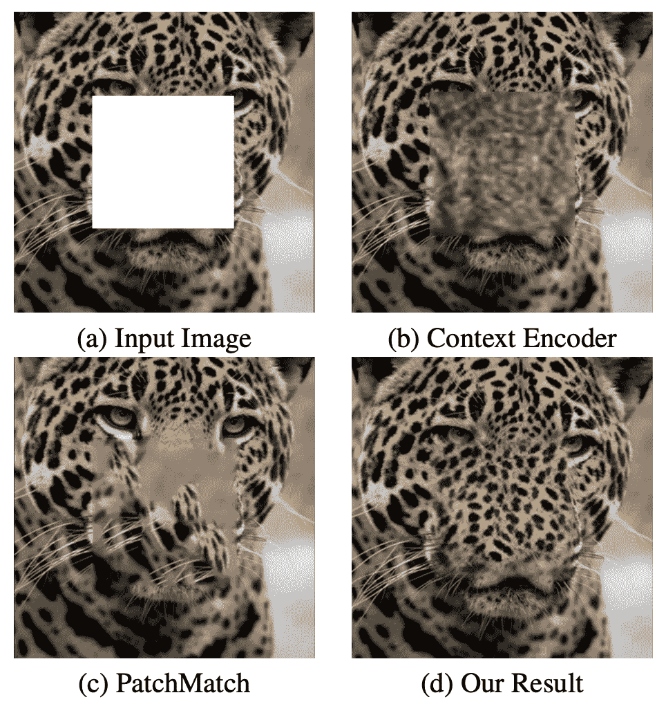

图一。修复任务的定性比较[1]。

*   由于内存限制和高分辨率图像的训练困难，现有的修复算法只能处理低分辨率图像。
*   虽然最先进的修补方法，即上下文编码器，可以成功地回归(预测)缺失部分，并具有一定程度的语义正确性，但在预测像素的纹理和细节方面仍有改进的空间，如图 1 所示。

# 介绍

*   上下文编码器不完善。I)可以进一步改善所生成像素的纹理细节。ii)不能处理高分辨率图像。
*   与此同时，[神经风格转移](https://arxiv.org/abs/1508.06576)是一个热门话题，我们想把一个图像(风格图像)的风格转移到另一个具有相同内容(内容图像)的图像上，如下图 2 所示。

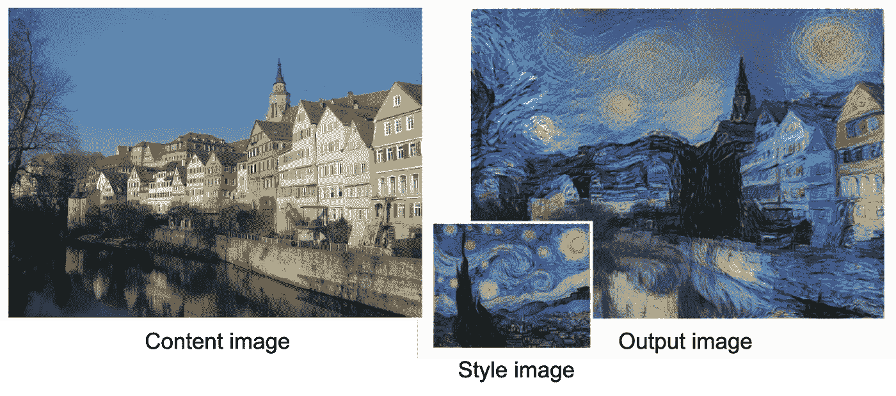

图二。举例说明风格转移的任务[2]

*   注意，纹理和颜色可以视为一种风格。本文作者采用风格转移算法来增强生成像素的纹理细节。

# 解决办法

*   作者使用上下文编码器来预测丢失部分并得到预测像素。
*   然后，对预测像素和有效像素采用风格转移算法。主要思想是将最相似的有效像素的样式转移到预测像素，以增强纹理细节。
*   在他们的公式中，他们假设测试图像的尺寸总是 512×512，并且缺少一个 256×256 的中心孔。他们使用三级金字塔的方式来处理这个高分辨率的修复问题。输入首先被调整为 128x128，具有 64x64 的中心孔，用于低分辨率重建。之后，填充的图像被上采样到 256×256，具有 128×128 的粗填充孔，用于第二次重建。最后，填充的图像再次被上采样到 512×512，其中 256×256 的填充孔用于最后的重建(或者可以称之为细化)。

# 贡献

*   提出一个结合上下文编码器和神经风格转移技术的框架。
*   建议多尺度方式处理高分辨率图像。
*   实验表明，风格转移技术可用于增强所生成像素的纹理细节。

# 方法

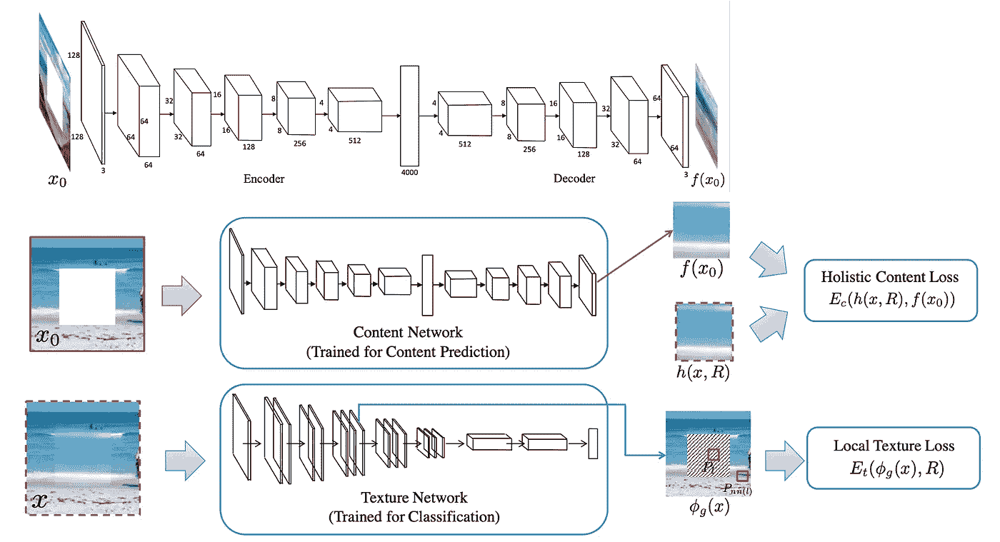

图 3。框架概述(下)和内容网络的结构(上)[1]

图 3 显示了提出的框架，实际上并不难理解。内容网络是稍微修改的上下文编码器，而纹理网络是 ImageNet 上预先训练的 [VGG-19](https://arxiv.org/abs/1409.1556) 网络。对我来说，这是一个早期版本的粗到细的网络，可以在多尺度上运行。本文的主要观点是他们如何优化模型(即损失函数的设计)。

# 内容网络

*   如前所述，内容网络是上下文编码器。他们首先独立训练内容网络。然后，训练内容网络的输出将用于优化整个提议的框架。
*   参考图 3 中内容网络的结构，与原始上下文编码器有两个不同之处。 ***i)*** 中间的通道式全连接层被标准全连接层代替。 ***ii)*** 所有的 ReLU 或漏 ReLU 激活功能层都被 eLU 层代替。作者声称，与 ReLU 和 Leaky ReLU 相比，ELU 可以更好地处理大的负面神经反应。请注意，ReLU 只允许肯定的响应通过。
*   它们使用与上下文编码器相同的方式训练内容网络。L2 损失和对抗性损失的组合。具体可以参考[我之前的帖子](/analytics-vidhya/introduction-to-generative-models-for-image-inpainting-and-review-context-encoders-13e48df30244)。

# 纹理网络

我将尝试在这里解释更多关于纹理网络的内容，因为它与神经类型转移的主题有关。感兴趣的读者可以谷歌一下了解更多细节。

*   纹理网络的目标是确保生成像素的精细细节与有效像素的细节相似(即，我们希望图像具有一致的风格/纹理)
*   简单地说，作者利用了[2]中的发现。在某种程度上，网络内不同层的特征图代表了图像风格。换句话说，给定一个训练好的网络，如果两个图像在网络内部具有相似的特征图，我们可以声称这两个图像具有相似的图像风格。说实话，这是一个过于简化的说法。在[2]中，作者在 ImageNet 上使用了一个[预训练的 VGG 网络](https://arxiv.org/abs/1409.1556)作为特征提取器进行分类。他们建议在 VGG 的每一个图层上使用特征地图的 Gram 矩阵(也称为自相关矩阵)。如果两幅图像具有相似的 Gram 矩阵，则它们具有相似的图像风格，例如纹理和颜色。回到修复论文，作者也使用预训练的 VGG 网络作为他们的纹理网络，如图 3 所示。他们试图强制在 VGG 的几个层上，中心孔区域 内的特征映射 ***的响应与中心孔区域*** 外的特征映射 ***的响应相似。他们说他们使用 *relu3_1* 和 *relu4_1* 层进行计算。***

# 损失函数

总损失函数由三项组成，即内容损失(L2 损失)、纹理损失和 TV 损失(总变化损失)。

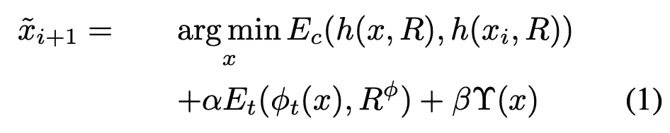

*   以上是他们想要最小化的联合损失函数。请注意， *i* 是电子秤的数量，如前所述，他们在这项工作中使用了 3 台电子秤。 *x* 为地面真实图像(即图像完好无缺失)。 *h* ( *x_i* ， *R* )返回孔区域 *R* 内 *x_i* 的颜色含量。 *phi_t* ( *x* )返回给定输入 *x* 时网络 *t* 计算的特征图。 *R^phi* 表示特征图中对应的空洞区域。最后一项是总变化损失项，它通常用于图像处理以确保图像的平滑度。α和β是平衡损失项的权重。

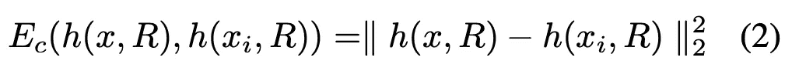

*   对于内容损失项，非常容易理解，只需计算 L2 损失以确保逐像素重建精度。

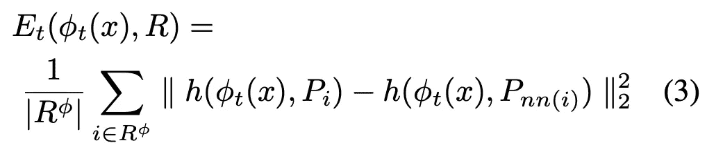

*   对于纹理损失术语，它看起来有点复杂，但也很容易理解。
*   首先，他们将图像馈送给预训练的 VGG-19 网络，以获得 *relu3_1* 和 *relu4_1* 层(中间层)的特征图。然后，他们将特征图分成两组，一组用于洞区域( *R^phi* )，另一组用于外部(即有效区域)。每个局部特征块 *P* 的尺寸为*s*x*s*x*c*(*s*为空间尺寸， *c* 为特征图的数量)在孔洞区域内。他们所做的是找到洞区域外最相似的小块，然后计算每个局部小块与其最近邻的平均 L2 距离。
*   在 Eq 中。3、| *R^phi* |是在 *R^phi* 区域采样的总斑块数， *P_i* 是以位置 *i* 为中心的局部斑块， *nn* ( *i* )计算为:

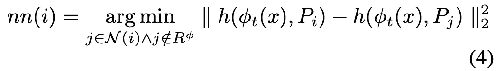

*   情商。4 用于搜索每个局部面片的最近邻居 *P_i* 。
*   最后，电视损耗计算如下:

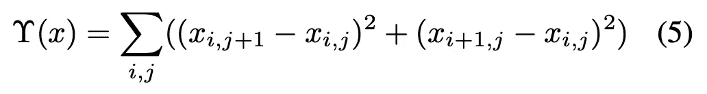

*   同样，这通常用于图像处理，以确保图像的平滑度。

# 实验结果

*   与上下文编码器相同，两个数据集用于评估，Paris StreetView [3]和 ImageNet [4]数据集。巴黎街景由 14900 张训练图像和 100 张测试图像组成；ImageNet 包含 1.26M 的训练图像，从验证集中随机选择 200 张测试图像。

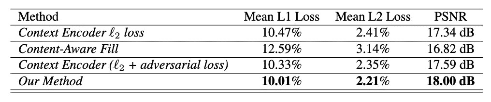

表 1。巴黎街景数据集上的定量比较。PNSR 越高越好。[1]

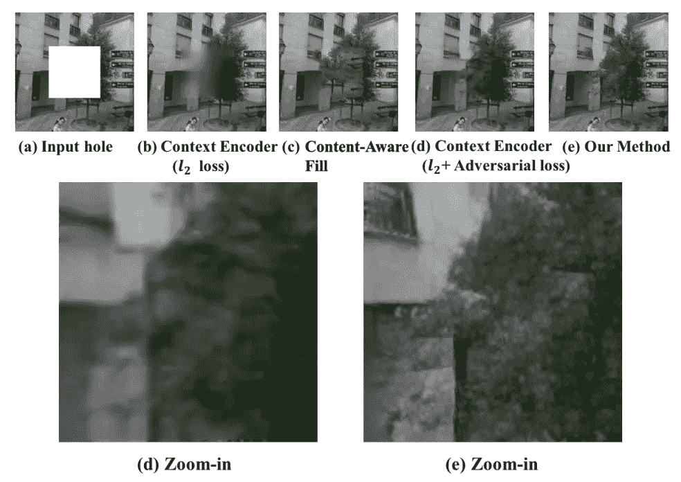

图 4。不同方法的视觉比较[1]

*   表 1 显示了不同方法的定量结果。更高的 PNSR 意味着更好的性能。显然，本文提出的方法提供了最高的 PNSR。
*   作者还声称定量评价(如 PSNR、L1 误差等。)对于图像修补任务可能不是最有效的度量，因为目标是生成看起来逼真的填充图像。
*   图 4 是几种方法的直观比较。从(d)和(e)的放大版本中，我们可以看到，与最先进的方法(上下文编码器)相比，所提出的方法可以生成更清晰的纹理细节。

# 内容和纹理网络的效果

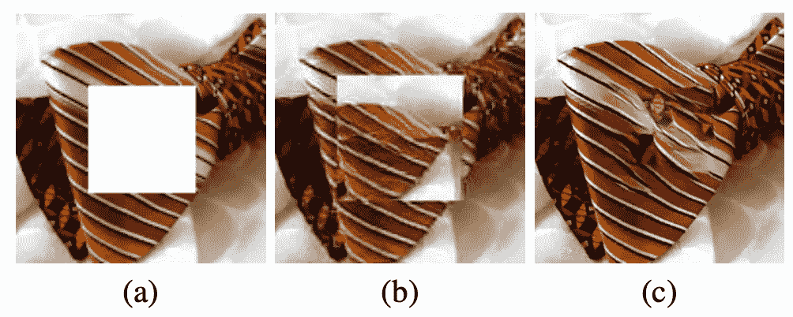

图 5。(a)输入图像(b)没有内容损失项的结果(c)来自所提出的方法[1]的结果

*   作者提供了损失项的烧蚀研究。图 5 显示了不使用内容损失项的结果。很明显，如果没有内容损失项，修复结果的结构是完全不正确的。

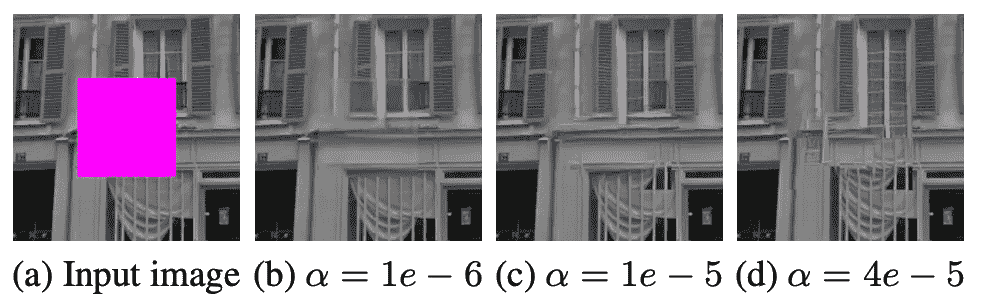

图 6。使用不同纹理权重α的效果。[1]

*   除了显示内容损失条款是必要的。作者还指出了纹理损失项的重要性。图 6 显示了等式中不同纹理权重α的效果。1.显然，纹理损失项越多，结果越清晰，但它可能会影响整体图像结构，如图 6(d)所示。

# 对抗损失的影响

如上所述，作者使用与上下文编码器相同的方式来训练内容网络。它们显示了仅使用 L2 损失和同时使用 L2 和对抗性损失的效果。

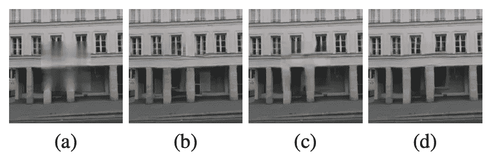

图 7。(a)仅用 L2 损失训练的内容网络的输出。(b)使用(a)的拟议方法的最终结果。(c)用 L2 +对抗性损失训练的内容网络的输出。(d)使用(c)的拟议方法的最终结果[1]

*   从图 7 中，我们可以清楚地看到，内容网络的输出质量对最终结果很重要。研究表明，利用 L2 损失和对抗性损失来训练内容网络更好。

# 高分辨率图像修复

如前所述，作者提出了一种处理高分辨率图像的多尺度方法。结果如下所示，

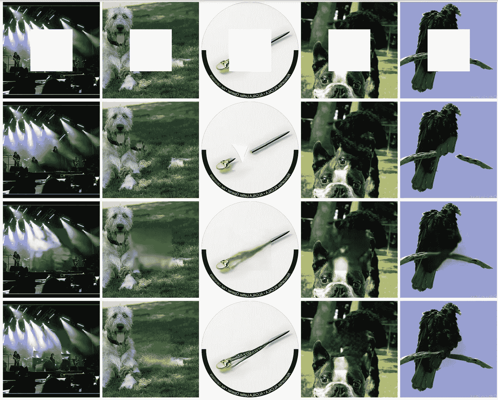

图 8。ImageNet 结果的视觉比较[1]。从上到下:输入、内容感知填充、上下文编码器、建议方法。

*   图 8 显示了高分辨率图像修复结果。对于上下文编码器，它仅适用于 128x128 输入图像。因此，使用双线性插值将结果上采样到 512x512。对于所提出的方法，输入将以三种尺度通过网络三次，以完成重构。显然，与其他方法相比，所提出的方法提供了最佳的视觉质量。然而，由于高分辨率图像修复的多尺度方式，所提出的方法用 Titan X GPU 填充 512×512 图像的 256×256 孔洞需要大约 1 分钟，这是所提出的方法的主要缺点(即低效率)。

# 真实场景(对象移除)

*   作者进一步扩展了提出的方法来处理不规则形状的孔。简单地说，他们首先将不规则的孔修改为边界矩形孔。然后，他们执行裁剪和填充，将孔定位在中心。通过这样做，他们可以处理带有不规则孔洞的图像。下面显示了一些例子，

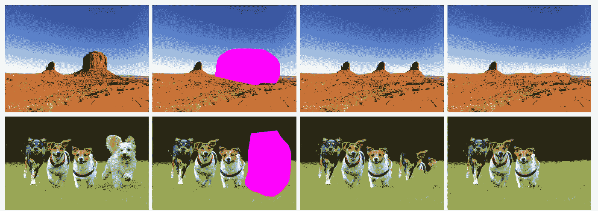

图 9。任意对象移除[1]。从左至右:输入、对象遮罩、内容感知填充结果、建议的方法

# 结论

*   这是上下文编码器的一个明显的改进版本。作者采用神经风格转移技术，通过上下文编码器进一步增强生成像素的纹理细节。因此，我们离逼真的填充图像更近了一步。
*   然而，作者也指出了一些未来的改进方向。 ***i)*** 在如图 10 所示的复杂场景下，仍然很难填充缺失的部分。 ***ii)*** 速度是一个问题，因为它无法实现实时性能。

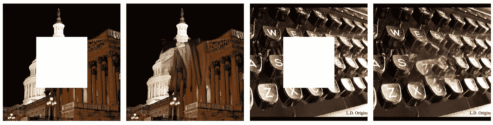

图 10。建议方法的失败案例[1]

# 外卖食品

同样，我想在这里强调一些要点，这些要点对以后的帖子很有用。

*   这项工作是粗到细网络(也称为两级网络)的早期版本。我们首先重建丢失的部分，并且重建的部分应该具有一定的逐像素重建精度(即，确保结构正确)。然后，我们细化重建部分的纹理细节，使得填充后的图像具有良好的视觉质量。
*   纹理损失的概念在后来的图像修复论文中起着重要的作用。通过利用这种损失，我们可以产生更清晰的图像。之后，我们通常通过使用感知损失和/或风格损失来实现清晰的生成图像。我们将很快覆盖它们！

# 下一步是什么？

*   下一次，我们将深入研究基于深度学习的图像修复算法的另一个里程碑。我必须说，这么多的修图论文都是基于他们的网络架构！希望你喜欢这篇文章:)

# 参考

1.  [https://arxiv.org/pdf/1611.09969.pdf](https://arxiv.org/pdf/1611.09969.pdf)
2.  莱昂·A·加蒂丝等，《艺术风格的神经算法》，[https://arxiv.org/pdf/1508.06576.pdf](https://arxiv.org/pdf/1508.06576.pdf)
3.  C.Doersch，S. Singh，A. Gupta，J. Sivic 和 A. Efros。是什么让巴黎看起来像巴黎？*2012 年美国计算机学会图形汇刊*。
4.  ImageNet 大规模视觉识别挑战。 *IJCV* ，2015。

再次感谢。感谢你花时间写这篇文章。如有任何问题，欢迎随时留下评论:)下次见！