# 综述:掩模 R-CNN(实例分割和人体姿态估计)

> 原文：<https://medium.com/analytics-vidhya/review-mask-r-cnn-instance-segmentation-human-pose-estimation-61080a93bf4?source=collection_archive---------2----------------------->

## 在实例细分方面优于[跨国公司](https://towardsdatascience.com/review-mnc-multi-task-network-cascade-winner-in-2015-coco-segmentation-instance-segmentation-42a9334e6a34)和[FCIS](https://towardsdatascience.com/review-fcis-winner-in-2016-coco-segmentation-instance-segmentation-ee2d61f465e2)；以及人体姿态估计中的 [CMU 姿态](/analytics-vidhya/review-cmupose-openpose-winner-in-coco-keypoint-detection-challenge-2016-human-pose-ccbdbc72b7dd)和 [G-RMI](/towards-artificial-intelligence/review-g-rmi-1st-runner-up-in-coco-keypoint-detection-challenge-2016-human-pose-estimation-6c8d250f62a0)

在这个故事中，非常著名的**面具 R-CNN** ，由**脸书艾研究(FAIR)** 进行回顾。Mask R-CNN 很容易推广到**实例分割**、**包围盒对象检测**、**人物关键点检测**等很多任务。它是由 FAIR 的 **Detectron** 开发的，这是一个支持众多研究项目的 FAIR 软件系统。

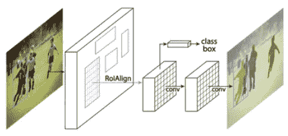

**屏蔽 R-CNN 进行实例分割**(图片来自[作者论文](https://arxiv.org/abs/1703.06870))

Mask R-CNN 是文献中相当重要的基于深度学习的计算机视觉论文之一。它在每个任务上都超过了所有现有的单一模型参赛作品(当时)，包括 COCO 2016 挑战赛的获胜者。在 COCO 2017 挑战赛中，获胜者的网络也是基于 Mask R-CNN。

这是一篇 **2017 ICCV** 论文，引用超过 **5000 次**。并在 2017 ICCV 获得 ***马尔奖*** 。( [Sik-Ho Tsang](https://medium.com/u/aff72a0c1243?source=post_page-----61080a93bf4--------------------------------) @中)

# 概述

1.  **什么是实例分割？**
2.  **从** [**快速 R-CNN**](/coinmonks/review-r-cnn-object-detection-b476aba290d1) **，** [**快速 R-CNN**](/coinmonks/review-fast-r-cnn-object-detection-a82e172e87ba) **，** [**快速 R-CNN**](https://towardsdatascience.com/review-faster-r-cnn-object-detection-f5685cb30202) **，到屏蔽 R-CNN**
3.  **屏蔽 R-CNN 网络概述&损失函数**
4.  **RoIAlign**
5.  **头部结构细节**
6.  **实例分割结果**
7.  **人体姿态估计(关键点检测)结果**

# **1。什么是实例分段？**

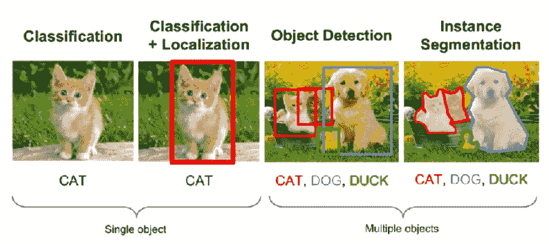

(图片来自[作者的 PPT](https://www.slideshare.net/windmdk/mask-rcnn) )

*   **分类**:只对图像中的主要物体进行分类。
*   分类+定位:我们也想知道主要物体的包围盒。
*   **物体检测**:图像中有多个物体，我们想知道所有已知类的类和每个物体的包围盒。
*   **实例分割**:对单个对象进行分类，并使用边界框对每个对象进行定位。

# **2。从**[**R-CNN**](/coinmonks/review-r-cnn-object-detection-b476aba290d1)**，** [**快 R-CNN**](/coinmonks/review-fast-r-cnn-object-detection-a82e172e87ba) **，** [**快 R-CNN**](https://towardsdatascience.com/review-faster-r-cnn-object-detection-f5685cb30202) **，到屏蔽 R-CNN**

*   要想很好的理解 Mask R-CNN 网络架构，最好从 [R-CNN](/coinmonks/review-r-cnn-object-detection-b476aba290d1) 开始理解。
*   (最好先对 [R-CNN](/coinmonks/review-r-cnn-object-detection-b476aba290d1) 、[快 R-CNN](/coinmonks/review-fast-r-cnn-object-detection-a82e172e87ba) 、[更快 R-CNN](https://towardsdatascience.com/review-faster-r-cnn-object-detection-f5685cb30202) 有个基本了解。这里只是简单回顾一下。)

## **2.1。** [**R-CNN**](/coinmonks/review-r-cnn-object-detection-b476aba290d1)

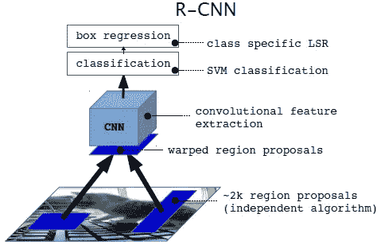

[**R-CNN**](/coinmonks/review-r-cnn-object-detection-b476aba290d1) (图片来自[作者的 PPT](https://www.slideshare.net/windmdk/mask-rcnn) )

*   在 [R-CNN](/coinmonks/review-r-cnn-object-detection-b476aba290d1) 中，在网络的底部，**基于非深度学习的选择性搜索(SS)用于特征提取，以生成 2k 个区域提议。**
*   **每个区域建议被扭曲并通过卷积神经网络(CNN)，最后通过支持向量机(SVM)**,输出分类和包围盒。
*   (如有兴趣，请阅读 [R-CNN](/coinmonks/review-r-cnn-object-detection-b476aba290d1) 了解更多详情。)

## 2.2.[快速 R-CNN](/coinmonks/review-fast-r-cnn-object-detection-a82e172e87ba)

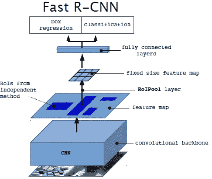

[**快速 R-CNN**](/coinmonks/review-fast-r-cnn-object-detection-a82e172e87ba) (图片来自[作者的 PPT](https://www.slideshare.net/windmdk/mask-rcnn) )

*   在[快速 R-CNN](/coinmonks/review-fast-r-cnn-object-detection-a82e172e87ba) 中， **SS 仍然用于生成 2k 区域提议。**
*   但是，**与**[**R-CNN**](/coinmonks/review-r-cnn-object-detection-b476aba290d1)**不同，输入图像经过 CNN 进行特征提取，生成特征图。这些特征图被共享，用于根据之后的每个区域提议的 RoI 汇集。**
*   对于每个区域提案，将对提案执行投资回报池，以最终通过网络，即全连接(FC)层。并且不再使用 SVM。
*   最后，**在全连接(FC)层的输出端输出分类和包围盒。**
*   但是区域提议部分仍然使用基于非深度学习的 SS 方法。
*   (如有兴趣，请阅读[快速 R-CNN](/coinmonks/review-fast-r-cnn-object-detection-a82e172e87ba) 了解更多详情。)

## 2.3.[更快的 R-CNN](https://towardsdatascience.com/review-faster-r-cnn-object-detection-f5685cb30202)

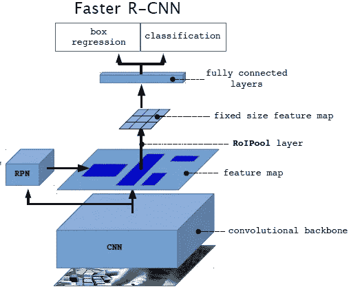

[**更快 R-CNN**](https://towardsdatascience.com/review-faster-r-cnn-object-detection-f5685cb30202) (图片来自[作者的 PPT](https://www.slideshare.net/windmdk/mask-rcnn) )

*   在[快速 R-CNN](https://towardsdatascience.com/review-faster-r-cnn-object-detection-f5685cb30202) 、**中，输入图像通过 CNN。这些特征图将用于区域建议网络(RPN)以生成区域建议，并用于在后期生成 RoI 汇集的特征图。**
*   在这种情况下，不再使用**SS**。而是使用一个 CNN。因此，整个网络是一个端到端的深度学习网络，这对于梯度传播以提高对象检测精度是必不可少的。
*   与 [Fast R-CNN](/coinmonks/review-fast-r-cnn-object-detection-a82e172e87ba) 类似，对于每个区域提案，RoI pooling 在提案上执行，以通过网络的末端，即完全连接的层。最后输出分类和包围盒。
*   (如有兴趣，请阅读[更快 R-CNN](https://towardsdatascience.com/review-faster-r-cnn-object-detection-f5685cb30202) 了解更多详情。)

## 2.4.屏蔽 R-CNN

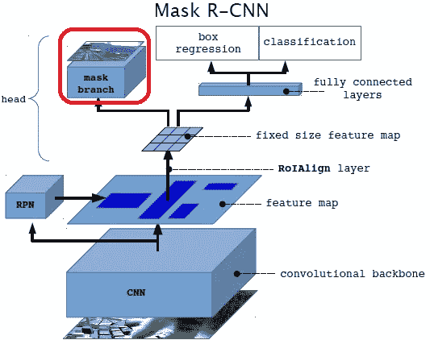

**屏蔽 R-CNN** (图片来自[作者的 PPT](https://www.slideshare.net/windmdk/mask-rcnn) )

*   在这个故事里，Mask R-CNN，架构非常接近[更快的 R-CNN](https://towardsdatascience.com/review-faster-r-cnn-object-detection-f5685cb30202) 。**主要区别在于，在网络的末端，有另一个头，即上图中的掩码分支，用于生成实例分割的掩码。**

# **3。屏蔽 R-CNN 网络概述&损失函数**

## 3.1.两阶段架构

*   采用两级架构，就像[更快的 R-CNN](https://towardsdatascience.com/review-faster-r-cnn-object-detection-f5685cb30202) 。
*   **第一阶段** : **地区提案网络**，产生地区提案或候选人。每个地区的提案将进入第二阶段。
*   **第二阶段:对于每一个区域提议**，第一阶段提出的特征图是根据区域汇集的 RoI，并通过剩余的网络，**输出类别、包围盒以及二进制掩码**。
*   更详细的网络体系结构在第 5 节中提到。

## 3.2.损失函数

*   因此，损失函数是多任务损失:

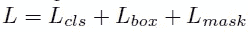

*   *Lcls* :分级损耗，同[快 R-CNN](https://towardsdatascience.com/review-faster-r-cnn-object-detection-f5685cb30202) 。
*   *Lbox* :包围盒丢失，同[快 R-CNN](https://towardsdatascience.com/review-faster-r-cnn-object-detection-f5685cb30202) 。
*   ***Lmask*** :二进制掩码丢失。该掩膜分支为每个 RoI 输出 *Km* ，为*m*×m 分辨率的 *K* 二值掩膜，代表 *K* 的类别数。

## 3.3.Lmask

*   **应用每像素 sigmoid** 。
*   **平均二进制交叉熵损失**用于 *Lmask* 。
*   *Lmask* 仅占带有地面真实等级 *k* 的掩膜的 RoI 的第 *k* 个掩膜。其他类不会造成损失。
*   因此，它不同于完全卷积网络( [FCN](https://towardsdatascience.com/review-fcn-semantic-segmentation-eb8c9b50d2d1) )。在 [FCN](https://towardsdatascience.com/review-fcn-semantic-segmentation-eb8c9b50d2d1) 中，使用了每像素 softmax 和多项式交叉熵损失。相比之下，这里的**掩码和类预测被解耦为 *Lcls* 和 *Lmask*** 。
*   为了提取掩模的空间结构，使用[**FCN**](https://towardsdatascience.com/review-fcn-semantic-segmentation-eb8c9b50d2d1)**预测每个 RoI 的 *m* × *m* 掩模。**不使用 FC 层的好处是需要的参数更少。

# 4.罗伊 Align

## 4.1.更快的 R-CNN

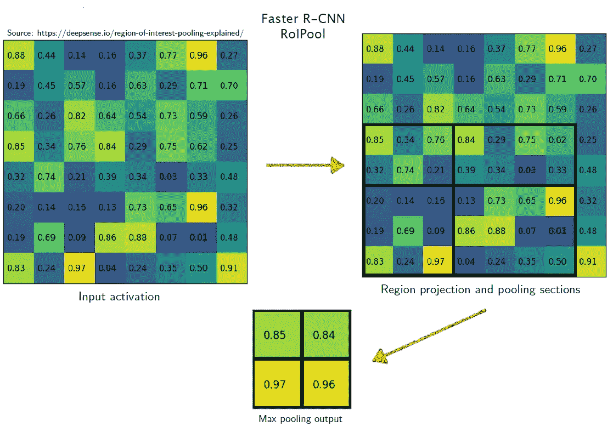

**RoIPool in** [**更快 R-CNN**](https://towardsdatascience.com/review-faster-r-cnn-object-detection-f5685cb30202) (图片来自[作者的 PPT](https://www.slideshare.net/windmdk/mask-rcnn) )

*   [更快 R-CNN](https://towardsdatascience.com/review-faster-r-cnn-object-detection-f5685cb30202) 中 RoIPool 的一个例子如上图。
*   首先，我们得到了图左侧的输入特征图。
*   根据区域建议，我们使用一个 7×5 的区域作为 RoIPool 的输入，输出 2×2 的特征图。
*   每个黑色矩形都被四舍五入为整数长度，以便以后合并。
*   对于输出特征图的每个值，它们对应于每个黑色矩形的最大值，这被称为最大池。

## 4.2.掩模 R-CNN 中的 RoIAlign

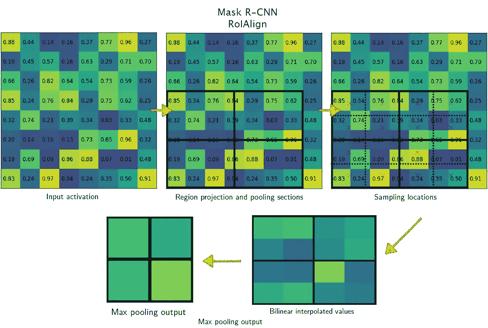

**RoIAlign in Mask R-CNN** (图片来自[作者的 PPT](https://www.slideshare.net/windmdk/mask-rcnn)

*   掩膜 R-CNN 中 RoIAlign 的一个例子如上图。
*   使用相同大小的黑色**矩形**，而不是将黑色矩形圆化为整数长度。
*   **基于特征地图值重叠的区域，使用双线性插值**获得中间汇集特征地图，如图右下方所示。
*   然后**在这个中间池化特征图**上执行最大池化。

# **5。头部结构细节**

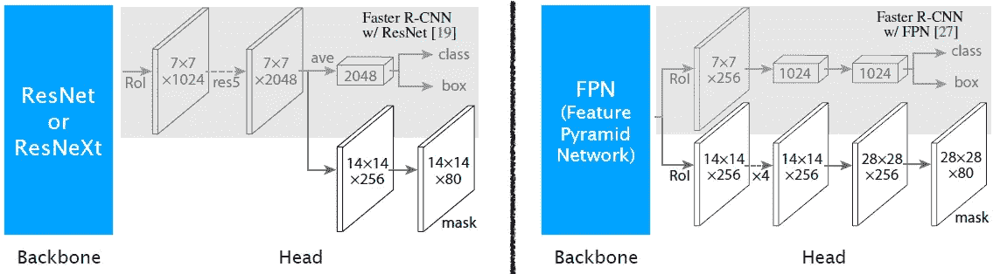

**网络架构变体**(图片来自[作者的 PPT](https://www.slideshare.net/windmdk/mask-rcnn) )

*   3 名骨干受审:[雷斯内特](https://towardsdatascience.com/review-resnet-winner-of-ilsvrc-2015-image-classification-localization-detection-e39402bfa5d8)、[雷斯 NeXt](https://towardsdatascience.com/review-resnext-1st-runner-up-of-ilsvrc-2016-image-classification-15d7f17b42ac) 和 FPN。
*   **左**:在没有 [FPN](https://towardsdatascience.com/review-fpn-feature-pyramid-network-object-detection-262fc7482610) 的情况下使用[ResNet](https://towardsdatascience.com/review-resnet-winner-of-ilsvrc-2015-image-classification-localization-detection-e39402bfa5d8)/[ResNeXt](https://towardsdatascience.com/review-resnext-1st-runner-up-of-ilsvrc-2016-image-classification-15d7f17b42ac)时，在分割成两个头之前先进行进一步的卷积。一个头部用于分类和边界框，一个头部用于遮罩。
*   **右**:当 [ResNet](https://towardsdatascience.com/review-resnet-winner-of-ilsvrc-2015-image-classification-localization-detection-e39402bfa5d8) / [ResNeXt](https://towardsdatascience.com/review-resnext-1st-runner-up-of-ilsvrc-2016-image-classification-15d7f17b42ac) 与 [FPN](https://towardsdatascience.com/review-fpn-feature-pyramid-network-object-detection-262fc7482610) 配合使用时，网络直接分裂成两个头。一个头部用于分类和边界框，一个头部用于遮罩。

# 6.**实例分割结果**

*   **数据集:COCO 女士**，80 个类别，80k 训练图像，35k val 图像子集，5k 消融实验图像。

## 6.1.消融研究

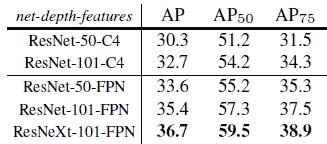

**主干架构**

*   更好的主干带来预期的收益:更深的网络做得更好， [FPN](https://towardsdatascience.com/review-fpn-feature-pyramid-network-object-detection-262fc7482610) 优于 C4 特性， [ResNeXt](https://towardsdatascience.com/review-resnext-1st-runner-up-of-ilsvrc-2016-image-classification-15d7f17b42ac) 在 [ResNet](https://towardsdatascience.com/review-resnet-winner-of-ilsvrc-2015-image-classification-localization-detection-e39402bfa5d8) 上有所改进。

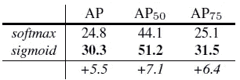

**多项式与独立掩码**

*   与多项式掩码(softmax)相比，通过 perclass 二进制掩码(sigmoid)去耦可获得更大的增益。

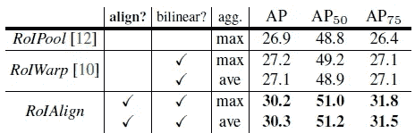

*   RoIWarp 最初用于 [R-CNN](/coinmonks/review-r-cnn-object-detection-b476aba290d1) 中，RoIPool 最初用于 [Fast R-CNN](/coinmonks/review-fast-r-cnn-object-detection-a82e172e87ba) 中。
*   RoIAlign 层提高 AP 3 点，AP75 提高 5 点。使用适当的对齐是造成 RoI 层之间大间隙的唯一因素。

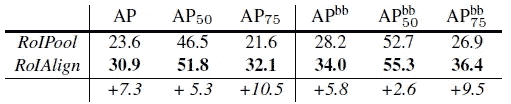

**RoIPool vs RoIAlign**

*   使用步幅 32 的 ResNet-50-C5。
*   失调比 stride-16 特性更严重，导致巨大的精度差距。

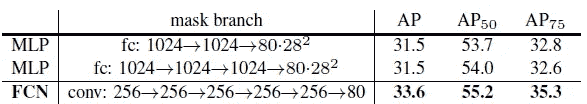

**遮罩分支变体使用**[**ResNet**](http://ResNet)**-50-**[**FPN**](https://towardsdatascience.com/review-fpn-feature-pyramid-network-object-detection-262fc7482610)

*   与 MLP(多层感知器，使用 FC 层)相比，FCNs 改善了结果，因为它们利用了显式编码空间布局的优势。

## 6.2.定性结果

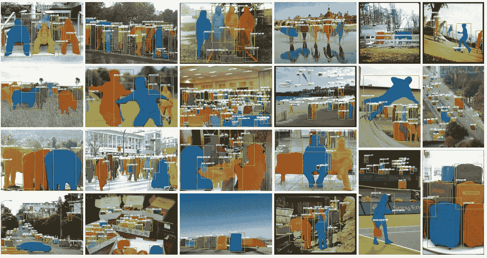

**屏蔽 R-CNN 对 COCO 的测试图片，使用**[**ResNet**](http://ResNet)**-101-**[**【FPN】**](https://towardsdatascience.com/review-fpn-feature-pyramid-network-object-detection-262fc7482610)**(图片来自[作者论文](https://arxiv.org/abs/1703.06870))**

## **6.3.SOTA 方法比较**

**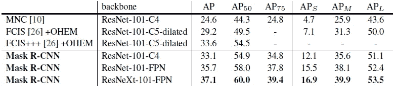**

****COCO 测试开发上的实例分段掩码 AP****

*   **[跨国公司](https://towardsdatascience.com/review-mnc-multi-task-network-cascade-winner-in-2015-coco-segmentation-instance-segmentation-42a9334e6a34)和 [FCIS](https://towardsdatascience.com/review-fcis-winner-in-2016-coco-segmentation-instance-segmentation-ee2d61f465e2) 分别是 2015 年和 2016 年 COCO 细分挑战的获胜者。**
*   **Mask R-CNN 胜过更复杂的[FCIS](https://towardsdatascience.com/review-fcis-winner-in-2016-coco-segmentation-instance-segmentation-ee2d61f465e2)++++，后者包括多尺度训练/测试、水平翻转测试和 OHEM。所有条目都是单一模型结果。**

# ****7。**人体姿态估计(**关键点检测)结果****

*   **Mask R-CNN 框架可以很容易地扩展到人体姿态估计。**
*   **关键点的位置被建模为一个热点遮罩。屏蔽 R-CNN 预测 *K* 个屏蔽，每个屏蔽对应一个 *K* 关键点类型(如左肩、右肘)。**

## **7.1.消融研究**

**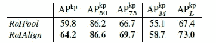**

****RoIPool vs RoIAlign****

*   **同样，使用适当的对齐是造成 RoI 层之间大间隙的唯一因素。**

**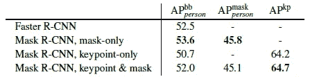**

****关于人物类别的方框、遮罩和关键点的多任务学习，在 minival 上评估****

*   **添加关键点分支略微减少了方框/掩码 AP，这表明尽管关键点检测受益于多任务训练，但它不会反过来帮助其他任务。**
*   **然而，联合学习所有三个任务能够使一个统一的系统有效地同时预测所有输出。**

## **7.2.定性结果**

**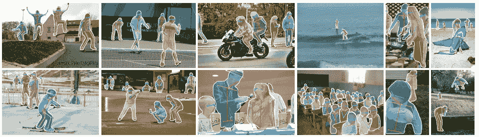**

****COCO 测试上的关键点检测结果使用掩膜 R-CNN(**[**ResNet**](https://towardsdatascience.com/review-resnet-winner-of-ilsvrc-2015-image-classification-localization-detection-e39402bfa5d8)**-50-**[**FPN**](https://towardsdatascience.com/review-fpn-feature-pyramid-network-object-detection-262fc7482610)**)**(图片来自[作者论文](https://arxiv.org/abs/1703.06870))**

## **7.3.SOTA 方法比较**

**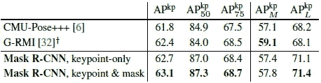**

****COCO 测试开发上的关键点检测 AP。****

*   **[CMU 姿势](/analytics-vidhya/review-cmupose-openpose-winner-in-coco-keypoint-detection-challenge-2016-human-pose-ccbdbc72b7dd) +++是 2016 年使用多尺度测试和后处理的比赛冠军，而 [G-RMI](/towards-artificial-intelligence/review-g-rmi-1st-runner-up-in-coco-keypoint-detection-challenge-2016-human-pose-estimation-6c8d250f62a0) 也是 2016 年的亚军。**
*   **Mask R-CNN (62.7 APkp)比 COCO 2016 关键点检测获奖者高 0.9 分。**
*   **使用掩码标签进行训练也有助于增加关键点检测 AP。**

**文中还给出了使用 Cityscape 数据集进行语义分割的结果，并在附录中给出了 COCO 上的增强结果。如果有兴趣，请阅读文件了解更多详情。**

## **参考**

**【2017 ICCV】【面具 R-CNN】
[面具 R-CNN](https://arxiv.org/abs/1703.06870)**

# **实例分割**

**[[SDS](/datadriveninvestor/review-sds-simultaneous-detection-and-segmentation-instance-segmentation-80b2a8ce842b?source=post_page---------------------------)][[Hypercolumn](https://towardsdatascience.com/review-hypercolumn-instance-segmentation-367180495979?source=post_page---------------------------)][[deep Mask](https://towardsdatascience.com/review-deepmask-instance-segmentation-30327a072339?source=post_page---------------------------)][[sharp Mask](https://towardsdatascience.com/review-sharpmask-instance-segmentation-6509f7401a61?source=post_page---------------------------)][[multipath net](https://towardsdatascience.com/review-multipath-mpn-1st-runner-up-in-2015-coco-detection-segmentation-object-detection-ea9741e7c413?source=post_page---------------------------)][[MNC](https://towardsdatascience.com/review-mnc-multi-task-network-cascade-winner-in-2015-coco-segmentation-instance-segmentation-42a9334e6a34?source=post_page---------------------------)][[instance fcn](https://towardsdatascience.com/review-instancefcn-instance-sensitive-score-maps-instance-segmentation-dbfe67d4ee92?source=post_page---------------------------)][[FCIS](https://towardsdatascience.com/review-fcis-winner-in-2016-coco-segmentation-instance-segmentation-ee2d61f465e2?source=post_page---------------------------)][[Mask R-CNN](/analytics-vidhya/review-mask-r-cnn-instance-segmentation-human-pose-estimation-61080a93bf4)]**

# **人体姿态估计**

**[ [DeepPose](https://towardsdatascience.com/review-deeppose-cascade-of-cnn-human-pose-estimation-cf3170103e36?source=post_page---------------------------) ] [ [汤普森 NIPS'14](https://towardsdatascience.com/review-tompson-nips14-joint-training-of-cnn-and-graphical-model-human-pose-estimation-95016bc510c?source=post_page---------------------------) ] [ [汤普森 CVPR ' 15](https://towardsdatascience.com/review-tompson-cvpr15-spatial-dropout-human-pose-estimation-c7d6a5cecd8c?source=post_page---------------------------)][[CPM](/@sh.tsang/review-cpm-convolutional-pose-machines-human-pose-estimation-224cfeb70aac?source=post_page---------------------------)][[FCGN](/@sh.tsang/review-fcgn-fully-convolutional-google-net-human-pose-estimation-52022a359cb3)][[IEF](/towards-artificial-intelligence/review-ief-iterative-error-feedback-human-pose-estimation-a56add160fa5)][[deep cut&DeeperCut](/@sh.tsang/review-deepcut-deepercut-multi-person-pose-estimation-human-pose-estimation-da5b469cbbc3)][[纽维尔 ECCV'16 &纽维尔 POCV'16](https://towardsdatascience.com/review-newell-eccv16-and-newell-pocv-16-stacked-hourglass-networks-human-pose-estimation-a9eeb76d40a5) ] [ [G-RMI](/towards-artificial-intelligence/review-g-rmi-1st-runner-up-in-coco-keypoint-detection-challenge-2016-human-pose-estimation-6c8d250f62a0)**

# **[我之前的其他评论](/@sh.tsang/overview-my-reviewed-paper-lists-tutorials-946ce59fbf9e)**