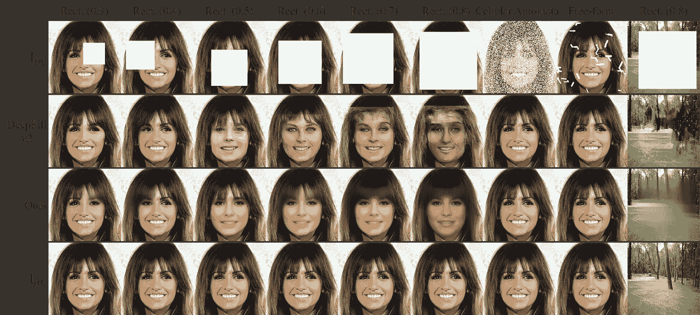
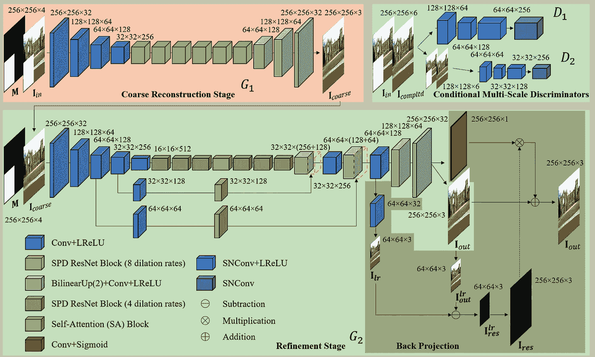
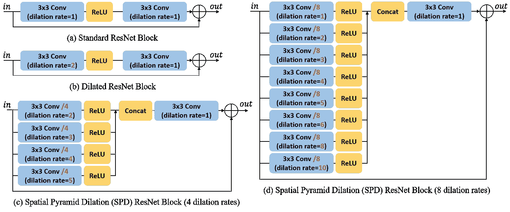
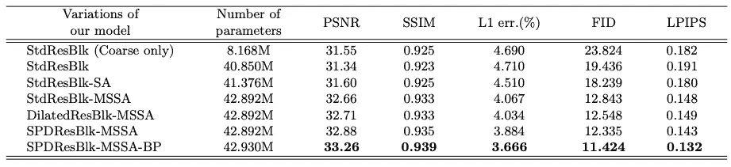
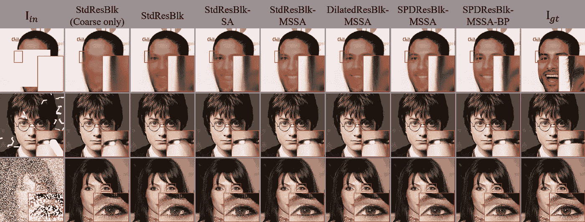
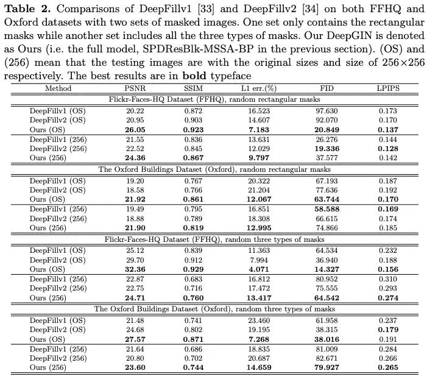
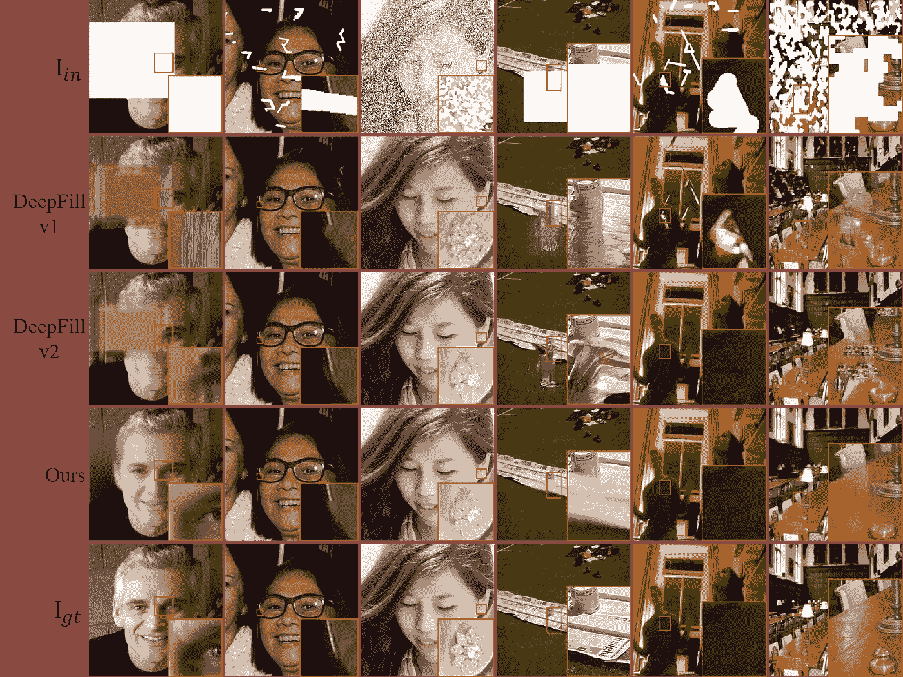
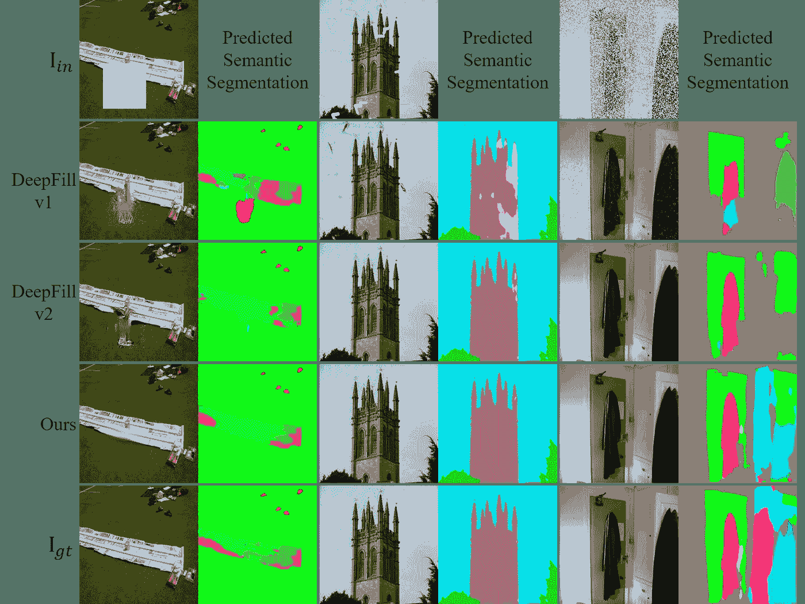
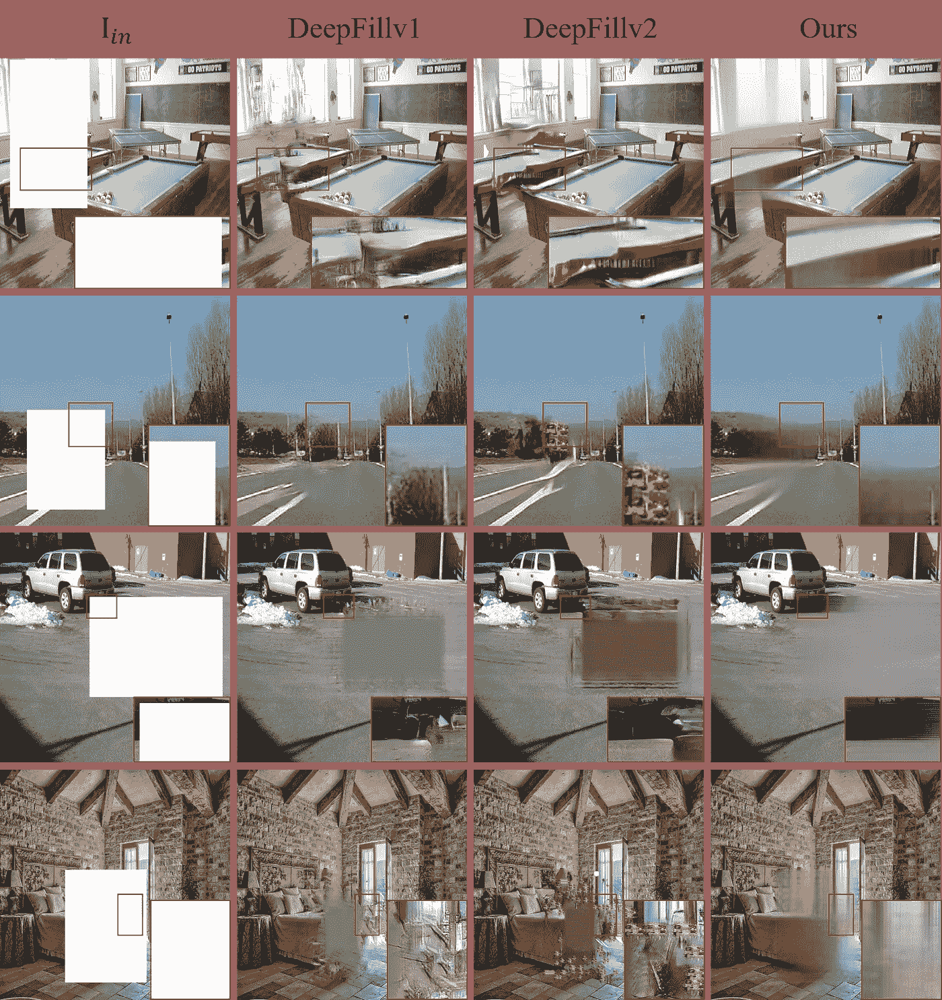
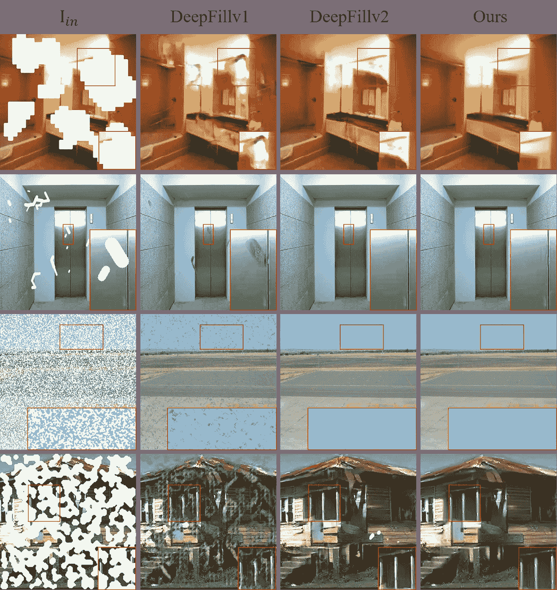

# DeepGIN 综述:用于极端图像修复的深度生成修复网络

> 原文：<https://medium.com/analytics-vidhya/review-of-deepgin-deep-generative-inpainting-network-for-extreme-image-inpainting-de5b191562b0?source=collection_archive---------10----------------------->

大家好，ECCV 20 AIM 工作坊今年举办了[极限图像修复挑战赛](https://data.vision.ee.ethz.ch/cvl/aim20/)(第一届图像修复挑战赛)。我想在这篇文章中分享一篇名为 [DeepGIN](https://arxiv.org/abs/2008.07173) 的挑战论文。源代码和相关资料可以在他们的 github 项目页面上找到:【https://github.com/rlct1/DeepGIN 

# 目标

*   填充图像中缺少的部分，如下图所示。

图一。第一行显示不同的遮罩图像。第二和第三行显示使用最新技术和所提出的方法完成的图像。最后一行是地面真实图像。图像修复的难度很大程度上取决于被遮盖区域的大小和形状

# 动机

*   现有的图像修补方法在野外完成缺失部分时通常会遇到困难，因为它们被训练用于处理一种特定类型的缺失图案(掩模)或者单方面假定被遮蔽区域的形状和/或大小(参见图 1 中的例子)。缺失的部分越大，任务越困难)

# 解决办法

*   所提出的模型是两阶段网络，即粗重构阶段和精细化阶段。粗略重建阶段负责丢失部分的粗略估计，而精细化阶段负责精细化粗略完成的图像

# 贡献

1.  提出一种空间金字塔膨胀(SPD)残差块来处理具有各种形状和大小的不同类型的掩模
2.  强调自相似性对图像修复的重要性，采用多尺度自关注策略显著改善修复效果(MSSA)
3.  设计反向投影(BP)策略，用于获得具有生成的图案和参考地面真实图像的更好对准的修补结果

# 方法

图二。提议模型的概述。有两个发生器和两个鉴别器

*   如图 2 所示，建议的模型包括两个阶段。
*   **粗重建阶段**:粗生成器***G1***以 中的 **M** 和 **I_ *为输入，给出一个粗完整图像 **I_ *粗******
*   **细化阶段**:细化生成器***G2***被训练用细节和纹理来修饰粗略完成的图像
*   **有条件的多尺度鉴别器**:两个鉴别器在两个不同的尺度上接受输入，以在两个尺度上促进局部重构图案的更好细节和纹理

# 空间金字塔膨胀(SPD)残余块

图 3。剩余块的变化。(一)是一个[标准残块](https://arxiv.org/abs/1512.03385)；(b)是简单的扩张残余阻滞；(c)和(d)是具有多个膨胀率的建议的残差块

*   由于掩蔽区域的尺度是随机确定的，作者建议使用多个扩张率来扩大每一层的感受野，从而可以将远距离空间位置给出的信息包括在重建中。图 3 图示了 SPD 残差块的设计

# 多尺度自我关注(MSSA)

*   本文中使用的自我关注区块与[非局部区块](https://arxiv.org/abs/1711.07971)完全相同
*   自注意的主要思想是计算图像本身的自相似性，这对于根据掩蔽图像中剩余的有效像素来修改生成的图案是有用的
*   如图 2 所示，作者应用 MSSA 代替单个 SA，通过在三个不同的尺度上考虑自相似性来增强完整图像的一致性。为了避免额外的参数，在连接到 SA 块之前，它们简单地使用标准卷积层来减小信道大小

# 反向投影

*   作者还重新设计了[反向投影策略](https://arxiv.org/abs/1803.02735)，如图 2 中阴影反向投影区域所示。他们学习加权 BP 残差并将其添加回以更新最终完成的图像，因此生成的模式与参考地面真实图像具有更好的对齐

# 条件多尺度鉴别器

*   两个输入尺度下的两个鉴别器与生成器一起被训练，以模拟填充区域的细节。鉴别器输出一组特征图，并且这些图上的每个值以两种不同的比例表示输入图像中的局部区域。这鼓励了外观和语义的相似性

# 损失函数

损失函数中有 ***五大项*** :

1.  ***L1 损失*** 保证逐像素重建精度
2.  ***对抗性损失*** 促使完成图像的分布接近真实图像的分布
3.  [***特征感知损失***](https://arxiv.org/abs/1603.08155) 鼓励每个完成的图像及其参考地面真实图像具有由训练有素的网络计算的相似特征表示，具有良好的泛化能力，如 VGG-19
4.  [***风格损失***](https://www.cv-foundation.org/openaccess/content_cvpr_2016/papers/Gatys_Image_Style_Transfer_CVPR_2016_paper.pdf) 强调完成的图像与真实图像之间的纹理、颜色等风格相似性

# 实验

*   **随机掩码生成**:在训练中使用了三种不同类型的掩码(如图 1 所示。即矩形掩模、自由形式掩模和元胞自动机掩模)。作者将这三种类型的掩模应用于每个训练图像，以实现更稳定的训练
*   **两阶段训练**:训练过程分为两个阶段，即热身阶段和主要阶段。他们首先使用 ***L1 损耗*** 对两台发电机进行 10 个历元的训练。然后，他们用鉴别器交替训练发生器 100 个时期
*   **训练数据**:他们在两个数据集上训练提出的模型，比如[***CelebA-HQ***](https://github.com/switchablenorms/CelebAMask-HQ)***数据集*** (仅针对人脸图像)和[***ade 20k***](https://groups.csail.mit.edu/vision/datasets/ADE20K/)***数据集*** (一个更通用的数据集，包含建筑物、人物、自然场景等。)
*   **消融研究**:作者首先提供证据证明他们建议的策略和构建模块的有效性，即 SPD 剩余模块、MSSA 和 BP

表 1。CelebA-HQ 数据集的消融研究。最好的结果是用粗体字

图 4。CelebA-HQ 数据集上的建议模型变化的结果

*   基线被表示为 StdResBlk(仅粗略，仅第一阶段)和 StdResBlk(用于修补的典型 ResNet)，对于它们，所有 SA 块和 BP 分支被消除，并且所有 SPD 残余块被标准残余块代替，如图 3 所示
*   从表 1 的定量结果来看，与 StdResBlk-SA(单一 SA)相比，MSSA 的就业为 PSNR 带来了 1.06 dB 的增长。这反映了 MSSA 对图像修复任务的重要性
*   对于定性结果，图 4 显示了所提出的模型的变化的比较。没有第二个细化阶段，完成的图像缺少面部细节，正如你在第二列的第一个例子中看到的
*   **与之前工作的比较**:为了测试提出的模型的泛化能力，作者在两个公开可用的数据集 [FFHQ](https://github.com/NVlabs/ffhq-dataset) 和[牛津大楼](https://www.robots.ox.ac.uk/~vgg/data/oxbuildings/)上将他们的模型与一些最先进的方法进行了比较

*   对于定量结果，表 2 显示，在所有实验中，他们提出的模型在逐像素重建精度方面优于其他两种方法(即 PSNR、SSIM、L1 误差。).在大多数情况下，它们还实现了更好的估计感知质量(即 FID 和 LPIPS)

图 5。FFHQ 和牛津建筑数据集的定性结果

*   对于定性结果，在图 5 中，可以看到深填充 v1 和 v2 未能在大矩形遮罩上实现令人满意的视觉质量，如第一列和第四列所示。请注意，作者试图在像素精度和视觉质量之间寻求平衡。为了表明这一点，他们还提供了预测的语义分割结果

图 6。预测的语义分割测试结果的可视化

*   很明显，他们的测试结果在语义上比其他两种方法更接近事实，例如，见前两列的报纸和草坪的交叉点
*   一些额外的测试结果也可以在他们的 github 项目页面上找到

图 7。AIM 极限图像修复挑战赛 2020 的测试结果

图 8。AIM 挑战测试集的更多测试结果

# 结论

*   回想一下，作者在本文中提出了三种主要的图像修复策略，即空间金字塔膨胀(SPD)残差块、多尺度自注意(MSSA)以及反投影(BP)。他们还指出，需要在逐像素重建精度和视觉质量之间取得适当的平衡，以避免产生一些奇怪的图案

强烈建议感兴趣的读者阅读[论文](https://arxiv.org/abs/2008.07173)并访问他们的 [github 项目页面](https://github.com/rlct1/DeepGIN)了解更多细节。

# 个人想法

1.  从他们的烧蚀研究来看，似乎用于图像修复的一级网络也是可能的，并且应该对此做进一步的研究
2.  高 PSNR 通常图像模糊，如何解决这个问题对赢得挑战至关重要

# 参考

*   https://arxiv.org/abs/2008.07173[迪普金](https://arxiv.org/abs/2008.07173)
*   [https://github.com/rlct1/DeepGIN](https://github.com/rlct1/DeepGIN)
*   [https://data.vision.ee.ethz.ch/cvl/aim20/](https://data.vision.ee.ethz.ch/cvl/aim20/)