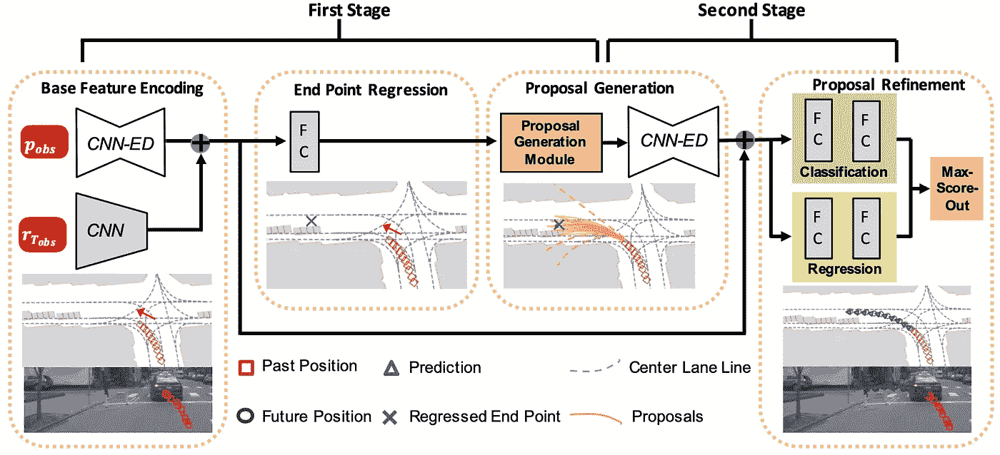
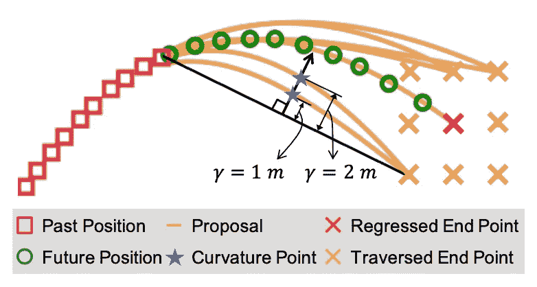
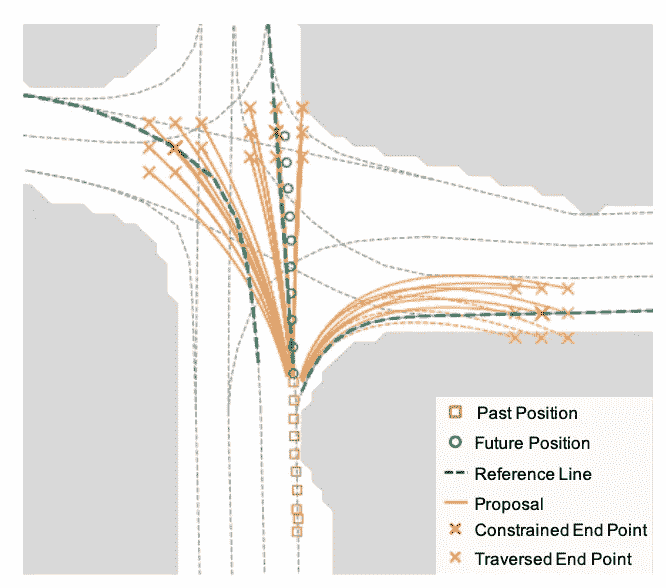
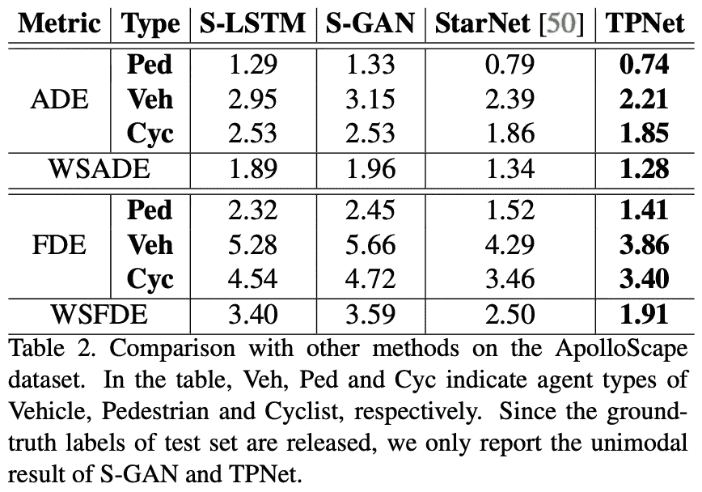
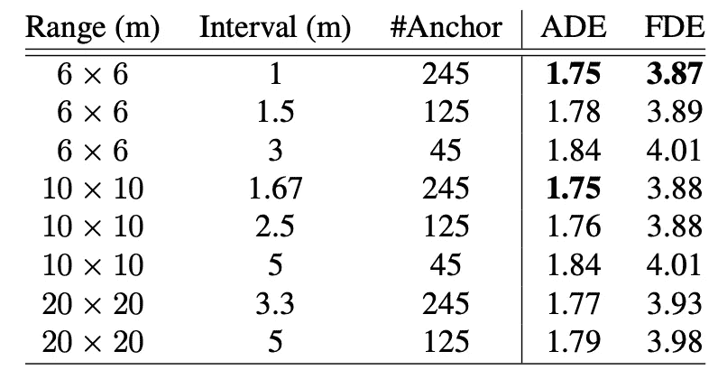
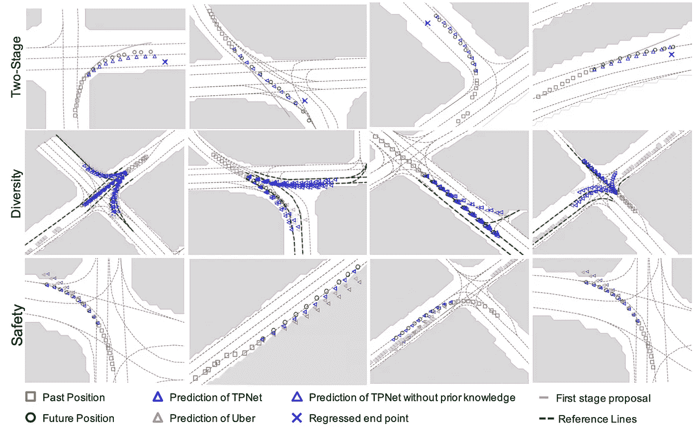

# TPNet:运动预测轨迹建议网络综述

> 原文：<https://medium.com/analytics-vidhya/review-of-tpnet-trajectory-proposal-network-for-motion-prediction-dc92e313115a?source=collection_archive---------14----------------------->

由于最近 Lyft 在 kaggle 上举办了一场[运动预测比赛](https://www.kaggle.com/c/lyft-motion-prediction-autonomous-vehicles/overview)，我开始研究运动预测领域的不同方法。简单来说，运动预测的目的是“猜测”一个或多个目标(或代理，一个更专业的术语)的即将到来的运动，这对自动驾驶非常有用。在现实世界中，举一个更具体的例子，如果我们可以知道周围车辆的运动，我们可以建议他/她遵循的拯救路径。

今天来讲一篇论文， [TPNet:运动预测的轨迹建议网络](https://arxiv.org/abs/2004.12255) [1]。这是对这篇论文的一个简要回顾，我将试着列出它的主要观点，我建议感兴趣的读者阅读这篇论文以了解详情。开始吧！:)

# 目标

*   预测邻近交通主体(如行人、车辆等)的未来运动。)围着一个主持人

# 动机

*   对于相邻的交通代理，有许多可能的路径。现有的方法通常从代理的过去位置提取特征，并直接回归它们的未来位置。这种直接回归不能满足现实世界情况的需要，在现实世界中，交通存在限制(例如，一些区域不可移动，人们可以在十字路口直行/右转)
*   其他一些方法基于一些相关的物理测量，如角加速度、速度等进行预测。然而，预测的性能高度依赖于这种测量的准确性，并且它导致对输入数据的大量要求

# 解决办法

*   本文提出的解决方案非常有趣。作者将问题分成两个子问题，即分类和回归。我们将在本帖中深入探讨解决方案。

# 贡献

1.  他们提出了一个两阶段网络来预测不同类型的主体，即车辆、行人和骑自行车的人的运动
2.  使用关于道路和交通的先验知识来进一步增强预测结果
3.  他们在几个预测数据集上实现了最先进的性能(这肯定会发表论文:)

# 方法

这是一个两级网络。第一阶段是轨迹建议网络，第二阶段是建议分类和回归网络。

# 轨迹建议网络

*   这个网络预测智能体的端点，然后根据相应的端点为每个智能体提出一些轨迹

图一。建议方法概述[1]

*   **基本特征编码模块**
*   —该模块具有编码器-解码器结构
*   —该模块以目标智能体在时间间隔`[0, T_obs]`的一系列过去位置`p_obs = {p_0, p_1, ..., p_T_obs}`及其周围道路信息`r_T_obs`作为输入。请注意，道路信息是可选的，具体取决于所使用的数据集
*   —道路信息是语义地图的形式，目标过去的位置被绘制在语义地图上，如图 1 所示
*   —使用浅层 ResNet-18 作为特征提取器，从道路语义地图图像中提取特征
*   **提案生成**
*   —有两种方案生成方式，即**基础方案生成**和**多模式方案生成**。**基本建议生成**仅使用位置信息，不需要道路信息，而**多模式建议生成**与道路信息一起使用，以获得更全面的路径建议
*   —作者将轨迹表示简化为多项式曲线表示。简单地说，当我们有了当前位置和预测的未来位置，我们可以根据这两点画出许多曲线

图二。如何基于端点和曲率点生成建议[1]

*   —作者建议使用一组点来表示曲线，即预测的端点和曲率点，如图 2 所示。"曲率点反映曲线的弯曲程度，由一个名为`gamma`的距离变量决定."
*   **基础提案生成**
*   -基础建议生成方法仅基于第一阶段的预测终点生成轨迹建议。基于预测的终点，可以通过枚举以预测的终点为中心的 n×n 网格来生成可能的终点。注意，对于图 2，N = 3(有 9 个十字，8 个黄色十字和 1 个红色十字)。
*   **多模式建议生成**
*   —由于基本建议生成方法不能满足我们的动态现实世界(即，当一个人可以左转/右转或直行时，有许多可能的端点)，多模式建议生成方法利用道路信息来生成多个端点，因为道路对车辆有很强的约束

图 3。使用道路信息生成多式联运建议书的图示[1]

*   —基于道路信息和目标的过去位置，我们可以得到目标可能遵循的一组参考线。因此，基本建议生成可以扩展到多模式建议生成。图 3 显示了如何利用参考线来生成多个提议
*   —基于第一阶段的单个预测端点，我们可以根据当前位置和未来位置的位移，在每个参考线上采样一个端点，得到多个预测端点。

# 提案分类和细化

*   在得到若干建议后，第二阶段是选择最佳建议(分类)和提炼建议(回归/提炼)
*   **分类模块**
*   —作者使用一个简单的二元分类标签来表示一个好的提议或不好的提议。他们简单地使用地面真实轨迹和建议轨迹之间的平均距离。他们沿着两条轨迹均匀地采样多个点，并计算平均距离。如果平均距离低于预定义的阈值，则提议轨迹被分类为好提议
*   **细化模块**
*   —为了细化，作者计算了预测终点和实际终点之间的差异。为了改进建议轨迹，他们还比较地面真实曲率点和建议轨迹的曲率点

# 先验知识

*   如果关于道路的先验知识是可用的，它将被用于显式地过滤轨迹提议。具体来说，对于在可驾驶区域之外的建议，将为这些建议分配较小的权重(基于与可驾驶区域的距离),以达到处罚目的

# 目标函数

*   目标函数中有三项

1.  预测终点和实际终点之间的差异
2.  用于分类的二元交叉熵损失。该网络应该能够对好轨迹或坏轨迹进行分类
3.  细化损失。建议轨迹应该接近地面真实轨迹

# 实验结果

*   作者做了大量的实验。我将在这里重点介绍其中一些，感兴趣的读者可以参考该文件了解更多细节
*   **评估指标**
*   —平均位移误差(ADE)和最终位移误差(FDE)是运动预测中常用的指标。请注意，越小性能越好
*   **曲线表示的有效性**

可以观察到“Veh”有更明显的改善[1]

*   —一个重要的结果是，如表 2 所示，与行人和骑自行车的人预测相比，所提出的方法在车辆轨迹预测方面表现更好。可以观察到车辆轨迹预测的明显改进。作者声称，曲线表示更适合于车辆轨迹
*   **消融(网格尺寸)**

表 3。不同网格尺寸对烧蚀影响的研究[1]

*   —第二个启发是建议生成的网格大小的影响。从表 3 中，我们可以看到较小的网格大小和间隔可以提供更好的性能。为了获得更好的性能，我们可以增加网格大小，并使用较小的时间间隔来生成建议。然而，这在计算上要昂贵得多
*   **定性评估**

图 4。定性评价[1]

*   —图 4 显示了对建议方法的定性评估。显然，两级网络给出了更好的预测结果，并且先验知识的使用也有效地滤除了在可驾驶区域之外的预测结果

# 结论

*   总之，作者将运动预测问题重新公式化为先分类后回归的问题。通过使用关于道路和交通的先验知识，我们可以为每个目标代理提出多个可能的轨迹(即可能的端点)，而不是迫使网络直接回归单个预测的端点。先验还可用于过滤异常值，以进一步增强预测结果

# 个人想法

1.  当我读到这篇论文时，我立刻想起了几篇经典论文，如 RCNN、Fast-RCNN、Fast-RCNN 等。就是因为理念相似。我们首先为任务生成一些建议，然后对所有建议进行分类/定位。或许，可以通过采用基于深度学习的提议生成方法来改进该方法
2.  运动预测非常依赖于时间信息。本文采用在当前语义图上绘制所有过去位置的方法来编码时间信息。通过这样做，输入仍然是 RGB 图像，作者可以使用为图像处理设计的典型卷积神经网络(CNN)来实现运动预测的任务。如果我们用其他方法对时间信息进行编码会怎么样？看到预测结果的任何改进将是有趣的

# 参考

[1] TPNet，【https://arxiv.org/abs/2004.12255 

[2]自动驾驶的 Lyft 运动预测，ka ggle[https://www . ka ggle . com/c/Lyft-Motion-Prediction-Autonomous-vehicles/overview](https://www.kaggle.com/c/lyft-motion-prediction-autonomous-vehicles/overview)

这是我第一次写综述论文。我试图总结论文的主要观点，并给出一些个人的想法。大家一起学习、思考、分享:)非常感谢。