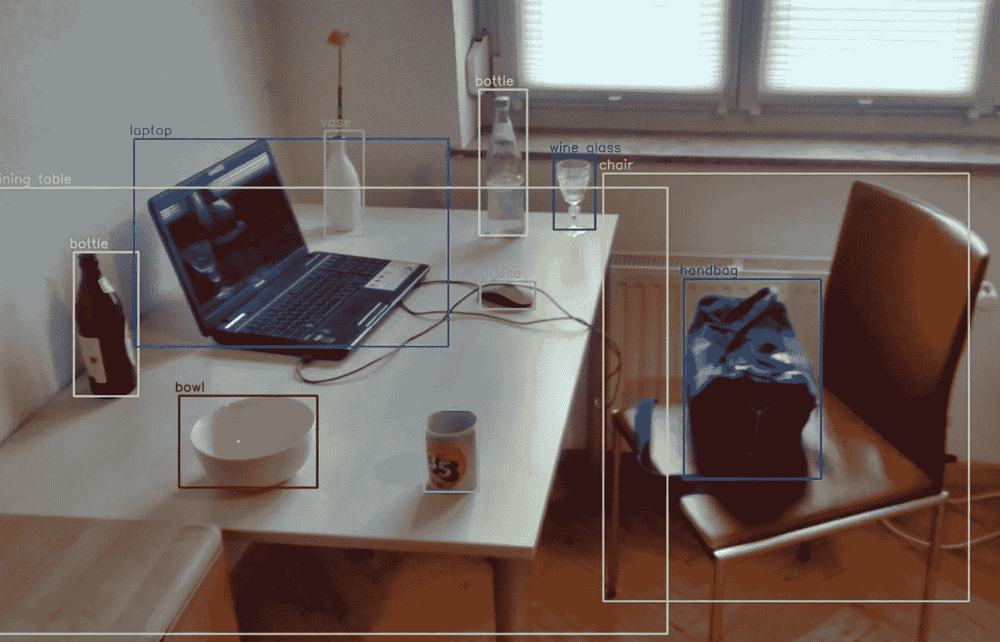
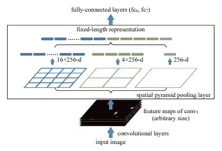
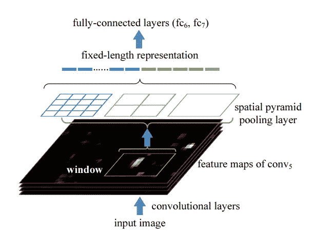

# 审查:空间金字塔池[1406.4729]

> 原文：<https://medium.com/analytics-vidhya/review-spatial-pyramid-pooling-1406-4729-bfc142988dd2?source=collection_archive---------3----------------------->

## 向 CNN 传递可变大小的输入

演职员表:[https://en.wikipedia.org/wiki/Object_detection](https://en.wikipedia.org/wiki/Object_detection)

我已经计划阅读主要的物体探测论文(虽然我已经粗略地阅读了它们中的大部分，但我会详细地阅读它们，好到足以写一篇关于它们的博客)。这些论文与基于深度学习的对象检测相关。随时给建议或询问疑惑会尽我所能帮助大家。我将在下面写下每篇论文的 arxiv 代码，并在下面给出博客(我写的时候会不断更新)和他们论文的链接。任何从这个领域开始的人都可以跳过许多这样的论文。当我读完所有的论文后，我还会写下它们的优先级/重要性(根据理解主题的必要性)。
我写这篇博客是考虑到和我相似并且仍在学习的读者。万一我犯了任何错误(我将通过从各种来源(包括博客、代码和视频)深入理解论文来尽量减少错误)，任何人都可以随意地在博客上强调它或添加评论。我已经提到了我将在博客结尾涉及的论文列表。

我们开始吧:)

CNN 用于从图像中提取特征，然后是用于分类的全连接层。由于卷积运算是以滑动窗口方式应用的，所以它可以接受不同大小的输入，从而产生不同大小的输出。因为 CNN 之后是可以接受固定大小输入的全连接层。这使得 CNN 不能接受不同大小的输入。因此，图像在被送入 CNN 之前，首先被重塑成某种特定的维度。这产生了另一个问题，即图像扭曲和分辨率降低。空间金字塔池可以解决这个问题。

## 空间金字塔池

在空间金字塔合并之前，提取的要素地图通常被展平(完全连接的图层接受作为 1d 矢量的输入)或合并，以滑动窗口方式应用，从而提供不同大小的输出。

空间金字塔池在局部空间箱中维护空间信息。箱柜的数量和大小是固定的。在每个空间仓中，汇集每个滤波器的响应。在下图所示的示例中，完成了三级池。在论文中，作者到处使用最大池。

空间金字塔池(鸣谢:[论文](https://arxiv.org/pdf/1406.4729.pdf)

输出特征图有 256 个过滤器，大小任意(取决于输入大小)。

1.  在第一个池层(图中的灰色层)中，输出只有一个容器，覆盖了一个完整的图像。这类似于全局池操作。这个池的输出是 256-d。
2.  在第二次汇集中，特征图被汇集成具有 4 个箱，从而给出大小为 4*256 的输出。
3.  在第三个池中，特征图被池化以具有 16 个箱，从而给出大小为 16*256 的输出。

所有池层的输出被展平和连接，以给出固定维度的输出，而不考虑输入大小。

## 多尺寸训练

由于现在我们的 CNN 能够使用不同大小的输入，作者为多种输入大小训练了网络(他们选择 224*224 和 180*180)。多尺寸训练的主要原因是模拟不同的输入尺寸。这种方法效果很好，显示出比单一尺寸训练更好的效果。

这篇论文还有其他的实验和训练策略，出于简洁和篇幅的原因，我将跳过这些，这篇博客的目的是讲述这些技术，而不是在每篇论文中进行的实验。

## 用于对象检测的 SPPNet

使用空间金字塔池的对象检测是建立在 RCNN 架构之上的，我希望你们知道这一点。在 RCNN 中，生成 2000 个区域提议，然后 2000 个裁剪的图像通过 CNN。在 SPPNet 中，每个图像只提取一次特征图。对每个候选者应用空间金字塔池来生成固定大小的表示。由于 CNN 是最耗时的部分，与 RCNN 相比，SPPNet 非常快。

对于每个提议，完全连接的层被执行 2000 次，以生成最终预测。

和平…

# 论文列表:

1.  [OverFeat:使用卷积网络的综合识别、定位和检测](https://arxiv.org/pdf/1312.6229.pdf)。[ [链接到博客](https://towardsdatascience.com/overfeat-review-1312-6229-4fd925f3739f)
2.  [丰富的特征层次，用于精确的对象检测和语义分割(RCNN)。](https://arxiv.org/pdf/1311.2524.pdf) [ [链接到博客](/@sanchittanwar75/rcnn-review-1311-2524-898c3148789a)
3.  [用于视觉识别的深度卷积网络中的空间金字塔池(SPPNet)。](https://arxiv.org/pdf/1406.4729.pdf) ←你完成了这篇博客。
4.  [快速 R-CNN](https://arxiv.org/pdf/1504.08083.pdf) 【链接到博客】
5.  [更快的 R-CNN:利用区域提议网络实现实时目标检测。](https://arxiv.org/pdf/1506.01497.pdf)【博客链接】
6.  [你只看一次:统一的，实时的物体检测。](https://arxiv.org/pdf/1506.02640.pdf)【博客链接】
7.  [SSD:单次多盒探测器](https://arxiv.org/pdf/1512.02325.pdf)。[博客链接]
8.  R-FCN:通过基于区域的完全卷积网络的目标检测。【博客链接】
9.  [用于目标检测的特征金字塔网络。](https://arxiv.org/pdf/1612.03144.pdf)【博客链接】
10.  [DSSD:解卷积单粒子探测器](https://arxiv.org/pdf/1701.06659.pdf)。[博客链接]
11.  [密集物体检测的焦点丢失(视网膜网)。](https://arxiv.org/pdf/1708.02002.pdf)【博客链接】
12.  [YOLOv3:增量改进](https://arxiv.org/pdf/1804.02767.pdf)。[博客链接]
13.  [狙击手:高效多尺度训练](https://arxiv.org/pdf/1805.09300v3.pdf)。[博客链接]
14.  [用于标记像素和区域的高分辨率表示。](https://arxiv.org/pdf/1904.04514.pdf)【博客链接】
15.  [FCOS:全卷积一级目标检测](https://arxiv.org/pdf/1904.01355v5.pdf)。[博客链接]
16.  [物体为点](https://arxiv.org/pdf/1904.07850.pdf)。[博客链接]
17.  CornerNet-Lite:高效的基于关键点的对象检测。【博客链接】
18.  用于物体检测的关键点三元组。[博客链接]
19.  [用于实时对象检测的训练时间友好网络。](https://arxiv.org/pdf/1909.00700.pdf)【博客链接】
20.  CBNet:一种用于目标检测的新型复合主干网络体系结构。【博客链接】
21.  EfficientDet:可扩展且高效的对象检测。[博客链接]

和平…