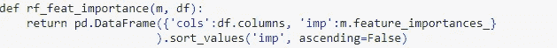

# 随机森林解释

> 原文：<https://medium.com/analytics-vidhya/rf-interpretation-season-1-e4bdbd10e0fe?source=collection_archive---------0----------------------->

## 第 1 部分:标准偏差和特征重要性

今天，我们将讨论口译技巧，有些是已知的，有些是新的。解释技术帮助我们更好地理解数据集，从而更好地训练模型。当你对自己的结果不确定，或者想在 kaggle 排行榜上名列前茅时，这些技巧会更加方便和有用。在这篇文章中，我将介绍两种解释技巧。让我们开始吧。我正在使用 fastai 库。我也推荐读者们去看看我的 [*上一篇文章*](/@machine_tyro/lift-random-forests-results-d3d81c7cf727) *来更好地理解下面的文章。*

# 你对自己的预测有信心吗？

通常，如果我们有 10 个估计量，对于验证数据集的每一行，我们预测所有估计量的结果，取所有预测的平均值，并将其与我们已经有的结果进行比较。但是如果我们想知道我们对每一个估计有多少信心呢？这里出现了非常有趣的标准差概念。我们不应该只考虑预测的平均值，还应该关注预测的标准差。如果标准偏差非常显著，这意味着每个预测彼此之间都非常不同。因此，每个估计量都非常不同。因此，在我们可以将我们的模型用于生产之前，我们需要再次考虑我们的超参数——这与预测的平均均值不同。如果我们的标准差变小了，那么我们对估计量也有信心。*因此，这些预测的标准差至少让我们相对了解了我们对此预测的信心程度。这不是 sci-kit-learn 中存在的东西，所以我们必须创建它。*

计算预测的标准差是毫不费力的。

```
m = RandomForestRegressor(n_estimators=40, min_samples_leaf=3, 
 max_features=0.5, n_jobs=-1, oob_score=True)preds = np.stack([t.predict(validation_dataset) **for** t **in** m.estimators_]) 
(validation dataset is the dataset without dependent variable.)np.std(preds[:,0])
```

*当特定类型的数据集较少时，计算标准差变得更加容易。在这种情况下，值的偏离可能是一个巨大的值，因此我们可能会对我们的决定不确定。*

赞！现在，你无疑对你的数据集更加大胆了。

# W 帽子特性比较关键，哪些不是？

现在，我们将讨论训练您的模型时最重要的事情，即 ***特征重要性*** 。在现实生活中也很明显，我们只关注真正重要的事情，或者在不同方面比其他事情更有影响力的事情。我们的模型也是如此。如果我们能够了解数据集中更重要的特征，然后我们只关注这些参数，而不是集中在整个参数空间，不是更好吗？**是的**，这样更好，我们的模型负担也更少。那么，我们来详细探讨一下这个术语。

Fastai 库提供了一种计算特征重要性的便捷方法，即 **rf_feat_importance。**它返回一个 pandas 数据框，其中列及其重要性按降序排序。



现在，你已经有了基本的特征，你可以用一个重要的特征来训练你的模型。事实上，您的模型预测不会因为特性的重要性而变差。它要么保持不变，要么变得更好。如果在一个意想不到的场景中变得更糟，这意味着这些特性是相互独立的，根本不是冗余的。在这种情况下，你必须考虑所有的特点。运气不好！
一般来说，如果您的验证分数在特性工程之后变得更差，那么可能有两个原因。

*   **过度拟合**:如果您过度拟合，这意味着您正在使用一个具有小`set_rf_samples`的相当大的数据集，并且您已经应用了与该小数据相关的特征工程。您没有考虑可能对训练数据集有用的变化。要解决这类问题，你必须是一个优秀的从业者。
*   **意外情况**:你的验证分数可能变得更差的第二个原因是，如果你没有过度拟合，这意味着你在训练集中做了正确的事情，但在验证集中却不准确。所以这只会发生在你的验证集不是随机样本的时候。

## 任何一个特性被测量的功能有多强大？

1.  我们传统上训练我们的模型。
2.  现在，如果我们想计算我们的特征有多重要，有两种方法。
    a .从数据集中移除相应的自变量，并训练您的模型。然后比较结果，这可能是 RMSE，R 或任何其他指标取决于跨国公司的 kaggle 竞争。
    b .混洗自变量列的值，然后训练你的模型。
3.  如果您删除该列，然后比较结果，这种方法有一定的缺点。首先，这将非常耗时。其次，你低估了变量之间的相互作用。
4.  因此，改变价值观可能是一种明智的做法。如果我们打乱它们，会增加随机性，我们既能捕捉到交互，又能捕捉到特征的重要性。
5.  这样，您就了解了重要的列。

**什么是数据泄露？** 数据泄露是一个问题，我们在无关紧要的信息或不需要的信息上训练我们的模型，使得我们的模型预测一些难以消化的东西。这些信息可能来自外部。

数据泄漏主要是复杂数据集中的一个问题。了解这一点的一种方法是建立一个适当的验证集，使预测值在训练和验证数据集中相差很大。

我将在第二季中讲述其他的解释技巧。