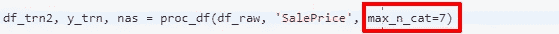
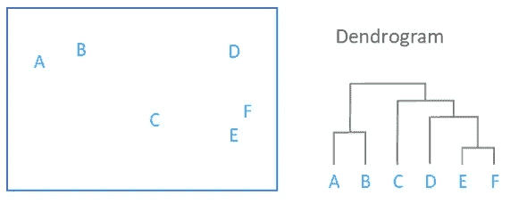

# 随机森林解释

> 原文：<https://medium.com/analytics-vidhya/rf-interpretation-season-2-ce74a4c32ab4?source=collection_archive---------2----------------------->

## 第 2 部分:编码技术和树状图

在这篇博文中，我将讨论剩余的随机森林解释技术，以改进使用随机森林的预测。我也推荐读者们去看看我的 [*上一篇文章*](/@machine_tyro/rf-interpretation-season-1-e4bdbd10e0fe) *来更好地理解下面的文章。*

# One Hot 编码到底是什么？

让我们用一个例子来理解这个可怕的术语。请容忍我。
考虑一个列名为 WeekDay(分类变量)的数据集，它告诉我们一周中的某一天，即，是星期天、星期一还是其他任何一天。现在，数据集中还有其他列，但在整个数据集中最重要的是，这一天是不是星期天，因为让我们假设星期天是国定假日，它通过流形影响数据集。

现在，训练模型的代码是以这样的方式编写的，如果那天是第 n 个分裂中的星期天。到那时，Sunday 参数变得很重要，一半的数据集已经被分割，因此，重要的东西根本不重要。这可能导致非常错误和非常不可接受的结果，让任何著名的组织承担巨大的损失。但是有一种方法可以解决这个问题。现在，这些都是一次性编码突然出现的情况。

> **幕后** 这个特性的作用是创建类别数作为单独的列，并删除父列。它分配二进制值，即 0 或 1，这取决于它是否满足条件，否则它分配 s 1 和 0。让我们用上面同样的例子来理解它。One-hot-encoding 会将 WeekDay 分类变量分成以下类别:
> 1。工作日 _ 周日
> 2。工作日 _ 星期二
> 3。工作日 _ 周三
> 4。工作日 _ 周四
> 5。工作日 _ 星期五
> 6。WeekDay_saturday
> 它将销毁父变量 WeekDay。

现在，估计者可以自由地考虑任何列，一些估计者将足够幸运地抓住要点。现在，如果您将特征工程应用于您的模型，我们可能会处理不同的结果，一组不同的参数可能比其他参数更重要。

一个热编码并不总是能改善结果？可能会有这样的情况，它恶化了模型的性能，可能是因为维数灾难。至少在那些场景中，我们会知道一些其他的基本特性。

所以我们可以足够快地进行一次热编码，我们这样做的方法是传递一个额外的参数，这个参数就是类别的最大数量。因此，如果我们说它是 7，那么任何少于 7 级的都将被转换为一个热编码的列束。您可以如下设置该参数。



# 冗余是重复，去掉重复

有时在我们的数据集中，我们有非常相似的特征，并且可能没有什么额外的我们可以通过拥有冗余的特征来实现。所以还是去掉不必要的特性比较好。现在问题来了，

> ***如何了解冗余功能？***

**聚类分析**:与把相似的东西聚类成一个有关，一般是两个东西的平均值。有一种聚类技术现在没有广泛使用，但在寻找冗余特征时非常有用。它被称为层次聚类或聚集聚类。

在层次聚类中，我们采用自下而上的类比。我们考虑每一个物体，并与其他物体进行比较。我们把相似的物体组合起来，进行同样的过程。与 k-means 中比较没有标签的行不同，这里我们比较完整的对象，或者更清楚地说，我们完全比较两个特征。


分层聚类

我们可以通过上面的图片来确认我们的理解。

我们使用树状图来绘制层次聚类。下面是绘图的代码。

```
from scipy.cluster import hierarchy as hccorr = np.round(scipy.stats.spearmanr(df_keep).correlation, 4)corr_condensed = hc.distance.squareform(1-corr)
z = hc.linkage(corr_condensed, method='average')
fig = plt.figure(figsize=(16,10))
dendrogram = hc.dendrogram(z, labels=df_keep.columns, orientation='left', leaf_font_size=16)plt.show()
```

在上面的代码中，在绘制树状图之前，我们正在计算 spearman 的相关系数。

**有什么关联？** 相关性类似于 R，但它是在两个对象之间而不是在实际值和预测值之间。

我们计算秩相关是因为对于单调非减函数一般是一条直线。这只是一个程序。
现在，如果你运行上面的代码，一个非常连贯的情节就会出现，如下所示。



现在，您知道哪些功能是多余的，哪些不是。此外，您可能会看到移除 oob_score 上的冗余要素的效果，并推断哪些要素可能会从数据集中删除。你可以遵循以下策略。

```
def calc_oob_score(df):
    m = RandomForestRegressor(n_estimators=30, min_samples_leaf=5, max_features=0.6, n_jobs=-1, oob_score=True)
    m.fit(independent_dataset_values, dependent_dataset_values)
    return m.oob_score_for col in ('A', 'B', 'E', 'F'):
    print(col, get_oob(independent_dataset_values.drop(col, axis=1)))
```

因此，我们在没有任何冗余变量的情况下训练了我们的模型。

# 什么是树解释器？

这是一个非常酷的技术，它告诉你通往你的预测的道路。假设你做了一个预测，现在你的客户想知道预测背后的原因，那么你可以使用树解释器显示你的预测的完整详细的路径。

```
pip install treeinterpreter**from** **treeinterpreter** **import** treeinterpreter **as** ti
prediction, bias, contributions = ti.predict(m, row)
```

`ti.predict`函数获取随机的森林和行(您想要在其上探索预测结果)。它会给我三样东西:

*   `prediction`:来自随机森林的预测
*   `bias`:整个原始数据集中因变量的平均值，即任何分割前的初始值。
*   `contributions`:一列和要分割的值(即预测值)，以及它对预测值的改变程度。

所以，现在你不仅对你的预测有把握，而且你还可以展示你的预测的完整路径。

因此，这些是广泛使用的随机森林解释方法。我建议读者多了解他们。