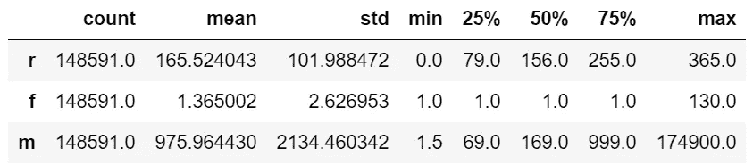

# 基于 Python 的客户细分 RFM 分析(一)

> 原文：<https://medium.com/analytics-vidhya/rfm-analysis-for-customer-segmentation-with-python-i-bb9ebadd0a96?source=collection_archive---------1----------------------->

> 最近我读了 Tony Song 的《Python 数据分析和数据操作》( Python Data Analysis and Data Operation)一书，他对 CRM 数据管理的分析给了我灵感。我遵循了书中的一些指导原则，并写下了自己关于如何以简单而有力的方式细分客户的想法。

客户是多种多样的，对于公司来说，了解他们是谁以及他们的价值有多大是很重要的。RFM 分析是一个很好的工具，通过检查购买的近期(R)、频率(F)和货币价值(M)来进行客户细分。这种模式很受欢迎，也很容易理解。

# 1.案例背景

我会用一个中国家电卖场的消费者交易数据。这里的目标不仅是将客户划分为不同的群体，而且还总结了他们各自的特点，并提供战略建议。

数据集从 2015 年到 2018 年有 20 万+的交易日志。有四个特征:*客户 ID* (唯一客户标识符)*订单 ID* (在线唯一订单标识符)*订单日期*(客户订购商品的日期)和*每订单销售额*(客户为该订单支付的金额)。根据这些信息，每个客户将被分配 1 到 3 分的购买数据的新近性、频率和货币价值，因此我们总共有 3*3*3=27 组。

# 2.使用 Python 进行 RFM 分析

这些是用于以下分析的包:pandas、matplotlib、seaborn 和 sklearn。

```
import pandas as pd
import matplotlib.pyplot as plt
import seaborn as sns
from sklearn.ensemble import RandomForestClassifier
```

**2.1 数据清理和准备**

我的数据存储在一个 Excel 文件中，有不同年份的多个工作表。第一步是将所有数据放入一个单一的数据框架中。在这个过程中，我们可以获得每年最近一次交易的订单日期，这对以后计算最近的交易很有用。

```
for sheet in SheetName_list[:-1]:
    single_sheet = pd.read_excel(r'sales.xlsx', sheet)
    single_sheet['max_year_date'] = single_sheet['order_date'].max() 
    all_df_list.append(single_sheet)
data_merge = pd.concat(all_df_list, axis = 0)
```

导入数据后，我们总是希望进行探索性的数据分析，并在需要时清理数据。事实证明，在 200，000 多个实例中，只有 2 个数据丢失，我们可以删除它们。每个订单的销售额是高度右偏的，其范围从 0 到 174，900。为什么有些顾客什么都没付？系统有什么错误吗？根据我们掌握的信息，这是因为一些顾客用优惠券支付。这也是任何低于 1 的交易的问题，所以我们将删除它们。就高阶值而言，它们在这个家用电器案例中是有意义的。

```
# drop all the instance with null value
data_merge = data_merge.dropna()# just keep the transactions with sales value > 1
data_merge = data_merge[data_merge['sales_per_order'] > 1]# create a new column to record transaction year
data_merge['year'] = data_merge['order_Date'].dt.year
```


在数据清理和准备之后

**2.2 计算 R、F 和 M**

新近性意味着顾客购买的时间有多近。为了得到它，我们使用每年最近的订单日期(max_year_date)，减去特定交易的订单日期。如果结果是 200 天，则意味着该客户的最后一次购买是在该年的 200 天前。

```
# calculate the recency
data_merge['date_interval'] = data_merge['max_year_date'] - data_merge['order_Date']
```

我们应该认识到，对于每个顾客来说，他或她在一年中可能会购买不止一次。例如，客户 A 在 2018 年购买了两次:一次是 100 天前用 200，另一次是 90 天前用 300。该客户在 2018 年的最近度、频率和货币值为 90 天(最近一次交易的日期)、2 天(总共购买 2 次)和 250 天(每单平均花费)。

```
# We use group and aggregation to calculate R,F and M
rfm_gb = data_merge.groupby(['year', 'customer_ID'], as_index = False).agg({'date_interval': 'min', 'order_ID': 'count', 'sales_per_order': 'mean'})
rfm_gb.columns = ['year', 'customer_ID', 'r', 'f', 'm']
```


我们每年都会为每个客户获得 RFM。



R、F 和 M 的统计摘要

图表将帮助我们更好地理解这三个变量的分布。

```
plt.figure(figsize=(20, 15))
plt.subplot(3, 3, 1)
sns.distplot(rfm_gb['r'])
plt.subplot(3, 3, 2)
sns.distplot(rfm_gb['f'])
plt.subplot(3, 3, 3)
sns.distplot(rfm_gb['m'])
```


R、F 和 M 的分布

频率和销售额的分布非常右偏，尤其是频率。其最小值、25%、50%和 75%百分位都是 1。为什么大多数顾客一年只购买一次？同样，这是来自一家家电商店的数据。人们购买的频率降低是很常见的。

**2.3 数据离散化**

正如我之前提到的，我们希望有 3*3*3=27 个段。所以我们需要给 r，f 和 m 分别指定一个 1 到 3 的分数。分数越高越好。

第一步是离散化数据。对于 r 和 m，我们可以使用 25%和 75%的百分比对客户进行分类。也就是说，如果最近度低于 25%四分位数，客户的 r 将得到 1 分。对于频率，我们将使用 2 和 5 作为分割点。购买 5 次或更多次的客户对公司来说非常有价值。

```
# set the bins [<min, x, x, max]
r_bins = [-1, 79, 255, 365]
f_bins = [0, 2, 5, 130]
m_bins = [0, 69, 999, 174900]
rfm_gb['r_score'] = pd.cut(rfm_gb['r'], r_bins, labels = [3, 2, 1])
rfm_gb['f_score'] = pd.cut(rfm_gb['f'], f_bins, labels = [1, 2, 3])
rfm_gb['m_score'] = pd.cut(rfm_gb['m'], m_bins, labels = [1, 2, 3])
```


数据离散化

**2.4 RFM 分数计算**

有两种方法可以计算 RFM 分数并对客户进行细分。第一个只是连接 rfm 的树分数。第二种方法是通过使用随机森林分类器来计算加权平均分数。

**2.4.1 串接 RFM 数字**

```
rfm_merge['rfm_group'] = rfm_merge['r_score'].str.cat(rfm_merge['f_score']).str.cat(rfm_merge['m_score'])
```


RFM 客户细分直方图


每年的细分

**2.4.2 加权平均得分**

我们还可以为每个客户计算一个数字分数。问题是，如何决定哪些因素更重要，以及重要到什么程度。这里，我们可以使用随机森林分类器。

除了交易数据，我还有每个客户的会员级别，范围从 1 到 5。忠诚度计划或会员资格是公司与客户保持联系的常用方式。我们可以把它作为我们的目标变量，看看 R，F 和 M 对它的贡献有多大。

```
rfm_merge = pd.merge(rfm_gb, membership,on='customer_id',how='inner')

x **=** rfm_merge[['r', 'f', 'm']]
y **=** rfm_merge['membership']
clf **=** RandomForestClassifier()
clf.fit(x, y)
weights **=** clf.feature_importances_
```

> 功能重要性:[0.39094971 0.0072379 0.6018185]

我们可以看到，货币价值是会员级别中最重要的属性，其次是新近度和频率。这个结果适用于许多不同的行业。会员升级通常是根据你花了多少钱。如果相当一段时间不消费，很可能会被降级。

现在我们有了权重，计算 RFM 分数就很容易了。

```
rfm_merge['rfm_score'] = rfm_merge['r_score']*weights[0] + rfm_merge['f_score']*weights[1] + rfm_merge['m_score']*weights[2]
```


# 3.结论

RFM 是一个简单而强大的模型，可用于不同的场景，如客户细分。有了 Python，我们可以很快做到。在我的下一篇[文章](https://elva-xiao.medium.com/rfm-analysis-for-customer-segmentation-with-python-ii-cadaffbb5f64)中，我将重点分析我们在这里得到的结果，并给运营团队一些战略建议。