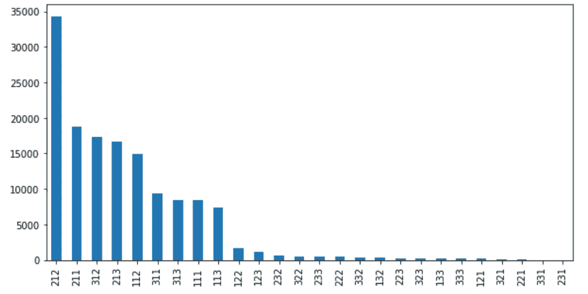
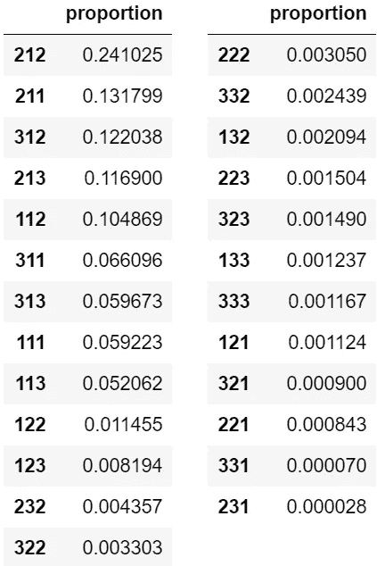

# 基于 Python 的客户细分 RFM 分析(二)

> 原文：<https://medium.com/analytics-vidhya/rfm-analysis-for-customer-segmentation-with-python-ii-cadaffbb5f64?source=collection_archive---------10----------------------->

在我之前的[文章](/analytics-vidhya/rfm-analysis-for-customer-segmentation-with-python-i-bb9ebadd0a96)中，我展示了我们如何使用 Python 一步步进行 RFM 分析。下面，我将分析一些有代表性的客户群的特点，并分别给出策略建议。

# 1.客户群

RFM 客户细分

客户细分比例

我们可以看到，客户并不是均匀分布在各个群体中的。相反，排名前九的细分市场约占客户群的 95%。我将深入研究三个有趣的细分市场:212(普通客户)、313(新的大买家)和 333(冠军)。

## 212(普通客户)

这些客户是最近购买的，消费还可以，但是购买频率比较低。上一次，我们已经使用随机森林分类器计算了 R、F 和 M 的重要性，我们知道在我们的例子中，货币价值和新近性比频率更重要。考虑到庞大的客户群，这个群体可能有很大的潜在价值，我们需要激励他们增加支出。例如，我们可以用特别折扣、免费送货或其他优惠来奖励他们。

## 313(新的大富豪)

这部分人是潜在的高价值客户。他们最近购买了高消费金额。只要我们增加他们的频率，他们就会成为忠诚度很高的最佳客户。我们可以用带有优惠券代码的个性化电子邮件来欢迎他们，以鼓励重复购买。我们还可以让这些客户加入奖励订单频率的忠诚度或会员计划。

## 333(冠军)

这是一个很小的群体，只有 0.12%的顾客属于这个细分市场。他们是高度参与的客户，在所有三个方面都表现最佳。我不会使用折扣定价来增加销售。相反，我们可以给他们优质和专属的优惠或服务，让他们感到受到重视和欣赏。我们还可以根据他们之前的购买情况向他们介绍和推荐新产品。我们在他们身上分配更多的资源是值得的，不仅因为他们有价值，而且他们可以帮助推广品牌。

# 2.RFM 分析的教训

当我们离散化数据并分配分数时，我们需要与运营团队交谈，以确保细分对他们有意义。比如，评分的尺度是什么，区分好客户和一般客户的规则是什么？

新近性、频率和货币价值的相对重要性对于不同的行业和公司是不同的。一般来说，对于耐用品，比如汽车和家电，R 和 M 会更重要。它影响我们对分析结果的解释，并进一步影响我们的客户管理策略。