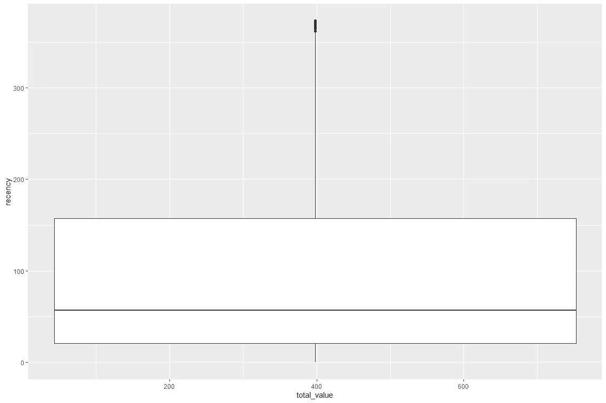
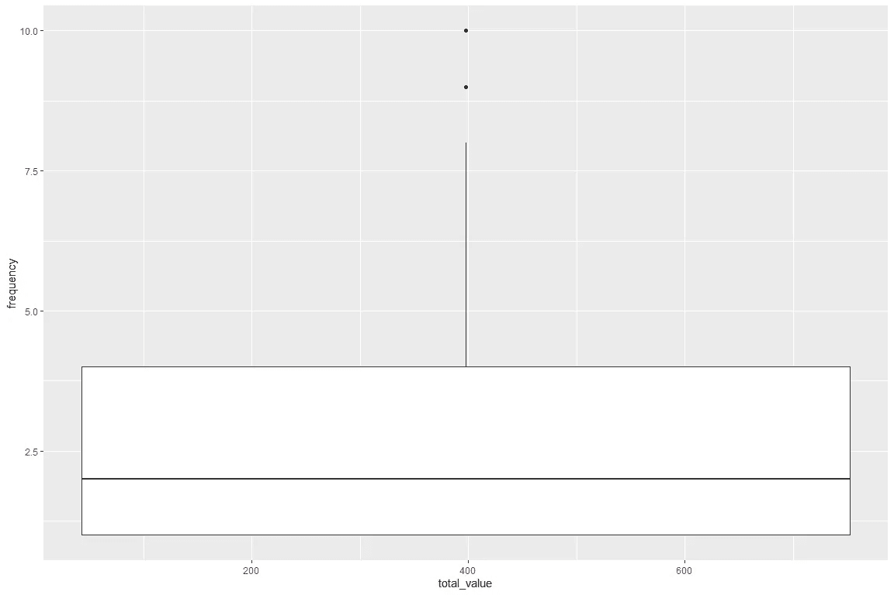
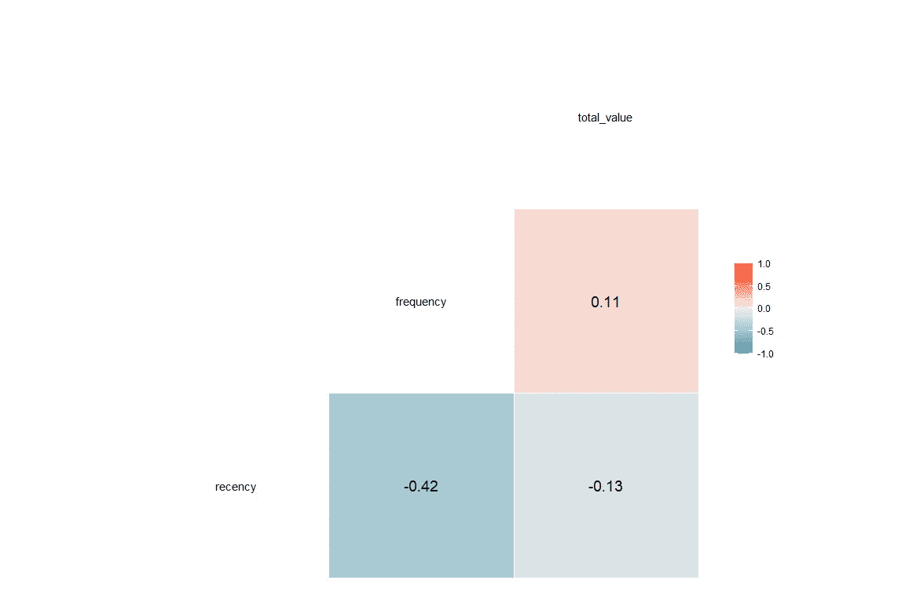
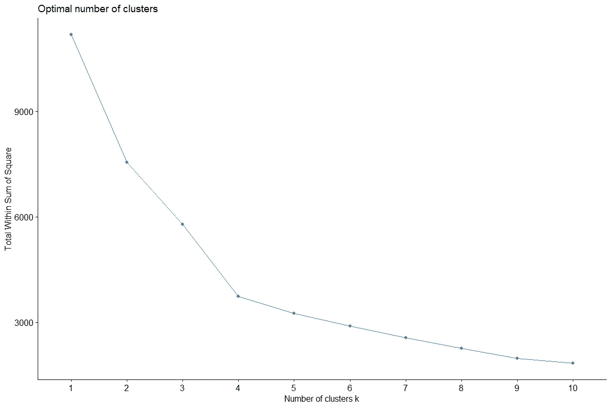
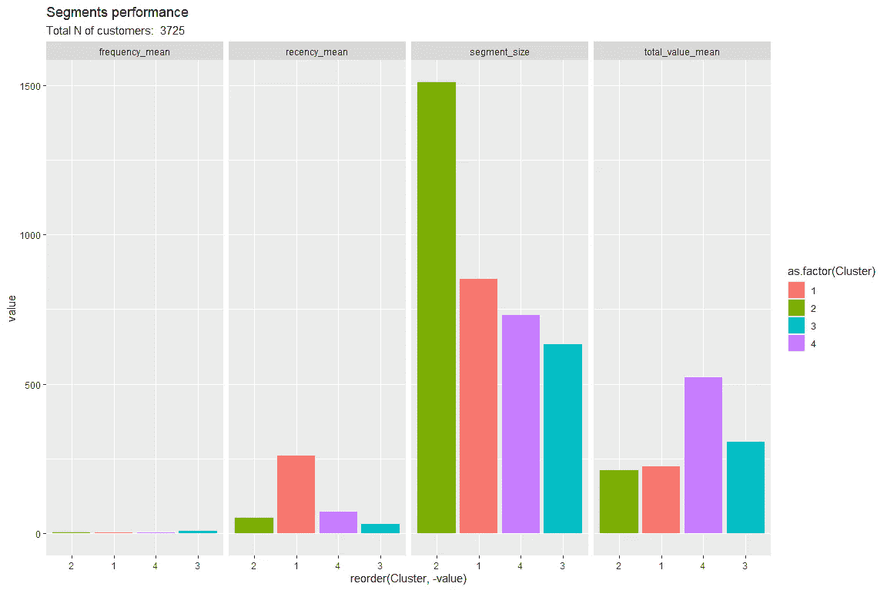
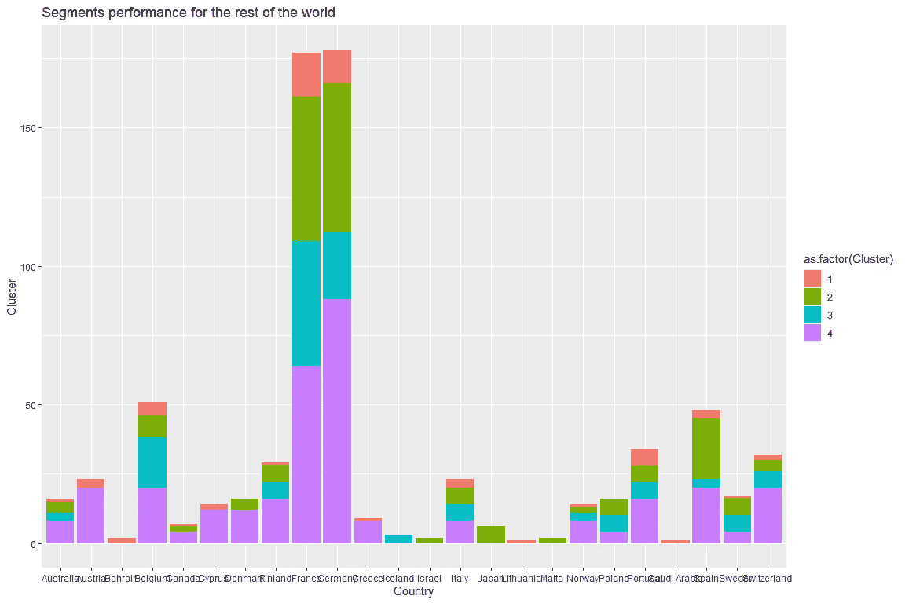
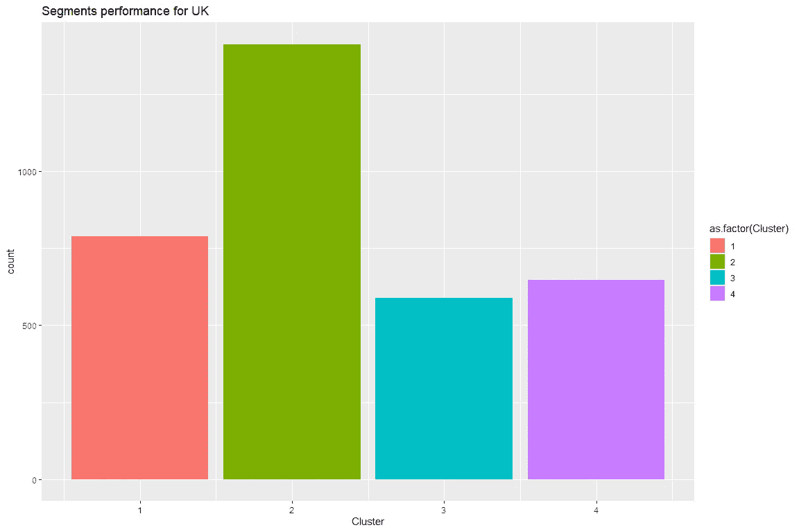
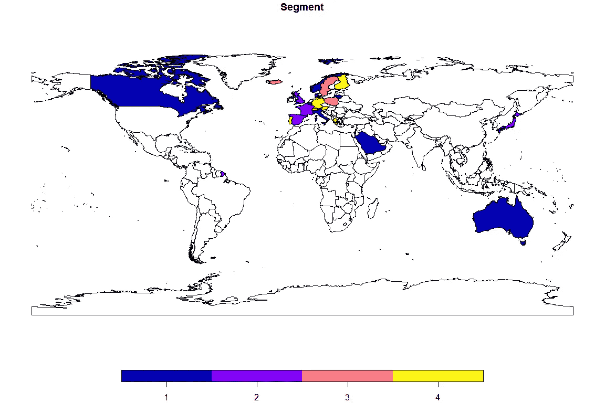

# 基于 K 均值的 RFM 客户细分

> 原文：<https://medium.com/analytics-vidhya/rfm-customer-segmentation-with-k-means-436894f2e5d1?source=collection_archive---------21----------------------->

## 个人客户的选择是 paramout

这篇文章是用 R Markdown 写的。你可以在这里找到**。多亏了平冈拓晃·尤塔尼的* [*杰作*](https://yutani.rbind.io/post/2017-10-26-post-to-medium/) *，这篇文章被直接从 R Markdown 转到 Medium。**

*这篇文章是一个更大的项目的一部分，这个项目是开发一个基本的营销分析堆栈。这个想法是为基于 ML 的市场分析建立一个可重用和可复制的模板栈。这里的模板是指流程逻辑、可重用的代码片段和模型适用的通用业务案例场景。*

*对于堆栈中的每个分析模型，都建议使用 Shiny 中的交互式应用程序。该应用程序的想法是作为一个可重复使用的模型演示框架。这将允许非技术用户获得对数据的直观理解，并直接在应用程序上玩不同的场景。此外，该应用程序将允许分析的自动化。这意味着当应用程序与数据源集成时，数据的每一个变化都会自动改变分析的输出数字。这将允许即时营销行动，如抓住时间敏感的促销机会。*

## *文章的结构:*

1.  *模型的业务目标；*
2.  *模型背后的算法；*
3.  *模型开发过程；*
4.  *进一步分析模型输出的想法。*

## *客户细分的业务目标*

***客户细分**帮助你了解如何、为什么以及何时购买/使用你的产品或服务。这些见解对于有效分配营销资源至关重要。*

***近期、频率和货币(RFM)** 客户细分为您提供了一个基本模型，根据客户的交易行为来分析客户——他们最近一次交易的时间、购买频率和花费金额。*

***RFM 客户细分**因此是防止客户流失、识别和利用追加销售和交叉销售机会的有效方法。*

## *为什么 K-均值聚类*

***K 表示**是无监督算法，可能是聚类使用最多的算法。K-Means 的一个主要优点是，与分层聚类方法相比，它可以处理更大的数据集。*

*然而，K-Means 也有一些缺点。它对异常值很敏感。该模型基于测量数据集之间的距离。数据点越接近，就越相似。因此，在执行算法之前，需要对 K-Means [使用的数据进行缩放](/analytics-vidhya/why-is-scaling-required-in-knn-and-k-means-8129e4d88ed7)。*

## *为什么是 R*

*使用 R 的优势:*

*   *完善的分析包的可用性；*
*   *易于创建美丽的分层可视化；*
*   *通过交互式应用程序(闪亮的应用程序)轻松呈现 ML 模型*

## *模型开发过程*

*模型的开发过程有两个主要阶段:*

***数据准备***

1.  *数据准备*
2.  *特征工程*
3.  *工程数据集的汇总统计数据*

*   *去除异常值；*
*   *缩放数据*

1.  *定义变量之间的相关性。*

***车型开发***

1.  *k-均值模型开发*

*   *定义测量数据点之间距离的方法；*
*   *定义最佳聚类数；*
*   *建立集群；*
*   *想象集群。*

1.  *聚类分析和人物角色构建的想法*

*   *根据集群对业务的价值对集群进行分类；*
*   *提供每个国家最主要的集群的地理空间可视化*

## *数据准备*

*用于构建当前模型的数据是英国在线零售商过度使用的交易数据集，您可以在这里找到。我们将原始数据集与一个世界国家地理空间坐标表结合起来，以便能够在以后获得一些不错的地理空间可视化。这一阶段的主要目标是删除丢失的值，在必要时转换数据类型，并检查数据是否有任何差异。*

*清理完数据后，我们可以运行一些基本的统计数据来了解主要的数据特征及其分布。R summary()函数是实现这一目的的完美工具。数据集的统计数据为我们提供了两个主要的洞察数据的时间维度和交易值中存在一些差异的事实。*

*数据集的时间跨度约为一年:*

*   *maxDate = 2011–12–09*
*   *minDate = 2010–12–01*

*数据汇总显示，交易价值存在一些差异。有一些交易的产品总价为 0，产品数量为负。这意味着我们可能会处理退款和折扣。*

*我们在交易数据中处理退款和折扣的方式很大程度上取决于业务案例。我们是否对所有购买感兴趣，因为我们记录了与客户接触的频率。或者，我们只对货币化交易感兴趣，因为它增加了企业的实际净值。*

*出于当前分析的目的，我们将删除退款和折扣及其原始交易。这些可以在以后的细分级别进行分析。例如，哪个部门要求退款最多，或者哪个部门对促销最敏感。这种类型的分析不仅对产品和服务的开发，而且对细分市场的进一步剖析都是很有见地的*

## *特征工程*

*我们希望建立一个基于 RFM 的客户细分。因此，首先我们需要生成近期、频率和货币变量的值。我们可以使用下面的等式。*

***最近度** =数据集的最近日期减去每个客户购买的最大日期。我们获得的价值越低，客户购买的时间就越近*

***频率** =不同购买的次数。这里的值越高，客户与企业的互动就越频繁*

***货币** =每位顾客消费总额。这里的价值越高，客户对企业的价值就越大*

*这些变量连同客户 id 将构成我们集群的数据框架*

*正如我们前面提到的，K- Means 是根据数据点之间的距离计算的。这使得它对异常值的存在很敏感。运行数据集的汇总统计将帮助我们定义模型特征中是否存在任何极值。同样，最快的方法是使用 summary()函数。*

*汇总统计数据显示，我们在频率和货币变量中有异常值。为了得到正确的聚类，我们需要删除这些离群值。然而，我们不应该完全摆脱他们，因为他们是我们最有价值的客户。这些客户甚至可以被定义为我们的忠诚客户——高水平的互动和购买价值。我们可以将它们标记为单独的片段，并在分析片段时将它们带回来。*

*为了去除异常值，我们需要确定一个数值截止范围，以区分异常值和非异常值。为此，我们将使用 [1.5*iqr 规则](https://www.khanacademy.org/math/statistics-probability/summarizing-quantitative-data/box-whisker-plots/a/identifying-outliers-iqr-rule)。*

*我们可以通过首先找到分位数来计算四分位间距。这里，我们使用 quantile()函数来查找数据集的第 25 个和第 75 个百分点，并使用 IQR()函数来计算第 75 个和第 25 个百分点之间的差异。*

*然后，我们计算数据的范围上限和下限:*

***上位**<-Q3+1.5*iqr****下位****<-Q1-1.5*iqr*

*我们可以使用 subset()函数来应用 1.5*iqr 规则，并从数据集中移除异常值*

*现在，我们可以检查我们的值范围是否看起来分布更加均匀。使用箱线图可视化显示范围*

****

## *缩放(标准化)数据*

*下一步是将变量归一化到均值= 0，方差= 1 的状态。为此，我们将使用 R scale()函数。这一步很重要，因为我们希望 K-Means 算法在创建聚类时对变量进行同等加权。*

*现在，我们可以使用热图来确定变量之间是否存在任何相关性。这一步很重要，因为在建立模型时，任何强相关性都会导致偏差。*

**

*我们只有三个变量。其中只有近期和频率显示负相关。这种相关性实际上应该被解读为正的，正如我们已经提到的，最近值以相反的方式测量，例如，越低越好。*

*另一个观察结果是，交易越频繁，价值越高，这是有道理的。我们可以仔细看看这些相关性。*

****

*综上所述，事实证明，最近的交易越频繁，其价值也就越高。这已经是客户行为中的异常现象。这可能是由于一个非常成功的营销活动或某种季节性的业务或两者兼而有之。*

*由于数据集的截止日期在 12 月(圣诞节期间),越接近圣诞节，每个客户的订单越频繁。这已经暗示了业务中存在的季节性，因此，为了使我们的细分准确，我们需要至少 2 年的数据，例如 2 个购物季的数据。不幸的是，可用的数据集仅来自一年。然而，我们将坚持认为它只是算法工作方式的一个展示。*

## *构建 K 均值模型*

## *选择测量数据点之间距离的方法*

*K-means 的主要目的是将数据分组到相同的相似观测值集合中，以区别于其他相似观测值集合。通过计算数据点之间的距离来定义观察值之间的相似性和不相似性。有[种不同的方法](https://machinelearningmastery.com/distance-measures-for-machine-learning/)来测量数据点之间的距离。欧几里德方法是[与 K-means](https://stats.stackexchange.com/questions/81481/why-does-k-means-clustering-algorithm-use-only-euclidean-distance-metric)一起工作的唯一方法。因此，数据点之间的欧几里德距离将定义我们的聚类。*

## *定义聚类的数量*

*下一步是指定我们可以拆分数据的最佳集群数量。首先，我们可以尝试手动找到聚类的数量，以便对 K-Means 的工作方式有一个大致的了解。然后我们可以通过使用算法来自动化这个过程。对于手动计算，我们可以使用 kmeans()函数。让我们用从 2 到 8 的聚类来计算和可视化我们的选项。函数的“中心”部分定义了聚类的数量，而“开始”部分定义了在给定设置的情况下，为了找到最有凝聚力的聚类，数据将被重新排列的次数。这里我们将设置 nstar = 25。这意味着 R 将运行 25 个随机分配，并且将选择具有最低簇内变化的分配。*

**

*有不同的自动化方法来定义最佳集群数量。我们将比较两种方法的输出——肘部法和平均轮廓法。对于这两者，请使用 fviz _ nbcluster()函数。*

***肘方法** —该方法的基本思想是最小化总体组间变化，例如总体组内平方和。*

**

***平均轮廓法**——测量聚类的质量，即每个对象在其聚类中的位置*

**

*两种方法都表明最佳聚类数为 4。让我们在最终的 K 均值计算中应用这个结果。使用 set.seed()函数获得可重复的结果。请记住，从上面的 K 均值使用随机改组的观察，以获得最佳的集群分裂。*

*运行该算法后，我们得到了 4 个大小非常相似的簇，只有一个簇的大小是其余簇的两倍。在本文的剩余部分，我们将探讨进一步分析细分市场的一些想法*

## *细分分析*

*首先，我们可以获得一些描述细分市场规模的基本数据，以及它们在 RFM 模型中的得分方式。*

*我们可以通过分配给每个集群的观察数量来定义大小。而每个特征(新近性、频率和货币)的平均值将让我们知道哪些是我们表现最好和最差的部分。*

*我们可以通过使用 summarise _ all()函数运行聚类数据的汇总表来获得这些数字。该函数仅适用于数字数据。因此，在运行它之前，我们需要排除客户 id 列，因为它具有字符格式。在我们得到我们的汇总表后，我们将把它转置以便于可视化。*

*现在，我们可以可视化这些部分，以确定哪些是最有价值的，哪些是最没有价值的。这将使我们知道如何以及在哪里集中我们的营销努力。*

**

*从汇总统计的可视化中，我们可以得出结论，我们的**最活跃的**和最近的段是**段 3** 。*

***细分市场 1** 可以定义为完全**失效**，平均一次购买发生在近一年前。关于这个细分市场有趣的是，通过一次购买，它产生的价值大约是最活跃的细分市场 3 的一半。因此，努力重新吸引这部分人可能是值得的。*

*我们**最大的段**是段 **2** 。然而，由于平均只有 2 次购买，这一细分市场并不特别活跃。它的消费倾向也最低。这可能是季节性购物者。无论如何，这一部分代表了最大的客户群。尽管如此，它并不代表企业的最佳客户。我们需要更多地分析这一细分市场的人口统计和行为，以了解它是否有成为最佳细分市场的倾向，或者企业是否需要改变其产品或市场。*

*最后，**部门 4** 是我们创造价值的最佳部门。不幸的是，段 4 是我们**最小的段**。像细分市场 2 这样的细分市场需要更深入的分析，因为我们希望获得更多类似的客户。*

## *细分市场的地理概况*

*对细分市场的另一个有趣的分析是它们的地理分布。为了执行这种分析，我们需要将分段附加到初始数据框，并获取客户的地理属性。另外，不要忘记对原始数据集进行重复数据删除，只留下唯一的客户记录。*

*我们可以运行一些初步的柱状图，直观显示每个国家的细分市场表现。*

**

*我们可以看到，与其他国家相比，英国的客户数量高得不成比例。这是有意义的，因为数据集来自英国的在线零售商。我们将把英国与其他国家的细分市场分布分析分开，以清晰了解每个国家的细分市场表现。*

****

*我们最好的细分市场 4 在德国和法国有很好的代表性。在德国和一些有趣的国家，如奥地利、葡萄牙和瑞士，这是一个占主导地位的部分。*

*细分市场 2 在英国市场占据主导地位。这是我们最大的，但不是最好的部分。失效的段 1 也比我们的最佳段 4 具有更高的代表性。*

*最后，我们可以获得每个国家主要细分市场的地理空间表示。*

**

*该图清楚地展示了细分市场的优势。它可以是市场分析和业务绩效衡量的完美起点。这种类型的分析以及细分市场的人口统计特征将为企业生成足够的信息，以建立关于产品功能或营销传播所需改进的假设。*

*我们可以总结说，K-Means 聚类是一个很好的起点，可以用来了解客户群，改善营销沟通，最重要的是测试企业产品和服务的不同功能开发。*