# 稻田预测器

> 原文：<https://medium.com/analytics-vidhya/rice-field-predictor-727b03eeffee?source=collection_archive---------26----------------------->

## 用单炮多盒探测器预测板鱼湾集地区稻田位置

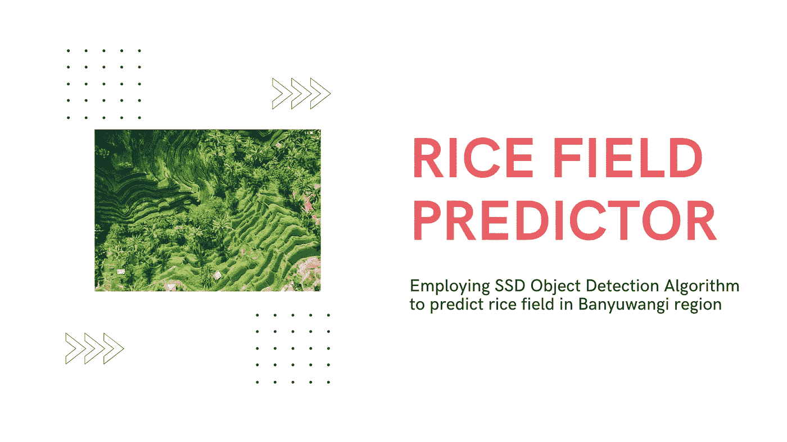

# 行动纲要

## 背景

稻田是印尼人的独特组成部分之一。印度尼西亚被广泛认为是一个农业国家，从很久以前起，这个部门就成为其人民最重要的经济基础之一。然而，在全球化和当前政府大规模开发的过程中，许多人，特别是那些居住在农村和远离城镇的人，开始失去他们自己的稻田，而这些稻田以前位于他们的房子前面。由于大规模开发的影响，这种情况会发生，允许建造高层建筑，如公寓、商场和其他精英住宅。对于村民和那些远离城镇的人来说，稻田是他们最宝贵的资产之一。除了他们的主要收入，他们还可以消费自己的收益，而不需要去中央市场。

根据各种来源的研究，稻田仍然是国家发展的最重要因素之一。如果我们看看印度尼西亚的发展议程，政府仍然把稻田作为大规模发展建筑和道路的重要重点之一。

现代城市被定义为仍然保留以绿地为主要特征的城市。其目的不仅是为了美化城市的外观，而且是为了减少空气污染，空气污染是由于城市居民使用他们自己的私家车或摩托车通勤到他们的办公室而产生的。稻田必须得到保护，以努力保持绿色面积，净化城市的空气，现在正变得日益黑暗。

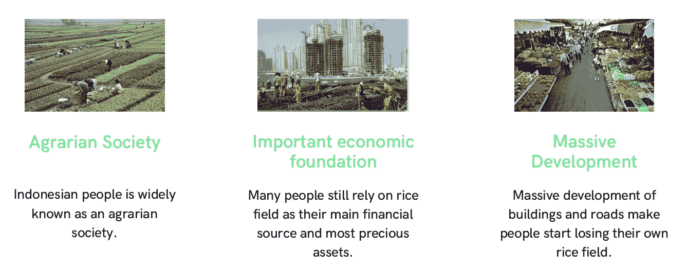

## 目的

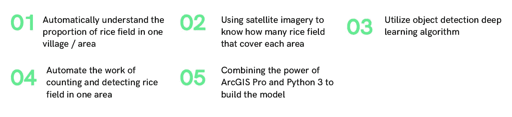

基于稻田对印度尼西亚人民的重要性，尤其是对那些生活在市中心的人们的重要性，快速了解稻田在一个区域中所占的比例变得非常重要，而不必手动计算它们并将测量员部署到田地中。这一目的可以通过利用现在向公众广泛开放的卫星图像来实现。当我们能够获得描绘一个地区的大范围卫星图像时，我们将更容易数字化每个地区覆盖的稻田数量。

传统的了解这些信息的方法是通过人工统计，其中一种方法是使用 ArcGIS Pro 软件逐个标注对象。但是这种方法非常耗时，尤其是在处理大数据集时效率非常低。为了解决这个问题，在这个项目中，我将利用对象检测深度学习算法来帮助我确定每个稻田的位置，而不用手动查找和计数它们。这种方法将节省一些时间，特别是当我们必须处理的位置有巨大和广泛的领域。通过使用深度神经网络自动检测对象，通过仅输入我们希望分析的区域，我们可以立即看到构成该特定区域的稻田、房屋、树木和道路的比例。我们还可以直接知道每个物体的尺寸和位置，而不需要手动计数。

在这个项目中，我从班玉旺吉的一个特定地点获取了单个数据，这个地点是我从[openaerialmap.com](https://openaerialmap.org/)获得的，对公众开放。该图像有 3 个 8 位像素深度的波段。选择该数据是因为该特定位置在将要被检测和分类的每个对象(稻田、房屋、树木和道路)之间具有平衡比例，使得该训练数据具有高度代表性，并且可以在部署该模型以检测另一位置和区域上的对象时使用。

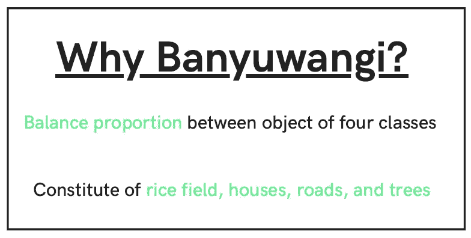

本项目的分析和建模工作是利用 ArcGIS Pro 和 Python 3 软件完成的。前者用于标记和获取训练数据样本，后者用于建立深度神经网络模型和进行简单分析。为了使模型结果在报表中可读，本项目使用了 Jupyter Notebook IDE。

此分析中使用的栅格地图如下所示。

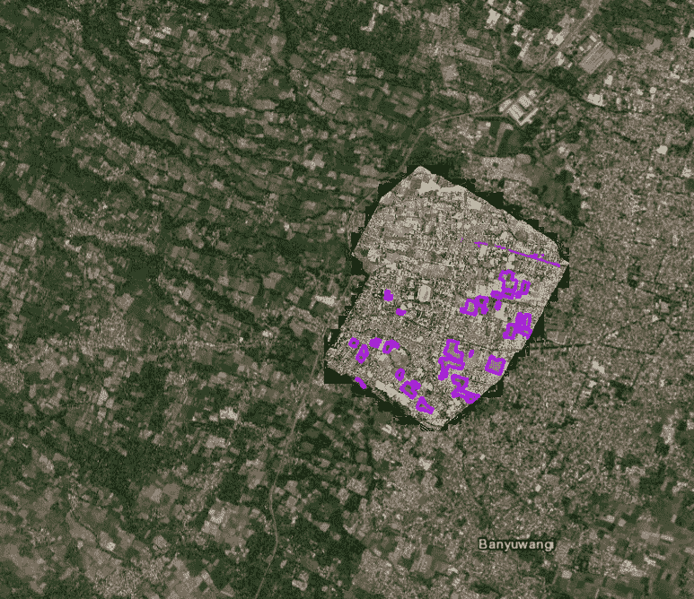

## 这是怎么做到的

深度学习在为决策者提供洞察力方面表现非常好的人工智能领域之一是计算机视觉，它被定义为计算机或机器看到的能力。这对于 GIS(地理信息系统)来说尤其有用，在 GIS 中，卫星图像和无人机现在被大量发布，使得用传统和旧的方法分析数据变得不可能。

目标检测和像素分类被认为是最重要的计算机视觉能力，并且对于空间分析也是有用的。深度学习对象检测算法要求我们以已经标记并馈入模型的一束图片的形式给出初始信息。接下来，模型将学习和训练标记的图像，并使用该图像建立模型，从而获得特定的准确性。然后，该模型将用于对其他卫星图像进行预测，因此它可以检测出哪些位置是稻田、房屋、道路或树木。

ArcGIS pro 软件具有“为深度学习标注对象”工具，该工具将简化我们在下一步中想要预测的对象样本的捕获过程。在这个项目中，我使用每一类稻田、树木、道路和房屋的样本数。样本是从本项目中使用的卫星图像的每个边缘随机采集的，因此它可以代表我们想要检测和预测的真实物体的形状。

所收集的样本并不多，这是因为 ArcGIS Pro 能够将所收集的对象加倍，因此模型可以利用足够数量的图像进行学习。收集到的大量数据将被导出到项目文件中的特定文件夹，然后在 Jupyter 笔记本中进行分析。用于确定模型的生产和部署是否可靠的参数是其精度，以及实际情况和预测之间是否存在明显差异。

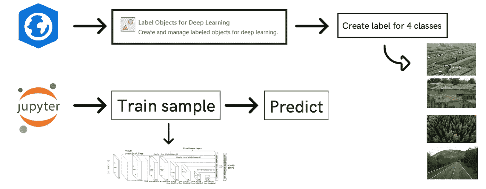

## 这个案例研究中我们想深入探究的问题

这项研究中有几个问题需要我们深入探究，包括:

1)正在分析的区域中稻田、房屋、道路和树木的比例如何

2)模型表现如何，准确度如何？

3)模型如何帮助决策者制定适当的政策？

4)拥有大面积的稻田意味着什么？

5)实现模型的高精度需要什么参数？

## 对读者/决策者的益处

这种分析将提供对特定位置中特定类对象的比例的洞察，在该项目中，该特定类对象更多地集中于稻田。知道比例后，就可以与前一年的比例进行比较，无论是否有相当大的差异。关于稻田，如果受发展的影响，稻田面积开始缩小，必须有一些固定政策。如果发展降低了人们使用自己的稻田在经济上独立的能力，就需要制定这样的政策。

这种分析也可以用来了解特定地区的住房状况，无论它是已经达到很好的比例还是高度密集。通过使用本项目中建立的模型，可以简化分析卫星图像的过程，以提取对决策者或企业主有用的信息。这个项目还显示了对象检测深度学习算法在处理各种数据方面的能力，特别是关于地理空间卫星图像。

# 工作流程

## 使用的方法

该项目利用 ArcGIS API for Python，特别是`arcgis.learn`模块，帮助在地理空间数据中创建深度学习和机器学习模型的工作流。在这个项目中，训练数据可以直接提供给深度神经网络模型，所以我们决定利用这个强大的模型。该模块采用深度学习主题中的最先进和最新的研究，例如使用卫星图像对预训练的模型进行微调，并且它还采用 fast.ai 框架来寻找合适的学习速率，以便可以更快地完成模型训练，而无需猜测需要设置的超参数。使用此模块的另一个原因是因为它与 ArcGIS 平台集成得非常好，导出训练数据非常简单。所建立的模型也可以直接用于在 ArcGIS pro 中检测其他图像中的对象。

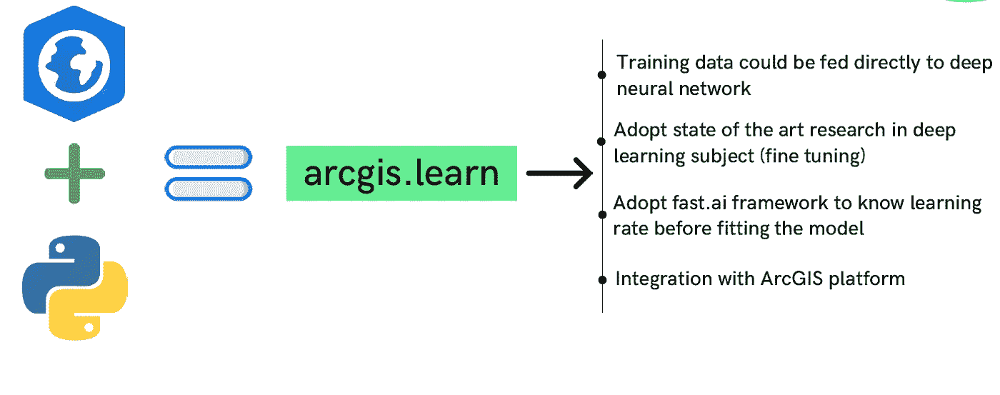

使用`arcgis.learn`完成该项目需要通过六个步骤，例如:

1)收集训练数据

2)准备数据

3)导出培训数据

4)训练模型

5)发布和部署模型

6)编写模型推理

## 收集培训数据

在建立模型之前需要做的第一件事是从将要分析的卫星图像中收集训练数据。本分析中使用的位置位于印度尼西亚东爪哇省的 Banyuwangi 地区。所使用的影像是从 openaerialmap 收集的栅格影像，openaerialmap 公开其数据。为了收集和标注这些图像中的对象，然后将其用作训练数据，我们使用 ArcGIS pro 中的深度学习工具标注对象。当我们用多边形指定对象时，我们自动得到图像的特征类，这样我们可以很容易地将它们以图像芯片的形式导出，这样就可以用它来建立模型。以下是需要完成的步骤:

1)用“为深度学习标记对象”工具标记对象

2)将数据作为图像芯片保存到文件夹中

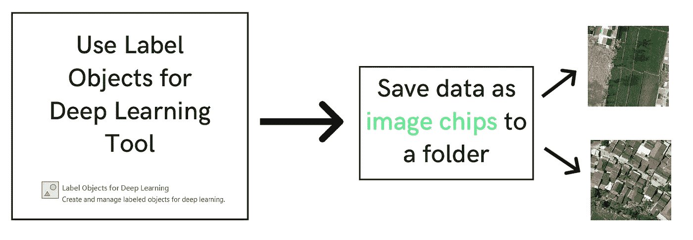

然后我们把这个区域的物体分成四类，分别是稻田、道路、房屋和树木。在每一类中，都有平衡数量的对象，以减少偏差，提高模型的准确性。然后导出该图像，以便能够在建模零件中使用。ArcGIS Pro 中的步骤如下所示。

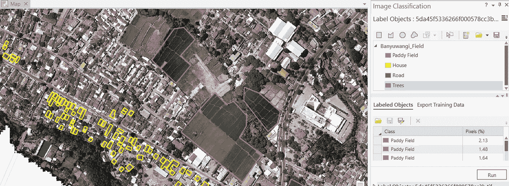

## 准备数据

数据准备也是数据收集的一部分。由于决定使用单镜头检测器对象检测算法，所收集的对象必须被包围在边界框内，以便算法可以读取这些图像。除此之外，边界框还必须包括栅格图层，其中包含有关像素和波段的所有信息。

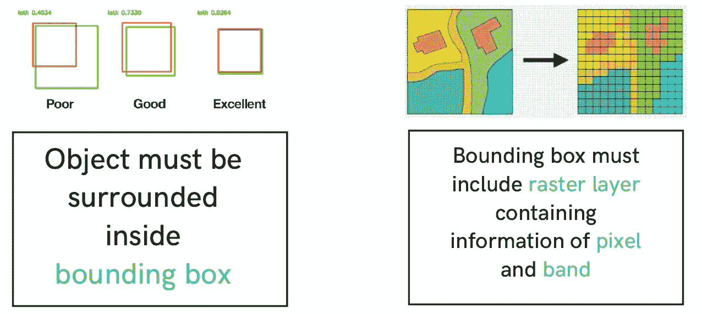

## 导出培训数据

在这个位置收集和标记每个类的对象后，我们可以立即以图像芯片的形式导出数据，其文件夹在上一步中已经可用。我们使用图像分类工具中的“导出训练数据”来帮助我们完成这一步。输出图像将具有 JPEG 格式，这样我们就可以在建模步骤中使用 jupyter notebook 访问它。成功收集的数据(金额)。我们使用 448 的瓦片大小，并且将元数据格式设置为与 SSD 对象检测算法兼容的 PASCAL 视觉对象类。下面是使用 ArcGIS pro 完成此步骤的过程。

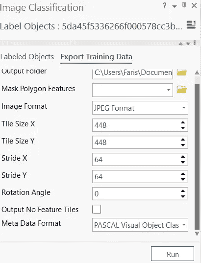

在下一步中，我们将使用这些数据进行建模。

## 训练模型

在这一步中，我们将使用这个库，如下所示。

```
import arcgis
from arcgis.learn import prepare_data, SingleShotDetector
```

## 数据准备

首先，我们使用`prepare_data()`方法准备数据，使其与模型要求的格式兼容。该方法中包括几个输入，例如 path、batch_size 和 chip_size。Path 是包含 JPEG 格式的图像芯片训练数据的文件夹位置，将出于建模目的访问这些数据。批量参数是每次迭代中用于训练神经网络的样本量。如果我们有 1000 个图像芯片形式的训练样本，并且批量大小为 100，则前 100 个样本将被馈送到神经网络。对于下一次迭代，将使用 100 个样本，以此类推。由于本项目中使用的机器的 GPU CUDA 的限制，项目的批量大小将设置为 8，以便模型可以无缝运行。Fir 芯片大小，我们可以使用类似的数字，因为我们出口的图像芯片。芯片大小是将用于模型训练的图像的大小。对于这个项目，我们设置图像大小为 448。下面是这一步的流程和工作流程。

```
# Prepare Data
data = prepare_data(path=r’imageChips6',
 chip_size=448, 
 batch_size=8)
```

## 可视化训练数据样本

为了获得关于将在对象检测模型中提供和使用的训练数据的完整图片，我们将使用`show_batch()`方法，该方法将随机显示和可视化我们在数据收集步骤中收集的具有边界框的训练数据。如果我们想用特定的格式可视化，我们可以用我们想要的格式设置行输入。

```
data.show_batch(rows=2, alpha=0.7)
```

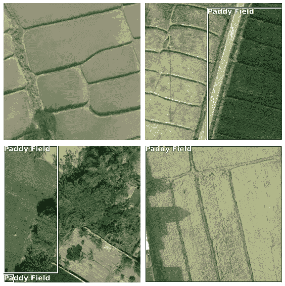

上面的图像显示了与我们收集的边界框相似的样本图像。然而，有几个位置不同于原始图像的附加图像。ArcGIS Pro 会自动对位置不同的影像进行加倍，以构建更精确的模型。

## 建立单次多探测器模型

由于本项目的主要目的是对稻田、房屋、树木和道路四类目标进行检测，我们将使用单镜头多检测器(SSD)算法，这种算法在目标检测工作中得到广泛应用。目标检测和图像分类的主要区别在于，虽然图像分类只预测特定图像上的目标，但目标检测远远超出了它，还具有检测目标位置的能力。此模型将产生的输出，例如:

1)图像中对象存在的概率

2)边界框的高度

3)边界框的宽度

4)包围盒中心点的水平坐标

5)包围盒中心点的纵坐标

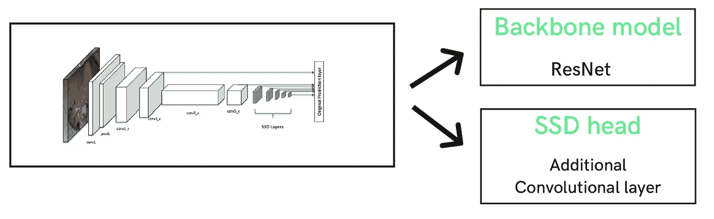

简单来说，SSD 有两个组成部分，即主干模型和 SSD 头。主干模型是预先训练好的图像分类网络，用于提取特征。主干模型采用迁移学习原理。它可以以类似 ResNet 的模型的形式表现出来，ResNet 已经使用图像网络数据集进行了训练，其中连接的分类层已经被移除。在它被移除后，我们有深度神经网络，它可以从我们提供给模型的新图像输入中提取特征。SSD head 是添加到 resnet 主干的一个或多个卷积层，其输出是我们分析的卫星图像中特定位置的包围盒和类对象。

下面是 SSD 算法的架构。

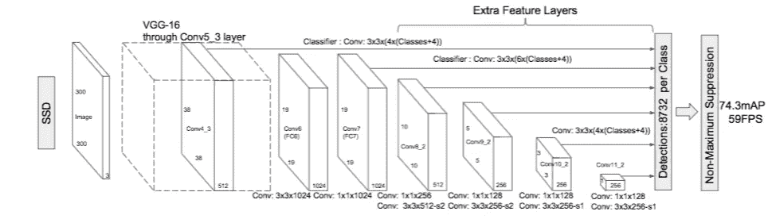

要实现和定义 SSD 模型算法，我们只需要用`arcgis.learn`模块写一行代码，用`SingleShotDetector()`作为方法。这种方法需要输入在前面步骤中已经转换和准备好的数据。我们还可以添加另一个输入，比如定义网格、缩放和比率。这三个输入基本上都是锚盒的格式，也就是这个模型的输出。

```
model = SingleShotDetector(data)
```

## 决定学习速度

深度学习模型优化中最重要的一步是超参数调整。在这一步中，我们将完成其中的一项任务，即确定并找到在模型训练中使用时更为优化的学习速率。学习率是超参数中最重要的参数之一，用于控制每次模型权值更新时模型应该做多少改变来解决错误。学习率太高将导致模型收敛不是最佳的，而学习率太低将减慢模型的收敛。在这一步中，我们将使用`lr_find()`方法找到最佳学习率，以确保模型足够健壮，可以生产和部署。

```
model.lr_find()
```

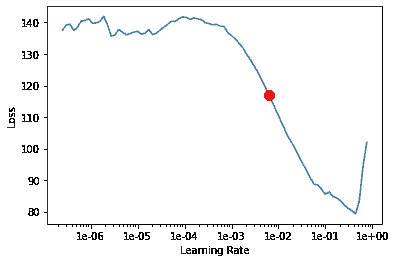

上述方法为模型提供了具有特定学习速率范围的小批量数据，同时在训练完成后记录每个学习速率下的损失。上面显示的结果是图表的形式，其中损失在 y 轴上绘制，学习率在 x 轴上绘制。根据上面的学习率图表，我们可以看到损失从学习率 0.006 开始下降。我们知道，在模型拟合步骤中，我们将用这些数字设置学习率。

## 用学习率和历元拟合模型

我们将使用`fit()`方法，并使用 30 个时期来拟合模型，这意味着我们将使用 30 次迭代来训练数据，以便我们可以获得稳健且准确的结果。学习率，如上所述，设定为 0.006。

```
model.fit(30, lr=0.006)
```

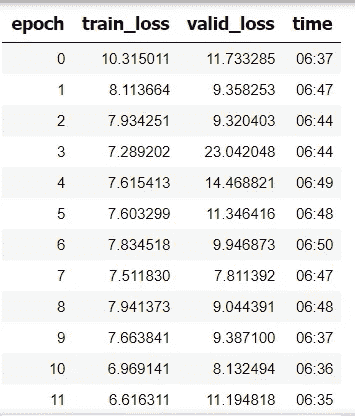

从上面的结果中，我们可以看到训练集和验证集丢失的变化。这有助于我们确定该模型在推广以前从未见过的数据方面有多成功，也有助于避免模型的过度拟合。可以看出，仅用 30 个历元，我们就可以得到合理的、令人满意的结果。模型拟合的损耗也绘制成图表，损耗为 y 轴，加工批次为 x 轴，如下所示。

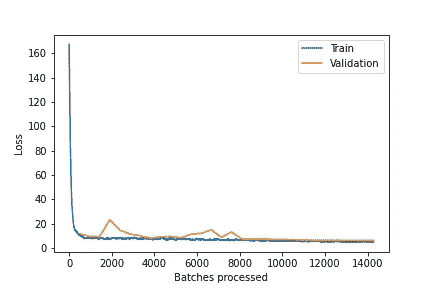

## 评估模型

为了测量对象检测模型的性能，我们使用并集交集(IoU)的概念。IoU 计算两个边界框的并集上的交集；地面真实的边界框和预测的边界框。IoU 为 1 意味着预测边界框和实际边界框完全重叠。

我们使用精度作为评估性能的指标。使用真阳性(TP)和假阳性(FP)来计算精确度和召回率。我们还需要考虑图像中模型检测到的每个对象的置信度得分。考虑置信度得分高于某个阈值的所有预测边界框。高于阈值的边界框被认为是正边界框，低于阈值的所有预测边界框被认为是负边界框。

精度是指你的模型在那些预测值中有多精确，有多少实际上是正的。

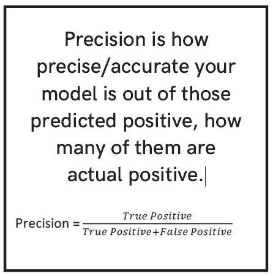

我们可以使用下面 argcis.learn 模块中包含的函数来测量该模型的平均精度分数:

```
**average_precision_score**(detect_thresh=0.2, iou_thresh=0.1, mean=False, show_progress=True)
```

下面是这个模型的每个类的精度分数:

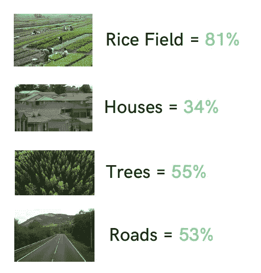

从上面的结果，我们可以推断两件事:

1.  由于收集了大量数据，稻田显示了相当不错的精度结果
2.  由于样本数据不足，其他类似乎缺乏精确性。

可以通过建立新的超参数来进一步改进，直到我们得到最完美的结果。然后这个模型将被保存在已经存在的文件夹 image chips 中。

## 保存模型

我们会将已经训练好的模型以深度学习包的形式保存(’)。dplk’)。深度学习包通常用作通用格式，因此我们可以在 ArcGIS 平台内部部署它。

我们将使用`save()`方法保存模型。模型将直接保存在包含训练数据的主文件夹中名为“模型”的子文件夹中。

```
model.save(‘paddy_detection’)
```

## 检测并可视化验证集中的五个类

在我们得到模型后，我们将把预测结果与地面实况一起展示，这样我们就可以了解我们的模型与地面实况相比表现如何，以及我们的模型在预测该位置的对象时有多准确。下面我们将创建一个 8 行图像的图，阈值为 0.3。物体存在的概率阈值。更高的阈值意味着更高的置信度。

```
model.show_results(rows=8, thresh=0.2)
```

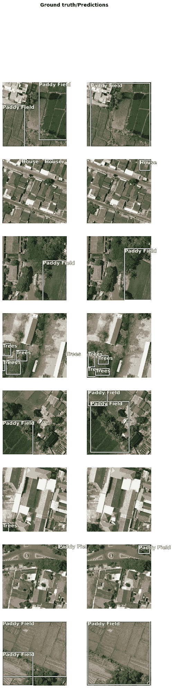

如上面图片子集所示，我们可以得出结论，与真实情况相比，我们的模型在预测对象方面表现良好。

# 结论


这个项目的主要目标是利用对象检测深度学习算法，能够对稻田和其他三类(房屋、道路和树木)的存在和位置做出准确的预测。这个项目可以通过建立模型来实现上述目标，该模型具有相当好的准确性，并且可以在与地面真实情况进行比较时以最小的误差来检测物体。虽然总是可以通过调整几个超参数来进行改进以增加模型的准确性，但是如果提供来自不同位置的不同图像，该模型足以能够进行预测。然而，在完成这个项目的过程中，我们遇到了一些错误，尤其是在部署阶段。因此，我们无法提供其他地图的可视化效果来检测我们已标记的对象。通过轻微的修复，我希望错误将被修复，我们可以在这个笔记本上看到结果。

该分析的结果及其模型可被政策制定者或商业实体用来创建他们自己的政策或商业策略，该政策或商业策略关于如何使用稻田的位置信息来做出更好的提议并在不牺牲自然和绿色区域的情况下平衡社会福利。

在 LinkedIn 上找到我:

[](https://www.linkedin.com/in/faris-dzikrur-rahman-077a70172/) [## Faris Dzikrur Rahman -印度尼西亚万丹省|职业简介| LinkedIn

### MBA 毕业生，对数据科学和商业分析有浓厚的兴趣。舒适地使用 R 和中的数据…

www.linkedin.com](https://www.linkedin.com/in/faris-dzikrur-rahman-077a70172/)