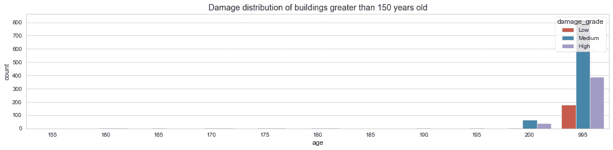
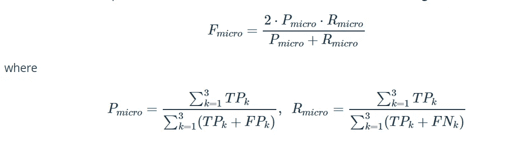

# 里希特预测器:模拟地震破坏

> 原文：<https://medium.com/analytics-vidhya/richters-predictor-modeling-earthquake-damage-b44e3dbdaef?source=collection_archive---------11----------------------->

使用数据科学模拟地震后建筑物损坏的严重程度

图片来源 [CircleOfBlue](https://www.circleofblue.org/)

在当今世界，使用数据科学来帮助解决身份问题和业务问题无论怎样强调都不为过。对于源于社会、健康和环境挑战等的问题，数据科学可以帮助确定这些问题的严重性及其影响，并提供可能的解决方案。

最近成为持续关注话题的许多问题之一是如何调查地震后建筑物的震害。因此，我们决定围绕这个问题进行研究，有趣的是，我是在由[驱动数据](https://www.drivendata.org/about/)主办的持续竞争中遇到这个问题的，这是一个将数据科学和众包方面的前沿实践带到世界上最大的一些社会挑战和组织的平台。

**案例分析**

随着大地震的发生，人们进行了大量的建筑物破坏现场调查，由于建筑物数量巨大且种类繁多，调查每一个震后受影响的建筑物成为一项艰巨的任务。然而，对建筑物进行一定程度的描述可以帮助我们确定对建筑物造成的损害程度。

**关于项目**

图片来源:[浮雕网](https://reliefweb.int/)

在 2015 年 4 月 25 日发生 7.8 兆瓦的廓尔喀地震后，尼泊尔利用移动技术开展了大规模的家庭调查，以评估受地震影响地区的建筑损坏情况。虽然这项调查的主要目标是确定有资格获得政府住房重建援助的受益人，但它也收集了其他有用的普查级社会经济信息。

**目标**

提出一种新的描述建筑物损坏严重程度的方法，以帮助调查人员对建筑物的损坏程度进行分类，而不会产生明显的误差

给出的案例解决方案将遵循 CRISP-DM 方法，包括:

1.  商业理解
2.  数据理解
3.  数据准备和分析
4.  数据建模/验证
5.  结果
6.  部署

**业务理解**

基于建筑物的位置和结构，我们的目标是预测 2015 年尼泊尔廓尔喀地震对建筑物造成的破坏程度。

**数据理解**

这些数据是通过加德满都生活实验室和 T2 中央统计局的调查收集的，中央统计局隶属于尼泊尔国家计划委员会秘书处。

该数据集主要包括关于建筑物结构及其合法所有权的信息。数据集中的每一行都代表该地区遭受廓尔喀地震袭击的特定建筑。

建筑数据头

该数据集中有 39 列，其中 building_id 列是唯一的随机标识符。

**数据准备&分析**

*   数据准备

首先，让我们从 with target 变量开始；损坏等级，它是一个顺序变量，即 1、2、3，一(1)代表低损坏，二(2)代表中等损坏，三(3)代表地震中建筑物几乎完全损坏。

我使用了一个映射函数将每一项映射到一个分类名称，以使它适合于分析

目标变量

其次，我检查数据集是否包含重复值和缺失值，它不包含空值和重复值

缺失值和重复值

探索性数据分析

此阶段包括探索数据以收集对模型有用的见解，从而从数据中学习以帮助改进模型的性能。

单变量分析

首先，让我们看看目标/因变量的分布，损伤等级，

目标可变伤害

从上表可以看出，约 56.89%的建筑物受损等级为中等严重程度，其次为高严重程度(33.47%)和低严重程度(9.64%)。这意味着尼泊尔大多数建筑在地震后都受到了中度和高度的破坏，只有少数建筑受到了低度的破坏

现在我们进一步研究因变量和自变量之间的关系

我们首先检查损坏等级和建筑物所在的地理区域之间的关系。

建筑物的损坏等级和地理区域

综上所述，我们从地理等级一(1)的建筑开始，似乎该地理区域中的大多数建筑具有较低的损坏等级，大约 75%的建筑位于地理等级 9 至 26，位于地理等级二的建筑具有与地理等级一相似的较低的损坏等级，大约 75%的建筑位于地理等级 200 及以上。最后，地理等级 3 中的建筑在所有地理等级中都有相似的损坏等级。

接下来，我们将探讨建筑中不同楼层的损坏等级

楼层数

从上图中，我们观察到两层楼的建筑物具有显著的损坏等级，其次是三层楼和一层楼的建筑物。我们还观察到，两层楼的建筑具有中等损坏等级，然后是高损坏等级，这也反映在三层楼和一层楼的建筑中。

接下来，我们来看看楼龄和损坏等级之间的关系

年龄和损坏等级

上图中值得注意的一个重要观察结果显示，楼龄小于 50 年的建筑主要受损等级为中等，0 至 20 年楼龄的建筑受损程度显著增加，从 25 年楼龄到 45 年楼龄的建筑受损程度稳步下降。另一个有趣的观察结果是，100 年楼龄和 150 年楼龄的建筑受损等级也有所增加，严重程度为中等。这意味着年龄是决定建筑物受损程度的主要因素

接下来，我们来看看标准化面积和建筑高度之间的关系

标准化建筑面积和高度百分比

以上图表说明了建筑面积和高度上的破坏等级分布。我们在这里可以看到大部分的伤害等级都是低伤害等级和高伤害等级

接下来，我们来看看数据集中损害等级和其他分类变量之间的关系

**引人注目的见解**

1.  从建筑物的地表状况来看，类型`T`对建筑物损坏的严重程度有重大影响
2.  查看基础类型，我们可以观察到值为`R` 的地板类型对建筑物损坏的严重程度有显著影响
3.  另外`F`类型的底层类型对建筑的破坏程度有很大的影响

正如我们所看到的，这里的许多发现都是观察性的，这表明它们将在构建我们的模型时产生重大影响

**数据建模**

该阶段包括用所有列出的特征训练机器学习模型，以对目标变量`Damage_Grade`进行预测。鉴于该项目的目标是预测 2015 年尼泊尔廓尔喀地震对建筑物造成的损坏程度，我们选择了损坏等级作为目标特征

为了衡量我们算法的性能，我们将使用 **F1 分数**，它平衡了分类器的[精度和召回](https://en.wikipedia.org/wiki/Precision_and_recall)。传统上，F1 分数用于评估二元分类器的性能，但由于我们有三个可能的标签，我们将使用一个称为**微平均 F1 分数**的变量。

宏观 F1 分数

在对数据进行模型拟合之前，对数据进行了必要的特征转换，包括以下内容，但并不详尽:

1.  特征标准化
2.  从分类特征中获取虚拟变量
3.  删除功能等。

数据建模包括以下阶段:

*   将我们的数据集分为训练集和测试集，用于选择基线模型
*   用合成少数过采样方法进行交叉验证

F1 _ 微分数

综上所述，在尝试了不同的算法以及综合少数过采样方法并执行交叉验证后，模型平均值似乎是相同的，然后我继续随机选择一个算法作为我们的基线模型，即 XGBoost

*   选择基线模型

*   最后，我们为模型的简单工作流程建立了一个管道

**部署**

机器学习或数据科学解决方案的部署可以从 web 应用程序、移动应用程序、以数据可视化形式为利益相关者讲述故事，或者为经理或上级提供技术报告，因此部署将取决于如何利用它。

比赛所需的部署&这个项目是用博客或文章讲故事的形式。未来可能会考虑 web 应用程序，并进一步分析以发现对训练机器学习模型有用的见解，从而提高模型在预测未知未来数据方面的当前性能。

谢谢你的时间

请不要忘记鼓掌。

要了解更多关于这个分析的内容，请点击这里[查看我的 Github 链接](https://github.com/Fiyinfoluwa6/Richter-s-Predictor-Modeling-Earthquake-Damage)

在 [*推特*](https://twitter.com/Sketchey1) 上与我联系

在 [*linkedin*](https://www.linkedin.com/in/favour-oyelami-29b607a1/) 上与我联系