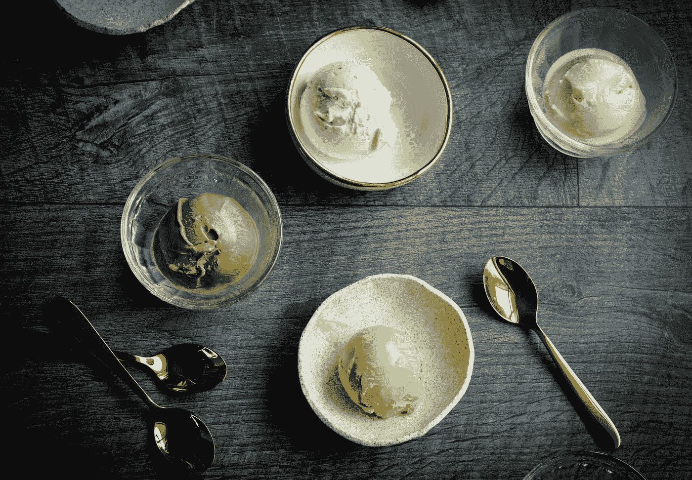

# 岭回归，记忆 vs 理解&冰淇淋！

> 原文：<https://medium.com/analytics-vidhya/ridge-regression-memory-vs-understanding-ice-cream-c5c6f13585aa?source=collection_archive---------14----------------------->

## 了解岭在线性回归方法生态系统中的位置

在 [Unsplash](https://unsplash.com?utm_source=medium&utm_medium=referral) 上[米歇尔·曾](https://unsplash.com/@petitesweetsnz?utm_source=medium&utm_medium=referral)的照片

新的，创新的和闪闪发光的磁铁关注。

> AI？RNNs？NLP？

每个人都知道更多的缩写意味着更多的价值。尤其是在统计学/机器学习/数据领域…