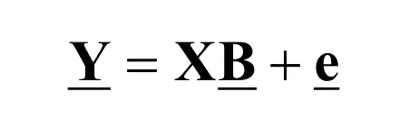
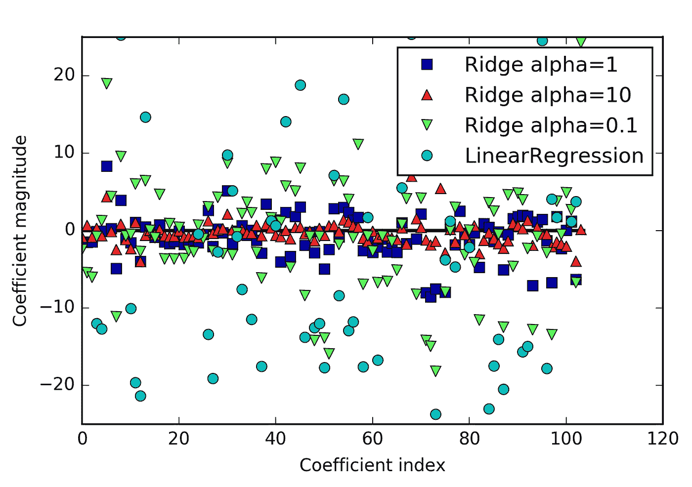
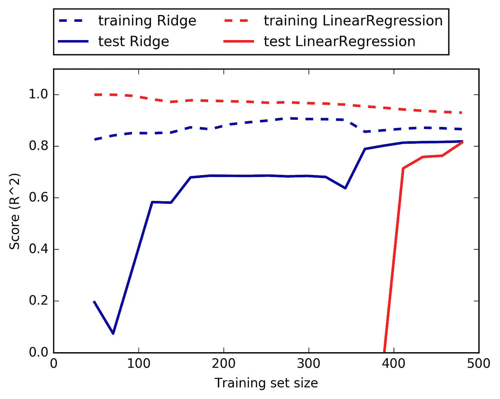

# Pyhton 多重共线性岭回归

> 原文：<https://medium.com/analytics-vidhya/ridge-regression-with-multicollinearity-in-pyhton-c8f6f3385e4c?source=collection_archive---------0----------------------->


**定义岭回归**

R idge 回归是一种用于分析多重回归数据的技术，该数据存在多重共线性，岭回归使用的特殊类型被称为 L2 正则化。在岭回归中，惩罚是系数的平方和。L2 正则化又名岭正则化-这在模型中添加了正则化项，它是参数系数平方的函数。参数的系数可以接近零，但永远不会变为零，因此。

**多重共线性**

多重共线性是指独立变量之间存在近似线性的关系。

**多重共线性的影响**

多重共线性会产生不准确的回归系数估计值，增大
回归系数的标准误差，缩小回归系数的部分 t 检验，给出错误的、不显著的 p 值，并降低模型的可预测性(这只是开始)。

**多重共线性的来源**

要处理多重共线性，您必须能够识别其来源。多重共线性的来源会影响线性模型的分析、校正和解释。有五个来源(详见 Montgomery [1982]:

1.  数据收集。在这种情况下，数据是从独立
    变量的狭窄子空间中收集的。多重共线性是由抽样方法创建的-它不存在于
    总体中。在扩大的范围内获得更多的数据可以解决多重共线性问题。最极端的例子是当你试图用一条线来拟合一个点的时候。
2.  线性模型或总体的物理约束。无论使用何种取样技术，多重共线性的来源都将存在。许多制造或服务流程对
    独立变量(就其范围而言)有物理、政治或法律上的限制，这将产生
    多重共线性。
3.  过度定义的模型。这里，变量比观察值多。这种情况应该避免。
4.  型号选择或规格。多重共线性的来源是使用独立变量
    ,这些变量是一组原始变量的幂或相互作用。需要注意的是，如果独立变量的采样
    子空间很窄，那么这些变量的任何组合都会进一步增加多重共线性问题。
5.  离群值。X 空间中的极值或异常值会导致多重共线性，也会隐藏多重共线性。我们称之为
    这种离群值导致的多重共线性。这应该通过在应用岭
    回归之前移除异常值来校正

**多重共线性检测**

检测多重共线性有几种方法。我们举几个例子。

1.  从研究独立变量对的成对散点图开始，寻找近乎完美的关系。也可以看一下相关性矩阵，了解高相关性。不幸的是，当一次考虑两个变量时，多重共线性并不总是出现。
2.  考虑方差通货膨胀因素(VIF)。波动率指数超过 10 表示共线变量。
3.  自变量的相关矩阵的特征值接近零表示多重共线性。不要看特征值的数值大小，使用条件数。大条件表示多重共线性。
4.  调查回归系数的符号。回归系数符号与预期相反的变量可能表示多重共线性。

**多重共线性校正**

根据多重共线性的来源，解决方案会有所不同。如果多重共线性是由数据收集产生的，则在更宽的 X 子空间上收集额外的数据。如果线性模型的选择增加了多重共线性，请使用变量选择技术简化模型。如果一个或两个观察值导致了多重共线性，则删除这些观察值。最重要的是，一开始就要小心选择变量。当这些步骤不可行时，您可以尝试岭回归。

**岭回归模型** 按照通常的符号，假设我们的回归方程以矩阵形式写成



其中 **Y** 为因变量， **X** 代表自变量， **B** 为待估计的回归系数， **e** 代表误差为残差。

转到岭回归

```
import mglearn
from sklearn.model_selection import train_test_split
X, y = mglearn.datasets.load_extended_boston()
X_train, X_test, y_train, y_test = train_test_split(X, y, random_state=0)
```

出局:

训练集得分:0.89
测试集得分:0.75

岭是一个更受限制的模型，所以这个模型过拟合。不太复杂的模型意味着在训练集上的较差性能，但如果模型过于复杂，这是不好的，因为可能会过度拟合。用户可以使用 alpha 参数来指定模型对简单性与训练集性能的重视程度。在前面的例子中，我们使用默认参数 alpha=1.0。尽管如此，没有理由说这会给我们最好的权衡。
alpha 的最佳设置取决于我们使用的特定数据集。
增加 alpha 迫使系数更趋向于零，这降低了训练集的性能，但可能有助于泛化。例如:

```
ridge10 = Ridge(alpha=10).fit(X_train, y_train)print("Training set score: {:.2f}".format(ridge10.score(X_train, y_train)))print("Test set score: {:.2f}".format(ridge10.score(X_test, y_test)))
```

**出局:**

训练集得分:0.79
测试集得分:0.64

减小 alpha 值可以减少系数的限制。对于非常小的α值，系数几乎不受任何限制

```
ridge01 = Ridge(alpha=0.1).fit(X_train, y_train)print("Training set score: {:.2f}".format(ridge01.score(X_train, y_train)))print("Test set score: {:.2f}".format(ridge01.score(X_test, y_test)))
```

**出局:**

训练集得分:0.93
测试集得分:0.77

通过检查具有不同 alpha 值的模型的 coef_ attribute，我们可以更定性地了解 alpha 参数如何改变模型。更高的 alpha 意味着更受限制的模型，因此我们期望 coef_ 的条目对于高 alpha 值比对于低 alpha 值具有更小的量值。为了便于比较，我们使用线性回归。这在图中得到证实:

```
from sklearn.linear_model import LinearRegression
lr = LinearRegression().fit(X_train, y_train)import matplotlib.pyplot as pltplt.plot(ridge.coef_, 's', label="Ridge alpha=1")
plt.plot(ridge10.coef_, '^', label="Ridge alpha=10")
plt.plot(ridge01.coef_, 'v', label="Ridge alpha=0.1")
plt.plot(lr.coef_, 'o', label="LinearRegression")plt.xlabel("Coefficient index")
plt.ylabel("Coefficient magnitude")
plt.hlines(0, 0, len(lr.coef_))
plt.ylim(-25, 25)
plt.legend()
```

**出局:**



用不同的α和线性回归的
值比较岭回归的系数大小

这里，x 轴枚举 coef_ : x=0 表示与第一个特征相关的系数，x=1 表示与第二个特征相关的系数，以此类推，直到 x=100。y 轴显示系数的相应值的数值。这里的主要要点是，对于 alpha=10，系数大多在–3 和 3 之间。α= 1 的脊模型的系数稍大。对应于 alpha=0.1 的点仍然具有较大的量值，并且对应于没有任何正则化的线性回归(alpha=0)的许多点非常大，以至于它们在图表之外。

理解正则化影响的另一种方法是固定 alpha 值，但改变可用的训练数据量。对于图 2，我们对波士顿住房数据集进行了二次抽样，并对规模不断增加的子集评估了线性回归和岭(alpha=1)(显示模型性能作为数据集规模的函数的图称为学习曲线):

```
mglearn.plots.plot_ridge_n_samples()
```



图二。波士顿
住房数据集的岭回归和线性回归的学习曲线

正如所料，对于所有数据集大小，无论是岭回归还是线性回归，训练分数都高于测试分数。因为岭是正则化的，所以岭的训练分低于全线线性回归的训练分。然而，岭的测试分数更好，特别是对于小的数据子集。对于少于 400 个数据点，线性回归不能学习任何东西。随着越来越多的数据可供模型使用，两个模型都得到了改进，最终线性回归赶上了岭回归。这里的教训是，有了足够的训练数据，正则化就变得不那么重要了，给定足够的数据，岭和线性回归就会有相同的性能(在这里使用完整数据集时出现这种情况只是偶然的)。图 2 的另一个有趣的方面是线性回归的训练性能下降。如果添加了更多的数据，模型就更难适应或记忆数据。

## 目标= RSS + α *(系数的平方和)

这里，α (alpha)是平衡最小化 RSS 和最小化系数平方和的强调量的参数。α可以取不同的值:

1.  **α = 0:**

目标变得与简单线性回归相同。

我们将得到与简单线性回归相同的系数。

**2。α = ∞:**

系数将为零。为什么？因为系数平方的权重是无限的，所以任何小于零的值都会使目标无限。

**3。0 < α < ∞:**

α的大小将决定给予目标不同部分的权重。

对于简单的线性回归，系数将介于 0 和 1 之间。

我希望这能对α如何影响系数的大小有所帮助。有一点是肯定的，任何非零值给出的值都小于简单线性回归的值。差多少？我们很快就会知道了。把数学细节留到后面，让我们看看岭回归在上述相同问题上的作用。

## 目标= RSS + α *(系数的平方和)

这里，α (alpha)是平衡最小化 RSS 和最小化系数平方和的强调量的参数。α可以取不同的值:

1.  **α = 0:**

*   目标变得与简单线性回归相同。
*   我们将得到与简单线性回归相同的系数。

1.  **α = ∞:**

*   系数将为零。为什么？因为系数平方的权重是无限的，所以任何小于零的值都会使目标无限。

1.  **0 < α < ∞:**

*   α的大小将决定给予目标不同部分的权重。
*   对于简单的线性回归，系数将介于 0 和 1 之间。

我希望这能对α如何影响系数的大小有所帮助。有一点是肯定的，任何非零值给出的值都小于简单线性回归的值。差多少？我们很快就会知道了。把数学细节留到后面，让我们看看岭回归在上述相同问题上的作用。

## 目标= RSS + α *(系数的平方和)

这里，α (alpha)是平衡最小化 RSS 和最小化系数平方和的强调量的参数。α可以取不同的值:

1.  **α = 0:**

*   目标变得与简单线性回归相同。
*   我们将得到与简单线性回归相同的系数。

1.  **α = ∞:**

*   系数将为零。为什么？因为系数平方的权重是无限的，所以任何小于零的值都会使目标无限。

1.  **0 < α < ∞:**

*   α的大小将决定给予目标不同部分的权重。
*   对于简单的线性回归，系数将介于 0 和 1 之间。

我希望这能对α如何影响系数的大小有所帮助。有一点是肯定的，任何非零值给出的值都小于简单线性回归的值。差多少？我们很快就会知道了。把数学细节留到后面，让我们看看岭回归在上述相同问题上的作用。

希望这能有用，别忘了鼓掌，不懂的请评论

参考

安德烈亚斯·穆勒和萨拉·圭多。2017.pyhton 机器学习简介

NCSS 统计软件第 335 章，岭回归