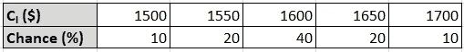
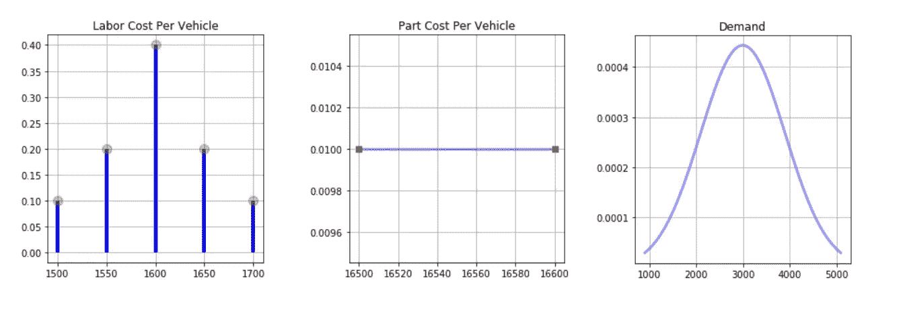
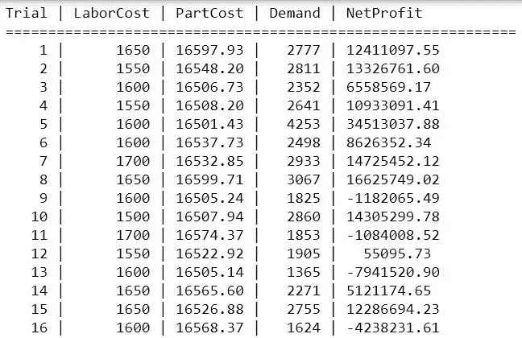
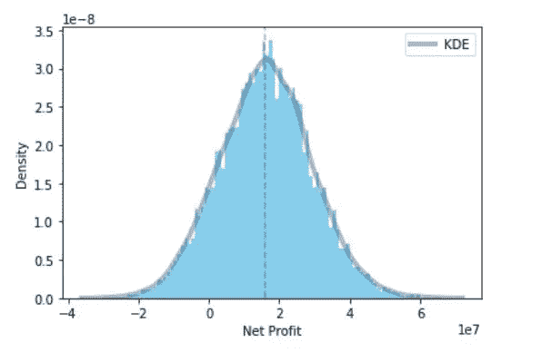

# 使用蒙特卡罗模拟的风险分析

> 原文：<https://medium.com/analytics-vidhya/risk-analysis-using-monte-carlo-simulation-e35bf047fa20?source=collection_archive---------3----------------------->

## 了解如何使用蒙特卡罗模拟建立风险分析模型

澳门图片社在 [Unsplash](https://unsplash.com/s/photos/casino?utm_source=unsplash&utm_medium=referral&utm_content=creditCopyText) 拍摄的照片

首先，我们将看看什么是蒙特卡罗模拟，然后它是如何工作的？此外，我们将使用蒙特卡罗模拟和 Python 编程实现风险分析模型。

## 介绍

蒙特卡罗模拟是一种广泛使用的问题解决技术，通过使用随机抽样运行多个试验(称为模拟)来近似目标变量或某些结果的概率。它生成您的决策的可能结果，并评估风险的影响，允许在不确定性、模糊性和可变性下进行更好的定量风险分析和决策。

它在商业、金融、项目管理、气象、制造、工程、研发、保险、石油和天然气、运输、天文学和环境等广泛不同的领域有着广泛的潜在应用。

> 这被称为蒙特卡洛近似法，以欧洲一座以豪华赌场闻名的城市命名。蒙特卡罗技术最初是在统计物理领域开发的，特别是在原子弹的开发过程中，但现在也广泛用于统计和机器学习。——第 52 页，[机器学习:概率观点，2012 年](https://amzn.to/3a33knp)。

如果用于试验的随机样本是独立且同分布的，那么它将实现目标变量的更精确的近似期望量或值。通过试验或模拟的次数，我们可以控制正在逼近的所需量的精度。如果我们将进行大量的试验，那么期望的数量将接近期望值，或者将趋向于变得更接近期望值。

## 工作/算法

按照以下步骤建立蒙特卡洛模拟模型:

第一步:首先我们找出问题陈述中确定和不确定的因素。

步骤 2:对于模型的每个不确定因素或参数/特征，我们计算概率分布。

步骤 3:从相应的计算概率分布中为每个不确定因素生成随机数，以用于模型实现。

步骤 4:使用生成的不确定因素的随机值进行试验以计算所需的数量。

第五步:我们多次重复第二步和第三步来模拟模型，这将产生大量独立的值，每个值代表模型的一个可能的结果。

第六步:在完成所有试验后，我们将所有试验的结果组合成可能结果的概率分布。因此，模型的输出是期望量的概率分布。

## 风险分析

在 [Unsplash](https://unsplash.com?utm_source=medium&utm_medium=referral) 上由 [Carlos Muza](https://unsplash.com/@kmuza?utm_source=medium&utm_medium=referral) 拍摄的照片

风险分析是分析师用来研究给定行动过程的潜在不确定性并评估组织内发生负面事件或风险的可能性的过程或技术。组织中可能会出现许多风险，如安全漏洞、基础设施故障和财务损失等。为了减轻和避免所有这些风险，有必要进行风险分析。

风险分析大致分为两种类型，即“定量风险分析”和“定性风险分析”。在本文中，我们将讨论和实现定量风险分析。使用模拟或确定性统计建立定量风险分析模型，其中我们将大范围的可能随机数值分配给风险的不确定因素，以计算所有可能结果的概率分布。

让我们来看看使用蒙特卡罗模拟和 Python 编程实现“定量风险分析”模型。

假设梅赛德斯-奔驰(汽车公司)正在制造一款名为梅赛德斯-奔驰 890M 的新车。该公司希望通过考虑以下参数/因素来预测这款新车的第一年利润:

1.  每辆车的售价是 32，800 美元
2.  第一年的生产和公司管理费用，cₚ是 2800 万美元
3.  每辆车的劳动力成本，cₗ

4.每辆车的零件成本，cₚₐ在 16500 美元到 16600 美元之间。

5.第一年的平均需求可能是 3000，偏差为 900。

注意:上面提到的数据只是为了解释本文而虚构的。

使用蒙特卡洛模拟来预测期望的数量(即第一年的利润)，我们将按照本文上面提到的工作步骤来模拟它。

第一步:在这个问题中，“每辆车的售价”和“第一年的产量和企业管理费用”是确定的因素，其余的因素是不确定的。

第二步:计算不确定因素的概率分布(即每辆车的劳动力成本、每辆车的零件成本和第一年的需求)。

不确定因素的概率分布

第三步:从计算出的概率分布和期望数量的结果中随机产生的不确定因素的值(即净利润)。

模拟过程中少量试验的结果

第四步:执行 10，000 次模拟后所需数量(即净利润)的概率分布。净利润的均值和标准差分别为 16088549 和 13103153。

期望数量(即净利润)的概率分布

***结论:*** 我们学习了蒙特卡洛模拟法，并计算了制造新车净利润的概率分布。此外，如果你想在这方面获得更多的经验，你可以尝试执行蒙特卡罗模拟的其他场景，如蒙蒂霍尔问题，近似圆周率的值。

请参考下面的 Python 模拟代码链接。

【GitHub 回购链接:[https://github.com/bilalsp/Quantitative-Risk-Analysis](https://github.com/bilalsp/Quantitative-Risk-Analysis)