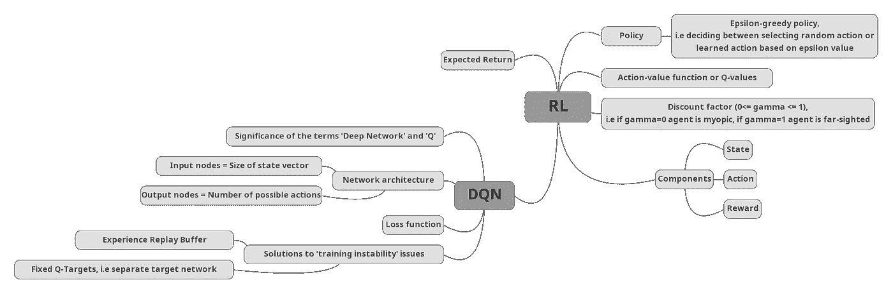
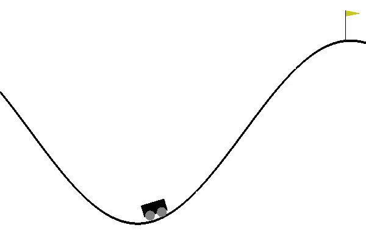
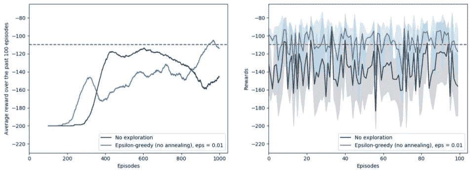
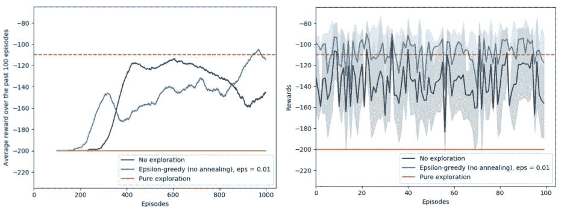
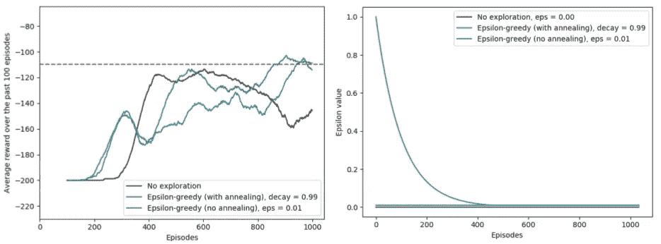
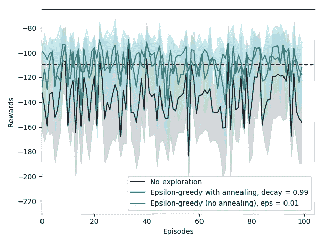
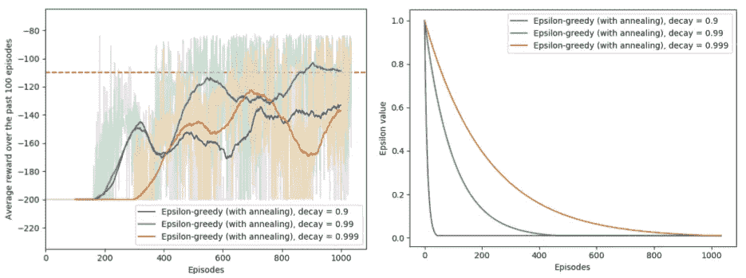
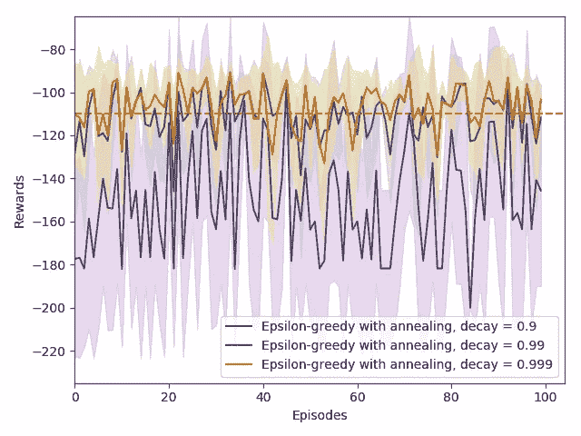

# RL 系列#3:探索还是不探索，这是个问题

> 原文：<https://medium.com/analytics-vidhya/rl-series-3-to-explore-or-not-to-explore-1ff88e4bf5af?source=collection_archive---------8----------------------->

## 理解 RL 中的探索-开发困境

Javier Allegue Barros 在 [Unsplash](https://unsplash.com?utm_source=medium&utm_medium=referral) 上拍摄的照片

***2020 年 9 月 21 日更新:*** 亲爱的读者朋友们，我很高兴地宣布，我已经转移到我自己的平台上，在那里我继续撰写与 AI 相关的主题，特别是 RL。如果你想阅读更多我的内容，请查看[https://www . saashan air . com/blog/](https://www.saashanair.com/blog/)。期待在那里见到你。🙃

***注 1:*** *这篇博文的 PyTorch 实现可以在* [*Github*](https://github.com/saashanair/rl-series/tree/master/dqn) 上找到

***注 2:*** *本帖是一个系列的一部分，第一帖可以在这里找到***。*😄*

*亲爱的读者，希望你一切都好。抱歉，过去两周我擅离职守。我想念你们💙，希望你也想我了(没有？一点也不？😢).不管怎样，我已经完成了硕士论文的最后陈述，然后还要处理重新安置的事情。但是，现在一切都解决了，我又回来发了另一篇与 RL 相关的帖子。所以让我们重新开始吧！你准备好接受另一剂 RL 内容了吗？*

# *DQN 概述*

**

*思维导图显示了到目前为止已经涉及的主题/想法(使用[https://www.mindmup.com](https://www.mindmup.com)创建)*

*在[上一篇](/@saasha/rl-series-2-dqn-e739eb3ab1d1)文章中，我们探讨了行动价值函数的含义，即 Q 值、预期收益和贝尔曼方程，以及它们在 DQN 的意义。我们还讨论了 DQN 的各种训练不稳定性问题，并使用经验重放缓冲区和固定 Q 目标来解决它们。*

*我们还简要地谈到了使用 epsilon 让代理人决定是采取随机行动还是使用神经网络建议的行动决策。然而，我们就此打住，因为这个议题需要进一步讨论，这将导致远离 DQN 议题。因此，在这篇文章中，让我们努力澄清ε值在 DQN 算法中的作用，以及为什么需要它。*

# ***好吧，那么告诉我，**为什么在 RL 代理的培训中我们需要 epsilon？*

*在 DQN，ε值是一个超参数，在探索环境和利用学到的知识之间进行权衡。它允许我们控制代理在执行随机动作时要花费多少时间，以便了解更多关于其运行环境的信息。在上一篇文章中，我们设置了 *ϵ=0.05* ，这实质上意味着在训练期间，代理花费 5%的时间探索环境，试图找到完成给定任务的最佳行动路线。*

# *但是，究竟什么是勘探开发困境呢？*

*好了，我们用一个例子来对题目有一个直观的理解。为了配合我最近的搬迁，让我们考虑一下在新的街区找一家餐馆的问题(当然，在整个 COVID 情况解决之后，呆在室内，孩子们！👩‍💻).*

**

*照片由[安娜·帕斯卡尔](https://unsplash.com/@annapascale?utm_source=medium&utm_medium=referral)在 [Unsplash](https://unsplash.com?utm_source=medium&utm_medium=referral) 拍摄*

*我首先在谷歌地图上搜索可用选项，找到了我附近的三家餐厅，分别是檀道里宫、四川宫和暹罗宫(哈哈，我几乎能听到谢尔顿在检查伦纳德点的菜是否正确😋).在这一点上，由于我没有在这三个地方吃过饭，所以我对它们都没有偏好。*

*在我寻找附近最好的餐馆的第一天，我随便挑了一家，在坦杜里宫吃了一顿(嗯，事后看来，也许这是我的印度基因😋).那里的 naan 和 paneer tikka masala 绝对好吃，这使得我对 Tandoori Palace 的偏好比其他两个选项都高。*

*第二天，我仍然太累了，因为所有的包装和拆包，并决定再次外出就餐。我现在面临着一个两难的选择——一方面，我知道我喜欢 Tandoori Palace 的食物，因此知道在那里吃饭的结果，另一方面，我可以抓住机会，在名单上的其他地方尝试食物。换句话说，我可以利用我学到的偏好或者探索我的选择。而这恰恰就是*‘探索-开采困境’*！*

# *嗯，我想我明白了。但是你能给这些条款一个正式的解释吗？*

*正如理查德·萨顿和安德鲁·巴尔托在他们的书《强化学习导论》(第 3 页)中描述的那样，*

> *“为了获得大量的奖励，强化学习代理必须更喜欢它在过去已经尝试过并发现能有效产生奖励的动作。但是为了发现这样的行为，它必须尝试以前没有选择过的行为。为了获得回报，代理人必须利用它已经经历过的事情，但是为了在未来做出更好的行动选择，它也必须探索。进退两难的是，无论是探索还是开采，都不可能不失败就完全成功。代理人必须尝试各种行动，并逐渐倾向于那些看起来最好的行动。”*

# *这很有道理，但是你能用 DQN 给出一个更具体的例子吗？*

*回到我们上次的 DQN 实现，我们使用 *ϵ* 来迫使代理在一定时间内采取随机行动，而在其他时间选择具有最高 q 值的行动。这种方法被称为'*ϵ*-贪婪的探索'。这是一个无方向探索策略的例子，因为探索阶段的行为都是随机选择的。*

**

*图 1:来自 Gym 的 MountainCar-v0 环境的截图，其中的任务是训练一个代理人驾驶一辆动力不足的车辆上山到达黄旗*

*代理需要执行的探索量在很大程度上取决于它执行的环境和它必须完成的任务。一些环境可能需要大量的探索，而另一些环境可能不需要什么探索就能学会。*

*在这篇文章中，来自 LunarLander 环境的图形没有强调探索的需要，因此为了更清楚地理解这个主题，我们将使用*‘mountain car-v 0’*环境。和 LunarLander 一样，这也是一个健身房环境。如图 1 所示，任务是让一辆动力不足的汽车到达山顶，用黄色旗子标记(环境的详细说明可以在[这里](https://github.com/openai/gym/wiki/MountainCar-v0)找到)。*

**

*图 2:在登山车环境中，比较无探索与ε值为 0.01 的ε贪婪探索对训练(左)和测试(右)的影响的图表。当汽车在过去的 100 集里获得平均分数-110 时(用红色虚线表示)，任务就完成了。*

*在 MountainCar 环境中应用前一篇文章中的相同 DQN 代码，让我们运行一些实验来研究ε值的影响。设置 *ϵ = 0.0* 会导致代理不选择任何随机动作，这意味着代理永远不会进入探索阶段。从图 2 中的黑线可以看出，尽管代理在这种情况下能够学到一些东西，但它执行得不是很好。通过设置 *ϵ = 0.01* 来增加一点探索，导致代理花费 1%的训练时间来尝试可能有助于提高其性能的随机动作。花费在探索上的时间显然是有用的，并且可以通过观察图 2 中的蓝线来记录。*

# *等等，你是说花在探索上的时间只有 1%能改善结果？那么纯粹的探索肯定会更好吗？*

*我明白你的想法。如果代理花费 100%的时间探索，它将能够尝试更多的选项，并使用获得的知识来改进自己。但这种推理并不完全正确。😅*

*让我们退一步，想想如何在附近找到最好的餐馆。假设现在，由于超市通常提供外卖和沙拉吧，谷歌地图甚至在我的推荐列表中列出了超市。如果我花时间逛超市，我就不会明智地利用我的时间，因为超市的食物不能被归类为“小吃店”。*

*类似地，当代理使用纯探索策略时，它可能会浪费时间和资源去探索环境中与当前任务不相关的部分。这又会导致代理不能很好地执行分配的任务，如图 3 中的黄线所示。*

**

*图 3:展示训练(左)和测试(右)期间在登山车环境中纯粹探索的效果的图表。当汽车在过去的 100 集里获得平均分数-110 时(用红色虚线表示)，任务就完成了。*

# *那么，有没有其他策略可以迫使智能体探索它的环境呢？*

*当然，肯定有。事实上，这是一个积极研究的领域，已经投入了大量的努力。不过在这篇文章中，我们将仅限于*ϵ*——贪婪策略。*

*我们之前研究的*ϵ*-贪婪策略可以使用退火进行扩展，其中 *ϵ* 值随着时间进行退火/减少，通常从最大值 1.0 到最小值 0.05 或 0.01，之后在最小值的剩余训练周期中保持恒定。*

*使用退火和*ϵ*-贪婪策略背后的直觉是，当代理人不确定任何决策时，它允许在开始时进行更多的探索。但是随着时间的推移，随着代理获得对环境的良好观察并从其经验中学习，花费在探索上的时间逐渐减少。*

**注意:在下面的图表中，我们使用了 eps_max=1.0 和 eps_min=0.01。**

**

*图 4:指示在登山车环境中训练期间使用具有ε贪婪探索的退火的效果(左)和ε值随时间的变化(右)的图。*

*从图 4 可以看出，在训练期间(左)，退火的使用使得代理探索环境。一旦ε值退火到最小值，代理就能够从其早期的经验中吸取经验，从而使其性能提高得更快。在当前设置下，两种*ϵ*-贪婪方法，即退火和不退火，在测试环境中表现出几乎相似的性能，如图 5 所示。*

**

*图 5:表示在登山车环境中测试期间用ε-greedy 退火的效果的图。当汽车在过去的 100 集里获得平均分数-110 时(用红色虚线表示)，任务就完成了。*

# *太酷了。改变ε的退火速率怎么样？这会影响性能吗？*

*如果你对这个问题的回答是，“是的！”，那么亲爱的读者，为你迄今为止所付出的关注而鼓掌吧！😄*

**

*图 6:左图显示了在山地车环境中训练期间不同的退火速率如何影响学习。较暗的线条描绘了代理在过去 100 集内的平均报酬，而背景中较浅颜色的线条描绘了每个代理在一段时间内获得的原始分数。右图显示了每种药物在训练期间遇到的相应ε衰变。*

*按照图 6 中的图表，当ε值退火太快时，网络没有足够的机会“到处晃悠”,并且必须非常快速地移动到一种状态，在该状态下，它预期在大多数时间利用它的学习。结果，代理无法找到执行任务的最佳策略，这可以通过观察图 7 中的图表来确认。*

*相比之下，当ε值退火缓慢时，代理可以在开始时花费大量时间尝试主要是随机的动作，同时随着ε值逐渐减小而向手头的特定任务前进。这导致网络学习速度变慢。然而，从图 7 中的图表可以看出，具有较慢衰减ε的代理能够更好地利用初始“忙碌”期。该代理的行为可能会提出为什么纯探索代理(来自图 3)表现不佳的问题。两者之间的主要区别在于，在慢退火场景中，随着ε值的减小，代理花费越来越多的时间专注于特定任务，另一方面，纯探索代理仅执行均匀随机的动作，因此不专注于特定任务的细节。*

**

*图 7:研究在登山车环境中测试期间不同ε退火速率对试剂性能的影响。*

*如果你想在使用不同的衰减率时可视化ε值如何衰减，你可能会发现[这个工具](https://observablehq.com/@katnoria/visualising-epsilon-decay)很有用。😄*

# *那么接下来呢？*

*这篇文章的主要观点应该是，对于一个 RL 代理来说，在探索和开发之间找到平衡是很重要的。然而，就像深度学习中的其他事情一样，实现这一点的确切技术和要设置的超参数值在很大程度上取决于手头的任务和相关环境。*

*所以亲爱的读者，你本周的任务是使用你的 DQN 代码(来自上周)并在使用一系列ε值、衰变率和环境时试验学习率。*

*此外，如果这个话题激起了你的兴趣，你想知道更多关于**地区**的公开问题，请查看[这个列表](https://sites.google.com/view/erl-2018/open-problems?authuser=0)。*

> ****我希望对 RL 中“探索-开发困境”的探索证明是富有成效的，并且你可以在你自己的项目中利用这些知识*** *(好了，坏的双关语说够了，我相信你一周已经听够了😅)* ***。期待您在评论区的回复，或者如果您愿意，也可以发电子邮件至***[***saasha.allthingsai@gmail.com***](mailto: saasha.allthingsai@gmail.com)***！😁****

*下一篇文章再见，注意安全！🦠*

# *旁白:这篇文章对测试情节进行了更深入的研究*

*亲爱的读者，如果你想知道为什么这篇文章中的测试图看起来是这样的，那么这一部分就是为你准备的。😊*

*一般来说，强化学习和深度学习都具有随机性，这可能会对可重复性产生破坏性影响，也使得跨模型比较性能变得困难。因此，为了解决这个问题，建议使用种子值作为一种良好的做法。因此，大多数 RL 算法在测试模式下使用一系列不同的种子运行多次，以确保它们确实工作，并且它们的成功不仅仅是环境或网络中的一些随机设置的因素。*

*本文中的所有测试都是用一组 5 个预定义的种子进行的。为了在图中描绘这些结果，计算每个时间步的 5 次运行的平均值，并绘制为黑线，而平均值趋势周围的浅色带表示每个时间步的标准偏差。*

# *参考*

1.  *[强化学习中探索策略的调查](https://www.cs.mcgill.ca/~cs526/roger.pdf)，罗杰·麦克法拉尼*
2.  *[强化学习:介绍](http://incompleteideas.net/book/the-book.html)(第 3 页)，理查德·萨顿和安德鲁·巴尔托*
3.  *[使用 DQN](https://beta.vu.nl/nl/Images/stageverslag-elfrink_tcm235-895011.pdf) 的勘探方法的性能，蒂姆·埃尔福林克(硕士论文)*