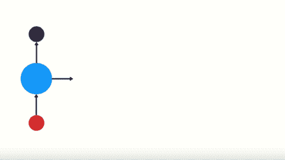
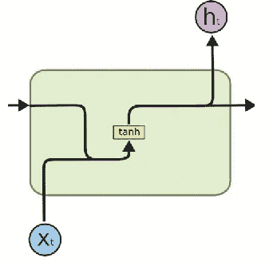
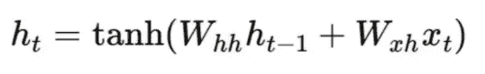
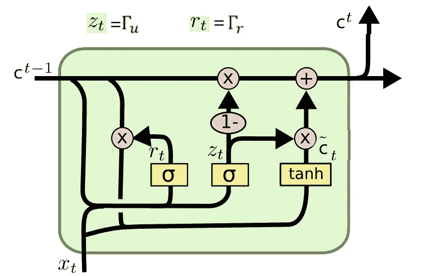
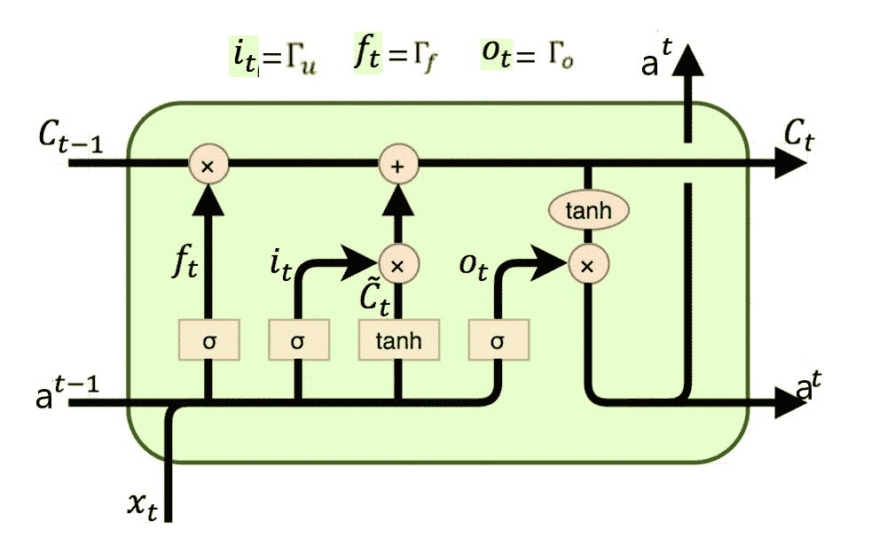
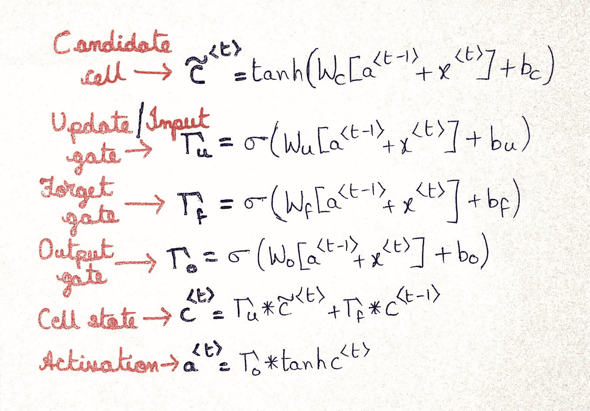
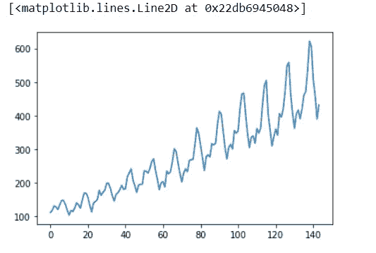
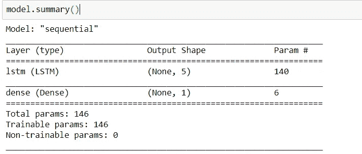
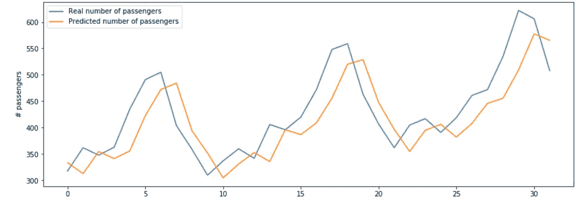

# RNN 对 GRU 对 LSTM

> 原文：<https://medium.com/analytics-vidhya/rnn-vs-gru-vs-lstm-863b0b7b1573?source=collection_archive---------0----------------------->

在这篇文章中，我将让你先了解 RNN、GRU 和 LSTM 的理论，然后我将向你展示如何用代码实现和使用它们。

已经有很多关于这些话题的帖子了。但是在这篇文章中，我想借助代码提供更好的理解和比较。

让我们从 RNN 开始吧！

## **递归神经网络**

递归神经网络(RNN)设计用于处理序列数据。顺序数据(可以是时间序列)可以是文本、音频、视频等形式。

RNN 使用序列中先前的信息来产生当前的输出。为了更好地理解这一点，我举了一个例句。

> “我的班是最好的班。”

**当时( *T0 )*** *，*第一步就是把*我的*这个词馈入网络。RNN 产生一个输出。

**当时( *T1 )*** *，*然后在下一步我们输入单词*“class”*和上一步的激活值。现在 RNN 有了“我的 T21”和“阶级”这两个词的信息。

这个过程一直持续到句子中的所有单词都被输入。你可以看下面的动画来形象化理解。



RNN 的工作流程。

在**最后一步**，RNN 具有关于所有先前单词的信息。

> ***注意:*** *在 RNN* 层中所有节点的权重和偏差都是相同的。

让我们看看 RNN 单元的架构。它接受上一步的输入和当前输入。这里 *tanh* 是激活功能，代替 *tanh* 你也可以使用其他激活功能。



RNN 基础建筑

**💡** RNN 面临短期记忆问题。这是由于消失梯度问题造成的。随着 RNN 处理的步骤越来越多，它比其他神经网络架构更容易遭受消失梯度的影响。

**问:什么是消失渐变问题？**

**答:**在 RNN 训练网络你通过时间反向传播，在每一步计算梯度。梯度用于更新网络中的权重。如果前一层对当前层的影响很小，那么梯度值也很小，反之亦然。如果前一层的梯度较小，则当前层的梯度将更小。当我们反向传播时，这使得梯度指数地缩小。较小的梯度意味着它不会影响重量的增加。因此，网络不会了解早期输入的影响。从而导致短期记忆问题。



RNN 的隐藏状态

> 主要的问题是，对 RNN 来说，要学会在多个时间步长内保存信息太难了。在普通的 RNN，隐藏的州正不断地被**改写。**

有独立内存的 RNN 怎么样？

**消失渐变解决方案**

为了解决这个问题，两个专门版本的 RNN 被创造出来。它们是 1) GRU(门控循环单元)2) LSTM(长短期记忆)。假设有两个句子。第一句是“我的 ***猫*** 是……她 ***是*** 病了。”，第二个是“猫的*…..他们 ***都*** 病了。”在句子的结尾，如果我们需要预测单词" ***"被"/"被"*" T25 "，网络就得记住起始单词" ***"猫"/"猫"*** 。因此，LSTM 和 GRU 利用存储单元来存储长序列中前几个词的激活值。现在 ***盖茨*** 的概念进入画面。网关用于控制网络中的信息流。门能够学习序列中的哪些输入是重要的，并将它们的信息存储在存储单元中。他们可以传递长序列的信息，并利用它们进行预测。***

## *门控循环单位*

*GRU 的工作流程与 RNN 相同，但不同之处在于 GRU 分部的内部运作。让我们看看它的架构。*

**

*GRU 基础建筑*

*在 GRU 内部，它有两个门 1)重置门 2)更新门*

*门只不过是神经网络，每个门都有自己的权重和偏差(但不要忘记一层中所有节点的权重和偏差都是相同的)。*

**

*GRU 的门和细胞态公式*

***更新门***

*更新门决定是否应该用候选状态(当前激活值)更新单元状态。*

***复位门***

*复位门用于决定先前的单元状态是否重要。有时在简单的 GRU 中不使用复位门。*

***候选单元格***

*它只是简单地与 RNN 的隐藏状态(激活)相同。*

***最终单元状态***

*最终单元状态取决于更新门。它可以用候选状态更新，也可以不用。从上一个单元格状态中删除一些内容，并写入一些新的单元格内容。*

> *在 GRU 中，最终单元状态作为激活直接传递到下一个单元。*

*在 GRU，*

*   *如果重置为接近 0，则忽略先前的隐藏状态(允许模型丢弃将来不相关的信息)。*
*   *如果 gamma(更新门)接近 1，那么我们可以通过许多步骤在该单元中复制信息！*
*   *伽玛控制着过去的状态现在应该有多重要。*

## *长短期记忆*

*现在你知道了 RNN 和 GRU，所以让我们简单地快速了解一下 LSTM 是如何运作的。LSTMs 与 GRU 的非常相似，它们也是为了解决梯度消失的问题。除了 GRU，这里还有 2 个门 1)忘记门 2)输出门。*

*首先，看看它的架构。*

**

*LSTM 基础建筑*

*现在，看看它内部的操作。*

**

*LSTM 的门和细胞态公式*

*从 GRU，你已经知道了除了遗忘门和输出门之外的所有其他操作。*

> *所有 3 个门(输入门、输出门、遗忘门)都使用 sigmoid 作为激活函数，因此所有门的值都在 0 和 1 之间。*

***忘记大门***

*它控制着从以前的细胞状态中哪些被保留，哪些被遗忘。用外行人的话来说，它将决定应该保留多少来自先前状态的信息，并忘记剩余的信息。*

***输出门***

*它控制单元格的哪些部分输出到隐藏状态。它将决定下一个隐藏状态是什么。*

*唷！理论到此为止，现在让我们开始编码。*

*我采用航空乘客数据集，并在数据集上提供所有 3 个(RNN、GRU、LSTM)模型的性能。*

> *我的动机是让您理解并知道如何在任何数据集上实现这些模型。简单来说，我并不关注隐藏层的神经元数量或网络的层数(您可以玩玩这些来获得更好的准确性)。*

***关于数据集**:*

*该数据集提供了特定月份乘坐美国航空公司航班的人数记录。它有 142 个月的记录。它有两列“月”和“乘客数量”。但在这种情况下，我想使用单变量数据集。仅使用“乘客数量”。*

*导入所有必需的库和数据集。*

```
*import numpy as np
import matplotlib.pyplot as plt
import pandas as pd
from tensorflow.keras.models import Sequential
from tensorflow.keras.layers import Dense, LSTM,GRU,SimpleRNN
from sklearn.preprocessing import MinMaxScalerdf = pd.read_csv('airline-passengers.csv')
df.head()
df.drop(['Month'],axis=1,inplace=True)
dataset = np.array(df)
dataset.reshape(-1,1)*
```

*为了可视化数据集，`plt.plot(dataset)`*

**

*乘客数量(Y 轴)与月数(X 轴)*

*它显示乘客数量在几个月内呈线性增长。*

*如果所有数据都经过缩放，机器学习模型/神经网络的效果会更好。*

```
*scaler = MinMaxScaler()
dataset = scaler.fit_transform(dataset)*
```

*将数据划分为训练和测试。我将数据集分成(75%的训练和 25%的测试)。在数据集中，我们可以根据第**‘I-1’**个值来估计第**‘I’**个值。您也可以通过取 i-1，i-2，i-3…来增加输入序列的长度，以预测第**‘I’**个值。*

```
*train_size = int(len(dataset) * 0.75)
test_size = len(dataset) - train_size
train=dataset[:train_size,:]
test=dataset[train_size:142,:]
def getdata(data,lookback):
    X,Y=[],[]
    for i in range(len(data)-lookback-1):
        X.append(data[i:i+lookback,0])
        Y.append(data[i+lookback,0])
    return np.array(X),np.array(Y).reshape(-1,1)
lookback=1
X_train,y_train=getdata(train,lookback)
X_test,y_test=getdata(test,lookback)
X_train=X_train.reshape(X_train.shape[0],X_train.shape[1],1)
X_test=X_test.reshape(X_test.shape[0],X_test.shape[1],1)*
```

*我制作了只有两层的序列模型。图层:*

1.  *简单的 RNN/GRU/LSTM*
2.  *致密层*

*在这段代码中，我用的是 LSTM。您也可以使用其他两个，只需将下面代码(第 2 行)中的“LSTM”替换为“SimpleRNN”/“GRU”。*

```
*model=Sequential()
model.add(**LSTM**(5,input_shape=(1,lookback)))
model.add(Dense(1))
model.compile(loss='mean_squared_error',optimizer='adam')*
```

*在 LSTM 层，我使用了 5 个神经元，这是神经网络的第一层(隐藏层)，因此 input_shape 是我们将传递的输入的形状。*

**

*神经网络概述*

*现在，模型已经准备好了。所以开始训练模型吧。*

```
*model.fit(X_train, y_train, epochs=50, batch_size=1)
y_pred=model.predict(X_test)
y_test=scaler.inverse_transform(y_test)
y_pred=scaler.inverse_transform(y_pred)*
```

*最后，可视化真实值和预测结果。*

```
*plt.figure(figsize=(14,5))
plt.plot(y_test, label = 'Real number of passengers')
plt.plot(y_pred, label = 'Predicted number of passengers')
plt.ylabel('# passengers')
plt.legend()
plt.show()*
```

**

*乘客(Y 轴)与样本数量(X 轴)*

*对于此数据集和使用 50 个历元的简单网络，我得到了以下均方误差值。*

```
*from sklearn.metrics import mean_squared_error
mean_squared_error(y_test,y_pred)*
```

*简单的 RNN:3000
GRU:2584
LSTM:2657*

## ***总结***

*在了解了这 3 个模型后，我们可以说 RNN 对序列数据表现良好，但有短期记忆问题(对于长序列)。这并不意味着总是使用 GRU/LSTM。简单 RNN 有其自身的优势(训练速度更快，计算成本更低)。*