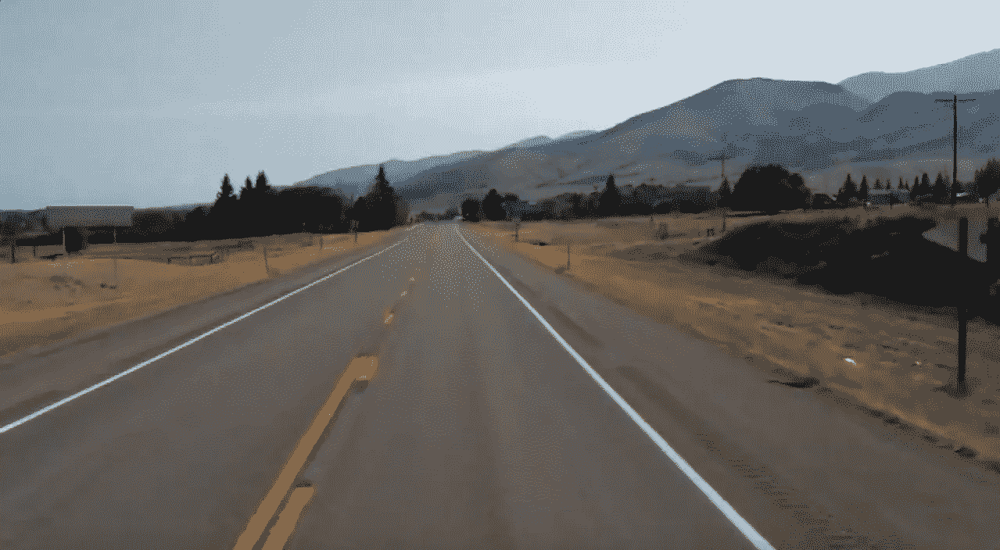
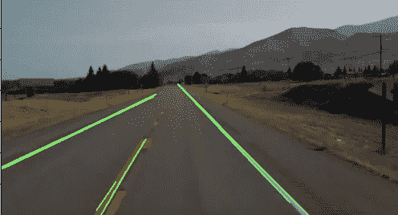

# 基于 OpenCV 的道路车道检测

> 原文：<https://medium.com/analytics-vidhya/road-lane-detection-using-opencv-3e2d2740a4d?source=collection_archive---------9----------------------->

让我们使用 OpenCV 实现一个道路车道检测器。

我们将使用精明的边缘检测器和霍夫线。它们的功能可以用 OpenCV 实现。

对于 Canny 边缘检测器的工作原理，请查看我的上一篇文章,在这篇文章中我对它进行了深入的解释。Canny 边缘检测器在这个模型中起着至关重要的作用，因此拥有它的知识是有帮助的。

## 模型管道

首先让我们导入 Matplotlib、OpenCV 和 Numpy 库。对于那些不知道 Matplotlib 是可视化工具而 OpenCV 是图像处理库的人来说。

```
import **matplotlib**.pylab as plt
import **cv2**
import **numpy** as np
```

现在，该模型的管道将如下:
1。读取图像并将其转换为 RGB 格式。获取其高度和宽度，并定义车道检测所需的感兴趣区域。
2。然后将图像转换为灰度格式，因为 Canny 边缘检测器只接受灰度图像作为输入。将图像传递给 Canny 边缘检测器。
3。现在，通过前面定义的感兴趣区域来遮盖图像。
4。然后对图像应用 Hough 变换，Hough 变换是一种特征提取技术，它给出了某一类形状内的对象的实例。在我们的例子中，形状将是一条线，因此我们将使用 HoughLines 函数。
5。最后，转换将返回检测到的线，我们将在我们的图像中绘制它作为输出。

现在让我们制作一个辅助函数，它将图像遮蔽到感兴趣的区域。你可以不这样做，但这有助于获得更好的结果。我们只是在图像中定义我们感兴趣的区域。

我们可以通过给函数顶点和输入图像来屏蔽图像。

```
def **region_of_interest**(img,vertices): 
    mask = np.**zeros_like**(img) 
    channel_count=img.shape[2]         
    match_mask_color=  255   #(255,) * channel_count
    cv2.**fillPoly**(mask,vertices,match_mask_color)
    masked_image=cv2.**bitwise_and**(img,mask) 
    return masked_image
```

同样，让我们实现一个在图像上绘制给定线条的辅助函数。霍夫变换后需要画的线就可以了。

```
def **draw_the_lines**(img,lines): 
  imge=np.**copy**(img)     
  blank_image=np.**zeros**((imge.shape[0],imge.shape[1],3),\
                                                   dtype=np.uint8)
  for line in lines:  
    for x1,y1,x2,y2 in line:
      cv2.**line**(blank_image,(x1,y1),(x2,y2),(0,255,0),thickness=3)
      imge = cv2.**addWeighted**(imge,0.8,blank_image,1,0.0) 
  return imge****Note**: Mind the indents, as it could differ for your IDE. Code link would be provided at the end.
```

cv2.line()用于在空白图像上绘制线条，这些线条通过 cv2.addWeighted()添加到原始图像中。

要进一步了解这些功能，请参考[原始文档](https://opencv-python-tutroals.readthedocs.io/en/latest/index.html)。

## 概率霍夫线变换

先来理解概率霍夫线变换。如果你对理论不感兴趣，你可以跳过这一节。

霍夫变换是一种流行的检测任何形状的技术，只要你能用数学形式来表示它。它可以检测形状，即使它被打破或扭曲了一点点。
如需深入了解，请参考官方[文档](https://opencv-python-tutroals.readthedocs.io/en/latest/py_tutorials/py_imgproc/py_houghlines/py_houghlines.html?highlight=houghlinesp)。

简而言之，一条线可以表示为 p= x cosQ + y sinQ，其中 p 是垂直距离，Q 是它与 x 轴所成的角度。

在霍夫线变换中，我们创建一个具有两列和多行的数组，其中列表示 p 和 Q 的值，这些值最初被设置为零。
数组的大小取决于我们想要的精度，现在从给定的 Canny 边缘图像，我们在所有边缘点上迭代这些不同的 p 和 Q 值，并推导出最佳连续线，保存 p 和 Q 的值。稍后这将用于在原始图像上画线。

概率霍夫变换是霍夫变换的一种优化。它不考虑所有的边缘点，而是只考虑点的随机子集，这对于线检测是足够的。

```
 cv2.**HoughLinesP**(edges,rho,theta,threshold,minLineLength,maxLineGap)
```

**‘edges’**是边缘图像，**‘rho’**是 p 或垂直距离。
**'np.pi/180'** 是 **theta** 的取值范围或者以弧度表示的角度，这里是-180 到 180。
**【阈值】**需要根据图像进行微调。
' **minLineLength** '是直线的最小长度，短于此长度的线段将被拒绝。
' **maxLinGap** '是线段之间的最大允许间隙，将它们视为一条直线。

使用的输入图像是:



img.png

**步骤 1** :读取图像，转换成 RGB 格式。获取其高度和宽度，并定义车道检测所需的感兴趣区域。

```
image=cv2.**imread**('img.png')
image=cv2.**cvtColor**(image,cv2.COLOR_BGR2RGB)
height=image.shape[0]
width=image.shape[1]
region_of_interest_coor=[(0,height),(0,400),(width/2,height/3),\     
                                                     (width,height)]
```

**第二步**:将图像转换成灰色格式，传给 Canny。

```
gray_image = cv2.**cvtColor**(image,cv2.COLOR_RGB2GRAY)
canny_image = cv2.**Canny**(gray_image,100,200)
```

**Step3:** 现在，用之前定义的感兴趣区域来遮罩 canny 图像。

```
cropped=**region_of_interest**(canny_image,\
np.array([region_of_interest_coor],np.int32))
```

**步骤 4:** 对掩蔽后的 canny 图像应用概率霍夫线变换。

```
lines = cv2.**HoughLinesP**(cropped,rho=2,theta=np.pi/120,threshold=120\
,lines=np.array([]),minLineLength=20,maxLineGap=35)
```

**步骤 5** :使用 HoughLinesP()返回的“线条”通过之前定义的 draw_the_lines()绘制线条，并绘制结果图像。

```
image_with_lines = **draw_the_lines**(image,lines) plt.**imshow**(image_with_lines)
plt.**show**()
```



输出图像:“带有线条的图像”

这总结了模型的实现。这里是[代码](https://github.com/negiaditya/PROJECT-Road_Lane_detection/blob/master/detector.py)。

这可以很容易地扩大到视频或实时。我们只需要使用 cv2。VideoCapture('vid.mp4 ')函数返回逐帧图像，每个图像都可以通过我们刚刚创建的模型。

```
cap = cv2.**VideoCapture**('video.mp4')while cap.**isOpened**():
   ret, frame = cap.**read**()    
   frame = process(frame)    
   cv2.**imshow**('frame', frame)    
   if cv2.**waitKey**(1) & 0xFF == ord('q'):
      break cap.**release**()
cv2.**destroyAllWindows**()
```

“cap”具有通过函数过程()的图像的每一帧，即我们创建的车道检测模型。

看看这个视频的视频结果。

我已经实现了它，代码可以在这里找到。

最后，我想感谢[的编程知识](https://www.youtube.com/channel/UCs6nmQViDpUw0nuIx9c_WvA)对他们工作的贡献。

感谢你的阅读，如果你喜欢这篇文章，请鼓掌，你可以在这里阅读更多这样的文章。

干杯！
快乐学习！