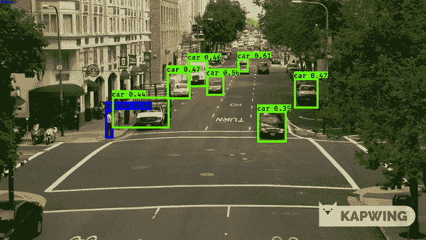
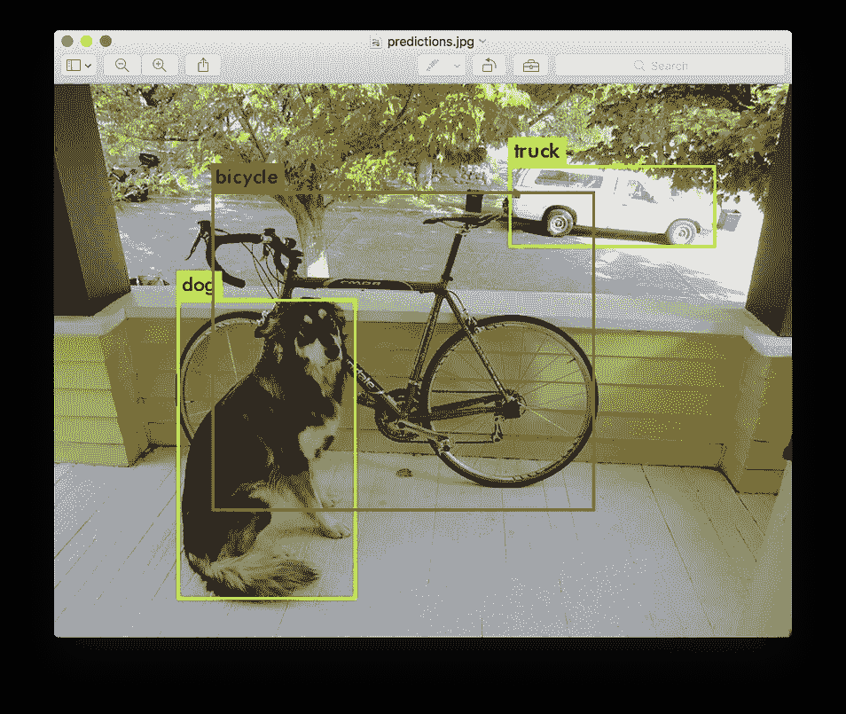
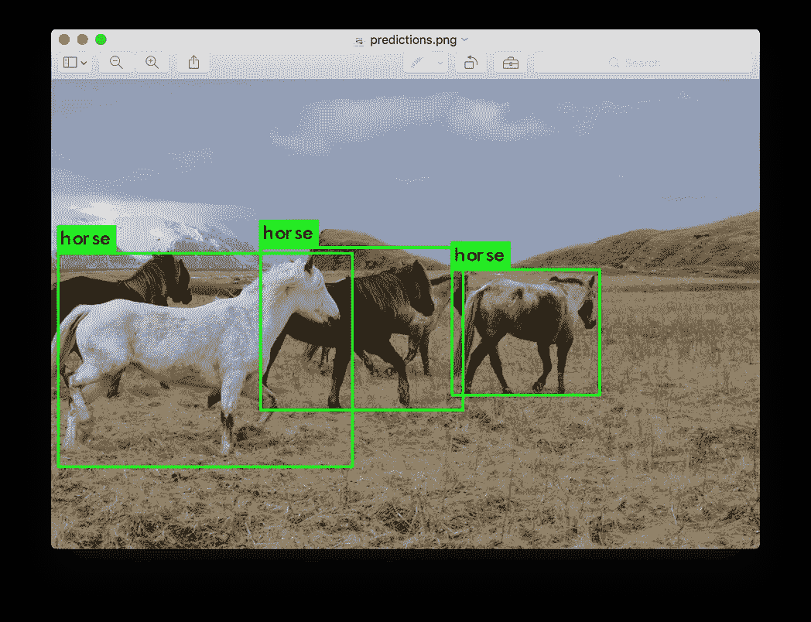

# 基于 YOLOv3 和 Keras 的道路目标检测

> 原文：<https://medium.com/analytics-vidhya/road-object-detection-using-yolov3-and-keras-1af4edcee17?source=collection_archive---------11----------------------->

这是我作为应用人工智能课程的一部分的第一个自我案例研究。我在 LinkedIn 上看到许多展示物体探测的帖子，这让我兴奋地尝试自己做一些类似的事情。

我的案例研究的最终结果

所以我决定把物体检测作为我的案例研究。然后我想到了以下问题:

1.  要检测什么对象？
2.  我应该使用哪个数据集？
3.  我有哪些计算资源？
4.  我应该使用哪种对象检测模型？
5.  我应该使用哪个平台来训练/测试模型？

如今，自动驾驶汽车是一个热门话题。在这种汽车中，底层感知系统检测行人和车辆。我知道这可以通过物体检测来实现，所以我决定选择这个话题。

我主要担心的是，我没有 GPU，所以首先我决定使用 Google collaboratory 作为训练和测试平台。有许多自动驾驶汽车和道路对象数据集可用，如 BDD100k、Kitty、Pascal VOC 等。我只有很少的时间来完成我的案例研究，collab 还有以下两个限制:

1.  它的运行时间为 12 小时。12 小时后，我们必须重新连接，导致所有变量和数据丢失。
2.  此外，我们不能让会话空闲超过 1.5 小时。

考虑到所有的限制，我选择 Pascal VOC 作为我的训练和验证数据集。

说到基于深度学习的对象检测，您会遇到三种主要的对象检测器:

*   R- CNN 及其变体，包括原始 R-CNN、快速 R-CNN 和更快 R-CNN
*   单触发检测器(SSDs)
*   YOLO

r-CNN 是首批基于深度学习的对象检测器之一，是 ***两阶段检测器的一个例子。***

1.  在第一个 R-CNN 出版物中， [*用于精确对象检测和语义分割的丰富特征层次*](https://arxiv.org/abs/1311.2524) , (2013) Girshick 等人提出了一种对象检测器，该检测器需要诸如[选择性搜索](http://www.huppelen.nl/publications/selectiveSearchDraft.pdf)(或等效物)的算法来提出可能包含对象的候选边界框。
2.  这些区域然后被传递到 CNN 进行分类，最终导致了第一批基于深度学习的对象检测器之一。

标准的 R-CNN 方法的问题在于，它*非常慢*并且不是一个完整的端到端物体检测器。

为了帮助提高基于深度学习的对象检测器的速度，单次检测器(SSD)和 YOLO 都使用了 ***一级检测器策略*** 。

这些算法将对象检测视为回归问题，采用给定的输入图像，同时学习边界框坐标和相应的类别标签概率。

**一般来说，单级检测机往往不如两级检测机精确*，但速度却快得多。***

原 YOLOv3 预测结果(图片来源:【https://pjreddie.com/darknet/yolo/】T4)

YOLO 是单级检波器的一个很好的例子。

雷德蒙和法尔哈迪最近发表了一篇新的 YOLO 论文， [*YOLOv3:增量改进*](https://arxiv.org/abs/1804.02767) (2018)。YOLOv3 速度极快，精度极高。在以. 5 测量的 mAP 中，IOU YOLOv3 与焦点损耗相当，但速度快 4 倍左右。此外，你可以简单地通过改变模型的大小在速度和准确性之间进行权衡，不需要重新训练！

在收集了上述信息后，我决定将 YOLOv3 用于我的案例研究，并将 Pascal VOC 作为训练数据集。

Pascal VOC 数据集由 20 个标签组成，包括但不限于:

*   *人:*人
*   *交通工具:*自行车、公交车、汽车、摩托车等
*   …其他一些课程。

感谢 GitHub 用户 ***qqwweee*** 制作了 YOLOv3 的 Keras 实现，该实现已经在 PASCAL 数据集上进行了训练，但我想在自己创建的注释和锚点以及包含人物和车辆的图像上进行训练。

我按照程序转换了 Keras 中的 YOLOv3 重量。我在 collab 上下载了数据集，并开始使用所需的训练和验证数据集进行训练。

我得到了 10.687 的验证损失，我肯定可以通过更多的训练来改善，但我在这个阶段停止了。我只有很少的时间来做这些事情，而且由于协作限制，很多时候我丢失了所有的数据和训练课程。此后，减少损失是一个非常缓慢的过程。

所以我决定在这个阶段测试我的模型，我得到的结果并没有那么糟糕！

**未来增强功能:**

在未来，我想对这个模型进行更多时代的训练，以获得更好的结果。我将使用像 BDD100K 这样的数据集来尝试这个模型，以训练我的模型来检测其他道路对象，如交通灯、交通标志、车道线、道路损坏/坑洞。

**参考文献:**

1.  [https://pjreddie.com/darknet/yolo/](https://pjreddie.com/darknet/yolo/)
2.  [https://github.com/qqwweee/keras-yolo3](https://github.com/qqwweee/keras-yolo3)
3.  [https://www . pyimagesearch . com/2017/09/11/object-detection-with-deep-learning-and-opencv/](https://www.pyimagesearch.com/2017/09/11/object-detection-with-deep-learning-and-opencv/)
4.  [https://www . pyimagesearch . com/2018/11/12/yolo-object-detection-with-opencv/](https://www.pyimagesearch.com/2018/11/12/yolo-object-detection-with-opencv/)