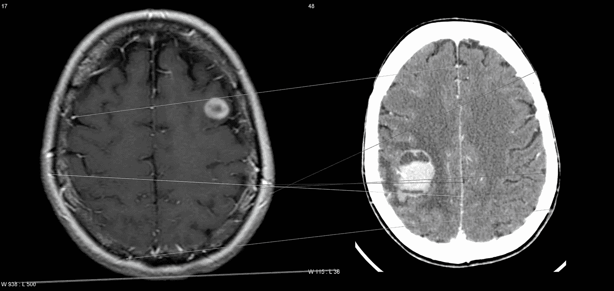
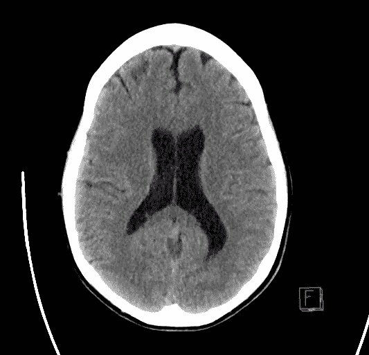
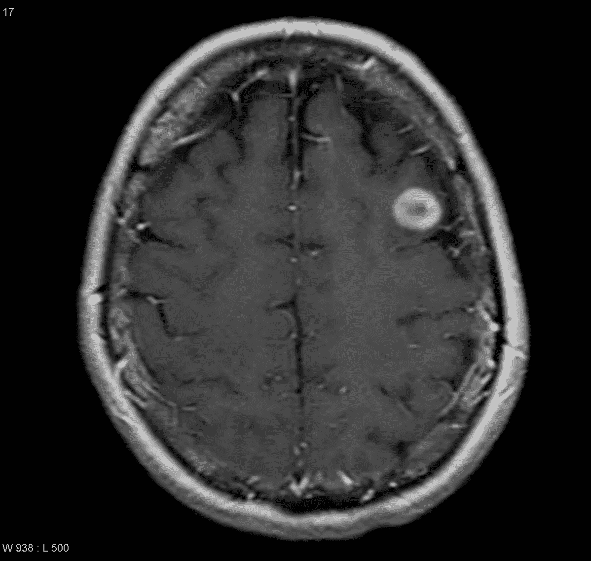
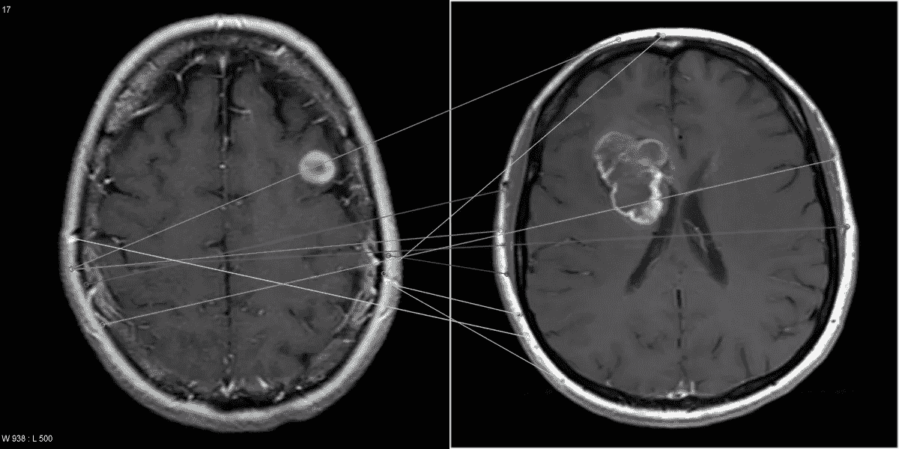
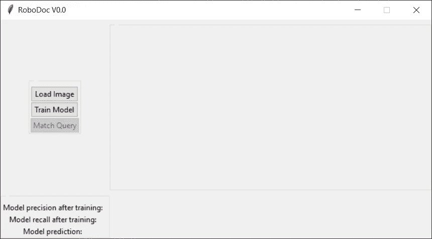
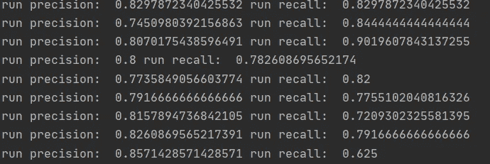
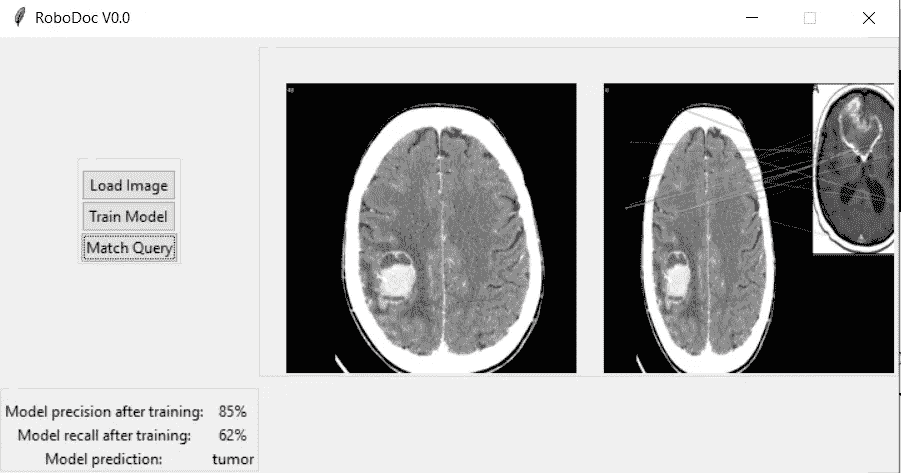
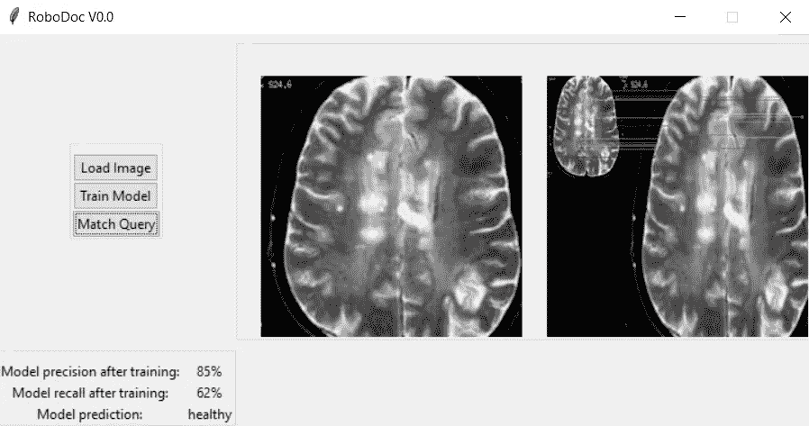

# RoboDoc，利用机器学习检测脑瘤

> 原文：<https://medium.com/analytics-vidhya/robodoc-using-machine-learning-to-detect-brain-tumors-b86607f68c75?source=collection_archive---------17----------------------->

# 人工智能和医学应用

人工智能已经开始以意想不到的方式渗透到现代生活的方方面面，这已经不是什么新闻了。我们都知道网飞推荐算法或脸书对用户偏好数据进行的数据挖掘(这也是我每年只访问我的脸书账户一次的原因之一)，这都非常令人兴奋，但在我看来，机器学习(ML)和人工智能的真正价值是尝试并找到解决不同领域特定领域问题的应用。在许多方面，我对 ML 的理解与我对计算和信息学的理解非常相似:作为一种工具，它的价值取决于它所解决的问题。

考虑到这一点，并一直在寻找机会启动一个 ML/Analytics 项目，几周前，我和我的一个朋友想到了一个诱人的想法，他碰巧是一名医学博士，正在进行放射学住院医师培训。我的朋友知道我对人工智能和人工智能的兴趣，并向我提出了一个问题，即我是否知道有一种方法可以开发一种算法，帮助他和他的同事使用 CAT 扫描和大脑结构的 X 射线图像来检测大脑异常

显然，我欣然接受了这个挑战，因为它提供了许多有趣的机会来扩展我的 ML 技能，甚至一点点软件工程。首先，这是实现新算法的机会，但也是我第一次处理图像数据集，我必须广泛研究如何处理图像，以及如何从这种数据类型创建机器学习模型。在几周的时间内，我就能够创建一个模型原型，使用 K-最近邻(KNN)算法将图像分为两类:健康和肿瘤。健康类别对应于没有肿瘤特征的图像，而肿瘤类别对应于大脑中存在假定的恶性肿瘤的图像。

健康大脑影像示例(来源:[https://radio paedia . org/articles/neuro radiology-interpretation-curriculum？lang=us](https://radiopaedia.org/articles/neuroradiology-interpretation-curriculum?lang=us)

肿瘤影像实例(来源:[https://radio paedia . org/articles/颅内肿瘤-摘要？lang=us](https://radiopaedia.org/articles/intracranial-tumours-summary?lang=us)

# 它是如何工作的？

KNN 的前提很简单。从广义上来说，这个想法是将一个查询归类到一个定义的类别中，通过将它与已知属于这个类别的元素进行比较。根据我们的查询与已知元素数据集的接近程度，我们可以决定它实际上是否属于我们正在寻找的类别。

KNN 既可以用于分类特征，也可以用于数字特征，但它往往非常适合数字特征，因为这样我们就可以将查询和已知集合元素之间的比较简化为几何距离计算，这正是我们要做的，以确定大脑扫描是否显示肿瘤。具体怎么做？嗯，这就是这个项目的研究部分的由来，为了弄清楚图像和对象检测是如何工作的，我研究了计算机视觉算法，并最终发现了尺度不变特征变换算法(SIFT)。

关于 SIFT 如何工作的全面解释超出了本文的范围，但是，有大量的在线资源可以了解它的内幕。事实上，您可以下载原始文章并遵循它(这并不特别难理解)，在本文的参考资料中，我将包括帮助我构建这个应用程序的主要资料。

对这个项目来说，重要的是 SIFT 和 KNN 实际上是相互合作的，为什么？因为 SIFT 恰好为我们提取数据，我们需要以关键点及其描述符的形式应用 KNN 算法。本质上，SIFT 从任何给定的图像中提取一组“兴趣点”,这些兴趣点显示了图像像素中发生突然变化的地方(如角落、边缘、纹理和颜色的变化等),它的妙处在于这些关键点将独立于图像的比例和旋转(因此是比例不变部分)。然后，它将生成一组描述符，这些描述符在数字上描述所识别的关键点处的像素之间的变化幅度和方向。这很重要，因为它基本上为关键点本身生成了一个数字模型

我认为肿瘤基本上是大脑扫描中的异常(即使像我这样没有受过神经放射学训练的人也可以看到图像，至少猜到我看到的斑点不应该在那里)，健康扫描和有肿瘤的扫描会有根本不同的关键点，而两张有肿瘤的图像可能会有类似的异常。因此，要以这种方式在脑部扫描中检测肿瘤，我们需要:

1.  创建一个训练集，其中有肿瘤和无肿瘤的图像
2.  识别关键点并找到这些图像的描述符
3.  识别查询图像的关键点和描述符
4.  将查询的描述符与我们所有的训练集进行匹配，最接近的匹配将告诉我们我们的图像属于哪个类别(健康或肿瘤)

结果将如下所示:

图像匹配，扫描肿瘤。

明白了这一点，让我们深入细节

# 数据集

提供医疗数据可能具有挑战性，因为有许多法律保护患者的隐私和病史。然而，我很幸运地在 Kaggle 中找到了一个公共数据集，其中有健康和肿瘤大脑的图像:

 [## 用于脑肿瘤检测的脑 MRI 图像

### Kaggle 是世界上最大的数据科学社区，拥有强大的工具和资源来帮助您实现您的数据…

www.kaggle.com](https://www.kaggle.com/navoneel/brain-mri-images-for-brain-tumor-detection) 

或者，人们可以使用 radiopedia.org 和绿洲项目数据集，以找到更多的例子。问题是，像往常一样，找到一个足够大的集合，让我们可以建立一个模型，可以实际预测一定程度的可靠性。Kaggle 数据集并不是特别大，两个类别的图像都不到 150 幅，但对于二进制分类来说应该足够了。

# 开发解决方案

我构思解决方案的方式是采用带有 tkinter GUI 的 python 应用程序的形式。许多机器学习项目通常以 Jupyter 笔记本的形式共享和部署，这是很实用的，因为它们变得类似于交互式报告，随着模型修改，可以很容易地更新新的度量和观察。

虽然 Jupyter 的方法非常好，但我想实际上构建一些可以被我的朋友和他的同事使用的东西，他们不是任何能力的程序员或分析师，将能够轻松地与模型交互，而要做到这一点，显然构建 GUI 是必要的。这与我的开场白有关，我在开场白中阐述了我的信念，即当 ML 和 AI 能够被带给能够最好地利用它们的人时，它们处于最佳状态，在这种情况下，是医生和放射科医生。为此，我设计了一个简单的 GUI，可以运行和执行 KNN 模型。正如本文的标题所暗示的，我将我的程序命名为 RoboDoc V0.0。

RoboDoc，主屏幕

功能很简单，我们可以加载一个图像查询(浏览计算机中的文件)，然后我们训练模型(这是指生成一个训练和测试集，稍后会详细介绍)。然后，我们简单地将我们的图像与训练集进行匹配，并获得一个预测。

对于此模型，训练包括选择最大化模型精度和召回率的训练和测试集，以便我们可以对预测有足够的可靠性。为了做到这一点，我按照通常的 70/30 (70%训练，30%测试)，在训练和测试数据集中随机分割整个数据集。然后，该程序将测试集中的每个条目与训练集进行匹配，并计算精确度和召回率。

在多次初始运行后，我注意到模型的精确度可能在 60%-90%的精确度之间变化很大，并且每次后续运行都可能有不同的召回率和精确度。这是因为训练和测试模型在每次运行中的分布方式，因为它们是随机生成的，并且程序不会区分它为训练和测试集选择的实例，我们最终可能会得到偏向某个类别的训练集，从而降低模型的准确率。为了解决这个问题，我定义了一个目标精度，并让程序反复训练模型，直到达到我的目标精度。经过几次运行后，我得出结论，83%的精度可以相对容易地实现，因此，这是我们应该尝试超过的基线目标，模型的精度在训练后将在 85%-90%的范围内。然而，这种方法有一个很大的问题，它极大地增加了模型的运行时间，因为精度不会收敛到我设置的目标，而是随机地尝试不同的设置，直到得到超过目标的组合。下面您可以看到几次运行的精度和召回值的打印输出

根据洗牌的不同，训练可以在一次跑步中完成，也可以多做几次尝试(有时会持续 10 次以上)。这显然不是最佳的，所以还有改进的空间。

最后，我们只是要求程序将查询与我们的训练集进行匹配。该程序将从训练集中返回与查询图像最匹配的图像，并返回该匹配的类别

基于关键点距离的最佳匹配

我们可以加载另一幅图像，同样通过同样的训练来要求预测

第二幅图像是本次运行的训练集的一部分，因此很明显我们有一个完美的匹配，这表明该程序正在正确识别图像并找到它们的最佳匹配，请注意预测如何从“肿瘤”变为“健康”。虽然这些结果是初步的，但它们是概念的证明。

# 讨论

作为概念验证，RoboDoc 的结果表明 KNN 方法可以作为图像识别和特征提取的方法。有趣的是，当与 kaggle 参与者为该数据集提交的笔记本(在 80%-95%精度范围内)相比时，这种方法可以达到与神经网络实现相当的精度水平。神经网络的实现无疑是一个值得探索的有趣方向，它可以作为 RoboDoc 的一个附加功能。

在 RoboDoc 的第一次实现中，一个很大程度上被忽略的方面是在关键点和描述符匹配过程之前对源图像的实际数据预处理。RoboDoc 预处理仅限于将所有图像调整到相同的任意大小(600x600 像素)。虽然这保证了关键点匹配将会起作用，但是这显然不足以创建归一化的图像集，在该图像集中，所有图像都是直接可比较的，并且我们想要比较的特征(肿瘤结构)在每个图像中被增强和归一化，使得它们是直接可比较的。通过执行特征增强过程，查询匹配结果将得到改善，并提供与查询中的肿瘤结构的更接近的匹配。

目前，RoboDoc 可以执行粗略的二进制分类，能够将具有肿瘤结构的图像与健康扫描区分开来。然而，匹配的特异性仍然严重缺乏，这意味着即使图像被正确地分类为“肿瘤”或“健康”类别，最匹配的图像和查询也不会在视觉上彼此对齐。我认为这是由于几个因素，最明显的是缺乏一个适当的图像预处理。此外，医生询问该程序是否可以识别脑部扫描中的特定肿瘤、病变和其他异常，答案是，嗯，当然可以。

如果我们将 KNN 二元分类的概念扩展到多类别分类，那么在理论上，该程序将能够识别所有方式的结构和大脑病理，只要我们对每个标记的类别都有足够的训练数据。这意味着我们需要大幅扩展训练集，也意味着模型的训练时间将大幅增加，因此必须找到工程解决方案来优化运行时间。

# 最后的想法

RoboDoc 提供了令人兴奋的可能性，我相信该计划有很大的改进和扩展潜力，我想探索的下一步发展包括:

1.  扩展训练数据集，以便能够对进一步的脑部病变进行分类
2.  实现一个神经网络，并将其性能与 KNN 算法进行比较(训练和运行时间将包括在该评估中)
3.  实施进一步的图像预处理技术，以改善匹配结果及其特异性。
4.  最后，开发一个 web 应用程序来部署该模型，并使其可供医疗专业人员使用

# 参考

## 快速实施

 [## 使用 Python 中的 OpenCV 为神经网络预处理面部图像的快速指南

### 覆盖人脸和眼睛检测加上图像拉直，裁剪，调整大小和标准化

medium.com](/yottabytes/a-quick-guide-on-preprocessing-facial-images-for-neural-networks-using-opencv-in-python-47ee3438abd4)  [## Numpy 和 OpenCV 中的图像几何变换

### 介绍

towardsdatascience.com](https://towardsdatascience.com/image-geometric-transformation-in-numpy-and-opencv-936f5cd1d315)  [## 在 Python 中实现 SIFT:完整指南(第 1 部分)

### 深入细节，巩固您的计算机视觉基础

medium.com](/@russmislam/implementing-sift-in-python-a-complete-guide-part-1-306a99b50aa5) 

## 打开简历

 [## 特征检测和描述- OpenCV-Python 教程 1 文档

### SIFT 使用具有 128 个浮点数的特征描述符。考虑数以千计的这样的特征。这需要很多…

opencv-python-tutro als . readthedocs . io](https://opencv-python-tutroals.readthedocs.io/en/latest/py_tutorials/py_feature2d/py_table_of_contents_feature2d/py_table_of_contents_feature2d.html) 

## TKINTER 开发

Meier B .，Python 编程 Cookbok，第二版，Packt Publishing 2017

## KNN 算法及其实现

用于预测数据分析的机器学习基础。麻省理工学院出版社 2015