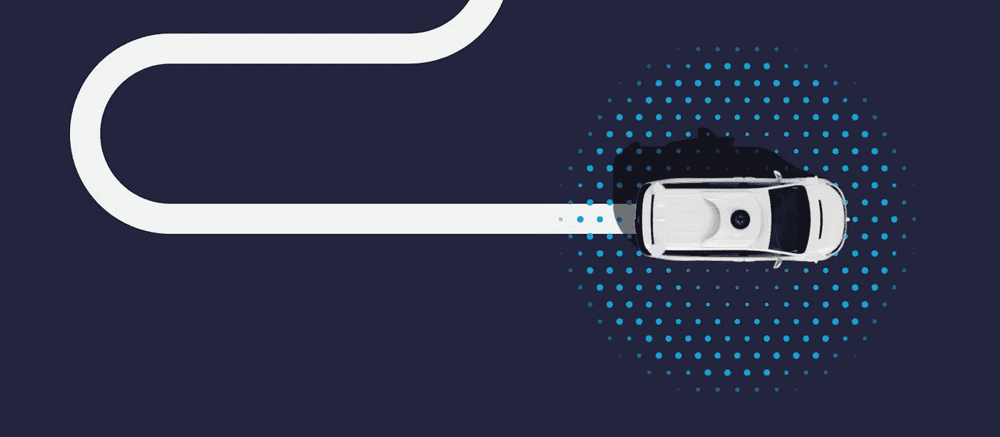
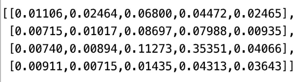

# 机器人:贝叶斯定位

> 原文：<https://medium.com/analytics-vidhya/robotics-bayesian-localization-a552601e98c2?source=collection_archive---------11----------------------->

## 利用简单贝叶斯后验更新定位机器人

机器人越来越突出，越来越受到公众的关注——这主要是由于当前科技巨头竞相开发第五级自动驾驶汽车。**定位，**机器人学的一个重要元素，简单来说就是指机器人在给定环境中确定自己所处位置的能力。

机器人技术通常分为感知和控制:

> 感知:机器人如何接收数据/信息(例如计算机视觉)
> 
> 控制:机器人如何根据数据行动

这里我们着重于控制算法。是蒙特卡罗定位的一个简单 Python 实现，使用一种称为直方图过滤器的技术来定位机器人。虽然被大大简化了，但这是 Waymo 的 AV(自动驾驶汽车)方法的本质——一种依赖于大量地理地图的方法，而不是纯粹的计算机视觉方法。

# 机器人定位

假设机器人(AV)可以:

*   可以访问环境地图(道路地图、车道、重要建筑物、其他车辆和行人的外观信息)
*   接受感官数据
*   移动的能力

# 目标

我们的任务是让机器人在环境中四处移动&根据给定的概率计算其位置的可能性:

*   它收集的感官数据
*   动作的历史

概率性，因为假设所有的感觉数据和动作都被准确记录是天真的假设(例如，计算机视觉算法的错误分类或机器人错误地记录了一个动作，而实际上没有动作发生)。

# 蒙特卡罗定位

给定一张世界地图，直方图过滤器可用于将机器人的感官输入与地图匹配，以计算准确的当前位置的可能性(请记住，机器人技术在很大程度上是为了减少观察和行动中的不确定性)。

# **算法**

下面的简单算法说明了蒙特卡罗定位。通过简单算法，我们实现了一个“玩具示例”,但提供了与实际应用的类比:

## 1.指定地图

*   现实生活:地理空间/谷歌地图数据
*   可能位置的 4x5 网格

## 2.设置先验分布

*   现实生活:道路上的位置
*   玩具示例:4x5 网格上的位置

先验表示假设的知识，我们将从统一的先验开始，然而前一次迭代的后验成为下一次迭代的先验。这类似于模糊的地理空间映射。我们的无信息先验表示没有初始空间信息。

## 3.观察世界

*   现实生活:计算机视觉/激光雷达检测物体/车道/汽车/行人
*   玩具示例:观察红色或绿色标记

我们加上观察结果正确的概率，因为在现实生活中，我们可能会出现错误分类

## 4.更新后验

> 这些观察结果然后对照地图进行检查，以更新我们的先验知识——给定证据——从而得出我们对当前位置的后验信念(再次考虑概率误差)

## 5.移动

*   现实生活:开车
*   玩具示例:通过领域空间向上、向下、向左、向右移动

再次考虑未正确执行移动的一些概率，计算更新后的后验概率

每次状态交互后，重复步骤 3、4 和 5。

# 履行

下面的实现显示了这个简单的贝叶斯更新如何正确定位机器人的位置。置信度随着超参数的规格(正确观察或正确执行移动的概率)而变化。

定义类别

执行上述功能:

# 结论

作为输出提供的概率提供了域上的分布——每个数字给出了机器人在特定位置的概率。

> 一个简单而有用的介绍，介绍了机器人学中一个非常重要的原理，以及统计/贝叶斯思维的含义。

代码可在[https://github.com/ZachWolpe/Basic-Robotics](https://github.com/ZachWolpe/Basic-Robotics)获得

参考资料:巴斯蒂安·特龙和乌达城