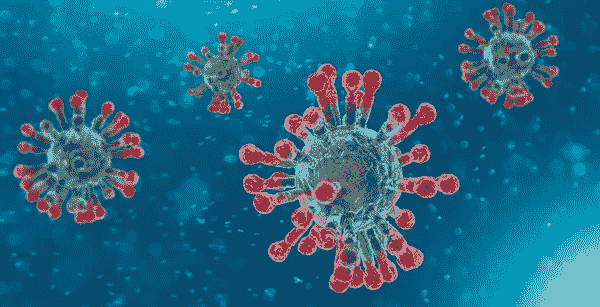
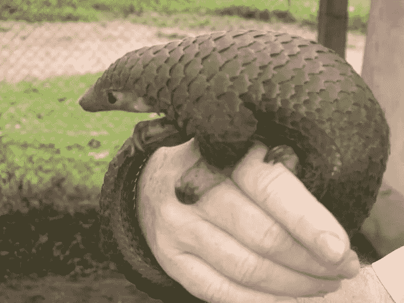
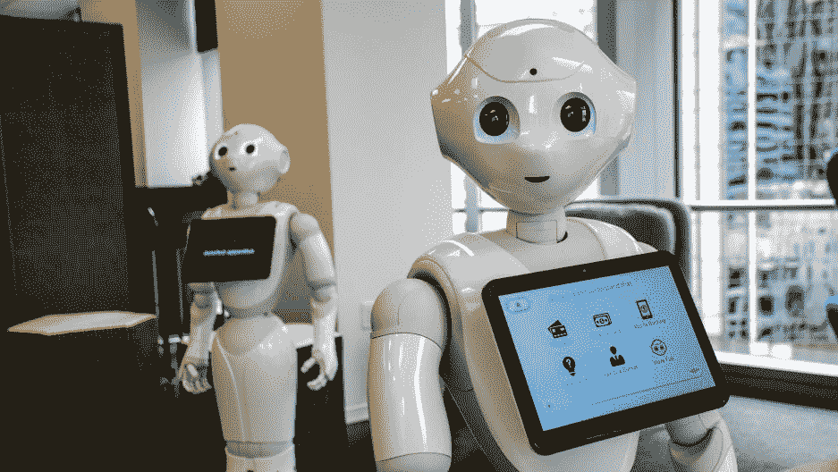
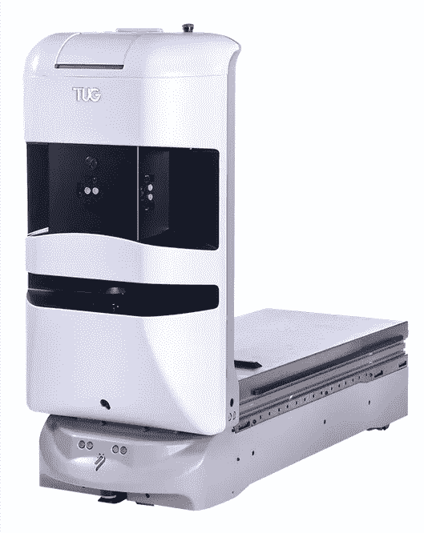
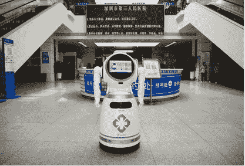
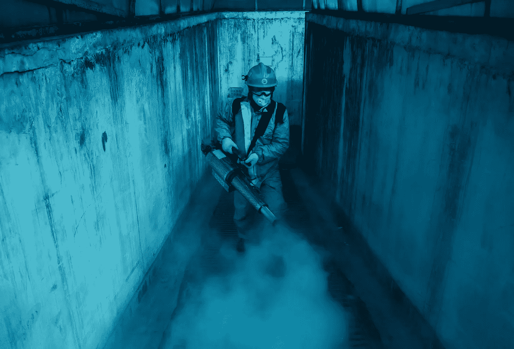

# 机器人可能有助于对抗世界上的新冠肺炎

> 原文：<https://medium.com/analytics-vidhya/robots-may-help-combat-covid-19-in-world-8b5deb13cea1?source=collection_archive---------37----------------------->

显微镜下看到的 Sars-Cov-2(提供:[https://www . health . Harvard . edu/diseases-and-conditions/coronavirus-resource-center](https://www.health.harvard.edu/diseases-and-conditions/coronavirus-resource-center)

# 什么是新颖的电晕病毒？

T he 新型冠状病毒或[Sars-Cov-2](https://www.google.com/search?client=firefox-b-d&sxsrf=ALeKk03FHZkGK12kd8QtXmmZZczMEfVjVA:1585635621529&q=sars+cov+2&spell=1&sa=X&ved=2ahUKEwjnlNv_iMToAhVs7XMBHS4qDXwQBSgAegQIFxAn&biw=1440&bih=826)正如全球医学专家所称，它被世界卫生组织(世卫组织)宣布为疫情，它正在如火如荼地传播。新冠肺炎病毒已经感染了地球上几乎每一个国家，削弱了它们的经济，挑战了医疗保健，夺走了数百万人的生命。

# 是怎么传播的？

好吧，网上没有合适的证据或理论来解释这种致命病毒的可能原因。根据疾病控制和预防中心(CDC)的说法，它通过蝙蝠传播。许多理论认为这种病毒是在穿山甲身上发现的。根据一种理论，当一个实验在中国的一个实验室进行时，一个研究在蝙蝠身上发现的病毒的科学家被一只蝙蝠攻击，使他感染了病毒。

穿山甲(来源:Siasat.com)

# 它是如何传播的？

新的冠状病毒是一种呼吸道病毒，主要通过感染者咳嗽或打喷嚏时产生的飞沫传播，或者通过鼻子排出的唾液传播。一些报道称，这种病毒可以承受 50-60 摄氏度的温度，并可能在表面持续几个小时或几天。

现在，我们已经非常熟悉这种病毒背后的术语，让我们继续讨论一些遏制这种病毒传播的方法。

在目前的情况下，疫苗还没有出现，也没有合适的治疗方法来治愈这种疾病。发展对这种致命病毒的免疫力的唯一可能的方法是预防。预防是最可行的选择之一，它将为我们提供充足的时间来准备治疗所需的疫苗和药物。

那么，有什么可能的方法来对抗这场灾难呢:

随机家伙思维(来源:[https://www . clip art . email/clip art/images-of-a-person-thinking-clip art-209625 . html](https://www.clipart.email/clipart/images-of-a-person-thinking-clipart-209625.html))

*不！！！那不是我，但有趣的是我戴眼镜。*

不管怎样！！！

1.  使用**深度学习模型**来估计在不久的将来会发生的感染数量。许多初创公司正在使用各种技术，通过精确定位容易发生疫情的特定区域来寻找可能的案例(如**武汉**)。

赞成。

1.  可能会给我们准确或大概的病例数。
2.  用于训练模型的数据集的可用性。我知道外面有很多这样的人。(github—[https://github.com/datasets/covid-19](https://github.com/datasets/covid-19))
3.  不缺乏数据科学家。

缺点。

1.  耗时(如果数据集很大)。
2.  需要 GPU 和其他复杂的框架(对于在家工作的人来说，无法访问或可能无法访问所需的机器)。

**注意:**无意冒犯，以防任何数据科学家碰巧看到我的帖子。我不是说 ***深度学习*** 技术不能实现或者不准确。这些技术可以用来开发治疗这种疾病的药物和疫苗。

现在听起来很自然，你(读者)会问，如果不是深度学习，那是什么？

# 医疗保健中的机器人

有很多技术可以用来对抗病毒的传播，比如人工智能，机器人技术等等。如果我们想有效地控制病毒，保护人们(医生、护士、警察等)。)在一线工作是必要的。这里机器人进入画面。 ***是的机器人！！！***

人形机器人(来源:[https://www . pri . org/stories/2019-08-21/will-next-wave-humanoid-robots-make-our-life-better-or-steak-our-jobs](https://www.pri.org/stories/2019-08-21/will-next-wave-humanoid-robots-make-our-lives-better-or-steal-our-jobs))

我们人类还没有准备好迎接疫情——机器也是。保护医生和护士是缓解的第一步，通过将任务交给机器人，医学很难自动化。这也是疫情冒险进入医疗机器人领域的一个独特机会，十几位机器人学家在《科学机器人学》*杂志上争论道。*

*如果机器被适当地编程来护理生病的病人，医生就不太可能感染疾病。大多数自主机器人被用于运送物资、用紫外线消毒表面等任务。*

# ***拖轮:滚动机器人***

*所以 [Aethon](https://aethon.com/mobile-robots-for-healthcare/) 自己的拖船机器人主要用于:*

1.  ***护理***
2.  ***药房***
3.  ***实验室***
4.  ***餐饮服务***

**

*拖船机器人*

# *ATRIS:中国深圳的救生员*

**

*图片:UBTECH 机器人公司*

*[优必选机器人](https://www.ubtrobot.com/?ls=en)“ATRIS 是部署在深圳一家专门治疗新冠肺炎患者的医院的机器人之一。通常，用于零售和酒店的机器人被修改为按部就班地执行任务，以确保医院工作人员的安全。这些任务包括:*

1.  *在病人和医生之间进行视频会议。*
2.  *记录体温*
3.  *和消毒。*

*根据 [***发表的一篇文章谱***](https://spectrum.ieee.org/automaton/robotics/robotics-hardware/video-friday-ubtech-robots-covid-19-shenzhen-hospital)***——****AI 机器人正在发挥关键作用。UBTECH 开发的机器人三人组，即 ATRIS、AIMBOT 和 Cruzr，正在伸出援手，监测体温，检测不戴口罩的人，喷洒消毒剂，并提供医疗咨询。**

**记者肯·弗莱尔的采访发表在《连线》杂志的*上。***

******

***蓝天救援是中国最大的人道主义组织，拥有 30，000 名成员，从事搜救、医疗护理，在新冠肺炎，还负责卫生工作。在这里，一名志愿者穿着防护服，带着熏蒸设备给北京的一个居民区消毒。摄影:Kevin Frayer/Getty Images(来源:[https://www . wired . com/story/coronavirus-photo journalism/# int cid = recommendations _ wired-bottom-recirc-personalized-similar _ c 8933 dcb-36f 7-437 a-9ac 9-ba 6794 ed 7 f 14 _ similar 2-3-personalized _ entityTopicSimilarity](https://www.wired.com/story/coronavirus-photojournalism/#intcid=recommendations_wired-bottom-recirc-personalized-similar_c8933dcb-36f7-437a-9ac9-ba6794ed7f14_similar2-3-personalized_entityTopicSimilarity))***

***北京摄影师凯文·弗莱尔说，“1 月 23 日武汉封锁，保护首都是中国政府计划的下一步行动”。他在疫情爆发期间拍摄了这些照片，尽管封锁期间的限制让拍摄变得很困难。尽管有许多障碍，他记录日常事件的工作是勇敢的。***

***事后看来，如果我们团结起来，以适当协调的方式明智地利用这项技术，那么新冠肺炎很容易被淘汰。***

***致所有读者***

***保持安全和健康！！！***

*****抱最好的希望。*****

***谢了。***