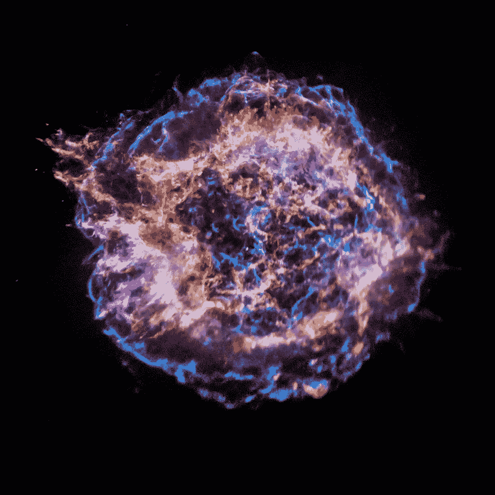
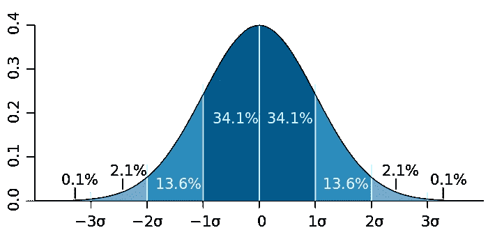
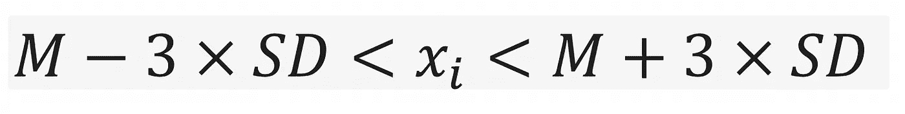
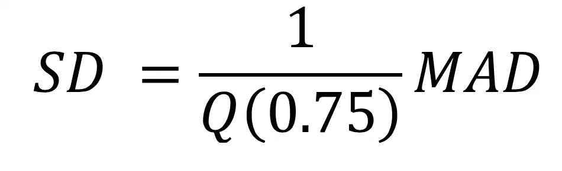

# 异常检测中稳健的位置和尺度估计量

> 原文：<https://medium.com/analytics-vidhya/robust-location-and-scale-estimator-in-outlier-detection-3481b74013ba?source=collection_archive---------26----------------------->

统计分析的主要目标之一是找到统计分布的位置和比例参数。位置参数指定典型值，即分布的中心值，而比例参数用于测量分布的分散或变化。

[仙后座 A](https://www.nasa.gov/mission_pages/chandra/images/chandra-reveals-the-elementary-nature-of-cassiopeia-a.html)

对于**位置参数**，可以使用三种常见的定义:

1.  ***平均值:*** 这是数据样本的算术平均值，通常称为数据样本的平均值。均值容易受到尾部极值的影响。

2. ***中值:*** 该值代表一半数据小于一半数据大于该点的中间数据点。与平均值相反，中值可以是精确的数据点。对于观测样本数为奇数的情况，如果整个观测值按升序排序，中值就是位于中间的数据点。在观测点数量为偶数的情况下，中值由中间两个数据点的平均值获得。中值的一个优点是，与平均值相比，它受极值的影响较小，因此是有许多异常值的情况下稳健位置估计的最佳候选。

3. ***模式值:*** 该值代表出现概率最高的值。该值通常通过推导观察样本的直方图来获得。

根据分布的形状，平均值、中值和众数可用作位置参数的代表。例如，如果基础分布围绕中心值对称，没有重尾(如正态分布)，则平均值可用作位置的良好候选值。在正态分布中，中位数、均值和众数几乎相同。但是，在指数或对数正态分布等偏斜分布的情况下，平均值不同于中值。在偏态分布中，并不总是很容易看出哪个位置最好地描述了分布，最好提及所有这些参数。在其他对称但重尾的分布类别中，中位数是比平均值更好的位置估计量。重尾的一个例子是柯西分布。在柯西分布中，平均值是没有定义的。换句话说，随着样本量的增加，平均值不会收敛到单一值。这是因为平均值受分布尾部极值的影响很大。在这种情况下，中位数是一个很好的位置估计量，因为它是一个基于秩的估计量。在稳健统计的背景下，提出了各种备选方案来对抗数据的非正态性，因为当基本分布为正态时，均值是一个很好的代表。实现均值稳健定位估计的两种常用方法是

*中间值:*使用 25 到 75%之间的数据计算平均值。

*修剪平均值:*使用 5 到 95 个百分点之间的数据计算平均值。

在测量分布的比例参数时，应考虑两个关键因素:

1.  围绕中心值的离差，即位置参数
2.  尾巴有多分散？

提出了几种数值测量方法来测量数据离散量，每种方法强调前面提到的不同成分。用于估计标度参数的一些建议的测量是:

1.  ***方差值:*** 该值定义为距离均值的平方的算术平均值。
2.  ***标准差(SD):*** 这是方差的平方根。它与数据样本具有相同的单位。
3.  ***范围:*** 这是数据样本的最小值和最大值之差。它并不反映平均值或中值等中心值周围的任何离差。
4.  ***平均绝对偏差:*** 这是数据样本与平均值的绝对差值的算术平均值。因为它对距离的依赖是线性的，所以它受极值的影响比方差或标准差小。
5.  ***中位数绝对偏差(MAD):*** 这是数据样本与中值的绝对差的中位数。
6.  ***四分位数范围:*** 这是 75 和 25 个百分点之间的差异。它是围绕中心变化的度量。

同样，根据基础分布，您可以选择适当的比例估计量来反映位置参数周围的离差和尾部分布。当基础分布对称且具有轻尾(如正态、标准差和方差)时，是一个很好的尺度估计量。对于对称但重尾的分布，如柯西分布，标准差或方差不是一个好的尺度估计量，因为随着数据大小的增加，它们不会收敛到一个值。换句话说，随着数据量的增加，标准差或方差(以及平均值)的准确性并没有提高。对于重尾分布，基于中值的位置和尺度估计量是处理尾部极值的稳健估计量。

# 标准差和 MAD 的关系

单变量数据中异常值检测的一种方法是将任何一点标记为异常值，该异常值位于距离样本均值三个标准差的位置。值得注意的是，总体标准偏差是一种广泛采用的距离度量，通过它可以识别异常值。然而，标准差和样本均值对异常值非常敏感，这使得它们不适合用于异常值检测。这是因为在 SD 中，极值点比接近平均值的点在 SD 评估中具有更高的影响。基于这一事实，我们需要一个对异常值稳健的度量。这个目标的一个可能的候选是相对于中位数的中位数绝对偏差，通常简称为中位数绝对偏差。中位数被定义为相对于观察组中位数的绝对偏差的中位数。

# **位置和比例参数的应用**

位置和比例参数是数据探索过程的精华部分。它们被用于许多应用中，以更好地揭示在大多数情况下被噪声污染的模式。**位置和比例参数的一个应用是异常值检测。**异常值是明显偏离大多数数据的数据样本。一些异常值可能是错误测量或不同分布的结果。不管如何处理异常值，您应该做的一件事是确保期望的参数不会受到异常值的显著影响。使用稳健估计器可以抑制异常值的影响。有许多技术可以识别观察样本中的异常值。这些技术的功效取决于底层发行版的性质。

识别异常值的一个广为接受的方法是使用正态分布的概念。换句话说，假设样本来自对称的轻尾分布，如正态分布，通过确定拒绝区域来识别异常值。如果考虑正态分布，观测样本距离位置值三个 SDs 的概率最多是 4%！见下面的正态分布。

正态分布

因此，任何超出三个 SDs 范围的观察值都被认为是潜在的异常值。潜在有效数据的接受范围是

基于三个 SD 概念的接受范围

其中 M 是平均值。然而，去除和识别异常值所需的平均值和 SD 值本身受到异常值的影响！这就是为什么我们需要稳健的位置和比例估计器来给出异常值的真正稳健的剔除范围。在样本数量较少的情况下，对稳健估计的需求变得更加重要[2]。在高度偏态分布中，大量的观测值密集地分布在中间值的一侧，而其他观测值稀疏地分布在另一侧。

***MAD 的应用:***Hampel(1974)发现并推广了中位数的绝对偏差，他将这一思想归功于 Carl Friedrich Gauss(1777–1855)[1]。中位数，像平均值一样，是一种集中趋势的度量，但对异常值非常稳健。这源于这样一个事实，即对于中位数，估计值的分解点是 0.5，而对于平均数，这个值是 0。**崩溃点是导致错误结果所需的最大观察次数。**例如，如果一个观察值被记录为非常大，即无穷大，则平均值变为无穷大。这就是说均值估计量的分解为零。对于中位数，超过 50%的观察值应该被污染，从而导致错误的结果。此外，MAD 不受样本大小的影响。然而，关于 MAD 方法的警告是，MAD 对基础分布采取对称的观点，从两侧具有相等的离差，这意味着与位置参数的正负偏差。幸运的是，为了处理非正态性问题，我们可以使用诸如 Box Cox 之类的变换来获得正态形状分布，然后应用 MAD 方法来移除异常值。

使用 MAD，我们可以使用三个 SD 公式来识别异常值。由于异常值会对 SD 估计产生不利影响，因此我们可以使用 MAD 和 SD 之间的关系来估计 SD！它由下面的等式给出

其中 Q(0.75)是样本分布的 75 分位数。在正态的情况下，1/Q(0.75) = 1.4826。我们可以使用三标准差规则来排除所有距离观察数据的中位数超过三标准差的观察值。也就是说，我们保留范围内的所有观测值。

在异常值去除过程中，提及异常值的大小和大小是有益的。这里有一个巧妙的地方。通过这样做，我们可以从两个极端中捕获距离中值超过 3-SD 的点。如果基础分布是对称的(如正态分布)，这是有意义的。然而，在偏态分布的情况下，这可能会落空。在高度偏态分布中，大量的观测值密集地分布在中间值的一侧，而其他观测值稀疏地分布在另一侧。

# 结论

在本文中，稳健的位置和规模估计讨论了异常值的存在。根据基础分布的类型，应采用适当的估计量。基于稳健估计，提出了一种简单的稳健异常检测方法。

# 参考

[1] Leys，Christophe，et al . .**检测异常值:不使用均值周围的标准差，使用中位数周围的绝对偏差。***实验社会心理学杂志*49.4(2013):764–766。

[2]库西诺博士和沙特尔博士(2010 年)。**离群点检测与处理:综述**。国际心理学研究杂志，3(1)，58–67。