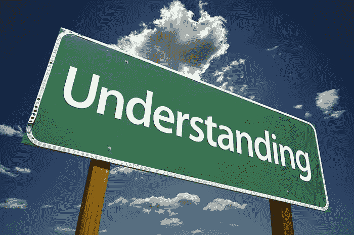
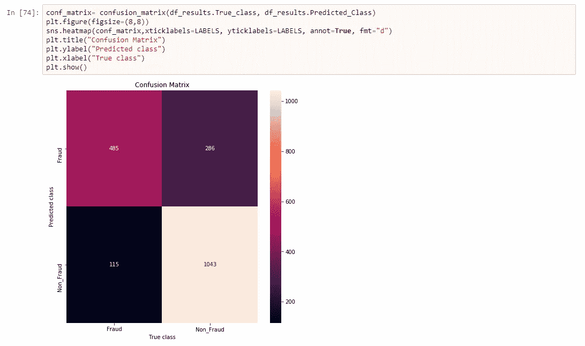
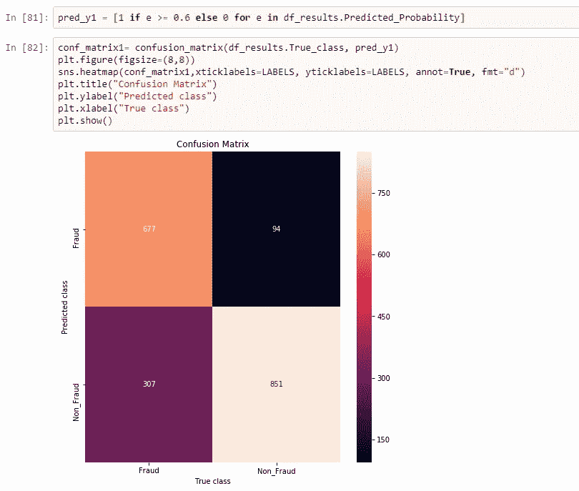
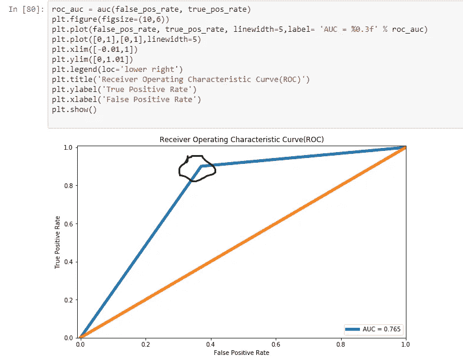

# ROC 曲线、AUC 值——阈值的显著性以及它们对模型性能的真正意义？

> 原文：<https://medium.com/analytics-vidhya/roc-curve-auc-value-significance-of-thresholds-and-what-do-they-really-mean-on-the-model-723039baf35c?source=collection_archive---------6----------------------->

每个数据科学家/数据科学爱好者都会遇到 ROC(受试者操作特征)曲线和 AUC(曲线下面积)的概念及其在评估模型质量中的适用性。

理解是理想的 src:[https://agurlbog . WordPress . com/2016/06/12/understanding-is-ideal/](https://agurlblog.wordpress.com/2016/06/12/understanding-is-ideal/)

有许多博客和教程详细解释了它们。但是我总是对它与模型质量的相关性以及如何使用它们来选择正确的模型有疑问。它们不像准确度/F1 分数那样简单，我总是觉得我错过了它的关键目的。在这篇文章中，我想解决这个问题，并与我的读者分享什么是 ROC 曲线和 AUC 值，以及如何使用它来评估模型。

**ROC 曲线——受试者工作特性**

-定义和公式

有许多博客描述了 ROC 曲线、其公式及其背后的理论科学。所以我不打算在这上面花时间。有关有用的参考资料，请参考本文的参考资料部分。

**样本数据**

让我们考虑“欺诈检测”问题的二进制分类结果作为我们的数据集，并参考本文中使用的数据和 python 笔记本的这个[链接](https://github.com/VVasanth/MachineLearning/tree/master/ROCCurve)。我们不会担心算法是什么，预测模型是如何建立的。假设预测模型已经建立，并且您已经用测试数据测试了该模型，并获得了结果。

我们将使用以下数据计算 ROC 和 AUC 指标，并解释 FPR(假阳性率)、TPR(真阳性率)等的显著性。

以下是数据汇总:

→结果文件包含大约 1900 条记录

→实际值出现在“True_Class”栏下

→二进制分类的预测值出现在“预测类”栏下。

→分类函数的预测概率值出现在“预测 _ 概率”栏下

在本文的其余部分，我们将使用这些数据进行 ROC、AUC 计算。

**预测概率的显著性:**

大多数分类算法基于定义的概率阈值来确定预测值是否为真/假。Scikit-learn 库默认将概率阈值视为“0.5”，当其值大于 0.5 时，预测为真，当值小于 0.5 时，预测为假。

但总是没必要把预测概率当成 0.5。阈值可以设置为任何有助于我们更好地对结果进行分类的值。尤其是对于与高度不平衡的数据或异常检测相关的问题，处理阈值将有助于提高准确性。

**混淆矩阵，FPR，TPR 计算:**

让我们计算阈值为 0.5 的结果的 FPR、TPR 和混淆矩阵值，结果如下所示:

正如您所观察到的，考虑到真实类的概率阈值为 0.5，该预测的准确性约为 79.2%。TP、FP、TN 和 FN 值分别为 485、286、1043 和 115，如混淆矩阵所示。

让我们计算上述结果的 FPR 和 TPR(阈值为 0.5):

TPR = TP/(TP+FN)= 485/(485+115)= 0.80

FPR = FP/(TN+FP)= 286/(1043+286)= 0.21

让我们用不同的阈值(比如 0.6)重复相同的练习，观察混淆矩阵、TPR 和 FPR 值如何变化。

正如您所观察到的，对于真实类的概率阈值 0.6，该预测的准确性已经下降到 79.2%。TP、FP、TN 和 FN 值分别为 677、94、307 和 851，如混淆矩阵所示。

让我们计算上述结果的 FPR 和 TPR(阈值为 0.6)，几乎没有任何变化:

TPR = TP/(TP+FN)= 677/(677+307)= 0.68

FPR = FP/(TN+FP)= 307/(307+851)= 0.26

因此，ROC 曲线是我们将结果的 TPR 和 FPR 值相对于不同阈值绘制的曲线。

Scikit learn library 在提供不同阈值方面做得非常好，并为我们简化了 FPR、TPR 计算。

对于数据集，我们的 ROC 曲线如下所示:

一般来说，ROC 曲线的理想值是(0，1)，从图中，我们需要确定更接近点(0，1)的“TPR”/“FPR”值，并可以确定相应的“阈值”值作为“概率阈值”。在上述情况下，黑色圆圈点是更接近理想值的点，因此对应于该点的阈值是这种情况下的最佳概率阈值。

综上所述，考虑到 FPR 和 TPR 值的变化，ROC 曲线有助于您确定问题的正确阈值。

给定问题的阈值选择基于假阳性和假阴性值之间的权衡。比如烟雾预测系统——以更大的假阳性(预测烟雾，当没有烟雾时)为代价，拥有更少假阴性(当有烟雾时，预测没有烟雾)的系统是更优选的。因为有更高的假阴性，将对人们的健康产生影响，通常最好是为更差的天气做好准备，当它不是。因此，数据科学家必须考虑问题的性质来确定最佳阈值。

**AUC——曲线下面积**

当我们谈到 ROC 时，不提到 AUC，对它的讨论就永远不会结束。

正如您所观察到的，ROC 主要是确定给定“模型”结果的最佳概率阈值。它通过一个单一的模型来计算 FPR 和 TPR 对于所提供结果的不同阈值。

假设您有多个模型为您提供不同的结果，您需要从给定的批次中识别出性能最佳的模型。这就是你要使用 AUC 的地方。

AUC 提供了模型整体性能的总结，并提供了描述其整体性能的质量分数。AUC 值越高，模型越好。

如果您有多个模型的 AUC，那么您可以通过比较 AUC 值来确定哪个模型是最好的。

就其本身而言，它没有任何意义。然而，假设您有两个模型的预测结果，一个值为 0.96，另一个值为 0.88，那么您可以确定 AUC 较高的模型更适合您的数据。

参考资料:

 [## 理解 AUC - ROC 曲线

### 在机器学习中，性能测量是一项基本任务。所以说到分类问题，我们可以…

towardsdatascience.com](https://towardsdatascience.com/understanding-auc-roc-curve-68b2303cc9c5)  [## 如何在 Python -机器学习中使用 ROC 曲线和精确召回曲线进行分类…

### 在分类问题中，预测一个观察值属于每一类的概率会更加灵活…

machinelearningmastery.com](https://machinelearningmastery.com/roc-curves-and-precision-recall-curves-for-classification-in-python/)