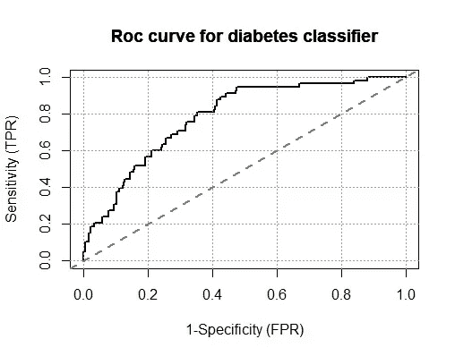

# ROC 曲线|分类度量|为什么度量不能代替你的常识？

> 原文：<https://medium.com/analytics-vidhya/roc-curve-classification-metrics-why-metrics-cant-replace-your-common-sense-e82d71c12eb3?source=collection_archive---------16----------------------->

度量在本质上是盲目的。它们被盲目地优化为单一数量，从而导致完全不合适的结果。一些成熟的媒体网站经常优化“用户点击量”指标。一些热心的记者和年轻的广告商意识到，用户更喜欢诸如“这***将改变你的生活”这样的标题。这就催生了 clickbait。虽然这些标题诱导用户点击它，但也关掉用户，引导他们避免花时间在“点击诱饵填充”的网站上。因此，针对用户点击的优化最终会引起他们的不感兴趣。

简而言之，为一个数量优化指标通常是以一个单独的数量为代价的。因此，为优化您的指标选择正确的数量非常重要。

**二元分类度量**

让我们借助一个例子来理解这一点。考虑具有四个输入和单个二进制离散输出的情况，这告诉我们一个人是糖尿病患者还是非糖尿病患者。“0”代表该人是非糖尿病患者，“1”代表该人是糖尿病患者。在建立了逻辑回归模型之后，我们有以下混淆矩阵。

混淆矩阵

**分类精度**

分类准确度是正确预测与预测总数的比率。

**灵敏度/召回率**

敏感度或召回率是正确的正面预测与正面预测总数的比率。这也叫*。*

**

***假阳性率***

*假阳性率是被确定为阳性的阴性预测与阴性预测总数的比率。*

**

***精度***

*精度是正确预测与预测的正确预测总数的比率。*

**

***特异性***

*特异性是正确的阴性预测与阴性预测总数的比率。*

**

***ROC 曲线***

*ROC 曲线用于可视化二元分类器的性能，即具有两个输出类的分类器。该曲线绘制了真阳性率(召回)对假阳性率(也解释为 1-特异性)。*

**

*TPR 和 FPR 值是在由曲线表示的不同截止值下计算的。Y 轴上最接近“1”的截止值为我们提供了曲线的最佳截止值。仅通过查看曲线，很难找出最佳截止值，但我们可以使用以下方法。*

***寻找“最佳”阈值点的方法***

*使用三个标准从 ROC 曲线中找到最佳阈值点。前两种方法同等重视敏感性和特异性，没有伦理、成本和流行的限制。第三个标准考虑成本，主要包括正确和错误诊断的财务成本、治疗引起的不适成本以及必要时进一步调查的成本。这三个标准分别称为曲线上最接近(0，1)的点、Youden 指数和最小化成本标准。*

**

*如果 sn 和 sp 分别表示灵敏度和特异性，则点(0，1)和 ROC 曲线上任意点之间的距离为 d =*

**

*为了获得区分疾病和非疾病受试者的最佳截止点，计算每个观察到的截止点的距离，并定位距离最小的点。大多数 ROC 分析软件计算所有观察到的截止点的敏感性和特异性，允许你做这个练习。*

*第二个是 Youden 指数，它最大化了从等位线到点[x，y]的垂直距离，如图 3 所示。x 代表(1-特异性), y 代表灵敏度。换句话说，约登指数 J 是 ROC 曲线上离平等线(对角线)最远的点。尤登指数的主要目的是最大化 TPR (sn)和 FPR(1-sp)之间的差异，并且小代数产生 J = max[sn+sp]。连续测试的 J 值可以通过搜索似是而非的值来定位，其中灵敏度和特异性的总和可以是最大的。*

*在这些方法中， *Youden 指数*是一个更常用的标准，因为该指数反映了最大化正确分类率的意图，并且易于计算。许多作者主张这一标准。*

**这是第一部分。在第 2 部分中，我们将使用 R.* 中的 ROCIT 包来解释它*

*[第二部到了](/analytics-vidhya/automatically-find-optimal-threshold-point-in-roc-curve-using-rocit-package-in-r-8955c36c855e)*