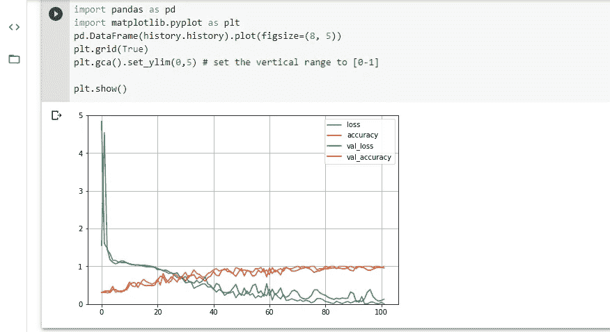

# 石头剪刀布(CNN)

> 原文：<https://medium.com/analytics-vidhya/rock-paper-scissor-cnn-670f5ffec767?source=collection_archive---------9----------------------->

石头剪刀手的图像分类

在这篇文章中，我们将设置一个简单的 CNN 来分类玩石头、布、剪刀游戏的手的图像。该数据集将从 tensorflow_datasets 模块加载

如果您尚未安装此模块，请使用 pip 安装 tensorflow-datasets。

## 了解数据集

数据集包含人们玩石头、剪子游戏的图像，如下图所示。它由 2，892 幅图像组成，仅具有训练和测试分裂。每个图像都有一个[300，300，3]的形状，有 3 个输出类(即石头、剪刀、布

## 加载数据集

为了加载数据集，我们需要做的第一件事是导入必要的库。然后，我们将使用 tfds.load()加载(下载，然后第一次加载)我们的数据集，同时将 with _info 和 as_supervised 设置为 True。

让我们试着检查一些可能不清楚的代码部分

*   在第 8 行使用 tfds.load()时，设置 with_info = True 将返回关于我们的数据集的信息，然后将这些信息存储在我们声明的变量中(即 info)。
*   as_supervised = True 将我们的数据集加载为(图像，标签)元组结构。

## 预处理数据

请记住，我们刚刚进行了培训和测试分割，我们需要进行验证分割。我们将使用 10%的训练数据作为我们的验证分割。

在把我们的数据输入 CNN 之前，它必须经过某种形式的预处理。

我们的数据集中图像的每个像素范围从 0 到 255，我们将借助一个小函数将其缩放到 0 到 1 之间

*   我们将可用的分割分配给它们各自的变量。
*   创建了一个函数来缩放图像的像素
*   tf.cast 确保我们的图像是 float32 类型
*   潜水 255。以浮点格式将我们的像素缩放到 0 到 1 之间
*   对每个数据使用 map()方法会将我们的预处理函数应用于每个数据

上面的代码负责从训练数据中获取验证数据

*   有效训练数据以 1000 的缓冲区大小被混洗
*   有效数据包含 10%的训练数据
*   train_data 包含剩余的 90%
*   设置测试数据的批量大小，这与使用测试数据总数作为批量大小是一样的，因为数据集很小

## 格式化

在我们准备好之前，只剩下一点格式化了。

*   每个数据都是批处理的，通过使用 prefetch(1 ),我们的数据集将总是领先一批
*   iter()遍历数据来分离图像和标签，记住我们设置为 _supervise = True
*   next()移动到下一批
*   这些图像的尺寸从(300×300)调整到(150×150)
*   train_images.shape 返回 TensorShape([32，150，150，3])。第一项是我们的 batch_size，而数据集中图像的形状是[150，150，3]，即我们的 input_shape

## 数据扩充

我们正在处理小数据集，因此数据扩充将对我们有很大帮助

*   imagedatagenerator 有一些你可以设置的参数，比如宽度移动，水平翻转等等。
*   datagen 以 32 的批量检查列车图像和列车标签
*   注意:不要在你的验证和测试数据中使用数据扩充

上面的代码将根据设置的参数创建不同变化的随机图像。例如，我们将 horizontal_flip 设置为 True，这意味着一些图像将被水平翻转

数据扩充是一种很好的方式，可以让你的模型在不同的图像上进行训练，尤其是当你的数据集很小的时候

## 模型

在预处理和格式化之后，我们现在终于准备好构建我们的模型了。在构建我们的 CNN 之前，我们肯定会从导入一些必要的库开始

*   我们的第一层由 32 个大小为 3(即 3 x 3)的过滤器组成，我们的 input_shape 变量也位于第一层
*   下一层由最大池组成，池大小为 2
*   随着过滤器 64、128 数量的增加，重复相同的过程
*   对于具有(填充=相同)的层，每个图像将被填充
*   Kernel_initializer 用于训练开始时的随机性加权
*   使用的激活函数是“relu”
*   展平层在传递到致密层之前展平我们图像的形状
*   我们只有一个密集的隐藏层，隐藏单元为 128
*   我们希望我们的模型返回一个三输出，所以我们的输出层包含 3 个隐藏单元和一个“softmax”激活函数

上面的代码将返回我们的模型的总结，我们可以看到可训练和不可训练的层和总参数

然后，我们需要编译我们的模型并使之适合。

*   Adam optimizer 的学习率为 0.001
*   我们使用“稀疏分类交叉熵”作为损失函数
*   还实现了早期停止回调来监控我们的 val_loss，并且如果 val_loss 在 10 个时期内没有增加，则停止模型
*   model.fit()将开始我们模型的训练
*   epochs 被设置为 200，但是不要担心，因为我们使用了 early_stopping 回调，如果它开始溢出，我们的模型就会停止

一段时间后，验证准确率将达到 94%左右。一点都不差！

让我们通过绘制来看看损耗和精度曲线是什么样子的

结果显示了早期停止的效果，因为它阻止了我们过度适应。

训练损失曲线和验证损失曲线都在稳步下降，其准确性也在提高

然后，您可以继续在 test_data 上测试它

结果表明，测试准确率约为 98%。

结论

我们能够建立一个 CNN 模型，并在玩石头、布、剪刀游戏的手的图像上训练它，以达到 98%的模型准确性。