# 距离度量在机器学习中的作用

> 原文：<https://medium.com/analytics-vidhya/role-of-distance-metrics-in-machine-learning-e43391a6bf2e?source=collection_archive---------1----------------------->

距离度量在机器学习中起着重要的作用。它们为一些机器学习算法提供了强大的基础，如用于监督学习的 k-最近邻和用于非监督学习的 k-均值聚类。根据数据类型选择不同的距离度量。因此，了解各种距离度量及其背后的直觉非常重要。

> 无论是分类任务还是聚类，有效的距离度量都可以提高我们机器学习模型的性能。

假设我们想要使用 k-最近邻算法来创建聚类，以解决分类或回归问题。我们怎么能说两个点彼此相似呢？

如果它们的特征相似，就会出现这种情况。当我们绘制这些点时，它们在距离上彼此会更近。

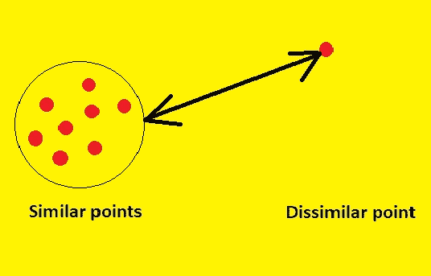

因此，我们可以计算点之间的距离，然后定义它们之间的相似性。现在，问题出现了——我们如何计算这个距离，机器学习中有哪些不同的距离度量？

这就是我们将在本文中讨论的内容。我们将讨论机器学习中的 6 种距离度量。

## **机器学习中距离度量的类型**

1.  欧几里得距离

2.曼哈顿距离

3.闵可夫斯基距离

4.汉娩距

5.余弦距离

# 1.欧几里得距离

> 欧几里德距离表示两点之间的最短距离。

欧几里德距离公式可以用来计算平面上两个数据点之间的距离。

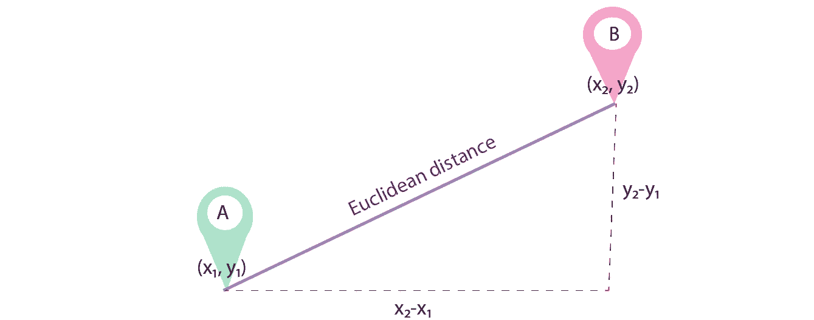

欧几里得距离通常在计算两行具有数值(如浮点或整数值)的数据之间的距离时使用。

如果列中的值具有不同的刻度，则应该在计算欧几里德距离之前对其进行规范化或标准化。否则，具有大值的列将主导距离度量。

欧几里德距离的计算方法是两个向量的平方差之和的平方根。

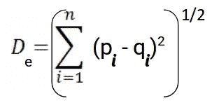

在哪里，

n =维数

pi，qi =数据点

这个计算与 **L2 向量范数**有关(稍后讨论)。

现在，让我们停下来仔细看看！这个公式看着眼熟吗？嗯没错，这个公式来源于 ***“勾股定理”。***

让我们用 Python 写欧几里德距离的代码。我们将首先导入 SciPy 库，该库包含 Python 中使用的大多数距离函数的预写代码:

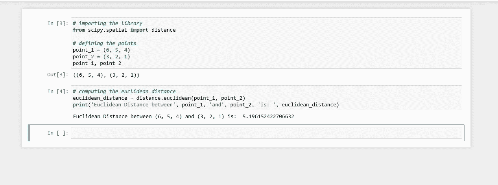

这就是我们如何在 Python 中计算两点之间的欧几里德距离。

# 2.曼哈顿距离

> 曼哈顿距离是所有维度上的点之间的绝对差之和。

如果我们需要计算像棋盘或城市街区一样的网格状路径中两个数据点之间的距离，我们使用曼哈顿距离，也称为**城市街区距离**，或**出租车几何图形**。

名称 **taxicab** 指的是该测量计算的直观结果:出租车在城市街区之间行驶的最短路径(网格上的坐标)。

比方说，我们想计算两个数据点 A 和 b 之间的距离 ***d*** 。

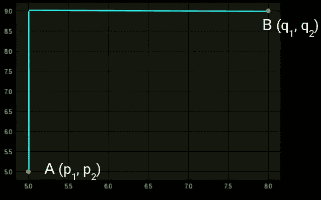

距离 ***d*** 将使用其笛卡尔坐标之间的 ***差*** 的绝对和来计算，如下所示:

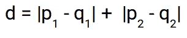

并且 n 维空间的通用公式给出如下:

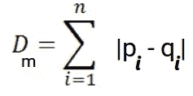

在哪里，

n =维数

pi，qi =数据点

曼哈顿距离与 **L1 向量范数**相关(稍后讨论)。

如果您尝试可视化距离计算，它将看起来像下面这样:

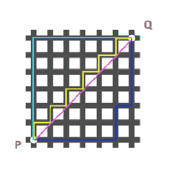

在上图中，将每个单元想象成一座建筑，网格线想象成道路。现在，如果我们想从图中标记的点 P 行进到点 Q，并沿着天蓝色和海军蓝色的路径行进，我们会看到路径不是直的，而是有转弯。在这种情况下，我们使用曼哈顿距离度量来计算步行的距离。连接 P 和 Q 两点的粉线是曼哈顿距离。现在距离 ***d*** 将被计算出来，如黄线所示。

**什么时候曼哈顿距离度量优先采用 ML？**

随着数据维度的增加，曼哈顿距离优于欧几里德距离度量。这是由所谓的“维数灾难”造成的。更多详情，请访问此[链接](https://bib.dbvis.de/uploadedFiles/155.pdf)。

现在，我们将计算两点之间的曼哈顿距离。SciPy 有一个名为 *cityblock* 的函数，它返回两点之间的曼哈顿距离。

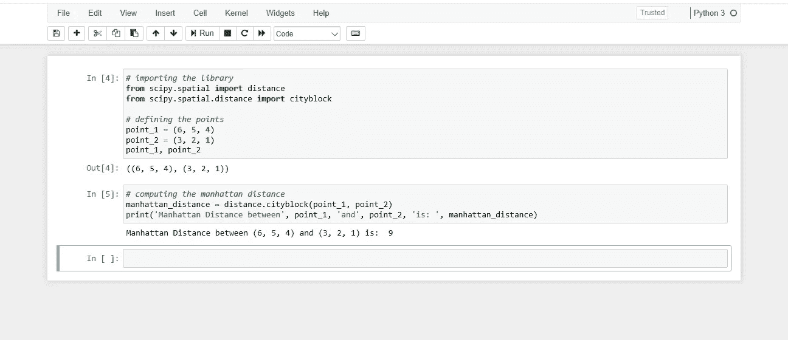

# 3.闵可夫斯基距离

> 闵可夫斯基距离是欧几里德距离和曼哈顿距离的推广形式。

闵可夫斯基距离计算两点之间的距离。

它是欧几里德和曼哈顿距离度量的推广，并添加了一个参数，称为“*阶*或“ *p* ”，允许计算不同的距离度量。

闵可夫斯基距离度量的计算如下:

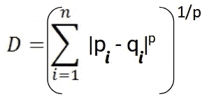

其中“ *p* ”为顺序参数。

当 p 设置为 1 时，计算结果与曼哈顿距离相同。当 p 设置为 2 时，它与欧几里德距离相同。

*   *p=1* :曼哈顿距离。
*   *p=2* :欧氏距离。

中间值提供了两种度量之间的受控平衡。

闵可夫斯基距离与 **Lp 向量范数**相关(稍后讨论)。

当实现使用距离度量的机器学习算法时，通常使用 Minkowski 距离，因为它通过可以调整的超参数“ *p* ”来控制用于实值向量的距离度量的类型。

让我们计算 3 阶的闵可夫斯基距离:

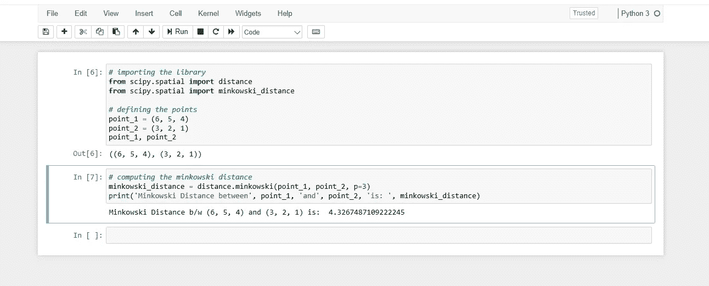

当阶数(p)为 1 时，它将表示曼哈顿距离，而当上述公式中的阶数为 2 时，它将表示欧几里德距离。让我们用 Python 验证一下:

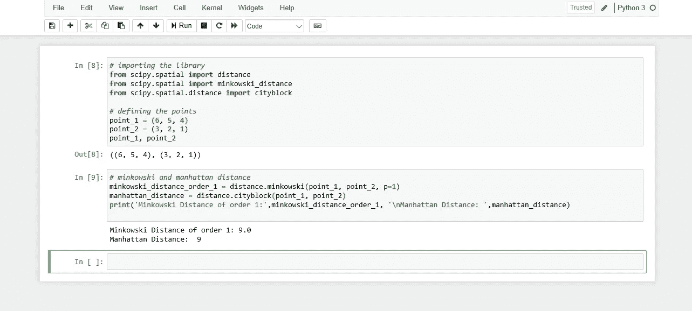

这里我们可以看到，当阶数为 1 时，闵可夫斯基距离和曼哈顿距离都是相同的。

让我们也验证一下欧几里德距离:

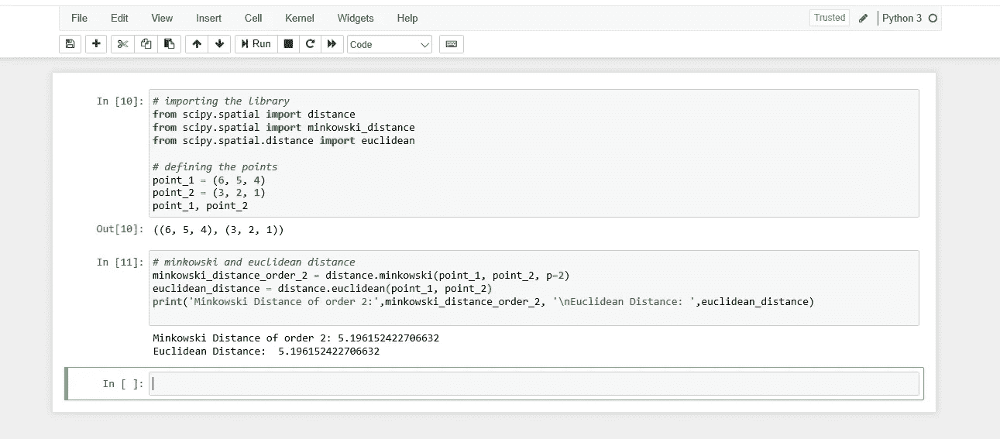

当阶数为 2 时，我们可以看到闵可夫斯基距离和欧几里得距离是相同的。

在阅读这篇文章的时候，你一定遇到过这样几个词 **L1 规范**， **L2 规范**。因此，让我们详细讨论它们。

# 向量范数

通常需要直接计算矢量的大小或长度，或者作为矢量度量运算的一部分。

向量的长度称为向量范数或向量的大小。

> *向量的长度是一个非负数，它描述了向量在空间中的范围，有时也称为向量的大小或范数。*

向量的长度总是正数，除了全零值的向量。它是使用一些距离度量来计算的，这些度量总结了向量距向量空间原点的距离。例如，具有 3 个元素的向量的向量空间的原点是(0，0，0)。

我们将看看机器学习中使用的一些常见的向量范数计算。

# 向量 L1 范数

矢量的长度可以用 L1 范数来计算。L1 范数，表示为||v||1，计算为绝对向量值的和，其中标量的绝对值使用符号|a1|。显然，范数是从向量空间的原点到**曼哈顿距离的计算。**

||v||1 = |a1| + |a2| + |a3|

向量的 L1 范数可以在 NumPy 中使用 norm()函数计算，该函数带有一个指定范数阶数的参数，在本例中为 1。

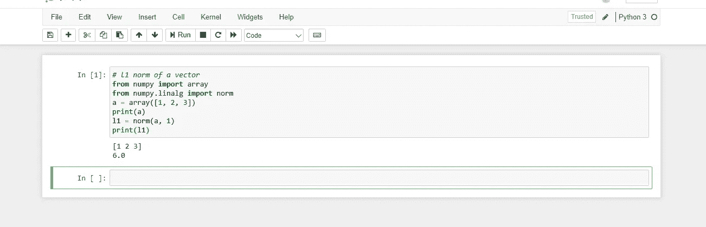

# 向量 L2 范数

L2 范数表示为||v||2，计算方法是矢量值平方之和的平方根。显然，范数是从向量空间的原点开始的**欧几里德距离** **的计算。**

||v||2 = sqrt(a1 + a2 + a3)

在 NumPy 中，可以使用带有默认参数的 norm()函数来计算向量的 L2 范数。

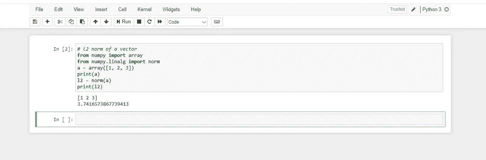

# 向量 Lp 范数

Lp 范数表示为||v||p，从向量空间的原点计算如下:

||v||p=(a1^p + a2^p + a3^p)^(1/p)

显然，范数是从向量空间的原点到**闵可夫斯基** **距离** **的计算。**

到目前为止，我们已经讨论了在处理连续变量或数字变量时使用的距离度量。但是如果我们有分类变量呢？如何确定分类变量之间的相似性？这就是我们可以利用的另一种距离度量，称为汉明距离。

# 4.汉娩距

> 汉明距离衡量相同长度的两个字符串之间的相似性。相同长度的两个字符串之间的汉明距离是对应字符不同的位置的数量。

让我们用一个例子来理解这个概念。假设我们有两根弦:

**《欧几里得》**和**《曼哈顿》**

由于这些字符串的长度相等，我们可以计算汉明距离。我们将逐个字符地匹配字符串。两个字符串(分别为 e 和 m)的第一个字符不同。同样，两个字符串(u 和 a)的第二个字符也不同。诸如此类。

仔细观察—七个字符不同，而两个字符(最后两个字符)相似:

因此，这里的汉明距离是 7。请注意，两个字符串之间的汉明距离越大，这些字符串就越不相似(反之亦然)。

让我们看看如何在 Python 中计算两个字符串的汉明距离。

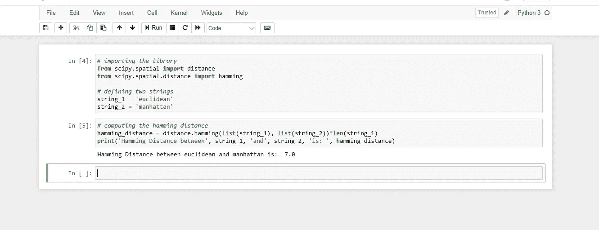

正如我们在上面的例子中看到的，“欧几里得”和“曼哈顿”之间的汉明距离是 7。我们还看到，汉明距离只在字符串长度相同时有效。

让我们看看当我们有不同长度的字符串时会发生什么:

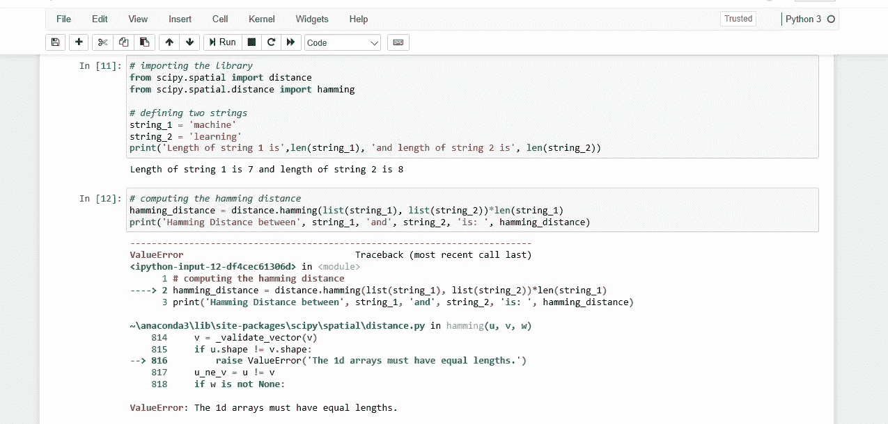

这将引发一个错误，指出数组的长度必须相同。因此，**汉明距离只在我们拥有相同长度的字符串或数组时有效。**

这些是机器学习中通常使用的一些相似性度量或距离矩阵。

# 5.余弦距离和余弦相似度:

余弦相似性是一种度量标准，用于衡量文档的相似程度，而不考虑文档的大小。在数学上，它测量的是在多维空间中投影的两个向量之间的角度余弦。余弦相似性是有利的，因为即使两个相似的文档相距欧几里德距离很远(由于文档的大小)，它们仍有可能更靠近在一起。角度越小，余弦相似度越高。

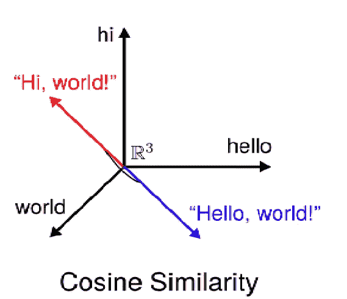

余弦相似性公式可以从点积公式中导出

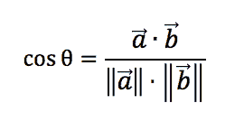

所以，余弦相似度由 Cos θ给出，余弦距离为 1- Cos θ。示例:-

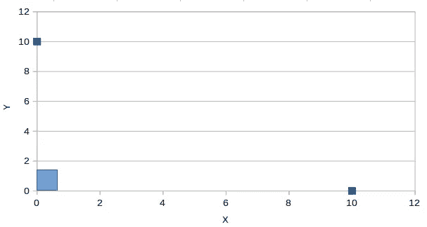

θ = 90

在上图中，有两个数据点显示为蓝色，这两个点之间的角度为 90 度，Cos 90 = 0。因此，所示的两个点并不相似，它们的余弦距离为 1 — Cos 90 = 1。

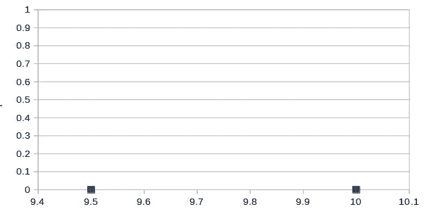

θ = 0

现在如果上图中两点之间的角度为 0 度，那么余弦相似度，Cos 0 = 1，余弦距离为 1- Cos 0 = 0。那么我们就可以解读为这两点是 100%相似的。

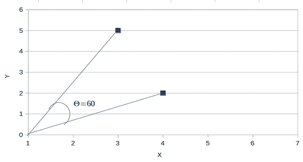

θ=60

上图中，假设θ的值为 60 度，那么通过余弦相似公式，Cos 60 =0.5，余弦距离为 1- 0.5 = 0.5。因此，这些点彼此相似 50%。

为了更好的理解，我们来编码吧。为此，我们必须导入余弦相似度库。

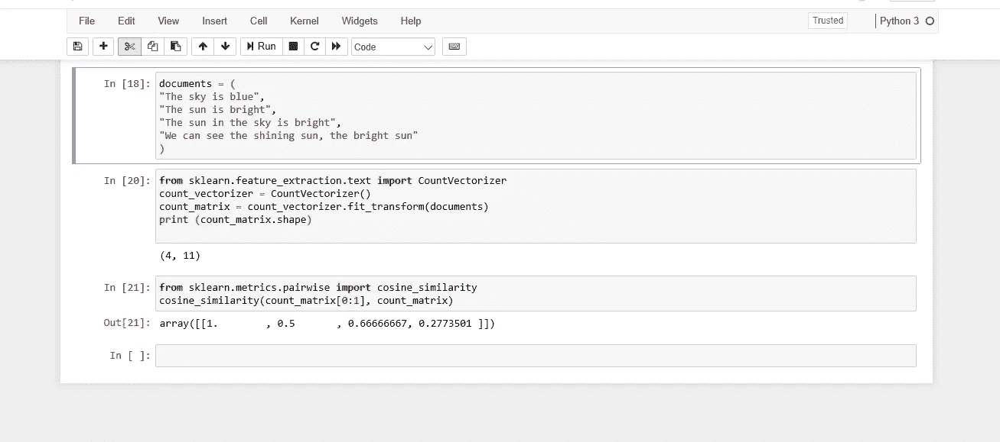

注意，数组的第一个值是 1.0，因为它是第一个文档与其自身之间的余弦相似度。还要注意的是，由于第三份文件上出现了类似的文字(“天上的太阳是明亮的”)，所以取得了更好的分数。

# 结论

在本文中，我们了解了一些流行的距离/相似性度量，以及如何使用这些度量来解决复杂的机器学习问题。我们学习了闵可夫斯基、欧几里德、曼哈顿、汉明和余弦距离度量及其用途。

当数据维数较高时，曼哈顿距离通常优于更常见的欧几里德距离。汉明距离用于度量分类变量之间的距离，余弦距离度量主要用于寻找相似性的量

*感谢阅读！*😊*如果你喜欢，点击*👏图标*。这对你的手指是一个很好的锻炼，并且会帮助其他人看到这个故事。*