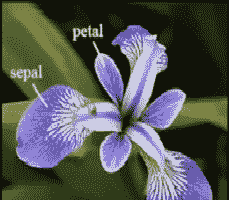
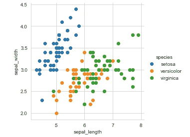
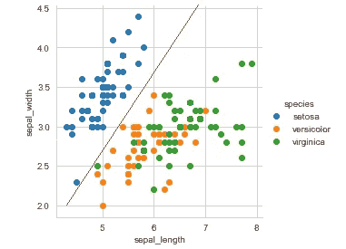
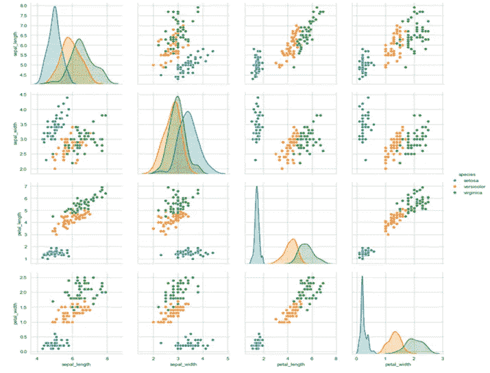
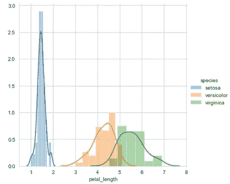
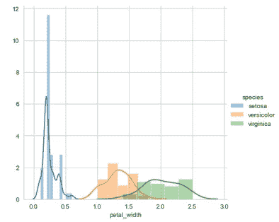
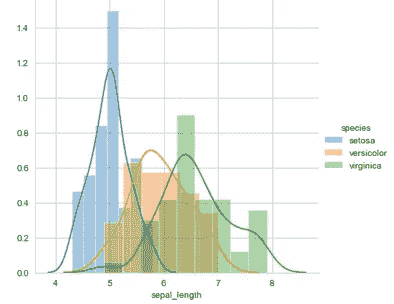
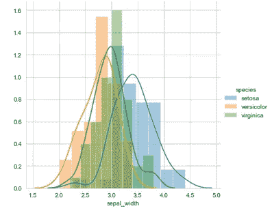

# 探索性数据分析在机器学习中的作用

> 原文：<https://medium.com/analytics-vidhya/role-of-exploratory-data-analysis-in-machine-learning-b09c25f9dafe?source=collection_archive---------14----------------------->

Tukey 在 1961 年将数据分析定义为“分析数据的程序、解释这些程序结果的技术、计划数据收集以使其分析更容易、更精确或更准确的方法”。有许多工具对 EDA 很有用，但是 EDA 的特点更多的是态度，而不是特定的技术。在本帖中，您将了解一些关于样本数据集的绘图技术。


**目录:**

**1。** **数据集概述**

**2。** **用于数据可视化的库**

**3。** **散点图**

**4。** **配对剧情**

**5。** **对剧情的限制**

**6。** **直方图**

7。结论**结论**

**数据集概述:**

iris 数据集包含有关三种鸢尾花(Virginica、Setosa 和 Versicolor)的数据。它包括三种鸢尾，每种有 50 个样本，以及每种花的一些特性。一种花与另外两种花是线性可分的，但是另外两种花彼此不是线性可分的。

数据集的下载链接:[https://www.kaggle.com/uciml/iris](https://www.kaggle.com/uciml/iris)

该数据集中的列是:

身份

萼片长度

萼片宽度

花瓣长度

花瓣宽度

种类



**数据可视化库:**

Seaborn 是一个基于 matplotlib 的 python 数据可视化库，与 pandas 数据结构紧密集成。它提供了一个高级界面，用于绘制有吸引力的信息丰富的图形。其面向数据集的绘图功能对包含整个数据集的数据帧和数组进行操作，并在内部执行必要的语义映射和统计聚合以生成绘图。

**双变量分析:散点图:**

散点图是一种图表或数学图，它使用笛卡尔坐标来显示一组数据的两个典型变量的值。让我们首先导入库并加载下面的数据集。代码将加载库和数据集。

```
import pandas as pdimport seaborn as snsimport matplotlib.pyplot as pltimport numpy as npiris = sns.load_dataset("iris") 
```

让我们绘制可变萼片长度和萼片宽度的特征图。

```
sns.set_style("whitegrid");sns.FacetGrid(iris, hue="species", size=4) \.map(plt.scatter, "sepal_length", "sepal_width") \.add_legend();plt.show();
```



从下面我们可以清楚地看到，Setosa 花与其他两个物种是线性分离的。另一方面，其他两个物种不是线性可分的。



因此，通过观察这个情节，我们可以写一个简单的条件语句来区分 Setosa 和其他两个物种。我们将在配对图之后看到条件图。

**双变量分析:配对图:**

配对图也是散点图。配对图只是对此的阐述，显示所有变量与所有其他变量配对。Seaborn 有一个非常简单的方法来绘制配对图。

```
sns.set_style("whitegrid")sns.pairplot(iris, hue="species", size=3)plt.show()
```



从该图中观察到:

1.  花瓣长度和花瓣宽度是识别各种花类型的最有用的特征。
2.  虽然 Setosa 很容易识别(线性可分)，但 Virginica 和 Versicolor 有一些重叠(几乎线性可分)。
3.  我们可以编写“if-else”条件来建立一个简单的模型来对花的类型进行分类。

为了将 Setosa flower 与其他两个区分开来，条件语句是:

```
If(petal_length<2 && petal_width<1){return “Setosa”;}
```

因此，可视化特征变量的散点图总是一个好主意。

**配对图的限制:**

当数据集中的特征变量数量较少时，可以使用配对图。例如，在这个虹膜数据集中，我们有四个特征变量。特征变量的绘图数量为 16。因此，随着特征变量的增加，图的数量将随着变量数量的平方而增加。所以，分析每个图的复杂性会急剧增加。因此，对更多变量使用配对图是不可行的。

**单变量分析:直方图**

单变量分析顾名思义就是一个变量的分析。假设我们有一个问题，在花卉种类的分类中，四个变量中哪一个更有用？为了进行单变量分析，我们可以为每个特征变量绘制直方图。Seaborn 有一个 distplot()方法，它将绘制我们作为参数传递给它的特性变量的直方图。

1.  **花瓣长度直方图**

```
sns.FacetGrid(iris, hue="species", size=5) \.map(sns.distplot, "petal_length") \.add_legend();plt.show();
```



**2。** **花瓣宽度直方图**

```
sns.FacetGrid(iris, hue="species", size=5) \.map(sns.distplot, "petal_width") \.add_legend();plt.show();
```



**3。** **萼片长度直方图**

```
sns.FacetGrid(iris, hue="species", size=5) \.map(sns.distplot, "sepal_length") \.add_legend();plt.show();
```



**4。** **萼片宽度直方图**

```
sns.FacetGrid(iris, hue="species", size=5) \.map(sns.distplot, "sepal_width") \.add_legend();plt.show();
```



因此，通过观察所有特征变量的直方图，我们可以注意到花瓣长度是可以单独区分 Setosa 花的特征变量。此外，该特征变量可以将其他两个物种分开，但是因为在 petal_length = 5 时这两个物种之间存在一些重叠，所以如果我们编写简单的条件语句来基于 petal_length = 5 对其他两个物种进行分类，则会出现一些错误分类。

**结论:**

在本文中，您了解了探索性数据分析在理解数据集方面的作用。此外，您还学习了使用散点图和直方图进行双变量和单变量分析。