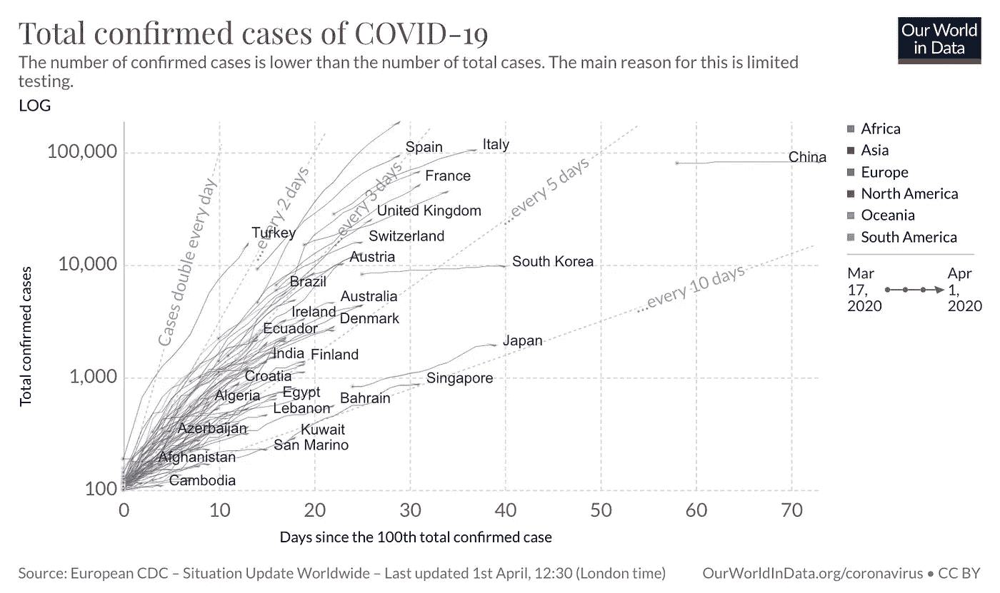

# 机器学习在抗击新冠肺炎病毒中的作用

> 原文：<https://medium.com/analytics-vidhya/role-of-machine-learning-in-fighting-covid-19-eee66ffbd4ad?source=collection_archive---------18----------------------->

> 截至 2020 年 4 月 1 日，记录在案的病例数量已经达到 90 万左右，而且还没有结束的迹象。

截至 2020 年 4 月 1 日新冠肺炎确诊病例总数[2]

新冠肺炎是由严重急性呼吸综合征冠状病毒 2 型(新型冠状病毒)引起的传染病。这种疾病于 2019 年 12 月在中国湖北省省会武汉市首次发现，此后蔓延到全球，导致了正在进行的 2019-20 冠状病毒疫情。截至 2020 年 4 月 1 日，记录在案的病例数量已经达到 90 万左右，而且还没有结束的迹象。在这种危险的情况下，每个研究人员都想尽自己所能帮助抗击疾病。机器学习和数据分析领域也不远了。

在这篇文章中，我将讨论机器学习已经发挥或可能发挥重要作用的不同类别。请注意，我不是流行病学、化学或生物学等领域的训练有素的专家，但作为一名机器学习专业人员，我受过训练，可以灵活地将我的知识应用于任何可能的领域。

根据[1],应用可分为以下专门领域:

*   临床诊断学
*   疾病进展的预测
*   抗病毒药物的发展
*   公众情绪分析
*   高效的数据扩充和利用

## 临床诊断学

在 Wang 等人[8]的工作中，他们开发了一个基于初始迁移学习的模型，随后进行内部和外部验证，可以提取的图形特征，以便在病原检测之前提供临床诊断，从而为疾病控制节省关键时间。该方法能够以 85.2%的准确度提取用于及时和准确的新冠肺炎诊断的放射学特征。

陈等人[9]的临床研究实施了 UNet++，这是一种新颖而强大的医学图像分割架构，用于在 2 台高分辨率计算机断层扫描上检测 2019 新型冠状病毒肺炎。该模型表现出与专家放射科医生相当的性能，大大提高了放射科医生在临床实践中的工作效率。它具有极大的潜力来减轻一线放射科医生的压力，改善早期诊断、隔离和治疗，从而有助于控制疫情。

Xu 等人[10]的工作旨在建立一个早期筛查模型，使用两个 CNN 三维分类模型(ResNet-18 和其他，在全连接层中添加位置注意机制)将肺炎与甲型流感病毒肺炎和肺部 CT 图像的健康病例区分开来。

## **疾病进展预测**

根据 Yan 等人[6]的论文，他们对 2020 年 1 月 10 日至 2 月 18 日在同济医院住院的患者进行了临床研究，并开发了基于 XGBoost 机器学习算法的预后预测模型。利用这一点，他们能够预测死亡率风险，并提供一种从重症病例中识别重症病例的临床途径，这可以帮助医生早期识别和干预，从而潜在地降低死亡率。

Anastassopoulou 等人[7]提出了一项研究，他们使用易感-感染-康复-死亡(SIRD)模型对震中武汉的疫情演变进行了为期三周的初步预测。该分析进一步揭示了死亡率的显著下降，这可能是多种因素造成的，例如中国湖北省采取的严格控制措施(如对受感染者进行隔离和住院治疗)。

## 抗病毒药物的发展

药物开发过程在预防、控制和治疗任何形式的疾病中起着至关重要的作用。目前正在进行的研究通过深层网络预测了现有药物和治疗程序的有效性。张等[3]认为，由于药物开发过程需要较长的周期，替代方法是当务之急。在他的论文中，冠状病毒主要蛋白酶(被认为是主要的治疗靶标)一直是使用 DFCNN 进行药物筛选过程的焦点，该 df CNN 以高准确度识别蛋白质-配体相互作用。

Beck 等人[4]的另一项研究使用了预训练的基于深度学习的药物-靶标相互作用模型，称为分子转运蛋白-药物靶标相互作用(MT-DTI)，以识别可作用于 2019-nCoV 病毒蛋白的市售药物。他们建议了一系列由 MT-DTI 模型确定的抗病毒药物，在建立 2019-nCoV 的有效治疗策略时可以考虑这些药物。同样，DeepMind [5]已经发表了使用他们的 AlphaFold 系统对蛋白质结构的计算预测。

## 公众情绪分析

疾病爆发的早期检测和预测至关重要，因为它可以提供更多的时间来准备应对措施，并显著降低疫情造成的影响。Alessa 等人[11]致力于从搜索引擎和社交网站跟踪流感样疾病(ILI)的趋势，以便使用支持向量机和神经网络等各种方法提前 7 至 10 天识别它。他们提供了对流感病毒传播的深刻回顾，可作为新冠肺炎追踪的参考。Lee 等人[12]对疾病控制和预防中心(CDC)的数据进行了类似的研究。

Wang 等人[13]的论文提出了一种基于社交媒体的实时地理标记 tweet 数据的流感预测方法，以确保实时预测，并适用于采样数据。他们使用偏微分方程(PDEs)模型，该模型纳入了流感传播的影响、流感恢复以及减少流感的积极人类干预等因素。

## 高效的数据扩充和利用

大量的研究证明了科学解决重大问题的速度。但这也给浏览文献以获得真知灼见带来了挑战。人们可以努力从大量的研究中挖掘答案，以帮助医学和公共卫生专家。这个部门有巨大的潜力来帮助争论和从科学研究中获得洞察力[14]。但在我看来，这种方法还处于早期阶段，不太可能有助于解决当前的危机。

这总结了我对机器学习在对抗 COVD-19 中的作用的看法。如果你能坚持到这里，谢谢你支持我的工作。请注意，我欢迎来自相关领域的学者和专家的批评。

[1]戈弗雷德岛，2020 年。*帮助应对冠状病毒的机器学习方法*。【在线】中等。可从以下网址获得:https://towardsdatascience . com/machine-learning-methods-to-aid-in-coronavirus-response-70 df 8 bfc 7861[2020 年 4 月 2 日获取]。

[2]世界经济论坛。2020.*这张互动图表显示了各国拉平新冠肺炎曲线的情况*。[在线]见:https://www . we forum . org/agenda/2020/03/covid 19-冠状病毒-国家-感染-轨迹/[2020 年 4 月 2 日查阅]。

[3]张，h .，萨拉瓦南，K.M .，杨，y .，侯赛因，M.T .，李，j .，任，x .和魏，y .，2020 .基于深度学习的新型冠状病毒 2019-nCov 药物筛选。

[4] Beck，B.R .，Shin，b .，Choi，y .，Park，s .和 Kang，k .，2020 年。通过药物-靶标相互作用深度学习模型预测可能作用于新型冠状病毒(2019-nCoV)的市售抗病毒药物，中国武汉。 *bioRxiv* 。

[5] Deepmind。2020.*与新冠肺炎*相关的蛋白质结构的计算预测。[在线]可在以下网址查阅:https://deep mind . com/research/open-source/computational-predictions-of-protein-structures-associated-with-新冠肺炎[2020 年 4 月 2 日查阅]。

[6]严，李，张海涛，肖，王，孙，梁，李，张，郭，肖，唐，2020 .使用三个临床特征预测严重新冠肺炎感染患者的危险度:一个基于机器学习的武汉临床数据预后模型。 *medRxiv* 。

[7] Anastassopoulou，c .，Russo，l .，Tsakris，a .和 Siettos，c .，2020 年。新型冠状病毒(2019-nCoV)爆发的基于数据的分析、建模和预测。 *medRxiv* 。

[8]王，s，康，b，马，j，曾，x，肖，m，郭，j，蔡，m，杨，j，李，y，孟，x，徐，b，2020。一种使用 CT 图像筛选冠状病毒疾病的深度学习算法(新冠肺炎)。 *medRxiv* 。

[9]陈，吴，李，张，张，李，龚，丁，赵，杨，胡，王，杨，胡，张，郑，张，王，2020 .基于深度学习的模型在高分辨率计算机断层扫描上检测 2019 新型冠状病毒肺炎:一项前瞻性研究。 *medRxiv* 。

[10]徐，徐，姜，马，陈，杜，李，吕，于，陈，苏，郎，李，杨，2020 .深度学习系统筛查冠状病毒疾病 2019 肺炎。 *arXiv 预印本 arXiv:2002.09334* 。

[11] Alessa，a .和 Faezipour，m .，2018 年。通过社交网站进行流感检测和预测的综述。*理论生物学和医学建模*， *15* (1)，第 2 页

[12]李，k .，阿格拉瓦尔，a .和乔杜里，a .，2017 年 8 月。使用实时社交媒体流预测流感水平。在 *2017 IEEE 国际医疗保健信息学会议(ICHI)* (第 409–414 页)。IEEE。

[13]王，杨，徐，康，杨，王，黄，王和艾弗拉姆，2020 年。基于 Twitter 数据和 PDE 模型的区域性流感预测。*《国际环境研究与公共卫生杂志》*， *17* (3)，第 678 页

[14]奈特，w .，2020 年。*研究人员将部署人工智能以更好地了解冠状病毒*。[在线]连线。可从以下网址获取:https://www . wired . com/story/researchers-deploy-ai-better-understand-coronavirus/[2020 年 4 月 2 日获取]。