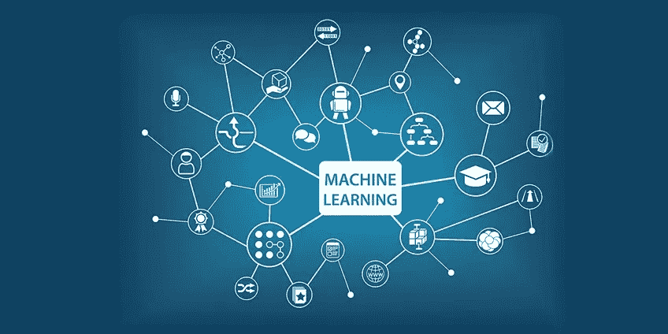

# 数学在机器学习中的作用

> 原文：<https://medium.com/analytics-vidhya/role-of-mathematics-in-machine-learning-afc75101f877?source=collection_archive---------4----------------------->

现在许多人都在计划向 AI/ML/数据科学世界的过渡，这非常令人鼓舞，也符合改变世界的步伐。

但是这些人对这样的问题感到困惑:

*   我想成为数学领域的专家，而不去钻研数学，这可能吗？
*   *为什么数学在数据科学和 AI/ML 世界中很重要？*