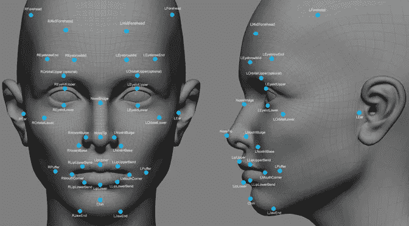

# 数学在机器学习中的作用

> 原文：<https://medium.com/analytics-vidhya/role-of-mathematics-in-machine-learning-f070e7cf6128?source=collection_archive---------13----------------------->

> “数据科学家比任何软件工程师都更擅长统计，比任何统计学家都更擅长软件工程。”-乔希·威尔斯

在当今世界，问任何一个技术人员，他们都会告诉你，这个行业最热门的工作都与数据和机器学习相关。难怪，这不可避免地引起了属于该行业的开发者和公司的极大兴趣。在机器学习和数据科学方面已经有了很多可用的资源和支持，统计工具，如 R 等编程语言和各种编程语言的库都是在这些努力中诞生的。

现在，机器学习的渴望者数量很多。然而，市场对机器学习工程师的需求很大，因为最终追求这一职位的人并不多。许多人不从事这一领域的部分原因是工作角色背后令人生畏的数学。虽然机器学习的普及已经产生了许多易于使用并得到广泛支持的 Python 和 r 库，但 scikit-learn、TensorFlow 和 OpenCV 等库确实通过提供某种机器学习的捷径使每个人的生活变得更容易，似乎*绕过了此类运算所需算法背后的数学。然而，机器学习背后的数学基本原理仍然保持不变。*

# 让我们讨论用于机器学习的数学的主要部分

> 机器学习的概念主要受益于四个数学部分: ***线性代数******微积分******统计*** 和 ***概率*** 。我们将大致了解为什么以及何时在机器学习模型的生命周期中应用这些数学分支。

## **线性代数**

机器学习最大程度上依赖于线性代数，线性代数用于求解联立线性方程。它是通过使用矩阵和矩阵运算来完成的。任何机器学习模型的数据通常以向量和矩阵的形式存储，所包含的值被认为是线性方程的系数。

线性代数

矩阵运算是优选的，因为机器学习通常处理大量数据，因此更容易应用标量运算，例如标量乘法和除法，以及通过各种矩阵运算的向量之间的运算，速度非常快且容易。

线性代数的知识对于决定如何在矩阵中存储数据是很重要的。例如，图片可以存储在三个矩阵中，每个元素分别包含矩阵中每个像素的红色、绿色和蓝色值的强度。现在对这些像素进行操作变得非常容易，因为使用了矩阵来应用线性代数。

## **微积分**

微积分被用来帮助机器学习算法提高预测的准确性。这是通过算法的优化过程来完成的。这是在微分的帮助下完成的。利用微分学，通过考虑函数的梯度，我们可以找到函数的极值。当一个函数有多个参数决定机器学习模型的预测时，使用多元微积分。它还有助于神经网络模型，其中微分用于计算反向传播误差。

梯度下降

此外，积分学还用于计算深度学习模型中的损失函数，以及绘制连续值的概率分布中特定变量的期望。

例如，经典的梯度下降问题，优化并找出球在碗中滚动的最低位置。这个用简单的微分学就解决了。

## **概率**

当算法没有结论性的结果，只有概率分布时，概率被用来做决策。一个算法可以输出一系列的值和它们的概率，这些值应该是预期的或真实的。这就是概率的用武之地，决策是基于一个变量的期望值的概率做出的。没有算法能够给出完全盲目可靠的输出。因此，概率被用来决定灰色区域的结果。

例如，如果我们找出样本中受帕金森病影响的人数及其年龄，我们将得到受帕金森病影响的人的年龄的概率分布。现在，如果要求我们选择受影响最大的年龄，我们可以选择最有可能受疾病影响的年龄范围。连续分布的决策过程需要概率。

## **统计**

统计学用于从数据中得出结论。各种统计方法可以应用于数据，以得出不同的结论，从而更好地理解数据。这种理解可以是找出数据的平均值、极值、范围，或者更复杂的结论，例如数据中离群值的欺骗、数据给出的函数的程度、数据的各种参数之间的相关系数、参数和算法的预期输出的相关性等等。还有假设检验，如卡方检验、z 检验、p 检验、ANOVA 等，它们检验假设的有效性，我们可以假设并在给定的数据上检验它。

> 现在让我们考虑一个简单易懂的例子，它大概包括了所有这些数学分支，这样我们就可以对它们的实现有所了解
> 
> 一个经典的例子是依靠机器学习的人脸识别算法。

*   示例数据集中图像的像素以向量的形式存储在矩阵中。这利用了 ***线性代数*** 。如果拍摄彩色图像，则利用根据所使用的颜色方案的多个矩阵，并将每个像素的强度存储在这些向量中。这使得处理数据变得容易，并有助于对它们进行矢量操作，这里是将现有的人脸与给定图片中的人脸进行比较。
*   ***演算*** 将在此处使用，以处理出现的误差梯度。绘制面的定义(存储为向量)和给定图片之间的误差梯度。如果梯度超过公差限制，则通过更新存储面的向量的系数来更新面的定义。
*   ***概率*** 用于通过计算给定图片中存在人脸的概率来决定给定图片中是否存在人脸。没有算法能够给出绝对正确和 100%可靠的输出。因此，应使用概率来决定结果。概率将输入与算法的容许因子进行比较。
*   ***统计*** 用于算法经历的各种过程，例如计算图像的各种参数和期望结果之间的相关性。统计学还被用于测试给定图像中存在人脸的假设，并且测试揭示了无效假设或替代假设是否被接受。

因此，我们可以看到，机器学习的每一点都严重依赖于数学。这就是为什么机器学习工程师需要对上面提到的数学部分有很强的把握。