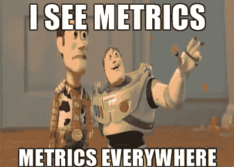
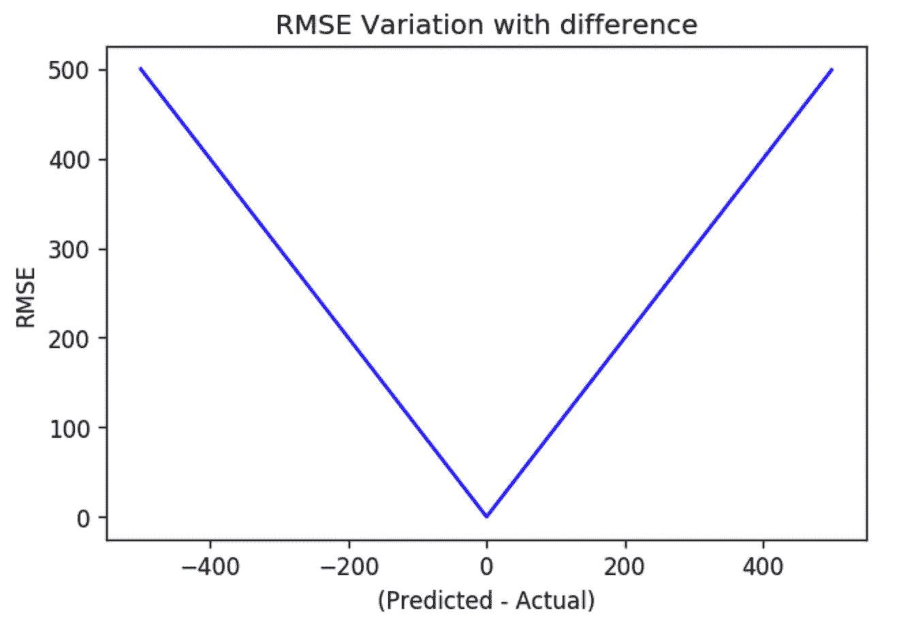

# RMSE 和 RMSLE 有什么不同？

> 原文：<https://medium.com/analytics-vidhya/root-mean-square-log-error-rmse-vs-rmlse-935c6cc1802a?source=collection_archive---------0----------------------->

# 介绍

当涉及到回归问题时，有许多评估指标，简而言之，均方根误差或 RMSE 是评估回归问题的“goto”方法之一，并且一直存在至今。

但最近，回归问题的评估指标中出现了一个通配符条目，特别是在[数据科学](https://courses.analyticsvidhya.com/courses/introduction-to-data-science-2?utm_source=medium&utm_medium=DifferenceBetweenRMSEandRMSLE)竞赛中，被称为**均方根对数误差**。

乍一看，似乎只是指标名称中的关键字“Log”有所不同。但是相信我，事情远不止看上去那么简单。在这篇短文中，我们将进一步了解 RMSLE，并将其与 RMSE 指标进行比较。如果您觉得需要快速复习一下 RMSE 评估指标，可以查看下面的链接

*   [重要评估指标](https://www.analyticsvidhya.com/blog/2016/02/7-important-model-evaluation-error-metrics/)

## 第一眼

在深入研究 RMSLE 的复杂性之前，让我们快速看一下公式。

**注意，在公式中，X 是预测值，Y 是实际值。**

当我们看到 RMSE 的公式时，它看起来就像一个对数函数的差。实际上，对数之间微小差异是赋予 RMSLE 独特属性的主要因素。

让我们逐一介绍。

## 对异常值影响的鲁棒性

在 RMSE 的情况下，异常值的存在可以将误差项放大到非常高的值。但是，在 RMLSE 的情况下，异常值急剧缩小，因此抵消了它们的影响。

让我们用一个小例子来理解这一点:

**认为预测值为 X，实际值为 Y**

Y = 60 80 90

X = 67 78 91

经计算，它们的 RMSE 和均方根误差分别为:4.242 和 0.6466

**现在让我们在数据中引入一个异常值**

Y = 60 80 90 750

X = 67 78 91 102

在这种情况下，RMSE 和均方根误差分别为:374.724 和 1.160

我们可以清楚地看到，一旦遇到异常值， **RMSE 的值就会在数量级**上爆炸。相比之下，即使引入异常值， **RMSLE 误差也不会受到太大影响**。从这个小例子中，我们可以清楚地推断，当离群值开始起作用时，RMSLE 是非常健壮的。

## 相对误差

如果只考虑 RMLSE 的内部部分，我们发现它根本上是一个计算相对误差。

由此，我们可以清楚地看到，由于对数的性质，RMLSE 可以被广泛地视为预测值和实际值之间的相对误差。

让我们借助一个例子来理解这一点。

**案例 1:**

Y = 100

X = 90

计算的均方根误差:0.1053

计算 RMSE: 10

乍一看，没有什么看起来华而不实的。让我们考虑另一个例子。

**案例二:**

认为

Y = 10000

X = 9000

计算 RMSLE: 0.1053

计算 RMSE : 1000

惊讶吗？

这两个例子完美地支持了我们上面提到的相对误差的论点， **RMSLE 度量只考虑了预测值和实际值之间的相对误差，误差的大小并不显著。另一方面，如果误差范围增大，RMSE 值的大小也会增大。**

## 有偏见的惩罚

这也许是为什么 RMSLE 被引入数据科学竞赛的最重要的因素。 **RMSLE 对实际变量的低估比高估招致更大的惩罚。**

简单地说，当预测值小于实际值时，会招致更多的惩罚。另一方面，当预测值大于实际值时，产生的损失较少。

我们用一个例子来理解。

**案例 1:低估实际值**

Y = 1000

X = 600

RMSE 算了一下:400

RMSLE 计算值:0.510

**情况 2:高估实际值**

Y = 1000

X = 1400

RMSE 算了一下:400

RMSLE 计算值:0.33

从这两种情况来看，很明显，RMLSE 因低估实际值而招致更大的损失。这**对于低估目标变量不可接受但高估可以容忍的商业案例特别有用。**

**例如:**

考虑一个回归问题，其中我们必须预测代理将食品交付给客户所需的时间。

现在，如果我们建立的回归模型高估了配送时间，那么配送员就会放松他配送食物的时间，这种微小的高估是可以接受的。

但当预测的送货时间少于实际行程所需时间时，问题就出现了，在这种情况下，送货代理更有可能错过截止日期，结果，客户评论可能会受到影响。

## 策划 RMSE 和 RMLSE

在这里，我绘制了 RMSE 曲线和 RMSLE 曲线。为此，我简单地假设我的实际值 Y 是 500，我定义了一个从 0 到 1000 的范围 X。一旦我定义了 X 和 Y，我计算了 X 和 Y 之间所有可能的差异的 RMSE 和 RMSLE

这些曲线将清楚地说明我们提出的关于低估实际值的额外惩罚的观点。

在 RMLSE 曲线的左半部分，我们清楚地看到，随着实际值低估的增加，误差迅速增加。而在右边，误差没有快速增加。

另一方面，RMSE 未能捕捉到预测值和实际值之间的任何特殊关系，它在零误差的两个方向上都是完全线性的。

RMSE 看起来不再那么令人印象深刻了，是吗？

你应该记住，在某些情况下，RMSE 可能仍然是一个更好的指标。所以，不要轻易放弃。

# 结束注释

在这里，我已经涵盖了回归问题的 RMSLE 度量的所有小细节。我们了解了 RMSLE 对异常值的稳健性，即计算预测值和实际值之间的相对误差的特性，我们还了解了 RMLSE 最独特的特性，即它对实际值低估的惩罚比对高估的惩罚更严重。

这就是我们结束这篇文章的原因，我希望你现在完全了解回归的 RMSLE 度量及其所有属性。