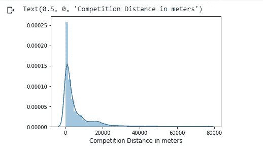

# 罗斯曼商店销售预测

> 原文：<https://medium.com/analytics-vidhya/rossmann-store-sales-prediction-998161027abf?source=collection_archive---------3----------------------->

这是我的第一个媒介故事。希望你会觉得有趣。

艾萨克·史密斯在 [Unsplash](https://unsplash.com?utm_source=medium&utm_medium=referral) 上拍摄的照片

## 目录:

1.  [简介](#c0fb)。
2.  [问题陈述和错误度量](#c67b)。
3.  [目标和数据信息](#d726)。
4.  [探索性数据分析](#d62c)。
5.  [特色工程](#251f)。
6.  [造型](#e216)。

## 简介:

对产品或服务的需求不断变化。如果不能准确估计客户需求和产品/服务的未来销售，任何企业都无法提高其财务绩效。销售预测是指估计特定时期内特定产品的需求或销售的过程。在这篇文章中，我将向你展示如何使用机器学习来预测来自 Kaggle 的现实世界商业问题的销售额。这个案例研究从头开始解决所有问题。所以，你将会看到在现实世界中案例研究是如何解决的每一个阶段。

## 问题陈述

Rossmann 在 7 个欧洲国家经营着 3000 多家药店。目前，罗斯曼商店经理的任务是提前六周预测他们的日销售额。商店销售受许多因素影响，包括促销、竞争、学校和国家假期、季节性和地点。数以千计的经理根据他们独特的情况预测销售，结果的准确性可能会有很大的差异。

## 误差度量:均方根百分比误差(RMSPE)

度量标准的公式如下:

## 目标:

1.给定数据，提前预测 6 周的销售额。

2.尽可能最小化给定的指标。

## 数据:

数据可以从[这里下载。](https://www.kaggle.com/c/rossmann-store-sales/data)

提供的文件有:

1.  train.csv
2.  test.csv
3.  store.csv

**数据字段:**

● **Id -** 表示测试集中的(商店，日期)副本的 Id。

● **商店-** 每个商店的唯一 Id。

● **销售-** 任何一天的营业额(这是你预测的)。

● **客户-** 某一天的客户数量。

● **开门-** 店铺是否开门的指标:0 =关门，1 =开门。

● **法定假日-** 表示法定假日。通常，除了少数例外，所有的商店在法定假日都不营业。请注意，所有学校在公共假日和周末都关闭。a =公共假期，b =复活节假期，c =圣诞节，0 =无。

● **SchoolHoliday -** 表示(商店，日期)是否受到公立学校关闭的影响。

● **商店类型-** 区分 4 种不同的商店模式:a、b、c、d。

● **产品组合-** 描述产品组合级别:a =基本，b =附加，c =扩展。

● **竞争距离-** 到最近的竞争对手商店的米距离。

●**competition on pension[月/年] -** 给出最近的竞争者开业的大概年月。

● **促销-** 表示当天商店是否在进行促销。

● **Promo2 -** Promo2 是部分店铺持续不断的促销:0 =店铺不参与，1 =店铺参与。

●**Promo2 since[Year/Week]-**描述商店开始参与 promo 2 的年份和日历周。

● **促销间隔-** 描述促销 2 开始的连续间隔，命名促销重新开始的月份。例如，“二月、五月、八月、十一月”是指该商店在任何给定年份的二月、五月、八月、十一月开始每一轮。

# 探索性数据分析

让我们执行 EDA 来深入了解给定的数据。

关于 train.csv 的信息如下:

train.info()

正如我们在这里看到的，我们有大约 100 万个数据点。另外，由于这是一个时间序列预测问题，我们必须根据日期对数据进行排序。

这里我们的目标变量是**销售额。**

关于 store.csv 的信息如下:

store.info()

我们总共有 1115 家独特的商店。这里的许多列都是空值。我们一会儿会照顾他们的。

现在让我们检查数据中的列信息。

## 宣传片:

针对销售和客户的促销栏。

我们可以看到，在促销期间，销售额和客户数量都有大幅增长。这说明促销对一个店是有正面作用的。

## 销售:

一周的平均销售额。

有趣的是，圣诞节和新年(见图表中接近 52 的几周)会导致销售额增加。由于 Rossmann Stores 销售健康和美容产品，可以猜测，在圣诞节和新年期间，人们外出庆祝时会购买美容产品，这可能是销售额突然增加的原因。

## 星期几:

针对 DayOfWeek 列的销售和客户。

在这里，我们观察到星期天的销售和顾客都很少，因为大多数商店在星期天关门。

此外，周一的销售额是一周中最高的。这可能是因为商店周日不营业。

## 打开:

存储一周内的开放信息。

这清楚地表明大多数商店在星期天仍然关门。一些商店在工作日也关门了，这可能是由于法定假日，因为商店通常在法定假日期间关门，在学校假日期间开门。

## 国家和学校假期:

销售和客户根据国家节假日。

销售和客户根据学校假期。

我们可以观察到，在国家和学校放假期间，大多数商店仍然关闭。但有趣的是，在学校放假期间开门营业的商店数量比在法定假日期间要多。

另一件需要注意的重要事情是，学校放假期间开门营业的商店比平时有更多的销售。

## 商店类型:

根据商店的商店类型的顾客和销售。

我们可以看到，类型 A 的商店有更高的总顾客量和销售额。StoreType D 在销售额和客户数量上都位居第二。

## 竞争养老金年度:

竞赛分布图自 2004 年开始公开.

大多数商店在 2000 年后开始竞争。

## 季节性的傅立叶分析:

存储类型“A”。

存储类型“B”。

StoreType“C”。

StoreType 'D '。

这里我们绘制了每种商店类型的销售额。

在上图中，我们可以看到在特定的频率上有一些尖峰。这表明商店销售数据中存在季节性因素。

因此，我们可以使用这些傅立叶特征来表示数据的季节性。

## 竞争力:

商店竞争距离的分布。

我们可以清楚地看到，大多数商店的竞争对手都在 5 公里范围内。

## EDA 的结论:

*   最畅销和最拥挤的商店类型是 a。
*   销售额与顾客数量密切相关。
*   对所有的商店来说，促销会导致销售额和顾客数量的增加。
*   学校放假期间开门的商店比平时有更多的销售。
*   学校放假期间开门的商店比法定假日还多。
*   圣诞节期间的销售额增加了，这可能是因为人们在圣诞节期间购买了更多的美容产品。
*   功能 competitionopenyear/Month 中缺少值并不表示缺少竞争，因为 CompetitionDistance 值不为空，而其他两个值为空。
*   在使用傅立叶分解分析销售后，我发现销售数据中有一点季节性成分。

# 特色工程和小东西

## 离群值列:

在这里，我将创建一个列，根据中位数绝对偏差(MAD)来指示销售值是否为异常值。

疯狂的公式。

我已经按存储方式创建了离群列，这意味着我已经为每个唯一的存储分别做了这些工作，然后将数据连接起来。

## 日期功能:

日期功能。

首先，我们将使用 pandas 的 to_datetime 函数转换日期列。之后，我们可以简单地从日期中提取其他特征。

## 本周、上周和下周的假期:

在这里，我创建了三个特性，显示当前周、上周和下周的假期总数。代码可以在我的 Github [这里看到。](https://github.com/keshav5196/Rossmann-Store-Sales/blob/main/Rossmann%20Store%20Sales%20Feature%20Engineering.ipynb)

## 国家假日柜台:

以上是我用来创建 2 个新功能的函数。一个显示离法定假日还有多少天，另一个显示法定假日过后还有多少天。

## 促销和学校假期柜台:

与上述功能相同，我创建了另外 4 个功能，指示促销或学校假期之前或之后的天数。github 上的代码[这里](https://github.com/keshav5196/Rossmann-Store-Sales/blob/main/Rossmann%20Store%20Sales%20Feature%20Engineering.ipynb)。

## 关闭的虚拟变量:

这个特性只有两个值+1 或-1。+1 如果商店昨天或明天关门，否则-1。

## 删除零销售额积分:

此处，带有零的数据点被删除，因为这些点表示特定商店因任何原因关闭。如果我们有一家商店没有开门，我们可以简单地预测零销售额。

## 每日销售额、每日客户数和每日销售额:

特性的名称只是暗示了它们的含义。这里不需要进一步解释。

## 竞赛公开和促销公开:

在这里，我们只是将这两个特征从“年”作为一个单位转换为“月”作为一个单位。

## 使用 Promointerval 生成要素:

Promointerval 以这样的形式给出:五月，八月，十一月。现在，我们将简单地将它们分开，就像五月是一个特征，八月是第二个特征，十一月是第三个特征。

## 销售的变化和加速:

变化= y - (y-1)，y =销售额

加速度= [(y-1) - (y-2)]，y =销售额

## 傅立叶特征:

这里我简单地使用 numpy 的 fft 函数来计算傅立叶频率和振幅。然后，将它们用作特征。

## 一些其他功能:

这些包括一周、促销、假期等的集中趋势。

## 外部数据:

对于额外的数据，只有两个。一个是州数据，表示商店属于哪个州，另一个是某个州在特定日期的天气数据。

其他数据/信息取自[此处](https://www.kaggle.com/c/rossmann-store-sales/discussion/17229)。

## VIF 分析:

添加完所有要素后，我执行了 VIF 分析来检查要素之间的共线性。具有高度共线性的特征被简单地丢弃。

让我们现在做一些模型。

# 系统模型化

## 基本型号:

这些是我在创建基本模型时保留的特征:

' Store '，' dayOfWeek '，' Promo '，' StateHoliday '，' SchoolHoliday '，' StoreType '，' Distance '，' CompetitionOpenSinceMonth '，' CompetitionOpenSinceYear '，' Promo2SinceWeek '，' Promo2SinceYear '，' Year '，' Month '，' Day '，' WeekOfYear '，' Day ' SalesPerDay '，' Customers_per_day '，' Sales _ Per _ Per _ Customers _ Per _ Per _ Day '，' PromoInterval0 '，' PromoInterval1 '，' PromoInterval

为了预处理数据，我使用了 sklearn 管道和 ColumnTransformer。

数值用中值估算，分类值用最频繁值估算。数值也按比例缩放。

现在将数据分为训练和验证。

对于基本模型，我使用简单的随机森林回归器和默认配置。

## 功能选择:

创建上述基础模型后，我对特征工程部分生成的所有新特征进行了正向特征选择。

以下是最后留下的功能:

商店'，' DayOfWeek '，'促销'，' StateHoliday '，' SchoolHoliday '，' StoreType '，'分类'，'竞争'距离'，'竞争'养老金'月'，'促销 2 '自周'，'促销 2 '自年'，'年'，'月'，'日'，'周'年'，'日'，'销售日'，'客户 _ 日'，'销售 _ 每 _ 日'，'销售 _ 每 _ 客户 _ 每 _ 日'，'促销间隔 0 '，'促销间隔 1 '，'促销间隔 2 '，'促销间隔 3 '，'加速'，'促销 _ 前 _ 日'，'促销 _ 后 _ 日'，'频率 _2 '

现在有了这些功能，我们可以尝试不同的模型。

下面是具有新功能的管道:

对于所有模型，使用试错法选择最佳参数。

## 新币回归量:

对于这个分数是:

## 决策树回归器:

对于这个分数是:

## 随机森林回归量:

对于这个分数是:

## 轻型 GBM 型号:

该模型的得分为:

## 元学习:

这种方法定义如下:

1.  将数据分成 80-20 份。
2.  把火车分成两部分，D1 和 D2。
3.  从 D1 抽取 9 个样本，对所有样本训练一个随机森林回归模型。
4.  从这 9 个模型中预测 D2。使用这 9 个预测作为特征，并使用 D2 y_original 作为输出来训练新模型。
5.  现在，对于测试集，使用 9 个模型预测它，并将 9 个预测作为特征传递给元模型。使用来自元模型的预测作为最终预测。

对于这种方法，得分为:

## 结论:

所有分数表。

从上表我们可以推断出最佳模型是轻型 GBM 模型。

# 未来工作:

随着深度学习的发展，为了进一步提高给定数据集的性能，LSTM 可能是一个很好的起点。

可以使用一些其他的集成技术来检查它们是否能够改善结果。

# 参考资料:

[离群值让我们发疯:单变量离群值检测](/james-blogs/outliers-make-us-go-mad-univariate-outlier-detection-b3a72f1ea8c7)

[多重共线性|检测与 VIF 的多重共线性](https://www.analyticsvidhya.com/blog/2020/03/what-is-multicollinearity/)

[缺失数据难题:探索和插补技术](/ibm-data-science-experience/missing-data-conundrum-exploration-and-imputation-techniques-9f40abe0fd87)

[朱庇特笔记本浏览器](https://nbviewer.jupyter.org/github/JohanManders/ROSSMANN-KAGGLE/blob/master/ROSSMANN%20STORE%20SALES%20COMPETITION%20KAGGLE.ipynb)

 [## 罗斯曼商店销售

### 使用商店、促销和竞争对手数据预测销售额

www.kaggle.com](https://www.kaggle.com/c/rossmann-store-sales/discussion) 

可以在这里联系我 [LinkedIn](http://www.linkedin.com/in/keshav-rawat) 和 [Github](https://github.com/keshav5196) 。