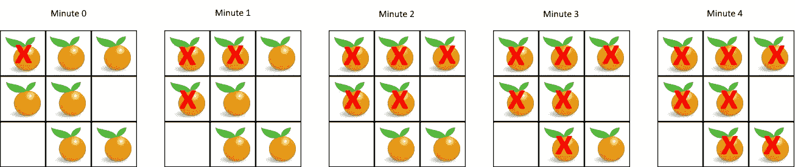

# 腐烂的橙子—第三天(蟒蛇)

> 原文：<https://medium.com/analytics-vidhya/rotten-oranges-day-3-python-83a313d20f65?source=collection_archive---------3----------------------->


照片由 [Brienne Hong](https://unsplash.com/@briennehong?utm_source=medium&utm_medium=referral) 在 [Unsplash](https://unsplash.com?utm_source=medium&utm_medium=referral) 上拍摄

烂橘子问题是面试中最常被问到的问题之一，尤其是亚马逊。让我们深入探讨这个问题。

[**994**](https://leetcode.com/problems/rotting-oranges/) **。腐烂的橙子**

在给定的网格中，每个单元格可以有三个值之一:

*   代表空单元格的值`0`；
*   代表新鲜橙子的值`1`;
*   代表一个腐烂的橙子的值`2`。

每一分钟，任何与腐烂的橙子相邻的新鲜橙子都会腐烂。

返回没有单元格呈现新鲜橙色之前必须经过的最少分钟数。如果这是不可能的，返回`-1`代替。

例 1:



```
**Input:** [[2,1,1],[1,1,0],[0,1,1]]
**Output:** 4
```

**例 2:**

```
**Input:** [[2,1,1],[0,1,1],[1,0,1]]
**Output:** -1
**Explanation: ** The orange in the bottom left corner (row 2, column 0) is never rotten, because rotting only happens 4-directionally.
```

**例 3:**

```
**Input:** [[0,2]]
**Output:** 0
**Explanation: ** Since there are already no fresh oranges at minute 0, the answer is just 0.
```

**注:**

1.  `1 <= grid.length <= 10`
2.  `1 <= grid[0].length <= 10`
3.  `grid[i][j]`只有`0`、`1`，或者`2`。

我已经学会了使用广度优先搜索算法，当我们需要找到最短的距离或最短的时间来完成网格或树中的一些任务。

在上面的问题中，我们需要找到所有橙子腐烂所需的最短时间，因此我们将使用 BFS 来解决上面的问题。

为了求解 BFS，我们需要一个堆栈和一个队列。通常，BFS 是用迭代法求解的。使用递归求解 BFS 具有更高的复杂性。

让我们立即着手解决这个问题。

我们需要一个包含腐烂橙子坐标的队列和一个包含新鲜橙子坐标的集合。

```
 fresh_set = set()
 rotten = []
 for row in range(len(grid)):
     for col in range(len(grid[row])):
         if grid[row][col] == 2:
             rotten.append((row, col, 0))
         elif grid[row][col] == 1:
             fresh_set.add((row, col))
```

在这个问题中，邻居被认为是在 4 个方向上相邻的块。我们需要计算可能的邻居。

```
valid_row = [-1, 0, 0, 1]
valid_col = [0, -1, 1, 0]
```

直到我们的队列有元素，我们从队列的前面弹出坐标。也要记录所采取的步骤。检查邻居中是否有新鲜的橙子，如果有，将坐标推入队列，并将其从新鲜组中移除。

如果队列是空的，检查是否还有新鲜的橙子。如果是，返回-1(这是问题要求我们做的)。否则返回步骤号。

```
while(rotten):
    row, col, time = rotten.pop(0)
    for neigh in range(len(valid_row)):
        new_row = row+valid_row[neigh]
        new_col = col+valid_col[neigh] # Checks if the orange at this position is fresh and the co-ordinates are not outside the boundary
        if(self.is_safe(new_row, new_col, grid)):
            grid[new_row][new_col] = 2
            rotten.append((new_row, new_col, time+1))
            fresh_set.remove((new_row, new_col))
 return -1 if fresh_set else time
```

完整的解决方案如下。

```
class Solution:
    def is_safe(self, row, col, grid):
        return(0<= row< len(grid) and
               0<= col< len(grid[0]) and
               grid[row][col] == 1)
    def orangesRotting(self, grid: List[List[int]]) -> int:
        fresh_set = set()
        rotten = []
        for row in range(len(grid)):
            for col in range(len(grid[row])):
                if grid[row][col] == 2:
                    rotten.append((row, col, 0))
                elif grid[row][col] == 1:
                    fresh_set.add((row, col))
        if rotten == [] and not fresh_set:
            return 0
        elif rotten == []:
            return -1

        valid_row = [-1, 0, 0, 1]
        valid_col = [0, -1, 1, 0]
        while(rotten):
            row, col, time = rotten.pop(0)
            for neigh in range(len(valid_row)):
                new_row = row+valid_row[neigh]
                new_col = col+valid_col[neigh]
                if(self.is_safe(new_row, new_col, grid)):
                    grid[new_row][new_col] = 2
                    rotten.append((new_row, new_col, time+1))
                    fresh_set.remove((new_row, new_col))
        return -1 if fresh_set else time
```

复杂性分析

**时间复杂度**

我们需要扫描网格中的每个区块。扫描每个块需要 O(N*M)，其中 N 是行数，M 是列数。

**空间复杂度**

在最坏的情况下，我们网格中的所有橙子都腐烂了。然后，我们需要在队列中存储坐标，这需要 O(N * M ),其中 N 是网格的行数，M 是列数。

如果你发现文章中有错误，请告诉我。此外，我想提高我的写作技巧，所以任何建议或批评都非常欢迎。