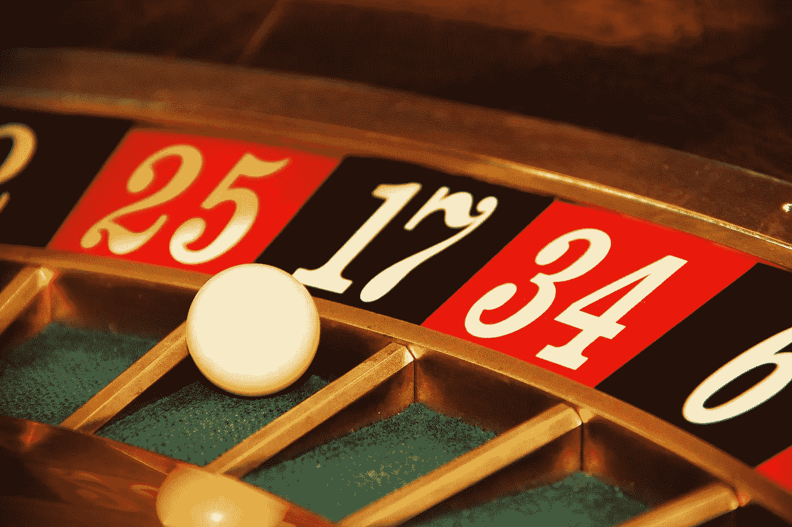
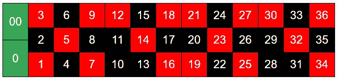
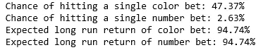
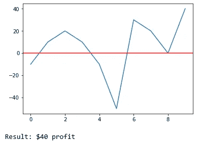
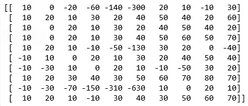
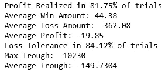
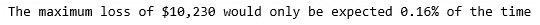
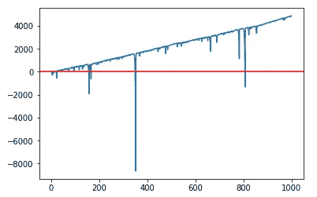
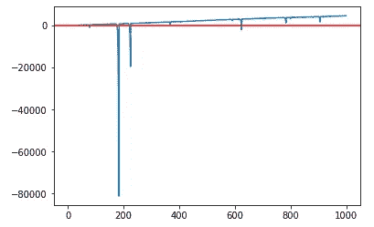

# 轮盘赌钱机

> 原文：<https://medium.com/analytics-vidhya/roulette-money-machine-6c9a5980461?source=collection_archive---------26----------------------->

剧透警告:不存在。

多年前，在一次午休时，我的一位同事想出了这个绝妙的赚钱策略:

1.  带着一把美元去新泽西州的大西洋城旅行
2.  在轮盘赌上押红色或黑色
3.  如果你输了，加倍下注
4.  最终你会打出你的颜色，甚至可能在第一次旋转的时候！
5.  你不可避免的胜利保证了你的利润等于你最初的赌注
6.  重复获得无限利润

现在，你可能意识到为什么这是愚蠢的。如果它真的起作用，有人已经想到了，提供轮盘赌的赌场将会破产。但是如果你一次考虑 6 个步骤，它几乎…有意义？最终你会打出你的颜色。通过每次加倍下注，你可以保证获利。那你为什么不直接冲洗然后重复呢？这一切哪里出错了？让我们建立一个模拟来看看为什么这个策略最终会失败。

## 游戏

如果你不熟悉轮盘赌，基础很简单。一个包含 38 个数字的轮子原地旋转，在每一轮开始时，庄家在边缘旋转一个小白球。玩家在他们认为球会落地的地方下注。这个游戏的标准美国版本有数字 1-36 以及 0 和 00。在游戏中，您可以进行多种组合下注(全是偶数、前 12 个、拆分号码)，但出于测试目的，我们将保持简单，只关注两种下注:

击中一个颜色支付 1:1。例句:如果你押 10 美元赌红色，如果它中了，你就能拿回 20 美元，获得 10 美元的利润。击中一个数字会得到 35:1 的回报，例如:如果你在 7 上赌 10 美元，而它击中了，你就能赢回 360 美元，获得 350 美元的利润。

正如您在这张下注区的简化图中所看到的，颜色分配给数字的方式有一些细微差别。红黑图案反转三次，这可以在下面的创建代码中看到。

## 设置

现在我们有了字典中所有的数字和相应的颜色。随机返回一个条目将代表旋转轮子。

在我们开始运行一些测试之前，通过使用一些基本的数学知识，我们就知道这两种策略从长远来看都是失败的。赌一个颜色会赢~47.37%的几率，而一个号码会赢~2.63%的几率。当我们将每一次下注的价值相加时，我们可以看到，通过这两种策略，我们可以预期从长期赌注中收回 94.74%的金额。

*[1]见鬼，我们不用做任何计算就知道这是真的，仅仅因为赌场里有轮盘赌。*

现在，让我们写一些函数来帮助我们运行一些测试。

## 颜色下注策略

现在让我们来测试一下我们在开始时介绍的策略:“颜色下注”策略。我们将坚持使用一种颜色，并旋转轮子 n 次。我们将从最初的赌注开始，如果我们输了，我们将翻倍。任何时候我们赢了，我们都会在下一轮回到最初的赌注。下面是我们将用来跟踪结果的函数:

如果我们在连续 10 次旋转中使用颜色下注策略，可能会发生以下情况:

40 美元的利润！很好。但是很明显我们的结果会有很大的变化。让我们运行策略的一系列迭代，看看我们能从中收集到什么。每次试验仍然是 10 次旋转，但我们将运行 100，000 次，而不是一次。

## 长期调查结果

这个数组是我们的累积利润在轮子每次旋转后的样子。每一行都是不同的试验，最后一列代表每一行的最终累积利润。

让我们通过将 color_sim_arr 传递给 findings()函数来分解一些关于测试的统计数据:

所以 81.75%的时候，我们的策略产生了利润！这看起来很有希望，对吗？然而，我们从前面知道，从长远来看，我们无法战胜游戏。那么发生了什么？接下来的几个数据说明了这个问题。我们的平均亏损远远高于我们的平均盈利，导致长期平均每次亏损近 20 美元。所以当我们输了，我们输得很惨！在我们的试验结束时，只要连续输几次，损失就会迅速增加。

但事实是，如果我们想运行这个策略一次，我们可以相信 5 次中有 4 次我们会看到某种利润。然而，在 84%的时间里，在 10 次旋转中的某个时间点，你觉得输钱没问题吗？如果你在一次平均获胜的尝试中只赚了 44 美元，而你的平均亏损额是 150 美元，那该怎么办？如果不可思议的事情发生了，你输掉了所有的 10 次旋转怎么办！如果开始下注 10 美元，你可能会输掉 10，230 美元！虽然，这种情况很少见:

## 让我们继续旋转…

如果你在一次试验中没有在 10 次旋转时停止呢？你认为会发生什么？最终你会击中，你的利润将继续上升…但这看起来可能是这样的:

这是一个示例结果。你可以看到利润确实呈上升趋势。但是随着你旋转的次数越来越多，打出长连败的概率就变成了统计上的必然。你能承受 8，000 美元的损失吗？这意味着你的下一个赌注是 16，000 美元。除非你能在轮盘赌桌上下最大的赌注，而且大多数人可能没有足够的流动现金来玩轮盘赌，否则最终你会遇到这个问题，你的赚钱机器梦想也会破灭。

这还不是最糟糕的。看看这个潜在的结果:

下降了 8 万美元！

我们之前在 10 次尾旋测试中总结的可变性和结论都适用于此，只是规模更大。还有比这更糟糕的连败！

哦好吧。也许我们应该学着在 21 点桌上算牌…

开玩笑的。