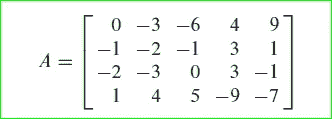
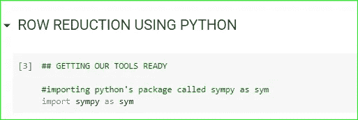
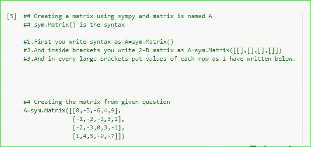
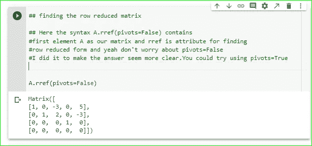

# 使用 PYTHON 减少行

> 原文：<https://medium.com/analytics-vidhya/row-reduction-using-python-75c2e4d75df3?source=collection_archive---------4----------------------->

嘿数学家/计算机科学家！！！！

线性代数是解释许多现实世界问题的最重要的数学领域之一。

解决这些问题的第一步是首先应用初等行运算来了解行归约。

我们可以自己动手解决这些问题，我们可以解决一些小问题，但当涉及到更大的方程组时，就变得非常复杂了。

为了解决这些问题，机器被开发出来了，对吗？

我有自己的经历，当我自己解决那些大型方程组时，我挣扎了很久，但后来我寻找工具来解决它。我找到了 MATLAB，但是我们需要付费。最终我找到了免费且灵活的 python。所以，我们用在这里。

机器使我们的工作变得更容易，因此，通过本文，您将能够熟练地在 breeze 中求解大型方程组。我们用来解决这些问题的工具将是 python。

伙计们，我们开始吧:

## **第一步:打开环境**

打开你的 JUPYTER 笔记本或者任何 PYTHON IDEs 都可以，但是这里我们将使用 google colab。但是如果你不知道 jupyter notebook 或任何 ide，不要担心，你可以通过这个链接去[***Google colab***](https://colab.research.google.com/notebooks/intro.ipynb#recent=true)和我在这里做的一样。

下面是我们将要解决的问题，并且是以扩充的形式。

作为一个学习线性代数的人，你应该知道如何写矩阵的增广形式，好吗！！！

问题取自大卫 c .雷线性代数书。

**第二步:导入工具**

现在我们将使用 python 的 **SYMPY** 模块来创建矩阵。但是在这一步中，您将导入模块 sympy，如下所示。

注意:每次写完代码后按 SHIFT+ENTER 运行单元格。

## **第三步:创建矩阵**

现在，我们将使用上述问题创建矩阵。

## **第四步:获取结果**

这里，我们得到了我们想要的行简化矩阵。

## **结论:**

所以从给定的行简化矩阵得出的结论是:

1.它由解组成，因为它没有 b 不等于零的[0 0 0…0:b]形式的行。因此，这是一致的。

2.它由一个自由变量组成，从最后一行可以看出，所以它有无穷多个解。因此，它不是唯一的。

## **使用工具的好处:**

1.  轻松解决大型方程组。
2.  检查我们自己的答案可能是另一个应用，因为我们可能会犯符号错误，但机器不会。

# 注意:它适用于任何矩阵。

## **奖金:**

如果你被困在中间或者你的代码不工作，那么你可以通过我的 **Github** 回购，链接在下面。

 [## anjanpa/线性代数

### 此时您不能执行该操作。您已使用另一个标签页或窗口登录。您已在另一个选项卡中注销，或者…

github.com](https://github.com/anjanpa/LINEAR-ALGEBRA) 

所以朋友们，感谢你们对我的理解，我希望你们至少从这篇文章中获得了一点知识。

我仍然是。谢谢你。