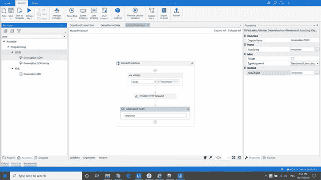

# RPA & AI:使用 RPA 工作流的保险索赔审批第 1 部分

> 原文：<https://medium.com/analytics-vidhya/rpa-ai-insurance-claims-approval-part-1-with-rpa-workflow-7ca37073ccea?source=collection_archive---------8----------------------->

保险索赔审批是 RPA & AI 的概念验证(POC)项目。该 POC 旨在实现保险索赔审批流程的自动化，在实践中，it 部门要花费大量时间进行检查。这里的好消息是，你可以让你的“虚拟员工”从过去的经验(数据)中学习来处理它。

下面是保险索赔审批的[视频](https://www.youtube.com/watch?v=aWVwZ0k0aVg&t=2s):

https://www.youtube.com/watch?v=aWVwZ0k0aVg&t = 2sT2

从概念上讲，RPA & AI 项目将分为 3 个步骤:

*   **RPA 工作流创建**
*   ML/DL 模型训练
*   模型服务

# 保险索赔审批 RPA 工作流(UiPath)

## 下载 UiPath Studio

让我们从构建 RPA 工作流开始。在此之前，我们需要下载构建工作流的必备工具— [**UiPath Studio**](https://www.uipath.com/start-trial) 。点击链接[这里是](https://www.uipath.com/start-trial)接着选择“社区云”版本。

社区云版本

当你点击“尝试”按钮后，它会要求你注册一个个人帐户。完成注册过程后，您需要使用您的注册帐户登录。

到“资源中心”下载“社区版”。通过单击“UiPathStudioSetup.exe”文件安装您的 UiPath studio，并完成设置。

安装完成后，您应该可以开始工作了！

## 创建新的项目工作流

通过在窗口搜索栏上键入 UiPath 找到您的 UiPath Studio，然后双击 UiPath Studio 应用程序。

打开 UiPath Studio

在您看到 UiPath Studio 应用程序成功启动后，让我们通过单击“新建项目”选项卡下的“流程”来创建一个新项目。通过在文本栏中键入“InsuranceClaimsApproval”插入您的新流程名称，然后单击“Create”按钮。

创建新流程

至于这个演示示例，我将使用“HubSpotCRM”来上传我的合成索赔表，以便我可以模拟保险索赔检查的实际过程。(注意:出于保密原因，我在这个演示中没有使用实际的保险索赔系统。)如果您有兴趣复制此演示，请单击[这里是](https://www.hubspot.com/pricing/crm)以获得您的免费 CRM 帐户。

## “OpenCRM”工作流程

在 UiPath studio 中，创建一个新的序列名称“OpenCRM ”,在项目面板中，您将看到“OpenCRM.xaml”工作流已创建。

1.  双击项目面板中的“Main.xaml ”,将“OpenCRM.xaml”工作流拖放到“Main.xaml”序列框中。
2.  双击项目面板中的“OpenCRM.xaml”工作流。
3.  在项目面板的底部，单击“活动”选项卡，通过在“搜索活动(Ctrl+Alt+F)”面板中键入“打开浏览器”来搜索活动。
4.  将“打开浏览器”活动拖放到“OpenCRM”序列中。
5.  将“https://app.hubspot.com/login”粘贴到输入 Url 选项卡中，并确保您的“BrowserType”是 IE。

6.打开你的网络浏览器，导航到"https://app.hubspot.com/login"。

7.回到 UiPath studio，搜索“输入”活动，在“打开浏览器”活动面板中拖放。点击“指示浏览器中的元素”，然后选择用户名文本栏。键入您的帐户用户名。

8.将另一个“键入”活动拖放到第一个“键入”活动之后。点击“指示浏览器内的元素”，然后选择密码文本栏。键入您的帐户密码。

9.搜索“单击”活动，将鼠标拖放到第二个“键入”活动后，单击“在浏览器中指示元素”。选择网页上的“登录”按钮。

10.成功登录 HubSpot 后，您需要点击文档选项卡。因此，在您的 RPA 工作流中，找到“单击图像”活动，拖放到“登录”活动之后。点击“指示浏览器内的元素”，选择 HubSpot 页面上的“销售”选项卡。

11.搜索“Anchor Base”活动，选择“sales”后将其拖放到工作流中。随后，找到“查找图像”活动，拖放到“锚点”框中。点击“指示浏览器内的元素”，再次选择 HubSpot 页面上的“销售”选项卡。

12.对于“将操作活动拖放到此处”，搜索“点击图像”活动，拖放到该活动上。点击“在浏览器中指示元素”，选择 HubSpot 页面上的“文档”选项卡。

13.就在“锚定基础”活动之后，搜索“延迟”拖放到工作流中。点击"延迟"，在右边面板你会看到"持续时间"文本插入框。键入“00:00:05”使工作流休眠 5 秒钟。这样做的目的是让网页在继续下一步操作之前完全加载。

## “下载声明表单”工作流

对于这个演示项目，我们只使用 4 个表格来代表 4 个不同的个人提交的保险索赔。因此，第二个工作流应该从 while 循环开始，从 HubSpot 下载所有可用的表单。

1.  创建一个名为“DownloadClaimsForm”的新序列，在项目面板中，您将看到“DownloadClaimsForm.xaml”工作流已创建。
2.  将“DownloadClaimsForm.xaml”拖放到“Main.xaml”工作流中，将其放在“OpenCRM.xaml”工作流之后。
3.  双击项目面板中的“DownloadClaimsForm.xaml”工作流，您将进入“DownloadClaimsForm.xaml”的编辑面板。
4.  在“搜索活动”面板中，搜索“While”，将“While”活动拖放到“DownloadClaimsForm.xaml”工作流中。
5.  在 UiPath Studio 的底部，找到“变量”选项卡并单击它。点击“创建变量”，将变量重命名为“I”。将“变量类型”更改为“Int32”，并将“默认值”设置为“0”
6.  在“While”循环活动下，键入“I< 4” inside “Condition” insertion text box.

7\. For the next steps, we will click in each claims form page to download the forms. Hence, we will drag & drop in several click activity to download the forms.

Meanwhile, there are some important notes to mention here. Basically, when we are looping through several forms, we should make sure the selector is dynamic so that it can effectively download all the available file. Imagine now that you have 1000 available claims form need to be download and perform inspection. Hence, for the selector of “click” activity on “InsuranceClaimsForm0001.xlsx”. following steps should be performed.

8\. Search for Selector under “Target” menu from the right side “Properties” panel.

9\. Find for aaname=’InsuranceClaimsForm0001.xlsx’

10\. Change it to aaname=’InsuranceClaimsForm000"+(i + ).ToString()+”.xlsx’

After changing the selector, we will need to instruct RPA to save the claims form into a dedicated folder.

11\. In your HubSpot web page, manually click on the “download” button. IE should prompt a notification bar to ask for file saving confirmation.

12\. Go back to UiPath studio, drag and drop click activity right after “click download” activity. Click on “Indicate element inside browser”, click on the notification bar that contain text “Do you want to open or save*”.

13\. Go back to UiPath studio, drag and drop another click activity right after the last activity. Click on “Indicate element inside browser” and select the drop down button beside “Save”.

14\. In UiPath Studio, search for “Send Hotkey” activity, drag and drop it right after the last activity. Click on “Indicate element inside browser” and select the drop down button beside “Save”. On “send Hotkey” activity, under “Key” drop down selection box, choose “down”.

15\. Drag & drop another “Send Hotkey” activity, put it right after the last “Send Hotkey” activity. Click on “Indicate element inside browser” and select the drop down button beside “Save”. On “send Hotkey” activity, under “Key” drop down selection box, choose “enter”.

16\. Manually click “Save as” on the notification bar, a file save pop up window should appear.

17\. In UiPath studio, drag and drop a “Type Into” activity right after last “Send Hotkey” activity. Click on “Indicate element inside browser” and select the text box where you type in a desirable file name.

18\. In “Type Into” activity, type in ***”***目录。GetCurrentDirectory()+" \ insuraceclaims form "+(I+1)。ToString() +"。xlsx "

*19.将“点击”活动拖放到最后一个“键入”活动之后。单击“在浏览器中指示元素”,然后在保存文件窗口中单击“保存”按钮。*

*20.将另一个“点击”活动拖放到上一个“点击”活动之后。点击“指示浏览器内的元素”,然后点击保存文件通知栏上的“x”按钮。*

**

*在结束“DownloadClaimsForm”工作流之前，我们将创建另一个工作流调用“ExtractFormsData”。“ExtractFormsData”工作流将在“DownloadClaimsForm”工作流中调用，此工作流预计将在步骤 20 活动后立即执行。*

*21.创建一个新序列，命名为“ExtractFormsData”。一旦创建了序列，将“ExtractFormsData.xaml”拖放到上一步之后(步骤 20)。*

*22.现在，搜索“附加浏览器”活动。将“附加浏览器”活动拖放到“ExtractFormsData.xaml”工作流之后。点击“指示浏览器中的元素”,然后点击 HubSpot 网页中的任何空白区域。*

*23.搜索“导航至”活动，在“连接浏览器”活动中拖放。在文本框中键入文档的 url。文档 url 的一个例子是“https://app . hubspot . com/documents/1002000”*

*24.搜索“分配”活动，拖放到“连接浏览器”活动之后。在“分配”活动中，键入“i = i + 1”。然后，搜索“延迟”活动，将其拖放到“分配”活动之后。在右侧“属性”面板的持续时间文本框中键入“00:00:05”。*

**

## *“提取表单数据”工作流*

*在我们成功地下载了索赔表格之后，我们需要提取表格中包含的所有信息。感谢 RPA，它提供了一个预定义的活动，允许用户从表单中提取变量。在我们继续创建这个新的工作流之前，我们需要返回到“DownloadClaimsForm”工作流，将一个参数值传递给“ExtractFormsData”工作流。*

1.  *在“ExtractFormsData”工作流程中，在底部面板中，单击“Argument”选项卡。点击“创建参数”，命名为“FormDir”>方向:“In”>参数类型:“String”>默认值:留空。*
2.  *回到" DownloadClaimsForm "工作流，找到" Invoke ExtractFormsData "工作流。点击【导入参数】，传入*目录。GetCurrentDirectory()+" \ insuraceclaims form "+(I+1)。ToString() +"。**【xlsx】***进入“数值”文本框。***

******

***3.在“ExtractFormsData”工作流中，搜索“Read Column”活动，拖放到“ExtractFormsData”工作流。将“表单目录”传入“工作簿路径”文本框。将“ClaimsForm”传递给“SheetName”文本框，将“B1”传递给“StartingCell”。***

***4.在底部面板，找到“变量”。创建几个变量:***

*   ***Name=FormTable1，Variable Type = systems . collections . generic . ienumerable .<system.object>，Scope=ExtractFormsData，Default =留空</system.object>***
*   ***Name=FormTable2，Variable Type = systems . collections . generic . ienumerable .<system.object>，Scope=ExtractFormsData，Default =留空</system.object>***
*   ***Name=FormTable3，Variable Type = systems . collections . generic . ienumerable .<system.object>，Scope=ExtractFormsData，Default =留空</system.object>***
*   ***Name=FormTable4，Variable Type = systems . collections . generic . ienumerable .<system.object>，Scope=ExtractFormsData，Default =留空</system.object>***
*   ***Name=DataTableArr，变量类型=System。String[]，Scope=ExtractFormsData，Default =留空***
*   ***Name=Concatstring，Variable Type=System。String，Scope=ExtractFormsData，Default =留空***
*   ***Name=ExtractedString，变量类型= System。String，Scope=ExtractFormsData，Default =留空***
*   ***名称=i，变量类型=系统。Int32，Scope=ExtractFormsData，默认值= 0***
*   ***名称=B1，变量类型=系统。String，Scope=ExtractFormsData，Default =留空***
*   ***名称=C1，变量类型=系统。String，Scope=ExtractFormsData，Default =留空***
*   ***名称=D1，变量类型=系统。String，Scope=ExtractFormsData，Default =留空***
*   ***名称=E1，变量类型=系统。String，Scope=ExtractFormsData，Default =留空***

***5.单击最后一个“Read Column”活动，在右侧的“Properties”面板中，在“Output”>“Result”下键入“FormTable1”。***

***6.搜索“分配”活动，拖放到最后一个“读取列”活动之后。键入“B1 =字符串。联接("，"，FormTable1)"。***

******

***7.再重复步骤 3、5 和 6 三次。随后将所有“B1”替换为 C、D 和 E。同样，随后将任何“FormTable1”替换为 2、3 和 4。***

***8.在最后一个活动后添加另外 3 个“分配”活动，然后键入以下序列:***

*   ***首先赋值:“串联字符串= B1+C1+D1+E1”***
*   ***第二次赋值:" DataTableArr = Concatstring。Split({ "，" }，StringSplitOptions。RemoveEmptyEntries)。ToArray()"***
*   ***第三次赋值:" extracted string = DataTableArr(15)+"，"+ DataTableArr(16)+"，"+ DataTableArr(17)+"，"+ DataTableArr(18)+"，"+ DataTableArr(19)+"，"+ DataTableArr(20)+"，"+ DataTableArr(21) +"***
*   ****对于第三次赋值，由于“DataTableArr”变量是一个数组，我们从数组中取出特定的值。因此，在你的情况下，它可能是不同的变量。这里的建议是打印出你的数组，并在从 excel 表格中读出后检查它的专用索引。****

****

**9.在进入下一个工作流程之前，让我们创建一个全新的序列。单击新建>序列>键入新工作流的名称:模型预测>创建。**

**10.将“ModelPrediction.xaml”拖放到最后一个“分配”活动之后。**

****

## **“模型预测”工作流**

**此工作流用于与模型服务系统通信。因此，我们需要从 UiPath 包管理器下载一个包。**

1.  **搜索“管理包”，点击它。点击“所有软件包”>在“UiPath”中按类型搜索。网络活动”。**
2.  **选择第一个弹出的包含 UiPath 标志的包。单击“安装”，然后单击“保存”。等待安装完成。**

****

**3.让我们继续通过将“分配”活动拖放到“模型预测”工作流的最开始来创建工作流。在底部面板，单击“变量”并创建一个新变量，名称>“正文”，变量类型>“字符串”，范围>“模型预测”，默认>留空。**

**4.多创造几个变量:**

*   **名称>【模型路径】，变量类型>【字符串】，作用域>【模型预测】，默认>**** * *你的机器学习模型路径****** 。**
*   **名称>“端点”，变量类型>“字符串”，范围>“模型预测”，默认>“http://localhost:65322/raw/dictionary”。**
*   **名称>“响应”，变量类型>“字符串”，范围>“模型预测”，默认>留空。**
*   **名称>“Jresponse”，变量类型>“Newtonsoft”。Json . Linq.JObject "，Scope>"ModelPrediction "，Default >留空。**
*   **名称>“预测 _ 类”，变量类型>“字符串”，范围>“模型预测”，默认>留空。**
*   **名称>“预测可信度”，变量类型>“字符串”，范围>“模型预测”，默认值>留空。**

**5.创建 2 个“参数”:**

*   **名称>“推理字符串”，方向>“输入”，参数类型>“字符串”，默认值>留空。**
*   **名称>“FormsDir”，方向>“In”，参数类型>“String”，默认>留空。**

**6.在“分配”活动中，键入“body = " { "" income str " ":" "+推理字符串+" " " "，" "模型路径" ":" "+模型路径+"""} "**

****

**7.在“活动”面板中搜索“HTTP 请求”活动。将它拖放到最后一个“分配”活动之后。单击“模型预测”工作流中的“HTTP 请求”活动，在右侧的“属性”面板下填写几个变量。**

*   **在"普通" > "超时(毫秒)> " 60000 "下**
*   **在“输入”>“接受格式”>“JSON”下**
*   **在“输入”>“端点”>“端点”下**
*   **在“输入”>“方法”>“发布”下**
*   **在“选项”>“正文”>“正文”下**
*   **在“选项”>“正文格式”>“应用程序/json”下**
*   **在“输出”>“结果”>“响应”下**

**8.搜索“反序列化 JSON”活动，将其拖放到“HTTP 请求”活动之后。单击“模型预测”工作流中的“反序列化 JSON”活动，传入变量:**

*   **在“输入”>“JsonString”>“响应”下**
*   **在“输出”>“JSON object”>“Jresponse”下**

****

**9.将另一个 2“Assign”活动拖放到“Deserialize JSON”活动之后。根据以下步骤依次输入:**

*   **第一个“赋值”——predict _ class = Jresponse。Item("预测 _ 类")。ToString()**
*   **第二个“赋值”——predict _ confidence = Jresponse。项(“信心”)。ToString()**

**10.创建一个新的“流程图”，命名为“决策”。将它拖放到最后一个“分配”活动之后。**

**11.在这个工作流完成之前，让我们回到“ExtractFormsData”工作流。在" ExtractFormsData "工作流中，找到" ModelPrediction workflow "，单击" Import Arguments " >在" Value for "InferenceString " >在" FormsDir "的" Value "下键入" FormDir "。**

****

## **“决策”工作流程**

1.  **在继续这个工作流之前，让我们创建几个参数。**

*   **点击“Argument”>点击“Create Argument”>名称:“FormsDir”>方向:“In”>参数类型:“String”>默认值:空。**
*   **单击“创建参数”>名称:" PredicitionClass " >方向:" In " >参数类型:" String " >默认值:留空。**
*   **点击“创建参数”>名称:" PredicitionConfidence " >方向:" In " >参数类型:" String " >默认值:留空。**

**2.回到“模型预测”工作流，找到“决策”工作流。单击“导入参数”>在“FormDir”的值下键入“FormsDir”>在“PredictionClass”的值下键入“predict_class”>在“PredictionConfidence”的值下键入“predict_confidence”。**

**3.在“活动”面板中，搜索“流程决策”。将它拖放到“决策”流程图中。将“开始”框连接到“流量决策”框。**

**4.点击流程图中的“决策”框。在右侧的“属性”面板中，在“其他”下找到“条件”。在“条件”文本框中键入 PredictionClass = "approve"。**

****

**5.让我们在继续之前创建最后一个序列工作流。单击新建>序列>键入名称:“MigrateForm”。**

**6.将“MigrateForm.xaml”拖放到“决策”工作流中的任何位置。再重复 1 次“MigrateForm.xaml”的拖放过程。**

**7.在“活动”面板中，搜索“流程决策”。将它拖放到“决策”流程图中。点击“流量决策”框，在“其他”>“条件”下输入“CDbl(PredictionConfidence) > 0.9”。**

**8.跟随。下面的 gif 文件连接了所有的流程图线。**

****

## **“迁移表单”工作流**

**这将是为这个保险索赔审批演示项目创建的最后一个工作流。让我们开始创建工作流，声明 2 个参数和 2 个变量。**

**1 .在 Uipath Studio 下，找到“Arguments”选项卡并单击它。**

*   **第一个参数>名称:“foldername”，方向:“In”，参数类型:“String”，默认值:留空。**
*   **第二个参数>名称:“OriFormDir”，方向:“In”，参数类型:“String”。默认值:留空。**

**2.在 Uipath Studio 下，找到“变量”选项卡并单击它。**

*   **第一个变量>名称:“CurrentDir”，变量类型:“String”，作用域:“MigrateForms”，默认值:“Directory”。GetCurrentDirectory()"。**
*   **第二个变量>名称:“statusfolder”，变量类型:“Boolean”，作用域:“MigrateForms”，默认值:留空。**

**3.返回“决策”工作流，双击与“真”标签关联的“迁移表单工作流”。点击“导入参数”>在“foldername”的“Value”下输入**"**" \ approve \ "**"**>在“OriFormDir”的“Value”下输入“FormDir”，然后点击“确定”。**

**4.返回到“决策”工作流，双击与 2 个“错误”标签相关的“迁移表单工作流”。单击“导入参数”>在“foldername”的“值”下键入**“**”“\拒绝”**“**”>在“OriFormDir”的“值”下键入“FormDir”，然后单击“确定”。**

**5.转到“MigrateForms”工作流，搜索“If”活动，将其拖放到“MigrateForms”工作流中。通过将“If”活动拖放到“MigrateForms”工作流中的第一个“If”活动之后，再次重复上述操作。**

****

**6.在第一个“如果”活动中，在“条件”文本框下，键入“目录。存在(CurrentDir + "\status\ ")"。在“If”活动中，有一个“Then”和“Else”条件。只需转到“Else”条件，将 3 个“创建文件夹”活动拖放到其中。按照以下步骤在每个“创建文件夹”文本框中键入内容:**

*   **首先“创建文件夹”>文件夹名称:**"**current dir+" \ status \ "**"****
*   **第二个“创建文件夹”>文件夹名称:**"**current dir+" \ status \ approve \ "**"****
*   **第三个“创建文件夹”>文件夹名称:**"**current dir+" \ status \ reject \ "**"****

**7.在第二个“如果”活动中，在“条件”文本框下，键入“目录。exists(current dir+" \ status \+foldername ")"。在“If”活动中，有一个“Then”和“Else”条件。只需转到“Else”条件，将“创建文件夹”活动拖放到其中。在“创建文件夹”文本框中键入>**"**current dir+" \ status "+foldername**"****

**8.搜索“移动文件”活动，将其拖放到第二个“如果”活动之后。在“移动文件”活动中，在“从:”文本框中键入“OriFormDir”。输入**"**current dir+" \ status "+foldername+Path。GetFileName(OriFormDir)**下的文本框中的“收件人:”。****

****9.勾选包含“覆盖”的复选框。****

********

## ****结论****

****目前，整个保险索赔审批演示项目 RPA 工作流的创建已经完成。如果你发现这个教程很难跟上，请继续关注我的 Y [outube 频道](https://www.youtube.com/channel/UCwZdyUSKFgirX9juGSM6ADQ)上的一系列视频教程，不要忘记点击订阅按钮！****

## ****下一步是什么？****

****我将继续展示保险索赔审批演示项目的第二部分，这是关于如何建立一个人工智能模型。对于人工智能模型的创建，我将使用 Tensorflow 框架。****

****敬请期待！****