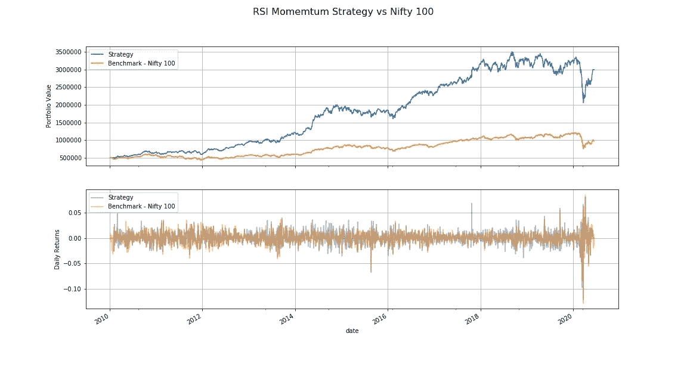
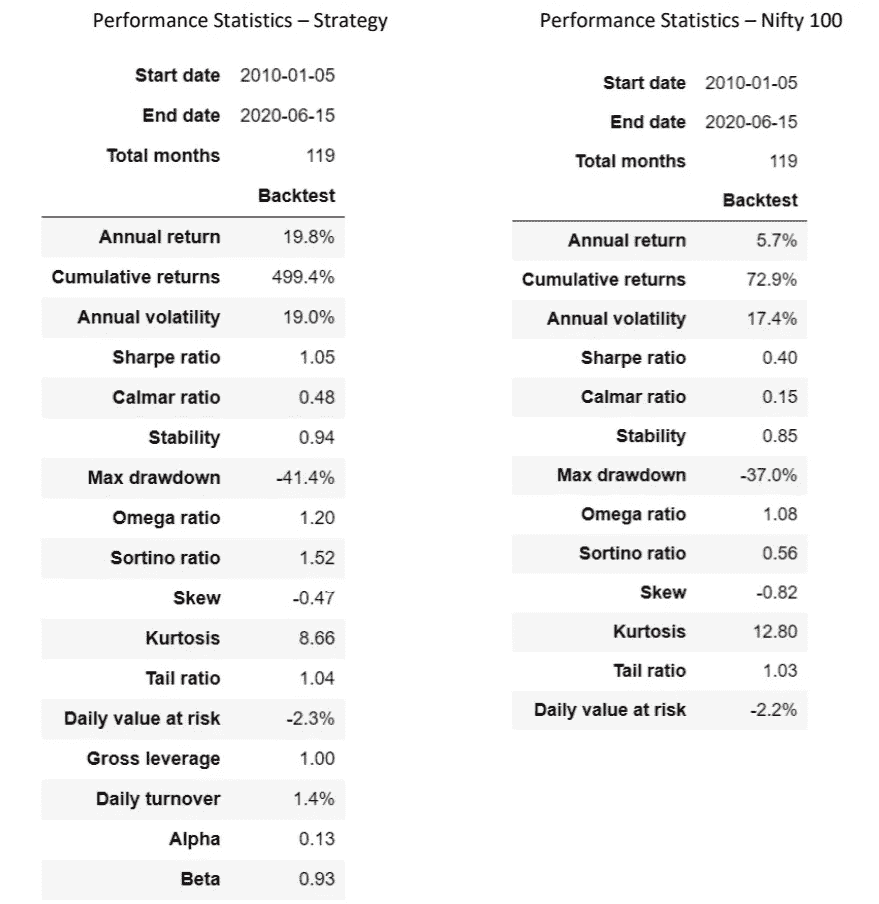
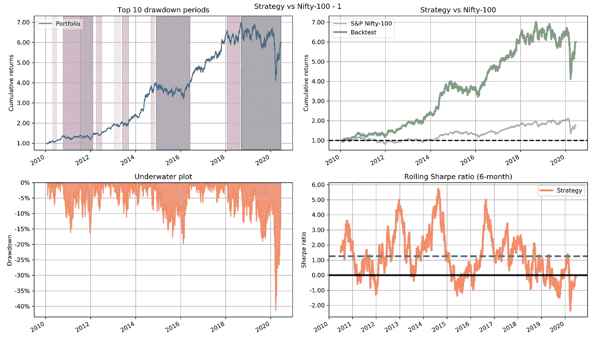
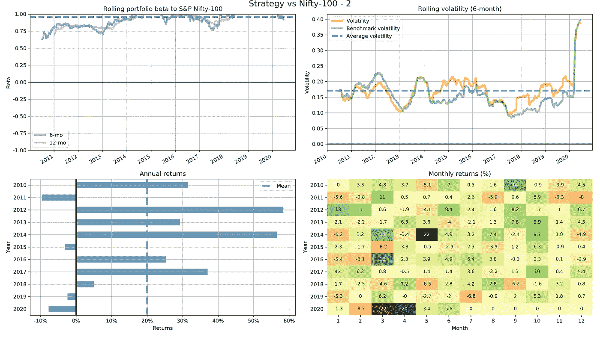
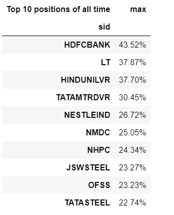

# 基于 RSI 的动量交易策略使用 zipline 对 Nifty 100 股票宇宙进行回溯测试

> 原文：<https://medium.com/analytics-vidhya/rsi-based-momentum-trading-strategy-backtested-using-zipline-for-nifty-100-stocks-universe-2598965203ba?source=collection_archive---------4----------------------->

作者:萨比尔·贾纳

势头、价值、质量、情绪、波动性和规模是一些公认的回报风险因素。动量投资是指做多表现良好的资产，同时做空在一定时期内表现不佳的资产。关于动量投资为什么在挑战了有效或半有效市场假说后仍然有效，有很多解释。其中一些解释包括诸如投资者不理性并遭受行为偏差、宏观因素、资产价格的正序列相关性、需求和供给失衡以及资产与经济增长之间的正反馈循环。

有许多方法来衡量动量，我分享了一个交易策略在我早先的文章[动量策略使用 Backtrader 与 BSE 500 作为股票宇宙](https://www.linkedin.com/posts/sabirjana_momentum-strategy-backtested-with-backtrader-activity-6674177296561246208-kitL)。在这篇文章中，我将根据相对强弱指标(RSI)建立我的交易策略。该方法基于 Andreas F. Clenow 和 Stefan Jansen 在他们各自的书中提出的想法，请参见参考资料。这 100 只漂亮的股票将成为我们的宇宙，并将使用 Quantopian `[zipline](https://www.zipline.io/)`对至少 10 年的历史每日价格数据进行回溯测试。RSI 是一个非常简单的动量指标，它比较最近的价格变化，以确定特定股票是超买还是超卖。例如，高于 70 的高 RSI 表示超买，而低于 30 的低 RSI 表示超卖。你可以通过[链接](https://en.wikipedia.org/wiki/Relative_strength_index)了解更多关于 RSI 的信息。您还可以在我的 [Github](https://github.com/sabirjana/blog/tree/master/RSI) 上找到本文使用的代码和数据。

我们的总体方法如下:

1.  收集数据。
2.  使用 zipline 定义我们的回溯测试策略。
3.  提取性能统计数据以与基准进行比较。

**收集数据**

zipline 是 Quantopian Inc .开发的一款出色、开源、成熟且功能强大的回溯测试工具。然而，在本地使用 zipline 处理您自己的数据时会面临一些挑战。您需要接收数据并创建自己的数据包。如果您想按照本文中的代码进行操作，那么您需要完成这个设置。和往常一样，您可以选择自己的数据源，但是，作为一个开端，我为每个股票行情自动收录器提供了 csv 文件形式的 OHLCV 数据集。请关注我的文章— [如何在本地机器上将印度股票数据导入 zipline？](/@sabirh.jana/how-to-import-indian-equities-data-to-zipline-on-your-local-machine-3b8587aaf112)创建您自己的定制捆绑包。

为了创建这些 csv 文件，我从本地数据库中取出了 2010 年 1 月 1 日到 2020 年 6 月 15 日之间的 100 只股票，并按照 zipline 中的要求重命名了这些列。我还剔除了日历史价格数据少于 10 年的股票。这将我们的宇宙限制在 84 只股票。在此之后，我通过删除任何重复的行来清理数据，每天对其重新采样以确保没有任何丢失的行，并为每个 ticker 编写 csv 文件。你可以在 Jupyter 的笔记本上看到这段代码。

**使用 zipline 定义我们的回溯测试策略**

让我们来定义我们的交易策略:

1.  我们有 84 只来自 Nifty 100 的股票。
2.  投资组合的最大规模保持在 30，所以我们的投资组合在任何时候都有 0 到 30 只股票。
3.  我们将每月进行一次再平衡，以避免过多的交易和相关成本。
4.  有 0.4%的交易费。
5.  我们将使用 14 个周期的 RSI 来定义我们的买入和卖出逻辑。我们每个月都会计算这 84 只股票的 RSI，并创建一个排名表。如果一只股票的 RSI 小于 30，并且我们还没有持有它，那么它就在我们的买入名单中。如果股票的相对强弱指数超过 70，我们持有，我们就退出。我们将最大投资组合规模保持在不超过 30 只股票。
6.  我们根据 126 天时间周期的 20 天滚动标准差的平均值进行头寸分配。这确保了头寸分配是基于风险对等，即股票将具有基于同等风险的权重，股票的波动性越小，权重越大。

让我们来理解一下 python 代码:

1.  我们进行必要的 python 库导入。我已经对代码进行了注释，以便从本地数据库中获取数据，进行清理，并编写 csv 文件。你可以在 Jupyter 笔记本中查看，为了节省空间，我没有在这里复制它。
2.  定义测试日期范围，并将时区转换为 UTC。
3.  读取`data/data`文件夹中的所有 csv 文件，并创建一个包含 84 个报价机的列表。
4.  现在，在继续下一步之前，我假设您已经获取了数据，可以在 zipline 中创建自己的定制数据包。如果没有，请这样做。
5.  接下来，我们定义模型参数，包括初始投资组合规模、RSI 的上限和下限、RSI 周期、标准差的滚动窗口、最大投资组合规模、佣金和滑点参数。
6.  函数`compute_rsi` 计算 14 天的 RSI 并返回时间序列的最后一个元素。我为此使用了 python 库 [ta-lib](https://github.com/mrjbq7/ta-lib) ，但是你可以为这项工作选择任何合适的库。其他几个选项包括`[ta](https://github.com/bukosabino/ta)`或`[finta](https://github.com/peerchemist/finta)`。
7.  在`volatility`函数中，我们采用 126 天的收盘价时间序列，计算每日回报，并采用 20 天标准差滚动窗口的平均值。
8.  `output_progress`的功能仅仅是在回溯测试执行期间跟踪进度输出和显示月度回报。
9.  我们在函数`initialize`中初始化佣金、滑点和报价器，并按月安排再平衡。
10.  功能`rebalance`是我们策略的核心，我将在接下来的几个要点中详细描述它。首先，我们调用`output_progress`来显示回溯测试期间的每月进度。然后我们得到每个股票代码的滑索符号。接下来，我们获取 126 个时间段的历史每日收盘价。
11.  接下来，我们调用`compute_rsi`函数，传递每个股票的历史收盘价格时间序列，并按升序创建股票和相应 RSI 值的排名表。
12.  现在，让我们先研究一下销售逻辑。我们使用变量`kept_positions`获得现有的投资组合股票列表。然后，对于投资组合中的每个现有证券，我们检查它是否是我们的论域的一部分，如果不是，我们命令目标百分比为零，并从变量`kept_positions`中移除该证券。然后，在`elif`中，我们检查证券的 RSI 值是否大于上限，如果是，我们退出头寸并将目标百分比设置为零。
13.  我们将转向我们的股票选择逻辑。我们通过最大投资组合规模和变量`kept_positions`的长度之差来确定要替换的股票数量。现在，我们创建一个买入列表，变量`kept_positions`中不包含股票。然后，从这个买入清单中，我们取出一定数量的证券，其长度等于 RSI 小于下限的替换长度。
14.  最后，我们通过将买入清单与变量`kept_positions`中的证券结合起来，形成一个新的投资组合。
15.  现在来讨论一下职位分配。我们可以有多种选择，如 1/n(等权重)、有效前沿优化或等风险平价。我在以前的帖子中使用过 1/n 期权，即 BSE 500 的 Backtrader 动量策略，得到了非常好的结果。我们将把有效边界优化留到以后某一天进行，现在我们将采用同等风险平价。这意味着每种证券的权重将与使用标准差衡量的风险一致。风险越高，权重越低。我们通过对新投资组合表中的每种证券取 126 天时间周期的 20 天滚动标准差的平均值来计算波动率表。为了得到单个证券权重，我们取波动率表的倒数，并除以倒数表的和。
16.  几乎完成了再平衡逻辑，我们有了新的证券组合和相应的权重。我们迭代新投资组合中的所有项目，如果证券在保留头寸列表中，或者如果 RSI 低于阈值，我们就设定目标百分比。
17.  在函数`analyze`中，我们只需计算年化回报，并将其与最大提款一起打印出来。
18.  最后，是时候使用我们之前定义的日期范围、初始资本和捆绑包作为您的定制捆绑包来运行算法了。

```
# Necessary imports
%matplotlib inline
%config InlineBackend.figure_format = ‘retina’import zipline
from zipline.api import (order_target_percent, symbol, set_commission, set_slippage,
 schedule_function, date_rules, time_rules)
from datetime import datetime
import matplotlib.pyplot as plt
import pyfolio as pf
import pandas as pd
import numpy as np 
from zipline.finance.commission import PerDollar
from zipline.finance.slippage import VolumeShareSlippage, FixedSlippage
import talib as ta
import pytz
import pandas_datareader.data as web
from os import listdir# for dataframe slicing operations
idx = pd.IndexSlice# Testing date range
start = datetime(2010, 1, 1, 8, 15, 12, 0, pytz.UTC)
end = datetime(2020, 6, 15, 8, 15, 12, 0, pytz.UTC)TICKERS = [f[:-4] for f in listdir('data/data/')]
print(TICKERS)
print(len(TICKERS))# Define Model Parameters
intial_portfolio = 500000
upper = 70
lower = 30
rsi_period = 14
vola_window = 20
mportfolio_size = 30# Commission and Slippage Parameters
enable_commission = True
commission_pct = 0.004
enable_slippage = True 
slippage_volume_limit = 0.025
slippage_impact = 0.05# function to calculate RSI
def compute_rsi(close):
    rsi = ta.RSI(close.values, timeperiod=rsi_period)
    return rsi[-1]# function to calculate volatility
def volatility(ts):
    std = ts.pct_change().dropna().rolling(vola_window).std().mean()
    return std# output performance
def output_progress(context):
    # Output performance numbers during backtest run on monthly basis
    # Get today's date
    today = zipline.api.get_datetime().date()

    # Calculate percent difference since last month
    perf_pct = (context.portfolio.portfolio_value / context.last_month) - 1

    # Print performance, format as percent with two decimals.
    print("{} - Last Month Result: {:.2%}".format(today, perf_pct))

    # Remember today's portfolio value for next month's calculation
    context.last_month = context.portfolio.portfolio_value# Initialization the trading logic
def initialize(context):

    # Set commission and slippage.
    if enable_commission:
        comm_model = PerDollar(cost=commission_pct)
    else:
        comm_model = PerDollar(cost=0.0)
    set_commission(comm_model)

    if enable_slippage:
        slippage_model=VolumeShareSlippage(volume_limit=slippage_volume_limit, price_impact=slippage_impact)
    else:
        slippage_model=FixedSlippage(spread=0.0)   
    set_slippage(slippage_model)    

    # Used only for progress output.
    context.last_month = intial_portfolio

    # Fetch and store index tickers
    context.index_members = TICKERS

    #Schedule rebalance monthly.
    schedule_function(
        func=rebalance,
        date_rule=date_rules.month_start(),
        time_rule=time_rules.market_open()
    )def rebalance(context, data): # Write progress output during the backtest
    output_progress(context)

    # Finally, get the Zipline symbols for the tickers
    universe = [symbol(ticker) for ticker in context.index_members]

    # Get historical data for volatility calculation
    hist = data.history(universe, "close", 126, "1d")
    hist = hist.dropna()

    # Make momentum ranking table based on RSI
    ranking_table = hist.apply(compute_rsi).sort_values(ascending=True)  
    # ranking_table.to_csv('data/ranking_table.csv') # Sell Logic
    # First we check if any existing position should be sold.
    # Sell if stock has RSI greater than upper value.
    kept_positions = list(context.portfolio.positions.keys())
    for security in context.portfolio.positions:
        if (security not in universe):
            order_target_percent(security, 0.0)
            kept_positions.remove(security)
        elif ranking_table[security] > upper:
            order_target_percent(security, 0.0)
            kept_positions.remove(security)

    # Stock Selection Logic
    # Check how many stocks we are keeping from last month.
    # Take the desired number of stock from the ranking table where RSI is less than lower.
    replacement_stocks = mportfolio_size - len(kept_positions)
    buy_list = ranking_table.loc[~ranking_table.index.isin(kept_positions)]
    buy_list = buy_list[buy_list.loc[buy_list.index] < lower].dropna()[:replacement_stocks]    
    new_portfolio = pd.concat((buy_list,ranking_table.loc[ranking_table.index.isin(kept_positions)])) # Calculate inverse volatility for stocks,and make target position weights.
    vola_table = hist[new_portfolio.index].apply(volatility)
    inv_vola_table = 1 / vola_table 
    sum_inv_vola = np.sum(inv_vola_table)         
    vola_target_weights = inv_vola_table / sum_inv_vola

    # Rebalance the tickers based on new weights
    for security, rank in new_portfolio.iteritems():
        weight = vola_target_weights[security]
        if security in kept_positions:
            order_target_percent(security, weight)
        else:
            if ranking_table[security] < lower:
                order_target_percent(security, weight)def analyze(context, perf):
    perf['max'] = perf.portfolio_value.cummax()
    perf['dd'] = (perf.portfolio_value / perf['max']) - 1
    maxdd = perf['dd'].min()
    ann_ret = (np.power((perf.portfolio_value.iloc[-1] / perf.portfolio_value.iloc[0]),(252 / len(perf)))) - 1
    print("Annualized Return: {:.2%} Max Drawdown: {:.2%}".format(ann_ret, maxdd))
    returnperf = zipline.run_algorithm(
    start=start, end=end, 
    initialize=initialize, 
    analyze=analyze, 
    capital_base=intial_portfolio,  
    data_frequency = 'daily', 
    bundle= 'nse_data')
```

**提取性能统计数据，与基准测试进行比较和对比**

在这一部分中，我们提取并可视化性能，并与我们的基准— S&P Nifty 100 进行比较。大多数情况下，我使用`[pyfolio](https://quantopian.github.io/pyfolio/)` 进行性能和风险分析。

让我们跳到 python 代码:

1.  我们使用 pyfolio 实用程序从回溯测试输出中提取回报、头寸和交易细节。
2.  为了获得漂亮的 100 个每日定价细节，我提供了一个 csv 文件，我们读取 csv 文件并创建一个数据框架。
3.  我们从上面的数据框架中获得收盘价，确保每日重新采样和向前填充，将日期时间指数转换为 UTC，并根据策略回报指数过滤记录。
4.  接下来，我们考虑初始投资组合价值，重新确定每日收盘基准价格。
5.  类似地，我们从定价数据中获得基准日回报，将指数转换为 UTC，并基于策略回报指数过滤记录。
6.  随后，我有了可视化策略和基准的投资组合价值和每日回报的代码。如果你是 python 的新手，就照原样使用它，慢慢你就会学会了。
7.  我已经使用了`pyfolio`的`show_perf_stats` 函数来获得基准测试的关键性能统计数据，并使用了一些其他函数来定制图表，还使用了`create_full_tear_sheet`选项来获得所有可用参数的完整视图。我想更多地关注性能分析，而不是可视化代码的本质，因为我相信你会明白这一点。

```
# Extract inputs for pyfolio
returns, positions, transactions = pf.utils.extract_rets_pos_txn_from_zipline(perf)
print(returns[:3])
returns.name = ‘Strategy’benchmark = pd.read_csv('data/nifty100.csv', index_col = [0], parse_dates=True)
benchmark.tail(3)# Get the benchmark prices for comparison
benchmark_prices = benchmark['close'].loc[start:end]
benchmark_prices = benchmark_prices.asfreq('D', method='ffill')
benchmark_prices.index = benchmark_prices.index.tz_localize('UTC')
benchmark_prices = benchmark_prices.filter(returns.index)
benchmark_prices.head(5)# Rebase the benchmark prices for comparison
benchmark_prices = (benchmark_prices/benchmark_prices.iloc[0]) * intial_portfolio
benchmark_prices.head()# Get benchmark returns
benchmark_rets= benchmark['close'].loc[start:end].pct_change().dropna()
benchmark_rets.index = benchmark_rets.index.tz_localize('UTC') 
benchmark_rets = benchmark_rets.filter(returns.index)
benchmark_rets.name = 'S&P BSE-100'
benchmark_rets.head(2)# Visulize the output
fig, ax = plt.subplots(2, 1, sharex=True, figsize=[16, 9])
# portfolio value
perf.portfolio_value.plot(ax=ax[0], label='Strategy')
benchmark_prices.plot(ax=ax[0], label='Benchmark - Nifty 100')
ax[0].set_ylabel('Portfolio Value')
ax[0].grid(True)
ax[0].legend()# daily returns
perf.returns.plot(ax=ax[1], label='Strategy', alpha=0.5)
benchmark_rets.plot(ax=ax[1], label='Benchmark - Nifty 100', alpha=0.5)
ax[1].set_ylabel('Daily Returns')fig.suptitle('RSI Momemtum Strategy vs Nifty 100', fontsize=16)
plt.grid(True)
plt.legend()
plt.show()
fig.savefig('images/chart1')# Performance of benchmark on key parameters
pf.show_perf_stats(benchmark_rets)# plot performance for strategy
fig, ax = plt.subplots(nrows=2, ncols=2, figsize=(14, 8),constrained_layout=True)
axes = ax.flatten()pf.plot_drawdown_periods(returns=returns, ax=axes[0])
axes[0].grid(True)
pf.plot_rolling_returns(returns=returns,
                        factor_returns=benchmark_rets,
                        ax=axes[1], title='Strategy vs Nifty-100')
axes[1].grid(True)
pf.plot_drawdown_underwater(returns=returns, ax=axes[2])
axes[2].grid(True)
pf.plot_rolling_sharpe(returns=returns, ax=axes[3])
axes[3].grid(True)
fig.suptitle('Strategy vs Nifty-100 - 1', fontsize=12, y=0.990)plt.grid(True)
plt.legend()
plt.tight_layout()
plt.savefig('images/chart2', dpi=300)# plot performance
fig, ax = plt.subplots(nrows=2, ncols=2, figsize=(16, 9),constrained_layout=True)
axes = ax.flatten()pf.plot_rolling_beta(returns=returns, factor_returns=benchmark_rets, ax=axes[0])
axes[0].grid(True)pf.plot_rolling_volatility(returns=returns, factor_returns=benchmark_rets,ax=axes[1])
axes[1].grid(True)pf.plot_annual_returns(returns=returns, ax=axes[2])
axes[2].grid(True)pf.plot_monthly_returns_heatmap(returns=returns, ax=axes[3],)
fig.suptitle('Strategy vs Nifty-100 - 2', fontsize=16, y=1.0)plt.tight_layout()
plt.savefig('images/chart3', dpi=300)fig = pf.create_full_tear_sheet(returns, benchmark_rets=benchmark_rets, positions=positions, transactions=transactions)
plt.savefig('images/chart4', dpi=400) 
```



RSI 动量策略 vs Nifty 100



战略与基准— Nifty 100

哇！看来我们中大奖了！该策略的年化回报率、夏普比率和索提诺比率都远远领先于基准。每当你得到这样的回报，你必须检查算法 2-3 次，以确保你没有愚蠢的错误，检查每日定价数据的质量，最后，永远记住，过去的表现不是未来表现的保证。

让我们用更多的参数来想象结果。由于篇幅的原因，我在这里没有包括完整的活页，但是你可以在这篇文章的 Jupyter 笔记本中找到它。



战略与优势 100–1



战略与优势 100 — 2



有史以来的十大职位

我们可以看到，总体而言，我们的战略表现良好，事实上，比我的预期要好。然而，我们无法在年度和 6 个月滚动波动性、最大提款和每日风险值方面击败基准。此外，6 个月滚动夏普比率相当不稳定。正如我提到的，我已经分享了代码，包括你可以从我的 Github 获得的数据。你可以摆弄代码和数据，在我看来，这是最好的学习方法之一。

祝投资愉快，请在文章中留下您的评论！

*请注意:此分析仅用于教育目的，作者不对您的任何投资决策负责。*

参考资料:

1.  Andreas F. Clenow — [“交易进化了:任何人都可以用 Python 构建黑仔交易策略”](https://www.amazon.in/Trading-Evolved-Anyone-Killer-Strategies-ebook/dp/B07VDLX55H)。
2.  Stefan Jansen — [算法交易的动手机器学习:设计和实施基于智能算法的投资策略，这些算法使用 Python](https://www.amazon.com/Hands-Machine-Learning-Algorithmic-Trading-ebook/dp/B07JLFH7C5/ref=sr_1_2?ie=UTF8&qid=1548455634&sr=8-2&keywords=machine+learning+algorithmic+trading) 从数据中学习。