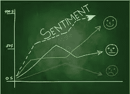
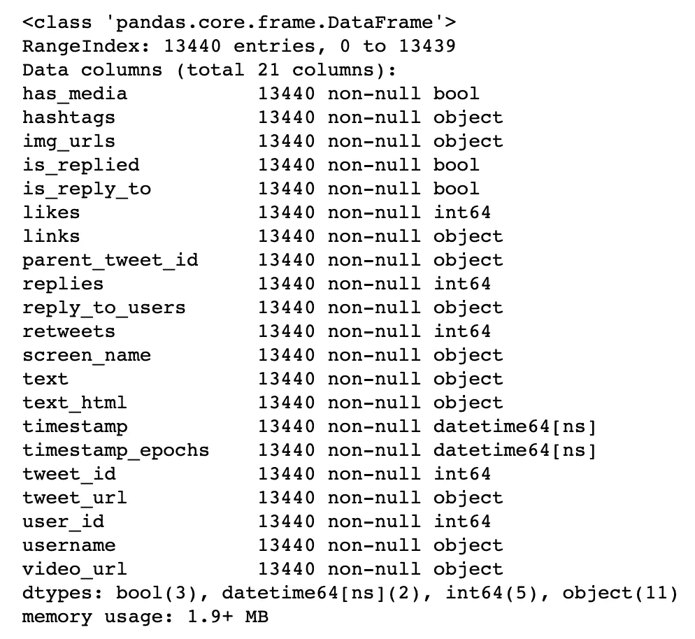
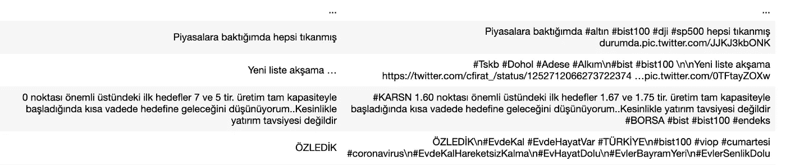
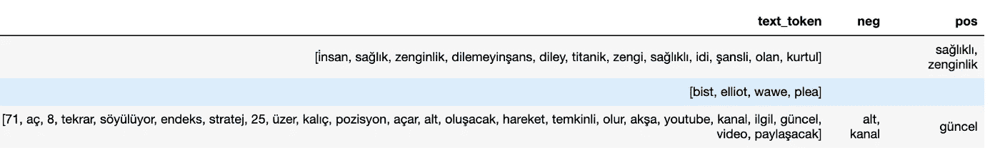
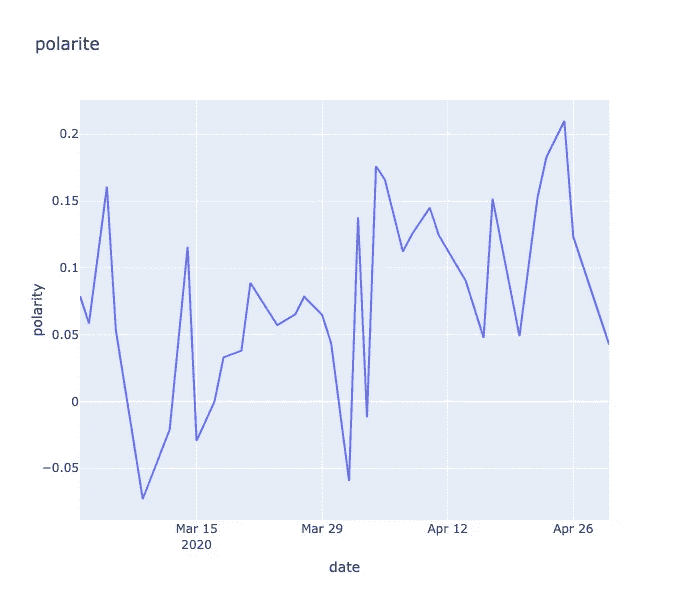
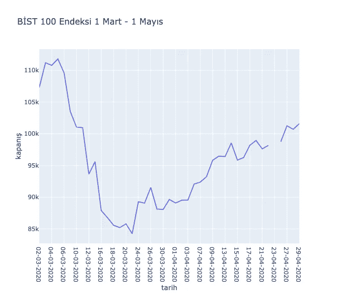

# 土耳其股票市场基于规则的 Python 情感分析

> 原文：<https://medium.com/analytics-vidhya/rule-based-sentiment-analysis-with-python-for-turkeys-stock-market-839f85d7daaf?source=collection_archive---------24----------------------->

[https://www . LinkedIn . com/pulse/情操-分析-股票-市场-代理-捕捉-投资者-库马尔](https://www.linkedin.com/pulse/sentiment-analysis-stock-market-proxy-capturing-investors-kumar)

## 在社区的大力支持下，Python 在数据科学领域发生了很大的变化。在这篇文章中，我尝试做了一个情感分析，叫做基于规则的情感分析。

让我们从导入库开始。

从 twitter 上挖掘数据有很多方法，但在这项工作中，我使用了一个名为 [twitterscraper](https://github.com/taspinar/twitterscraper) 的库，它不需要 api 键或任何东西。您可以通过用 python 编码或用终端作为 json 文件来抓取数据。我用了终端。我想分析关于土耳其股票市场 Bist 100 的推文，下面是我的命令行:

`***twitterscraper Bist100 -bd 2020–03–01 -ed 2020–05–01 -o bist100tweets.json***`

我选择 3 月 1 日至 5 月 1 日之间的推文，以实际了解 covid19 对市场的影响。

为了清理数据，我选择了 layz，并找到了一个名为 [tweet-preprocessor](https://pypi.org/project/tweet-preprocessor/) 的伟大的库来清理来自标签、主题和链接的 tweet。因为我要做一些 groupby 操作，所以我创建了一个单独的日期列，没有小时分钟信息。

这是关于我们数据框架的信息

在清除了标签、提及和链接之后。

在基于规则的情感分析中，你要有正负词的数据。我从 kaggle 中名为[81 种语言的情感词典](https://www.kaggle.com/rtatman/sentiment-lexicons-for-81-languages)的数据集以 txt 格式获得并使用了这些数据。我还使用 python nltk 库从数据集中删除了停用词和标点符号。您可以从 stackoverflow 中找到这些函数。

为了获取土耳其语单词的词干，我使用了一个名为 [turkish-stemmer-python](https://github.com/otuncelli/turkish-stemmer-python) 的库。

在 stackoverflow 的帮助下，我发现了一个很棒的函数，如果一个字符串列包含列表中的特定单词，它会在单词列表中创建一个新列。这帮助我在推文中创建了一个负面和正面词汇的专栏。

我们的最终数据框架包含负数、正数和词干标记:

由于我的情感分析方法是一种最原始的方法，叫做基于规则的方法，我通过从一篇文章中的正面词总数中减去负面词的数量来计算我的极性。如果 pos 或 neg 行是空的，我从表示我称为 len_pos 和 len_neg 的 tweet 中的积极和消极单词数的行中扣除它，因为它将它计为 1，我还用 sent_rate 将句子中的句子单词数除以总单词数，这给了我们关于句子感伤性的信息。

通过取每日极性数的平均值并将其分组，我现在可以看到 Bist100 tweets 每天的情绪变化。由于某种原因，我无法弄清楚，一些日期丢失了，所以如果你能弄清楚，请通知我。

现在，让我们用 python 编写的 [evds](https://github.com/fatihmete/evds) 库获取 bist100 收盘的真实值，并查看上面的日期范围。

于是，我们通过一个简单的情感分析，看到了 twitter 上 bist100 的极性变化和 bist100 的价值变化之间的联系。希望这部作品能激励很多人。

Jupyter 笔记本:[Python-Turkish-情操-分析](https://github.com/pytmar/Python-Turkish-Sentiment-Analysis)

 [## 情感分析

### 情感分析是对文本中的情感(积极、消极和中性)进行解释和分类…

monkeylearn.com](https://monkeylearn.com/sentiment-analysis/)