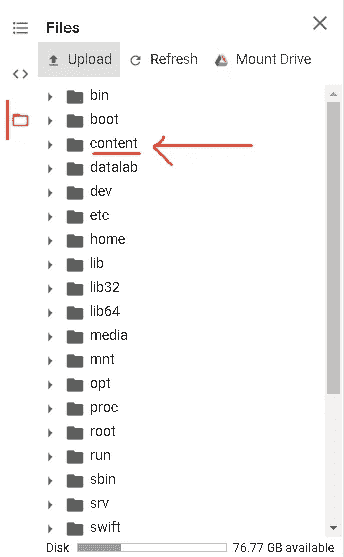

# 在颤振中运行 CNN 模型

> 原文：<https://medium.com/analytics-vidhya/run-cnn-model-in-flutter-10c944cadcba?source=collection_archive---------0----------------------->

在 flutter 应用中运行任何类型的机器学习模型。


**TensorFlow Lite** 是一套帮助开发人员在移动、嵌入式和物联网设备上运行 **TensorFlow** 模型的工具。它支持设备上的机器学习推理，具有低延迟和小二进制大小。

# **先决条件**

*   >我们将假设您已经构建了模型
*   >是的，您可以使用任何型号，但这里我们将使用 CNN
*   >我们将学习如何在 flutter 应用程序中部署您的模型，这意味着自动在 IOS 和 Android 上部署，因为 flutter 是一个跨平台的框架。
*   >好吧，现在有很多关于如何在 flutter 应用程序中部署模型的文章，但在处理实际问题时，到处都缺少一些关键功能。
*   >在本文中，我们将了解一些次要的细节，以便让您关注成功的部署
*   >我将在最后提到最有用的导入库，以防有人有任何问题。但是如果你已经训练了你的模型，很有可能你已经导入了我们需要的大多数库

## 训练模型

*   >正如我们前面提到的，我们将假设您已经训练了您的模型。
*   >对于那些仍然感到困惑的人，我们假设在执行了类似于下面的代码之后，您已经有了经过训练的模型

```
Model = model.Squential(....)
.
.
trained_model = Model.fit(traningData , TrainingLabels)ORtrained_model = model.fit_generator(train_batches,epochs=10)
```

*   > **trained_model** 是我们需要的，我们将从这里开始这篇文章

## 保存模型

*   >首先，我们将保存模型，以防将来需要使用

```
model.save("augmented_model.model")
```

## 获取您的班级指数

*   >记下或保存课程索引
*   >当模型预测某样东西、某幅图像或某个输入时，它会返回一个向量(1D 矩阵),所有的值都是 0，一个值是 1，表示模型已经预测到了，我们需要知道我们的模型索引是什么
*   >如果您创建了一个多类 CNN，很可能您使用了 softmax 函数，这意味着您的结果向量将具有概率值，而不是 1 和 0
*   >我们将选择最高值作为结果

```
test_batches.class_indices#output :-
{'dettol_sanatiser': 0,
 'fevicol': 1,
 'lifeboy_sanatiser': 2,
 'scissors': 3,
 'setwet_hair_Gel': 4}
```

## 以 HDFS 格式保存模型

*   >不要想太多这是什么，你现在不需要知道这是什么格式，但如果你知道这一点就好了，可能会对你的未来有用。

```
import tensorflow as tfkeras_file = "My_saved_Model.h5"
keras.models.save_model(trained_model , keras_file)
```

## 将您的模型转换成 TFlite 模型

*   >现在这是一个棘手的部分，仅仅知道代码是无法完成的
*   >通过做一些研究，我知道教程和文章中的内容已经发生了变化，在实际工作中，这是很好的升级
*   >在 Tensorflow 1.x 中，将. h5 模型转换为 TFlite 模型很容易，但在 2.x 中却很复杂
*   >您肯定会找到转换代码，但有些人会遇到许多问题。
*   >这是因为您用 pip 或 conda 安装程序安装的 TensorFlow 不包含此转换代码库。
*   >所以你必须直接从 GitHub 获得 TF 的原始完整版本，这也很棘手，但是如果你是一个天才，尽管去做吧，这在将来可能会对你有用
*   >但如果这太多了，你可以使用 Google Colabs，
*   > Google Colab 是由 Google 主办的免费云服务，旨在鼓励机器学习和人工智能研究，而学习和成功的障碍往往是对巨大计算能力的要求。
*   >只需将它视为存储在 Gdrive 中的虚拟 Jupyter 笔记本。
*   >使用 python3 在 google colab 中创建一个笔记本，这是免费的

## 将保存的模型上传到 Colab

*   >这一步也让我感到沮丧，因为模型确实上传了，但是实际代码不能识别或检测上传的文件
*   >这样做是为了确保模型上传到正确的位置


1.  单击文件选项卡
2.  单击…文件夹

它会带你到你的虚拟机的整个目录



*   >我们需要上传我们保存在“内容”文件夹中的模型
*   >对于你们中的许多人来说，简单的上传可能也可以，但是如果这不起作用，就按照上面的步骤
*   >右键单击内容文件夹并上传您保存的模型
*   >上传" **My_saved_Model.h5**
*   >等待一段时间，上传需要时间，上传后不要关闭笔记本的会话，如果关闭，您的模型将被删除

## 最后一些代码

*   >在您的 Colab 笔记本上运行此代码

```
import os
import tensorflow as tf
from tensorflow import keras
print(tf.__version__)
!pwd
!ls ###OUTPUT### :-2.2.0-rc4 
/content sample_data  **My_saved_Model**.**h5** tensflow version might be different but still in 2.x+
```

## 现在用代码将模型转换成 TFLITE

```
My_TFlite_Model = tf.keras.models.load_model('**My_saved_Model**.**h5**')converter = tf.lite.TFLiteConverter.from_keras_model(minor_model)tflite_model = converter.convert()open("**My_TFlite_Model.tflite**", "wb").write(tflite_model)
```

*   >这段代码会将您转换后的模型保存在同一个目录中
*   >从目录中下载您珍贵的 Tflite 模型

如果你的模型转换成功，忽略下一个部分，跳到颤动部分，但是如果你仍然有一个错误，快速尝试这个，

试着在 colab 中保存一个训练好的随机模型，然后重新加载它，如果你能在代码中重新加载它，使用这个随机模型的目录。这意味着将您的模型上传到保存这个随机模型的目录，然后尝试用这个目录路径加载您的模型。

并且在放弃之前等待至少 5-6 分钟，colab 可能还没有与最新上传的文件同步。

```
create and save your random model
x = [-1, 0, 1, 2, 3, 4]
y = [-3, -1, 1, 3, 5, 7]
model = tf.keras.models.Sequential([tf.keras.layers.Dense(units=1, input_shape=[1])])
model.compile(optimizer='sgd', loss='mean_squared_error')
model.fit(x, y, epochs=1)
model.save('sample_model.h5')#load the saved model again, do this in a different cell
new_model = tf.keras.models.load_model('sample_model.h5')
new_model.summary()
```

# 颤动部分

*   >在 flutter 应用程序中创建资产文件夹
*   >将下载的 TFlite 模型拷贝到“资产”文件夹中
*   >在资产文件中创建一个名为 label.txt 的文本文件
*   >在这个文本中，按照我们之前从类索引中得到的相同顺序填写结果对象的名称，但是没有索引号，只有正确的顺序

```
dettol_sanatiser
fevicol
lifeboy_sanatiser
scissors
setwet_hair_Gel
```

pubspec.yaml

```
dependencies:
  flutter:
    sdk: flutter
  cupertino_icons: ^0.1.2
  tflite: ^1.0.4
  image_picker: ^0.6.2+3
```

主.镖

```
import 'package:tflite/tflite.dart';
import 'package:image_picker/image_picker.dart';
```

变量

```
 List _outputs;
  File _image;
```

initState()

```
[@override](http://twitter.com/override)
  void initState() {
    super.initState();
    loadModel().then((value) {setState((){});});
  }
```

功能

```
pickImage() async {
    var image = await ImagePicker.pickImage(source: ImageSource.gallery);
    if (image == null) return null;
    setState(() {
      _image = image;
    });
    classifyImage(image);
  }classifyImage(File image) async {
    var output = await Tflite.runModelOnImage(
      path: image.path,
    );
    print("predict = "+output.toString());
    setState(() {
      _outputs = output;
    });
  }loadModel() async {
    await Tflite.loadModel(
      model: "assets/**My_TFlite_Model.tflite**",
      labels: "assets/**labels.txt**",
    );
  }[@override](http://twitter.com/override)
  void dispose() {
    Tflite.close();
    super.dispose();
  }
```

*   >只需在 UI 上放一个按钮，调用 **pickImage()**
*   >当你选择一幅图像时，它会自动调用分类图像并将结果存储在 **_outputs** 变量中
*   > **_outputs** 将是一个具有最合适预测概率的列表，第一个元素将具有最高概率
*   > **_outputs[0]** 将是您的结果

**大功告成**

你可以在这篇文章的应用程序中看到这一点

[https://www . LinkedIn . com/posts/harshborse _ androidapp-flutter-app developer-activity-66685858088366080-SsC-](https://www.linkedin.com/posts/harshborse_androidapp-flutter-appdeveloper-activity-6668583858088366080-SsC-)

感谢阅读