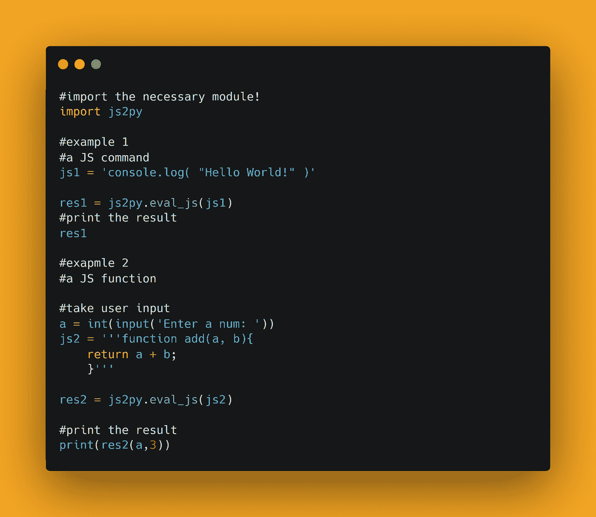

# 从 Python 运行 Javascript

> 原文：<https://medium.com/analytics-vidhya/run-javascript-from-python-c0fe8f8aeb1e?source=collection_archive---------0----------------------->

读者您好，希望您和您的家人身体健康！


Javascript 是一种非常强大的语言，老实说，我是 Js 的新手，但我一直想知道，Js 可以与 Python 集成吗？最近在网上冲浪，Js2Py 模块出现在我的谷歌搜索中。

在这篇博客文章中，我们将学习如何从 Python 脚本内部运行 Javascript 命令。我们将利用 Js2Py 模块。

[查看 python](https://github.com/ayushi7rawat/Ultimate-Python-Resource-Hub) 中的终极资源库。发现有用就掉颗星！有什么要补充的吗？开个 PR 就一样了！

你可以参考我的 YouTube 视频教程来更好的理解和一步一步的指导。

# 这个博客将会涵盖什么

```
1\. Js2Py Introduction
2\. How to Run Javascript commands from inside Python script
```

# Js2Py 简介:

可以使用 Js2Py 将 JavaScript 翻译成 Python。Js2Py 是一个 Python 模块，可以用来将 JavaScript 翻译成 Python &充当用 100%纯 Python 编写的 JavaScript 解释器。

*   它将任何有效的 JavaScript (ECMA 脚本 5.1)翻译成 Python。
*   翻译是全自动的。
*   没有任何依赖关系-仅使用标准 python 库。

# 局限性:

它有三个限制:

*   忽略严格模式。
*   不支持 with 语句。
*   对 eval will 的间接调用被视为对 eval 的直接调用(因此总是在局部范围内进行 eval)

如果你想了解更多，可以参考 [Js2Py 文档](https://github.com/PiotrDabkowski/Js2Py)。使用此链接导航到文档。

现在您已经了解了 Js2Py 的基础知识，我们可以前进到编码部分了。我们开始吧！

# 该编码了！

你可以在我的 [GitHub 库](https://github.com/ayushi7rawat/Youtube-Projects/tree/master/Run%20javascript%20in%20python)找到所有代码。发现有用就掉颗星。



为了访问 Python 库，您需要将它安装到您的 Python 环境中，使用下面的命令来安装`Js2Py`

```
pip install js2py
```

现在，让我们在 Python 脚本中导入包。

```
import js2py
```

先说一个简单的`Hello World!`。

```
#example 1
#a js command
js1 = 'console.log( "Hello World!" )'res1 = js2py.eval_js(js1)
```

让我们看看等价的`python`代码:

```
print('Hello World!')
```

所以在这里，我们将`javascript`命令存储在`js1`中。我们将在这里使用来自`js2py`模块的`eval.js`方法，将我们的 js 代码传入其中并存储在`res1`中。最后我们输出我们的结果。

```
#print the result
res1#OUTPUT: Hello World!
```

现在，我们来看另一个例子！让我们用 Javascript 创建一个加法函数。

```
#exapmle 2
#a js function
js2 = '''function add(a, b){
    return a + b;
    }'''
```

让我们看看等价的`python`代码:

```
def add(a, b):
    return a+b
```

让我们将它存储在`js2`中，为了使我们的程序更具交互性，让我们在 python 脚本中获取用户的输入。

```
a = int(input('Enter a num: '))
```

我们将在这里使用来自`js2py`模块的`eval.js`方法，将我们的 js 函数传入其中并存储在`res2`中。

```
res2 = js2py.eval_js(js2)
```

最后，让我们打印出我们的结果。因此，保存并运行 python 脚本。

```
print(res2(a,3))
```

它将输出两个数的和。它将根据用户输入而变化。

这是 Js2Py 的一个基本工作示例。这是关于在 Python 脚本内部运行 Javascript 命令的全部内容。就是这样！

很简单，不是吗？希望这篇教程有所帮助。我强烈推荐你去看看 T4 的 YouTube 视频，别忘了订阅我的频道。

您可以使用 Js2Py 库，甚至探索更多的特性。

你可以在我的 [GitHub 库](https://github.com/ayushi7rawat/Youtube-Projects/tree/master/Run%20javascript%20in%20python)找到所有代码。发现有用就掉颗星。

感谢您的阅读，我很乐意通过[Twitter](https://twitter.com/ayushi7rawat)|[LinkedIn](https://www.linkedin.com/in/ayushi7rawat/)与您联系。

请分享您的宝贵建议，感谢您的真诚反馈！

你绝对应该看看我的其他博客:

*   [Python 3.9:你需要知道的一切](https://ayushirawat.com/python-39-all-you-need-to-know)
*   [终极 Python 资源枢纽](https://ayushirawat.com/the-ultimate-python-resource-hub)
*   [GitHub CLI 1.0:你需要知道的一切](https://ayushirawat.com/github-cli-10-all-you-need-to-know)
*   [成为更好的程序员](https://ayushirawat.com/become-a-better-programmer)
*   [如何制作自己的谷歌 Chrome 扩展](https://ayushirawat.com/how-to-make-your-own-google-chrome-extension-1)
*   [使用 Python 从任何 pdf 创建您自己的有声读物](https://ayushirawat.com/create-your-own-audiobook-from-any-pdf-with-python)
*   你很重要，你的心理健康也很重要！

# 资源:

*   [github.com/PiotrDabkowski/Js2Py](https://github.com/PiotrDabkowski/Js2Py)
*   【pypi.org/project/Js2Py/0.27 号

在我的下一篇博客文章中再见，保重